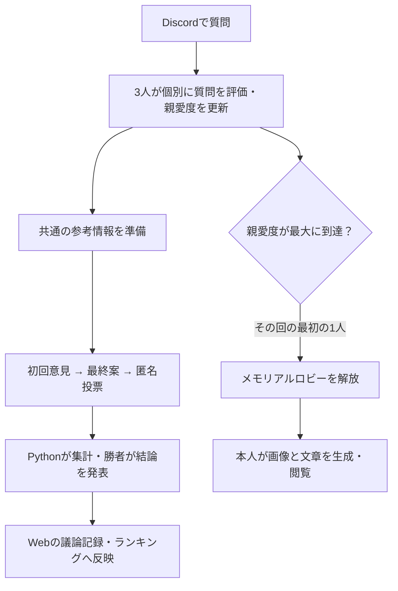

# THE SHITTIM CHEST — シッテムの箱

**3人のAIとの議論を、友人同士で楽しむDiscord BotとWebアプリです。**
質問への答えだけでなく、それぞれの個性、意見のぶつかり合い、質問を重ねて変わる親愛度、
一緒に積み重ねた思い出を楽しめます。勝者を決めるのはAIではなく、投票結果を集計するPythonです。

[Webを開く](https://shittim.pitekusu.dev/) · [設計文書を読む](docs/00_シッテムの箱_ドキュメント索引.md)

## できること

| 機能 | 体験 |
|---|---|
| Discordでの討論 | `/shittim`へ質問すると、3人が意見・最終案・匿名投票を経て結論を発表 |
| 議論の記録 | Webで過去の質問、3人の意見、投票理由、結論を振り返る |
| 親愛度 | 質問者ごと・参加者ごとに変化し、回答の口調や熱意に反映。結果はDiscordにも投稿 |
| いろいろな記録 | 勝利・依頼・親愛度ランキングと概算費用を確認 |
| メモリアルロビー | 親愛度が最大になると解放。本人用の記念画像と思い出の文章を生成・保存 |
| サービス状態確認 | AWSサービスの稼働状況、警告、コンテナイメージの脆弱性などを閲覧 |
| プロンプト管理 | 現在の設定と履歴を閲覧。管理者は編集・反映・復元が可能 |

WebはDiscord認証が必要です。サービス状態とプロンプトの参照は認証済み利用者に開放し、
プロンプトの書き込みは管理者だけ、メモリアルロビーは本人だけが操作できます。

## 議論から思い出まで

親愛度は3人それぞれに初期値500点、範囲は0〜1,000点です。質問評価が3人とも成功したときだけ
まとめて更新します。親愛度は発言の態度を変えますが、匿名投票や勝者の決定規則には影響しません。
メモリアルロビーは1回の解放につき1回生成でき、警告に同意して親愛度をリセットすると次の解放を目指せます。
過去に生成した思い出は残ります。

## しくみ

| 層 | 役割 | 主な実装 |
|---|---|---|
| Discord受付 | 署名を検証し、起動待ちの質問を永続化 | API Gateway・Lambda・DynamoDB |
| 討論処理（Core） | 司会1体と参加者3体を1プロセスで動かす | Python・OpenAI Responses API・Fargate |
| Web機能（Records） | 認証、議事録、集計、管理画面、メモリアル生成 | React・Vite Plus・Lambda・S3・CloudFront |
| 配信・運用 | 構成管理、監視、署名付き成果物の検証と配信 | AWS CDK・GitHub Actions |

FargateはARM64のオンデマンド構成で、通常は0タスク、必要時だけ最大1タスクが起動します。
処理状況と投稿待ちデータをDynamoDBへ保存し、中断時は保存済みの状態から再開します。
処理がなくなってから約30分で停止し、その約5分前に参加者のひとりが帰宅の挨拶をします。

## 大切にしている境界

- 個性のある議論を楽しむ少人数向けの個人開発アプリです。一般公開Botや専門判断の代替は目的にしません。
- 質問・参考情報・モデル出力は信頼できないデータとして検証し、進行・勝敗・権限はコードで管理します。
- 認証情報、非公開の人格設定、利用者の質問・回答をGitや運用ログへ残しません。
- 画像アップロードの原本は生成処理後に削除し、保存した記念画像と文章は本人だけに公開します。
- 配信するコンテナはダイジェストで固定し、署名・SBOM・脆弱性・配信証跡を検証します。

## 文書と開発

| 知りたいこと | 入口 |
|---|---|
| 全体像・文書の読み順 | [ドキュメント索引](docs/00_シッテムの箱_ドキュメント索引.md) |
| 要求と利用者体験 | [要求仕様・基本設計](docs/01_要求仕様書・基本設計書.md) |
| どのコード・試験を変更するか | [実装との対応表](docs/19_実装計画・トレーサビリティ.md) |
| リリース・障害対応 | [配信設計](docs/15_GitHub・CI-CD詳細設計.md)・[運用手順](docs/17_運用保守・監視・障害対応設計.md) |
| 文書を変更する方法 | [正本と同期のルール](docs/README.md) |
| 開発への参加・脆弱性の報告 | [CONTRIBUTING.md](CONTRIBUTING.md)・[SECURITY.md](SECURITY.md) |

依存バージョンは各プロジェクトのロックファイル、実行コマンドは設定ファイルを正とします。
READMEへバージョン表を複製せず、更新箇所を一か所に保ちます。

## ライセンス

ソースコード・構成コード・ツール・公開サンプルはMITライセンスです。
`docs/`と`AGENTS.md`は対象外です。[適用範囲](LICENSE-SCOPE.md)を確認してください。
