# Records Android

C01のExpressive画面へC02のCircuit／Metroを接続し、C03のAndroid専用CIで確認している。
C16でC13のトークン保存、C14の認証APIクライアント、C15のAuth Tabを画面へ接続した。
ログイン・期限切れ・通信障害・ログアウトを区別し、一時的な明暗表示切替も維持する。
C17で記録1件の表示、C18でRelease署名、C19でApp Linksを接続した。C20でPlay内部テスト版の実機ログインと記録表示を確認した。C21〜C22では最近の記録を追加取得できる一覧にした。
C23では詳細の3人の初回意見・最終案を表示し、Markdown本文をMaterial 3対応のrendererで描画する。
C24では3人の投票・得票数と、記録に採点があれば展開式の内訳を表示する。勝者はAPIの保存結果を使う。
C25では親愛度と勝利コメントなどの任意項目を表示する。
C26〜C28でKeystore・PQC・Roomの暗号化保存部品を追加し、C29で認証済み記録を保存するようにした。C30は期限付きオフライン認可とログアウト時の記録削除、C31は全記録同期・キャンセル・再開、C32は保存済み一覧・詳細のオフライン表示とオンライン更新、C33はローカル検索・勝者絞り込み・並べ替えを担当する。
CodeQL接続（C04）はCodeQL 2.27.2でKotlin 2.4.20のmanual抽出を確認し、専用workflowへ追加した。PRとマージ後のmainで4言語の解析・upload確認を完了条件とし、Kotlinはダウングレードしない。

## 開発環境

- Android Studioではこのディレクトリを開く。
- JDKはTemurinを使用し、バージョンは`.java-version`に合わせる。
- Android SDK Platform 37.2（`platforms;android-37.2`）とBuild Tools 37.0.0を用意する。
  AGP 9.4.1が対応する公開済みSDKを使い、minSdk 26・targetSdk 37は維持する。
  Android 17 QPR2の端末向けOSはBetaであり、このSDK更新だけで新しい端末向けAPIを使用しない。
- `JAVA_HOME`にJDK、`ANDROID_HOME`にSDKのディレクトリを指定する。
  Android Studioが作る`local.properties`でもSDKを指定できるが、Gitへ追加しない。
- Gradleは同梱Wrapperを使う。プラグイン・ライブラリは`gradle/libs.versions.toml`を正とする。

### ローカルの一時ビルドをため込まない

ローカルではリポジトリのrootから管理用の入口を使う。設定済みの`JAVA_HOME`と`ANDROID_HOME`、署名・Firebaseの環境変数は引き継ぐ。

```sh
uv run --frozen python -m tools.run_android_build -- :app:assembleDebug :app:lintDebug
```

Android projectを明示する場合は`--project apps/records-android`を指定する。この端末に配置した`shittim-android-build`も同じ入口である。
Release配布のヘルパーもこの入口へ接続し、`--output-dir`の出力から検証済みAABを取り出す。実署名・versionCode確認・Playへの提出手順は変えない。

- 中間生成物、project cache、Kotlinのpersistent project data、JVM／nativeの一時ファイルは、`XDG_CACHE_HOME`配下の専用ディスク領域で作る。Kotlin公式の`kotlin.project.persistent.dir`を使い、checkoutの`.kotlin`にも蓄積させない。`/tmp`のtmpfsや使い捨てソースコピーには蓄積させない。
- 標準の`TemporaryDirectory`とGradle init-scriptを使い、処理終了を確認してから一時領域を削除する。強制終了の残骸は、次回実行時にこの入口が作った非使用領域だけを回収する。同時ビルドによる衝突を防ぐ。Gradleの単発JVMも使用権ロックを持ち、起動途中の中断などで終了を保証できなければ`android_build_cleanup_needed`で止める。使用中・状態不明の領域を自動削除して新しいビルドを重ねない。
- Wrapper取得失敗などinit前の通常終了は、launcherとprocess groupの終了を確認した記録がある場合だけ回収する。終了確認のない中断は従来どおり保持し、記録があってもJVMの使用権ロックを優先する。
- 所有マーカーだけを作成して起動前に中断した領域は次回実行で回収する。使用権ロックのリンクや他の状態・ファイルが残る領域は、起動前と決めつけず保持する。
- この入口だけはKotlin標準の`in-process`実行を指定し、コンパイラを使用権ロックのあるGradle JVM内で動かす。共有SDK・依存バージョン・CIの実行方式は変更しない。
- 出力先の既定値は`$XDG_CACHE_HOME/shittim-chest/android-artifacts`（未指定時は`$HOME/.cache`配下）。APK／AAB、必要なLint報告とprivate logを固定名で残し、実行ごとの大きな履歴ディレクトリは増やさない。`--output-dir`でリポジトリ外の保存先を指定できる。
- `assembleDebug`・`bundleRelease`・`build`など既知の生成taskを完全な名前で指定したビルドでは、開始前に固定出力先のmodule直下にある旧APK／AABだけを消去し、成功した今回の成果物だけを配置する。失敗・中断後に旧版を今回の成果物として残さず、リンク・別の保存階層・再送防止記録は消去しない。help・Lint・単体試験・dry-run・検証済みAABの提出は保持し、生成taskの省略名やtask除外は使わない。
- SDK・JDK・共有Gradle cache・秘密鍵は保持する。完了した使い捨てworktree／仮想環境は、未保存変更や実行中の参照がないことを確認して片付ける。署名済みの大きな配布成果物は直近2版に限定し、Play反映結果・SHAなどの小さな再送防止記録は残す。
- ビルド失敗と後片付け失敗は成功扱いにしない。OS／CI全体のtemp設定は変更せず、このローカルAndroid処理だけを管理する。

### Kotlin Compiler Native Image（単体CLI）

Kotlin 2.4.20の公式Native Image版を、単体ソースのコンパイルに利用する。
AGP／Gradleのコンパイラーは自動では切り替わらず、APK生成は既存方式のままとする。
通常のKotlin/JVMバイトコードを生成するもので、Kotlin/Nativeへの移行ではない。

[公式配布物](https://github.com/JetBrains/kotlin/releases/tag/v2.4.20)のうち、
Linux x86_64では`kotlin-native-image-linux-x86_64-2.4.20.tar.gz`を使用する。
SHA-256は`a249c9270ab8fed93f9d54756677b3fa3da652b80791227036231b5869d5d73f`。
照合後にツール用の永続ディレクトリへ展開し、そのルートを`KOTLIN_NATIVE_IMAGE_HOME`へ指定する。
`JAVA_HOME`は引き続き`.java-version`に合わせる。通常の`kotlinc`やGradle設定は上書きしない。

```sh
"$KOTLIN_NATIVE_IMAGE_HOME/bin/kotlinc-native-image.sh" -version
"$KOTLIN_NATIVE_IMAGE_HOME/bin/kotlinc-native-image.sh" Sample.kt -jvm-target 17 -d out
"$JAVA_HOME/bin/java" -cp "out:$KOTLIN_NATIVE_IMAGE_HOME/lib/kotlin-stdlib.jar" SampleKt
```

Linux版で単体Kotlinのコンパイル・実行と、Compose Compiler 2.4.20＋Compose Runtimeを渡す
最小Composableの変換を確認した。APK全体のNative Imageビルド成功を意味しない。
`-include-runtime`ではリソース参照エラーが発生したため、class出力と明示classpathを使用する。
配布物はExperimentalであり、上流の`Unsafe::invokeCleaner`警告も残っている。

## 確認

ビルドコマンドはリポジトリのrootで実行する。

```sh
uv run --frozen python -m tools.run_android_build -- :app:assembleDebug :app:lintDebug
```

APKは既定の成果物ディレクトリの`app/app-debug.apk`に出力する。
debug版のapplication IDは`dev.pitekusu.shittim.records.dev`であり、配布版と分離する。
C02の接続確認は、専用エミュレーターまたはテスト端末で次を実行する。

```sh
uv run --frozen python -m tools.run_android_build -- :app:connectedDebugAndroidTest
```

実Activityを起動する2件でMetro→Circuit→UIの接続、表示切替、Activity再生成後の復元を確認する。
C13の6件は実Android Keystoreで暗号化保存・再読込・改ざん／鍵消失の拒否・削除・書込失敗・
バックアップ除外を確認する。テスト専用のディレクトリと鍵を使い、既存の認証情報には触れない。
C14は型検証2件とMockEngineによる5件で認証APIの変換・失効／通信失敗・転送拒否・上限・キャンセルを確認し、本番へ通信しない。
装飾の座標やライブラリ内部を写す試験は追加しない。
CodeQLは`.github/workflows/codeql.yml`で`security-extended`を実行する。Java/Kotlinは初期化後にキャッシュ・差分コンパイルを使わず`:app:assembleDebug`をビルドする。共通リリース判定では`Analyze (java-kotlin)`も必須とし、通常ビルドの成功と解析・upload成功を区別する。
見た目の変更はエミュレーターで自動／明暗切替、320dp・文字2倍、840dp境界・広い幅、回転、アニメーション無効時を確認する。
狭い幅のoverflow menuとkeyboard操作からも表示を選べることを確認する。
Previewやビルドの成功は、実機起動・Play配布の確認とは区別する。

### SSH接続先のLinuxで画面を確認する

RakuOS 44ではEmulator 37.1.11／API 36のAVDを、KVMと`swangle`で起動できることを確認した。
`host`はEGL初期化に失敗し、以前の`swiftshader`／`off`起動も異常終了したため、
この環境ではANGLE経由のソフトウェア描画を明示する。X転送やホストのGPU設定変更は不要。
ソフトウェア描画のため、実機の描画性能を評価する用途には使わない。

AVDは`shittim-expressive-preview`を使用する。別の環境ではDevice Managerまたは`avdmanager`で
同名のAPI 36 x86_64端末を用意し、AVDデータは一時ディレクトリではなく永続領域に保存する。
次の起動コマンドは専用ターミナルで実行し、既に起動済みなら重ねて実行しない。

```sh
"$ANDROID_HOME/emulator/emulator" -accel-check
"$ANDROID_HOME/emulator/emulator" -avd shittim-expressive-preview \
  -no-window -no-audio -no-boot-anim -no-snapshot -gpu swangle \
  -camera-back none -camera-front none -port 5580
```

別のターミナルから、起動完了値が`1`になってからインストールする。
以下は`apps/records-android`で実行する。接続先を明示し、実機や別AVDへ誤操作しない。

```sh
SHITTIM_ANDROID_ARTIFACTS="${XDG_CACHE_HOME:-$HOME/.cache}/shittim-chest/android-artifacts"
umask 077
"$ANDROID_HOME/platform-tools/adb" -s emulator-5580 shell getprop sys.boot_completed
"$ANDROID_HOME/platform-tools/adb" -s emulator-5580 install -r "$SHITTIM_ANDROID_ARTIFACTS/app/app-debug.apk"
"$ANDROID_HOME/platform-tools/adb" -s emulator-5580 shell am start -W \
  -n dev.pitekusu.shittim.records.dev/dev.pitekusu.shittim.records.MainActivity
"$ANDROID_HOME/platform-tools/adb" -s emulator-5580 exec-out screencap -p > "$SHITTIM_ANDROID_ARTIFACTS/shittim-preview.png"
```

操作は`adb -s emulator-5580 shell input`、画面要素の確認は`uiautomator dump`で行える。
ホスト側のデスクトップ画面は開かないが、スクリーンショットをCodex等で表示できる。
終了は`adb -s emulator-5580 emu kill`。ADBやエミュレーターの制御ポートは外部公開しない。
実データを含むスクリーンショットやUI dumpはGitへ追加せず、個人情報として扱う。
レビュー用画像は公開可能な準備画面だけを選ぶ。

### レビュー用スクリーンショット

C33の検索・勝者絞り込み・並べ替え部品（API 36・架空の選択状態のみ・実データなし）：

- [ライト](screenshots/search-light.png)
- [ダーク](screenshots/search-dark.png)
- [320dp・文字2倍](screenshots/search-large-text.png)

C32追加の自動同期の状態通知（API 36、架空の画面状態のみ・実データなし）。専用の同期メニュー・手動更新ボタンは設けず、同期中・失敗時だけ一覧へ小さく表示する：

- [ライト](screenshots/sync-light.png)
- [ダーク](screenshots/sync-dark.png)
- [320dp・文字2倍](screenshots/sync-large-text.png)

C16のログイン画面（API 36、未認証・実データなし）：

- [ライト](screenshots/login-light.png)
- [ダーク](screenshots/login-dark.png)

2026年9月17日、API 36のエミュレーターで取得。アカウント情報・実データは含まない。

- [通常表示](screenshots/bootstrap-default.png)
- [320dp・文字2倍：文字を縮めず標準メニューから選択](screenshots/bootstrap-large-text-menu.png)

## C03のCI

- 共通CIの`android-gate`でdebug APK・テストAPK・Lintを実行し、API 36のエミュレーター1台で認証・鍵・暗号化保存・DB・API・同期などの非画面instrumentation testを確認する。
- Composeの画面・操作試験には実行時annotationの`@ScreenTest`を付け、通常のPR／main CIでは全件実行しない。試験自体は残し、UI変更時と配布前には影響する画面を選んで確認する。
- JDKは`.java-version`、GradleはWrapperをローカルと共有する。CIにもアプリと同じSDK／Build Toolsを用意する。
- Android配下と関連文書だけの差分ではCoreの全pytest・パッケージ・CDK検証を省略する。
- `android-gate`は必要な処理の失敗・取消・skipを不合格にする。Gradleの終了コードだけで判断せず、JUnitレポートの実行済み試験を必須にし、結果欠落・0件・失敗・skipも拒否する。手動CIではAndroidも必ず検証する。
- Lint・テストのレポートを7日保存する。APK配布は含めず、C04のCodeQL解析は独立したworkflowで実行する。

### instrumentation testの選択

[AndroidJUnitRunnerの標準フィルター](https://developer.android.com/reference/androidx/test/runner/AndroidJUnitRunner)を使う。専用の選択基盤や新しい依存は追加しない。以下はリポジトリのrootから、専用エミュレーターを起動した状態で実行する。

通常CIと同じ非画面試験：

```sh
uv run --frozen python -m tools.run_android_build -- \
  -Pandroid.testInstrumentationRunnerArguments.notAnnotation=dev.pitekusu.shittim.records.ScreenTest \
  :app:connectedDebugAndroidTest
```

画面・操作試験だけ：

```sh
uv run --frozen python -m tools.run_android_build -- \
  -Pandroid.testInstrumentationRunnerArguments.annotation=dev.pitekusu.shittim.records.ScreenTest \
  :app:connectedDebugAndroidTest
```

変更した画面のクラスだけ（例：一覧ジャーナル）：

```sh
uv run --frozen python -m tools.run_android_build -- \
  -Pandroid.testInstrumentationRunnerArguments.class=dev.pitekusu.shittim.records.RecordJournalVisualTest \
  :app:connectedDebugAndroidTest
```

全試験はフィルターを付けずに実行する：

```sh
uv run --frozen python -m tools.run_android_build -- :app:connectedDebugAndroidTest
```

`notAnnotation`と`class`は同時指定しない。フィルターは積集合になるため、画面クラスを指定しても`notAnnotation`で除外される。
CIで全試験を確認する場合は、手動実行の`android_screen_tests`を有効にする。既定は無効であり、手動実行でも非画面試験は常に実行する。
対象の試験、結果、未実施の確認をPRへ記載し、タイムアウト・取消・skipを合格扱いしない。画面試験の選択変更は、既存タイムアウトの原因解消や性能改善を証明するものではない。

## C02の責務

- `MainActivity.kt`：Activity単位のMetro graphを生成し、CircuitContentで画面を表示。
- `RecordsGraph.kt`：Circuitへ準備画面のPresenterとUIを登録。未使用の依存やscopeは追加しない。
- `BootstrapPresenter.kt`：画面識別子・State・Eventと、一時的な表示選択の保持／復元。
- `BootstrapUi.kt`：Stateを受けて描画し、選択操作をeventSinkへ返す。Previewは固定Stateだけで表示。
- Circuit `0.39.0`、Metro `1.4.4`を固定。Kotlin `2.4.20`とMaterial 3 `1.5.0-alpha28`は維持。

## C18のRelease設定

- debug版は従来どおり`.dev`付きでビルドする。release版は本来のapplication IDを使用する。
- `shittimAndroidVersionCode`（正の整数、既定`1`）と`shittimAndroidVersionName`（`major.minor.patch`、既定`0.0.1`）をGradleプロパティで指定できる。更新時はPlayに提出済みのcodeより大きくする。
- 署名には環境変数`SHITTIM_ANDROID_UPLOAD_KEYSTORE`、`SHITTIM_ANDROID_UPLOAD_STORE_PASSWORD`、`SHITTIM_ANDROID_UPLOAD_KEY_ALIAS`、`SHITTIM_ANDROID_UPLOAD_KEY_PASSWORD`を使用する。秘密値をコマンド行、`gradle.properties`、Git、ログへ書かない。
- いずれかの入力またはkeystoreファイルが欠ければ、`assembleRelease`・`bundleRelease`は成果物作成前に失敗する。実際のupload keyの発行・管理、Play署名証明書とApp Linksの接続はC19以降の運用で扱う。
- 合成テスト鍵でのAAB署名確認は実施するが、配布版の署名や端末ログインの確認とは区別する。C39の配布Workflowは同一AABの検証・提出を別途実装する。

## C19のApp Links

- `https://shittim.pitekusu.dev/.well-known/assetlinks.json`はRecords Web Releaseが配信する。Play Consoleのアプリ署名鍵（従来鍵とポスト量子暗号鍵）を登録し、upload/debug鍵は登録しない。
- 固定認証callbackと`/records/{43文字のID}`だけがアプリのHTTPSリンク対象。記録リンクは固定host・query／fragmentなしを確認してから画面へ渡す。
- 未ログインで記録リンクを開いた場合はその記録をログイン後の復帰先にし、ログイン済みなら記録を再取得する。記録の公開範囲はAPIの認可で決まる。
- Play配布版でのOS検証、実Discordログイン、実upload keyで署名したAABの提出は、本番配布の準備ができた時点で行う。debug署名のエミュレーター確認はその代替にならない。

## 「＋」の押下フィードバック

円形FABは64dpにし、Material標準の押下反応に、記号の28%の縮み・5dpの沈み込み、濃い押下色と影の低下を組み合わせる。約160ms後に下書きを開くが、64dpのタップ領域は動かさない。連打、待機中の認可・画面変更、背面への移動では古い操作を適用しない。アニメーション無効時は待機しない。

架空操作の[通常状態](screenshots/debate-fab-resting.png)／[押下中](screenshots/debate-fab-pressed.png)で見た目を比較できる。

`DebateComposeFabTest`で待機前の反応、連打、前景離脱、無効設定を確認し、`RecordSearchNavigationTest`の既存FAB経路で下書きだけを開くことを確認する。押しただけで討論は送信しない。

## 議論開始画面の対戦演出

3人の顔を「アロナ VS プラナ VS 安倍晋三AI」と並べ、人格色の斜めのVSバッジと短い登場演出を表示する。Compose標準のAnimatableとMaterialのMotionSchemeを使い、背景では停止する。復帰・再作成で再演せず、アニメーション無効時は完成形を表示する。演出中も下書き入力・明示送信を待たせない。

公開先の説明文は撤去し、送信ボタンは「シッテムの箱を開く」とする。空白・文字数・オフライン・送信中・受付済みの送信制御、暗号化下書き保存、APIとDiscordの投稿先は変更しない。

`DebateScreensUiTest`を任意に実行し、架空の入力で[ダーク](screenshots/debate-versus-dark.png)、[ライト](screenshots/debate-versus-light.png)、[320dp・文字2倍](screenshots/debate-versus-large-text.png)を確認する。実Discord投稿・実機受入・内部テスト配布の証拠ではなく、重い画面試験CIは追加しない。

## Play内の更新案内

- SnackbarのinverseSurfaceに合わせて、両操作のTextButtonへSnackbarDefaultsのactionContentColorを指定する。通常のprimaryを流用しない。[ダーク](screenshots/update-actions-dark.png)／[ライト](screenshots/update-actions-light.png)の実描画を確認し、有効な「更新」「あとで」の文字と背景のコントラスト4.5以上を回帰試験する。SDKの同意・保留・ダウンロード・再起動の制御は変更しない。
- Google公式In-App UpdatesのFLEXIBLE方式を使用する。前景で更新を確認し、「更新／あとで」を表示する。更新を押した後だけPlayの同意画面を開き、バックグラウンドでダウンロードする。
- 完了後の「再起動して更新」も明示操作だけで実行する。強制更新、独自APK配布、入力中の自動送信は行わない。Play未対応・オフライン時も保存済み記録を閲覧できる。
- `PlayUpdateNoticeTest`は公式Fakeで接続境界を検証する。Compose操作を含むため`@ScreenTest`に分類し、通常CIの画面試験除外に従う。必要時はローカルまたは`android_screen_tests`を指定した手動CIで実行する。実配布の確認には、この機能を含む旧版と、その後のより大きい`versionCode`の内部テスト版が必要。旧版をPlayから取得して同じテスターアカウントを使い、ストアで更新する前にアプリ内の案内を確認する。
- 「あとで」・取消、同意後の閲覧継続、準備完了後の明示再起動、下書き・ログインの保持を実機で確認する。Fake・Debug版の合格をPlay実接続成功とは扱わない。
- 遅い同意結果は、SDKが既に通知した失敗を待機状態へ戻さず、明示再試行を妨げない。
- 受信済みの失敗は要求版とともにSavedStateへ保持し、回転・画面再作成後も同じ版への明示再試行を維持する。SDKオブジェクトや応答本文は保存しない。
- 明示操作では古い前景確認を標準Coroutineの取消で止め、操作中は復帰確認を重ねない。SDK通知より古い操作の応答・例外は状態へ反映せず、新しい再試行の操作制限も解除しない。
- 確認応答のinstallStatusは更新進行中だけを読み、更新なしの未定義値から再起動を案内しない。開始・復帰した実際の版を取消対象とし、確認から同意までの新規公開や背景での版変更でも同じ版を再案内しない。背景中にPlay側で取り消されてlistenerが受信しなかった場合も、既に要求した版は再案内せず、新しい版は提示する。
- 更新操作直前の確認結果も反映し、更新の撤回・FLEXIBLE不可なら古い案内を消す。SDKのlistenerはComposition破棄まで保持し、背景中の失敗も明示再試行できる。未開始の確認応答では、失敗案内を同じ要求版が利用可能な場合だけ維持し、次版公開・撤回・FLEXIBLE不可で古い失敗を解除する。問い合わせは前景のみで背景pollingは追加しない。プロセス破棄・画面再作成でイベントを受信できず同じUPDATE_AVAILABLE応答へ戻った場合は取消と失敗を区別できないため、同一版の再案内を抑止し、新規起動・新しい版で再提示する。未定義の状態から失敗原因を推測しない。

## C20：本人向け内部テスト

最初は本人だけを[Play Consoleの内部テストトラック](https://support.google.com/googleplay/android-developer/answer/9845334)へ登録する。
「内部アプリ共有」は別の鍵で再署名されるため、Playアプリ署名鍵を使うApp Linksの受入確認には使用しない。
友人への配布、一般公開、Android配布Workflowの自動化はまだ行わない。

1. Records Releaseで`https://shittim.pitekusu.dev/.well-known/assetlinks.json`を配信する。初回配信より前にReleaseIdentityの対象ファイル限定IAM変更を適用する。次の比較が成功し、Play Consoleの「アプリ署名鍵」に現在表示されるSHA-256がすべて同ファイルにあることを確認する。証明書が増えた場合は追加してから配信する。

   ```sh
   curl --fail --silent --show-error --max-time 15 \
     https://shittim.pitekusu.dev/.well-known/assetlinks.json \
     | cmp - ../records-web/public/.well-known/assetlinks.json
   ```

2. [Googleの案内](https://support.google.com/googleplay/android-developer/answer/9842756)に従い、本人がリポジトリ外へupload keyを作る。Playの「アプリ署名鍵」とは別物。鍵とパスワードはバックアップを取り、Git・チャット・CI artifactへ渡さない。以下は秘密鍵ファイルの保存先を自分で指定した後、対話的にパスワードを入力する例。

   ```sh
   umask 077
   # SHITTIM_ANDROID_UPLOAD_KEYSTORE にリポジトリ外の保存先を設定してから実行する
   keytool -genkeypair -keystore "$SHITTIM_ANDROID_UPLOAD_KEYSTORE" \
     -alias shittim-upload -keyalg RSA -keysize 4096 -validity 9125 \
     -storetype PKCS12
   ```

3. Play Consoleの「内部テスト」で本人のGoogleアカウントだけをテスターに追加する。提出済みの最大`versionCode`より大きい番号を選び、秘密値を対話入力して同じ端末で署名済みAABを作る。以下のビルドはリポジトリrootから実行する。この手順で作るPKCS12では鍵パスワードに保管庫と同じ値を使う。パスワードをコマンド引数、`gradle.properties`、シェル履歴へ書かない。

   ```bash
   # 保管庫のパスワードを入力してEnter（入力内容は表示されない）
   read -r -s SHITTIM_ANDROID_UPLOAD_STORE_PASSWORD; printf '\n'
   SHITTIM_ANDROID_UPLOAD_KEY_PASSWORD=$SHITTIM_ANDROID_UPLOAD_STORE_PASSWORD
   export SHITTIM_ANDROID_UPLOAD_KEYSTORE SHITTIM_ANDROID_UPLOAD_STORE_PASSWORD
   export SHITTIM_ANDROID_UPLOAD_KEY_PASSWORD
   SHITTIM_ANDROID_UPLOAD_KEY_ALIAS=shittim-upload \
     uv run --frozen python -m tools.run_android_build -- :app:bundleRelease \
     -PshittimAndroidVersionCode=1 -PshittimAndroidVersionName=0.0.1
   unset SHITTIM_ANDROID_UPLOAD_STORE_PASSWORD SHITTIM_ANDROID_UPLOAD_KEY_PASSWORD
   ```

   番号`1`と`0.0.1`は初回・未使用の場合の例。成果物は既定の成果物ディレクトリの`app/app-release.aab`に作られる。Play Consoleの「内部テスト」→「リリースを作成」でこのAABを提出し、パッケージ名`dev.pitekusu.shittim.records`、版番号、配布対象が本人のみであることを確認して公開する。Playが配布用APKをアプリ署名鍵で署名するため、upload keyのSHA-256を`assetlinks.json`へ追加しない。

4. 本人の実機でテスター参加リンクからPlay版をインストールする。debug版や「内部アプリ共有」版で代用しない。Androidの設定で対象ドメインが「検証済み」か確認する。開発者向けADBが使える場合は、`adb shell pm get-app-links dev.pitekusu.shittim.records`の`shittim.pitekusu.dev: verified`でも確認できる。確認時に端末の既定アプリ設定を手動変更して検証成功を装わない。
5. 実Discordログイン後に記録1件が表示されること、ログアウト後に記録リンクを開いて再ログインすると同じ記録へ戻ることを確認する。callback URLの一回限りコードやBearer tokenをスクリーンショット・ログへ残さない。
6. 更新試験は同じupload keyで、より大きい`versionCode`のAABを内部テストへ提出し、Playから更新する。保存済みセッションと記録表示が壊れないことを確認する。失敗版を旧AABへダウングレードせず、新しい版番号の修正版で直す。

記録する受入結果は版番号、内部テストの状態、App Links検証、ログイン・記録復帰・更新の成否だけにする。署名鍵・パスワード・token・private Discord ID・実質問を記録しない。鍵が未作成、Play配布未実施、または実機未確認ならC20の配布受入は未完了として扱う。

## C38：内部テスト配布の接続

- [r0adkll/upload-google-play](https://github.com/r0adkll/upload-google-play)（MIT）を配布Workflowの完全SHA付き`uses:`で固定する。アップロードとcommitはこのActionへ任せ、Gradle Play Publisherや独自Pythonの提出処理は使わない。既存のAGP・Kotlin・Materialと通常ビルドは維持し、アプリの実行時依存を追加しない。
- 採用時に保守状況・ライセンス・ランタイム・WIF対応・依存advisoryを確認する。採用pinのbraces・qs・undiciには既知advisoryがあるが、固定AABパス・固定API引数・WebSocket未使用の経路では、その攻撃条件に該当する入力経路を確認できなかった。脆弱性ゼロとは扱わず、pin更新時に再確認する。
- API認証はGitHub OIDCと[Workload Identity Federation](https://cloud.google.com/iam/docs/workload-identity-federation-with-deployment-pipelines#github-actions)による短寿命認証を使う。認証Actionの`credentials_file_path`を提出Actionの`serviceAccountJson`へ渡す。サービスアカウントの長期秘密鍵JSONや`serviceAccountJsonPlainText`は使わない。
- Play側のサービスアカウント権限を本アプリのテストトラックに限定し、本番公開・掲載情報変更・財務権限を付けない。GitHub側のWIF条件はrepository・main・専用Environment・配布Workflowに限定する。外部設定が未完了なら配布受入は未完了とする。
- upload keyと署名パスワードは引き続きC18のReleaseビルド専用。API用の短寿命認証はAABを署名せず、署名済みAABの提出にはupload keyを再読込する必要はない。
- 正式な提出入口はC39の手動Workflow。`releaseFiles`へ**検証済みの署名付きAABを1個だけ**指定し、globや複数成果物を渡さない。提出段階で再ビルドせず、`packageName`・`tracks: internal`・`status: completed`をWorkflowで固定する。掲載情報・本番トラック・内部アプリ共有は変更しない。
- 配布helperは公式Google SDKを使い、版番号の事前読取、秘密入力の準備、AAB検証、提出後の再取得、後片付けに限定する。全track・提出済みbundle／APKの最大番号検査、SHA-256／署名／package／versionCodeの検証を維持し、競合時の自動再番号付けやuploadの自動再送は行わない。
- Actionは通常のcommitを行う。[Play commitの既定動作](https://developers.google.com/android-publisher/api-ref/rest/v3/edits/commit)は既存審査を取り消して変更を送信し得るため、起動前に他の審査が進行中でなく、未送信の掲載情報変更を意図せず送信しない状態をPlay Consoleで確認する。この運用確認を自動guardで代替したとは扱わない。

接続試験は架空データでWorkflowの単一AAB・WIF入力・固定トラックとhelperの検証境界を確認する。Action内部の提出処理を独自に複製して試験せず、実署名・WIF・Play配布の受入とは区別する。

## C17の記録1件表示

- `RecordsReadClient.kt`：既存の一覧から最新1件のIDを選び、詳細APIを取得。Ktor ContentNegotiationで必要な表示項目だけ変換する。
- `RecordPreviewPanel.kt`：読み込み・空・エラー・議題／勝者／結論を表示。本文はメモリ内の画面状態だけで保持する。
- `MobileSessionModel.withAuthorizedToken`：保存tokenをリクエスト中だけ貸し、ログアウト・期限切れ・アカウント切替後に戻る結果を捨てる。
- C21以降、通常起動では一覧を表示し、カード選択か個別記録リンクからこの1件表示を開く。
- 架空APIとエミュレーターで画面・境界条件を確認する。C19の実署名ログインはこの工程の検証には含めない。

## C21の議論一覧

- `RecordsReadClient.recentRecords`は既存の認証済みAPIから12件ずつ取得し、議題の要約・依頼者・完了日・勝者を画面用データへ変換する。C22ではPagingの`PagingSource`が次のcursorを渡し、必要なページだけ追加取得する。
- `RecordListPanel`はカード、読み込み・空・失敗・再試行を表示する。カードを選ぶとC17の1件表示を開き、画面内ボタン・システムBackで一覧へ戻れる。一覧のスクロール位置は維持する。
- 依頼者アイコンはCoilの`AsyncImage`を利用する。署名付き画像のdisk cacheは無効化し、認証状態から離れた際にmemory cacheを消去する。tokenや質問本文は画像リクエストへ渡さない。
- `BootstrapPresenter`は一覧と選択した1件を、現在の認証セッションにだけ結び付ける。選択先は既存の認証モデルで管理し、画面復帰・回転後も維持する。詳細への往復では取得済み一覧を保持し、認証更新では再取得する。一覧へ戻ると選択先を解除し、処理済みApp Linkは再適用しない。ログアウト後に前ユーザーの記録を残さない。

## C22の一覧ページング

- 一覧は`LazyColumn`とPaging Composeで遅延描画する。追加ページの通信失敗は取得済みカードを残して再試行できる。
- APIのcursorが期限切れになった場合は、表示された操作から最初のページを読み直す。ページ間の重複IDは表示しない。
- 全件を一括取得せず、永続キャッシュも追加しない。詳細へ移動して戻る間は一覧のスクロール位置を保持する。

## C23の議論本文

- 詳細APIから3人の初回意見と最終案を読み、人格の対応と必須本文を検証して表示する。投票・評価・親愛度は後続工程で扱う。
- Markdownの構文解析とMaterial 3描画は`multiplatform-markdown-renderer`に任せる。外部リンクは絶対HTTPS URLだけを開き、Markdown画像のURLは自動取得しない。
- 議題・回答・見出しなどの日本語は、共通Typographyの`LineBreak.Paragraph`＋`WordBreak.Phrase`と`ja-JP`で文節単位の折り返し・禁則処理を行う。全利用者のAndroid 16以降で使用でき、Android 16で表示を検証する。本文へ改行や不可視文字を挿入せず、画面幅・文字サイズに応じて描画する。互換上のAndroid 8〜12は標準の高品質な段落折り返しへ安全にフォールバックする。Markdownのコードブロックは等幅・横スクロールを維持し、`LineBreak.Simple`で別扱いにする。
- 本文は既存の認証済み画面状態でのみ保持し、永続キャッシュ・ログ・テレメトリーへ追加しない。

## C24の投票・評価

- 詳細APIの投票者・投票先・理由・得票数を検証して表示する。投票の重複・自己投票・得票数と保存済み勝者の不整合は不正応答として拒否し、アプリで勝者を選び直さない。
- 新方式では5項目の採点と総合点・理由を投票ごとに展開できる。投票先がその投票者の最高採点候補であり、投票理由が選択候補の採点理由と一致すること、同票時の採点・勝者・決定方式の整合を検証するが、勝者を選び直さない。理由の500文字上限はUnicode文字数で判定する。採点がない旧記録でも投票を表示し、APIが示す決定方式または旧同票表示を使う。
- 記録内容を新たに端末へ永続保存しない。

## C25の親愛度・任意項目

- 旧記録の`affection: null`は数値を作らず「親愛度データなし」と表示する。`unavailable`は評価不能の説明と実増減0を示す。
- `applied`では3人それぞれの変更前・変更後と実増減を表示する。質問評価点は画面に表示しないが、上限・下限で実増減と異なる場合もAPIの値を検証する。
- 詳細取得は `contract=affection-reasons-v1` を指定する。人物ごとの `reason` と `reasonStatus` を読み、数値カードの下に選択・コピー可能なプレーンテキストを「人格名から一言」の見出しで全文表示する。感想だけ取得できなかった記録でも保存された増減を表示し、感想のない旧記録と未更新の旧キャッシュを区別する。質問評価自体が不能なら、その説明を優先して個別の感想欄を出さない。
- 勝利コメント、実行案、注意点は内容がある場合だけ表示する。欠損・重複・範囲外・数値の不整合を拒否し、親愛度は変更しない。

## C26の保存用秘密鍵保護

- `storage/KeystorePrivateKeyStore.kt`は、後続のML-KEM秘密鍵バイト列をAndroid Keystoreの非書出しAES-256-GCM鍵で暗号化し、`noBackupFilesDir`へ`AtomicFile`で保存する。
- v1形式・長さ上限・アカウント識別子を含むAADを検証し、異なる秘密鍵、別アカウント、改ざん、鍵消失で上書きしない。例外には秘密値を含めず、平文への切替もしない。
- 初回の書込が確定せず本体ファイルもない失敗では新規鍵を片付ける。既存ファイルがある場合は鍵を残し、暗号文を無効化しない。
- `clear`は専用の鍵とファイルだけを削除する。読み出したbyte配列は呼出元が消去する。Keystore操作はUI thread外から呼ぶ。
- Roomへの接続はC28で行い、認証と記録Repositoryの接続はC29〜C30で行う。この工程では実際の議論記録の永続保存やログアウト時の記録削除をまだ行わない。

## C27のデータ鍵保護

- Bouncy Castle 1.86のHPKE（ML-KEM-768／HKDF-SHA256／AES-256-GCM）で、32-byteの記録データ鍵を包む。KEM・鍵導出・AEADを自作しない。
- ML-KEM秘密seedはC26のKeystore保護に保存する。wrapの形式はversion、encapsulation、認証付き暗号文。アカウント識別子と記録IDをAADに結び付ける。
- unwrapは鍵が欠損しても再作成しない。改ざん・別アカウント・別記録・形式不正を拒否し、秘密値や詳細な暗号例外を出さない。
- C27はデータ鍵保護部品のみ。byteペイロードの暗号化とRoom保存はC28、実際の議論モデルとの接続はC29で行う。

## C28の暗号化済み記録保存

- Room 3.0.3とKSPでschemaを管理し、Android標準SQLite driverを使う。schema JSONもレビュー対象として保存する。
- 一覧・詳細のbyteペイロードをランダムなデータ鍵でAES-256-GCM暗号化し、C27で鍵を包んでからRoomへ保存する。質問・依頼者名・回答は平文列へ書かない。
- アカウント・記録・一覧／詳細の種別をAADで束縛する。破損・別アカウント・鍵欠損は固定の失敗分類で拒否し、平文fallbackを設けない。削除APIは暗号文の行のみを対象とする。
- C28は未接続の保存部品であり、実ユーザーの記録はまだ端末へ保存されない。Repositoryへの接続とログアウト時の鍵失効はC29以降で扱う。

## C29の記録Repository接続

- 認証済みモバイルセッションの`cacheAccountId`をキャッシュの本人識別に使用する。表示名やBearer tokenは識別子にしない。サーバー側の認証応答を先に配信してから、このフィールドを必要とするAndroid版を配布する。
- 検証済みの一覧項目と詳細を`RecordsRepository`がバージョン付きJSONへ変換し、C28の暗号化Storeだけへ保存する。保存失敗時は`STORAGE_UNAVAILABLE`で止め、平文表示へ切り替えない。
- 再起動後の暗号化済み読込口を用意するが、画面にはまだオフラインデータを表示しない。明示ログアウト直後の削除と90日の認可はC30、同期・表示統合はC31〜C32で接続する。
- アカウント切替でC26の単一鍵が次の利用者の保存を妨げないよう、保存開始前に旧鍵を失効させ、旧暗号文を全削除する最小の切替処理をC29へ前倒しした。明示ログアウト直後の削除とオフライン認可は引き続きC30で扱う。

## C30のオフライン認可とログアウト

- session APIで本人を確認してから、`cacheAccountId`・確認時刻・絶対期限をtokenと同じKeystore暗号文へ保存する。保存形式v2は既存v1も読み、v1だけではオフライン閲覧を許可しない。氏名・アイコン・質問は認可情報へ保存しない。
- キャッシュの読取口は本人一致と期限を前後で確認する。期限は保存済みtoken・サーバー応答・確認から90日のうち最短とし、通常利用や再確認では延長しない。有効な保存済み許可はsession応答待ちでも利用でき、通信障害／5xx時も維持する。未検証token・認証拒否では利用せず、401／403では即座にロックする。プロフィールや通常APIへのtoken使用はサーバー確認まで復元しない。
- 期限切れはtokenを削除して記録をロックするが、記録の鍵・暗号文は保持する。同じアカウントで再認証すれば再利用できる。
- 明示ログアウトでは直ちに読取を閉じ、記録鍵を失効→Roomの暗号文を全削除→所有者マーカーを削除→tokenを削除する。ネットワークや画面終了に依存せず端末削除を先に完了させ、サーバー失効POSTは従来どおり1回だけ試す。端末削除失敗は保存エラーとして再ログインを止め、明示削除の再試行を可能にする。
- 別アカウントへの切替はsession確認直後に旧鍵・暗号文を消す。遅れて完了した旧リクエストの保存と同一Mutexで直列化し、旧ユーザーのキャッシュを残さない。
- 削除前に個人情報を含まない削除予定マーカーを保存し、中断・失敗後は次の認証前に削除を再開する。マーカーが残る間はキャッシュの復号を許可しない。
- token側にも独立したログアウト予定を保存し、プロセス終了後はsession確認ではなく端末削除から再開する。tokenが既に消えていても、記録とtoken・専用鍵の削除がすべて完了するまで予定を消さず、再ログインを拒否する。端末削除失敗の再試行用に旧tokenをメモリだけで保持し、削除後の失効POST前に再送用の参照を破棄する。
- オフラインの画面表示・全記録同期はC31〜C32で接続する。オフライン中のサーバー失効は再接続まで検知できない。端末時計を使う期限確認に加え、同一プロセスでは単調時計のタイマーで期限を閉じる。OS自体の侵害や時計の意図的操作を完全に防ぐ仕組みではない。

## C31の全記録同期

- ログイン・復帰時に自動同期する。一覧先頭で下方向へ引っ張ると同じ差分同期を手動で予約できる。専用の同期メニュー・手動更新ボタンは設けず、同期中・失敗時だけ小さく状態を表示する。全索引ページをたどり、未保存・更新分だけを1件ずつ暗号化保存する。件数未確定のため推測した割合は表示しない。
- C31の初期実装は画面起点だったが、C32追加仕様でWorkManagerによるバックグラウンド自動同期へ変更した。詳細への移動・画面停止／再生成では同期を止めない。OSによる停止時は保存済み進捗から再開する。
- 進捗は既存の暗号化Storeに別用途で保存し、Room schemaや既存本文の形式は変えない。ログアウト・別アカウントへの切替では進捗も消す。token・質問・プロフィールは進捗へ保存しない。
- 再起動後もWorkManagerから未完了分を続行する。cursor期限切れは1回だけ先頭から列挙し直し、版が一致する保存済み詳細は再取得しない。通信／保存エラーやキャンセルでは完了扱いにしない。
- 初回保存後は軽量な同期索引を照合し、新規・更新分だけ取得する。C32では全ページ成功後の不在候補を詳細APIで確認し、404の場合だけ削除する。保存済み詳細は開くたびに再取得しない。

### 自動同期の待ち時間を抑える

- コミット済み記録版は暗号化した同期進捗へまとめる。変更なしは一覧・詳細の存在を一括照合し、本文の復号や1件ごとの進捗書き込みをしない。旧キャッシュの版は一度だけ取り込む。
- 中断した同期も先頭ページの最新記録から確認して、元のcursorへ戻る。先頭ページだけで削除を判定せず、全列挙後の認証済み404確認を維持する。
- 本文・一覧を保存した時点で表示へ通知し、アイコンは全本文の照合後に取得する。画像待ち・画像再試行で完成した本文を隠したり再取得したりしない。
- 最初の変更通知は即時、続く通知は最大500msで集約して最後も届ける。変更のないWorker状態通知で一覧を読み直さず、暗号文が一致する一覧・アイコンはアカウントに紐づくメモリで再利用する。変更・削除・改ざん・認可喪失は引き続き検出する。
- 回帰試験は変更なしの書き込み回数、古い同期より先に最新記録が見えること、画像遅延と失敗後の本文保持、別Repositoryの更新・削除・改ざん、最後の通知と認可境界を確認する。暗号化方式・Room schema・公開API・15分の定期同期設定は変更しない。

## C32の保存済み表示と更新

API 36・架空データで確認した保存済み詳細パネル：[ライト](screenshots/offline-light.png)／[ダーク](screenshots/offline-dark.png)／[320dp・文字2倍](screenshots/offline-large-text.png)。長い画面はスクロールして閲覧する。

- 前回の認可期限内なら、通信できない場合も保存済み一覧・詳細を閲覧できる。未取得の詳細は未保存と表示する。期限切れはロックし、同一アカウントの再認証で再び閲覧できる。ログアウト・切替は鍵・記録・進捗を消去する。
- 一覧・保存済み詳細はローカルから表示し、同期Workerが更新を反映する。通信・端末保存失敗では既存の内容を残す。依頼者アイコンも暗号化保存し、オフラインでは復号した画像をCoilへ渡す。画像未保存・欠損は代替表示とし、古い署名付きURLへ接続しない。
- 起動・復帰時は有効な保存済み認可を先に読み、通信完了を待たず一覧・詳細を表示する。同期進捗によるローカル再読込は直列・最新要求の集約で扱い、読み込みを繰り返し中断しない。同一アカウントの再確認中も表示を保つが、認証拒否・期限切れ・ログアウト・切替では直ちに隠す。
- 同一アカウントの保存済み一覧は同じPagingのFlowへ更新を流し、同期進捗で配信元を作り直さない。カードの記録IDをkeyとして、新規記録の追加や同期完了時も読んでいる位置を維持する。
- 認証済み404は一覧・詳細を同時に削除する。同期開始時の削除候補を暗号化進捗へ保存し、全ページ成功後の不在候補だけ詳細APIで確認する。索引の反映遅れだけでは削除せず、200なら保存済み内容を維持、通信失敗・キャンセルなら確認を再開する。候補以外の本文取得は増やさない。C31の旧進捗は先頭から安全に再列挙する。既存Room schema・暗号形式は変えない。
- Play内部テスト：オンラインで自動保存を完了 → 機内モードで再起動し一覧・詳細・アイコンを確認 → 再接続して差分更新 → ログアウト後は一覧・詳細が表示されないことを確認する。端末内のデータ削除は不要。
- 架空APIと実Keystore／Roomでページ重複・途中再開・期限切れ・巡回・404・認可喪失を確認する。実機試験とPlay配布は別途行う。

## C33：保存済み記録の検索・絞り込み・並べ替え

- 議題・依頼者・保存済み本文を端末内で検索する。空白区切りは全語一致、全半角・英字の大小文字は区別しない。未保存の本文を検索のためにダウンロードしない。
- 勝者は「すべて」または3人の1人で絞り、完了日時の新しい順／古い順へ切り替えられる。同日時は記録IDで順序を安定させる。
- 検索中・表示件数／保存件数・一致なしを表示する。同期中は現在保存されている分だけが対象となり、完成した記録は自動反映する。
- 入力と条件は同一アカウントの画面内メモリだけで保持し、詳細から戻る間は維持する。認可喪失・ログアウト・切替・画面再生成で初期値へ戻し、SavedStateや検索用平文DBへ保存しない。
- Material 3 Expressiveの形状変化する勝者チップと標準ButtonGroupを使用し、文字2倍では折り返し／overflowで操作できる。条件解除は入力・勝者・並べ替えをまとめて初期値へ戻す。
- 架空データの試験で本文検索・絞り込み・順序・通信なし・認可喪失・平文非保存と画面操作を確認する。API・Room schema・暗号形式・依存バージョンは変更しない。

### バックグラウンド自動同期と差分取得

- ログイン・アプリ復帰後に即時同期を予約し、約15分間隔の定期同期を一意なWorkManagerジョブとして保持する。ネットワーク接続が必要で、省電力・Doze・強制停止等により実行は遅れる。サーバーpushによる瞬時反映ではない。手動更新は一覧先頭の引っ張る操作だけにし、保存済み詳細では通常の閲覧を妨げない。
- `GET /api/v1/records/sync-index`は50件ずつの軽量なID・記録版・アイコン版だけを返す。質問・依頼者名・回答は返さない。全索引を照合するため、古い日付で後から追加された記録や削除も検出できる。本文は未保存・更新版だけ取得し、同じ依頼者の同じ版のアイコンは共有して再取得しない。
- 同期索引をまだ持たない旧キャッシュは、初回だけ本文を再確認して基準版を作る。その間も保存済み記録は読める。新APIをRecords Releaseで先に配信し、その後Androidを配布する。旧アプリの既存GET契約は維持する。
- 感想対応前のcheckpointは読取契約versionを0として読み、対応後は1で保持する。更新時は旧cursorと版のmanifestを再初期化し、全索引を一度だけ走査して感想対応の本文を取得する。保存済み本文・アイコンと未完了のアイコン処理を保護し、中断後は対応済みの記録を再取得せずに続行する。
- Workerは実行時にKeystoreからtokenを読み、サーバーの本人・期限を確認する。WorkManagerの入力・出力・進捗へtoken、質問、利用者IDを入れない。各保存境界で期限・削除意図・同じtoken・所有者を確認し、所有者を再活性化しない。失効確認時はオフライン認可もロックする。
- 8分で区切り、途中進捗から再開する。通信失敗は指数backoffで最大3回再試行する。通常の画面停止では継続するが、ログアウト・切替では予約を止め、鍵・暗号文・アイコン・進捗を消す。
- 実機確認：自動同期の完了後に機内モードで再起動し、アイコンと本文を確認。再接続後の新規記録追加と差分更新、画面を閉じた場合の継続、ログアウト後の非表示を確認する。

### 一覧を引っ張って手動更新

- 一覧を先頭まで戻し、下方向へ引っ張って離すと更新する。採用済みMaterial 3の`PullToRefreshBox`を使用し、途中の通常スクロールでは更新しない。
- 既存の差分同期へ接続し、実行中のジョブを置き換えず重複予約を防ぐ。保存済みの一覧・本文と読位置を維持し、表示を空や初期読み込みへ戻さない。
- 検索・絞り込み・メニュー・詳細表示中、画面非表示時、認可喪失後は無効。認可済みオフライン中は接続待ちで予約する。大きな丸表示は引っ張る操作のフィードバックだけとし、自動同期のRunningではブランド上に常駐させない。
- 同期中は件数下の固定高領域に「最新の記録を確認中」と小さな進捗を併記する。通信を確認できない場合は「保存済みの記録を表示中（オフライン）」だけを表示し、WorkerがRunningでも通信中の進捗を重ねない。待機・完了では進捗を消し、読位置を動かさない。同期・保存・認可・予約の処理は変更しない。
- 架空状態の画面：[ライト](screenshots/meaningful-sync-light.png)／[ダーク](screenshots/meaningful-sync-dark.png)／[文字2倍](screenshots/meaningful-sync-large-text.png)／[オフライン](screenshots/meaningful-sync-offline.png)。実通信・実機・Play配布の証拠ではない。
- 確認：先頭での更新、途中スクロール、同期中の再操作、完了後の再操作、オフライン予約、認可喪失と保存済み表示の維持を架空データで試験する。Play配布・実機受入は別依頼で行う。

## C34：共通デザインシステム

- `ui/ShittimComponents.kt`に、主要パネル・関連情報の面・節見出し・人格名・読み込み表示・余白をまとめる。色・書体・形状・MotionSchemeは既存の`ShittimTheme.kt`を使い、新しいライブラリや汎用UI層は追加しない。
- `ShittimBackdrop`のSurfaceから本文色を供給する。背景上の見出し・空状態・読み込みメッセージもダーク表示で黒へ戻らない。
- ログイン・再試行と、ログアウト・端末内情報削除の操作は視覚的に分ける。人格名と勝者はシアン／ピンク／ラベンダーを名前付きで表示し、代替アイコンも同じ色の役割へ合わせる。
- LINE Seed JP／Delogyと利用条件は維持。Delogyは固定の短い英字ラベルのみ。素材・依存バージョン・認証・同期・保存形式は変更しない。NEW／OLDやログイン演出はC35へ残す。
- 架空記録による明暗・320dp／文字2倍・操作確認と背景本文色の回帰確認を行う。既存の採点内訳・親愛度・再試行・ログアウト・スクロール維持も確認する。実機ログインや配布の代替ではない。

### C34の画面写真

試験用の架空記録を表示した一覧・詳細のスクロール途中の画面。実利用者の記録や認証情報は含めない。

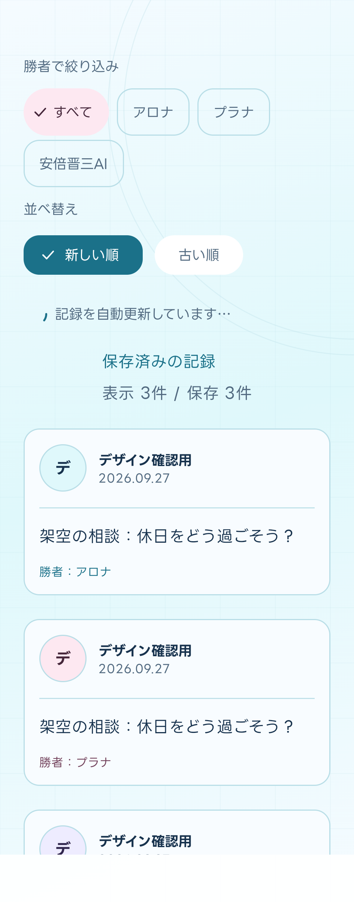
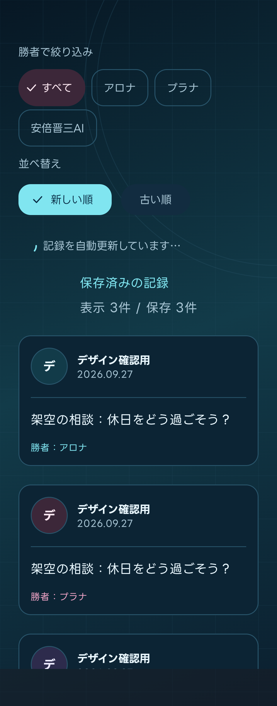
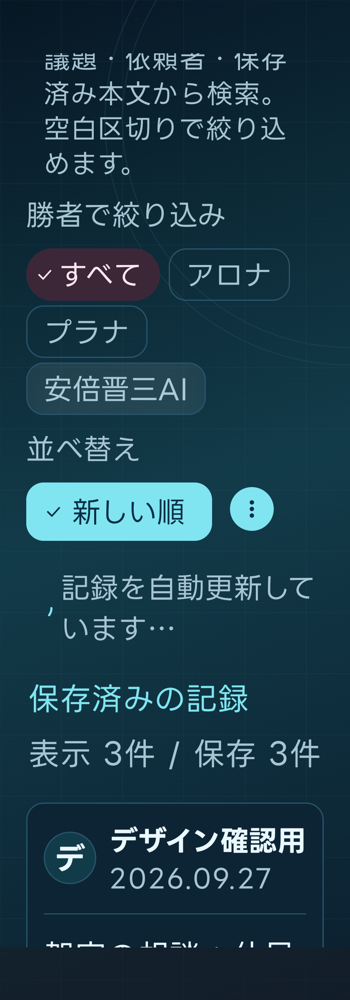
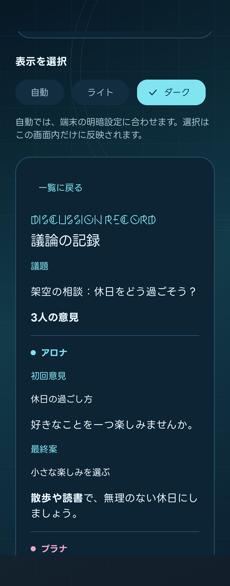

## C35：NEW／OLD切替とログイン完了演出

- NEW＝新しい順、OLD＝古い順。標準ButtonGroup／ToggleButtonの接続形状と幅変化、MotionSchemeによる選択位置の移動を使用する。日本語の説明は文字拡大時に折り返し、選択状態は読み上げでも伝える。
- ログイン完了は、ブラウザーから戻っただけでは出さない。保存tokenをサーバーで確認できた対話的ログインの後だけ、チェック付きの標準Snackbarを約2秒表示する。アクセシビリティの推奨時間を優先する。
- 通常起動・アプリ復帰・回転では再演しない。全画面の待機や一覧への項目追加を行わず、表示中も記録やログアウトを操作できる。システムのアニメーション無効設定を尊重する。
- API・認可・暗号化保存・依存バージョンは変更しない。C36以降の仕上げ・配布は別工程とする。

この節はC35時点の実装記録。後続のブランド演出で完了Snackbarを置き換えた。

### C35の画面写真

API 36・架空データによる画面確認。実DiscordログインやPlay配布の確認ではない。

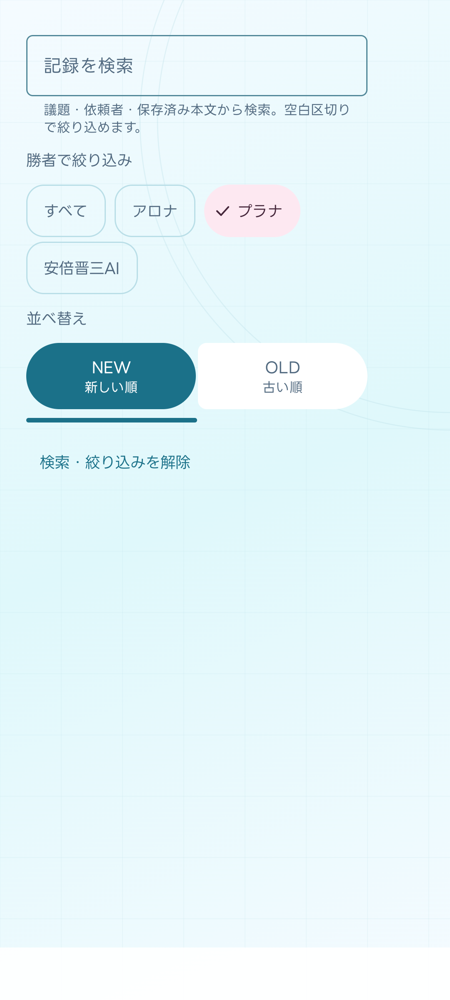
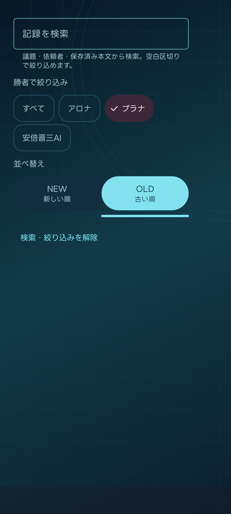
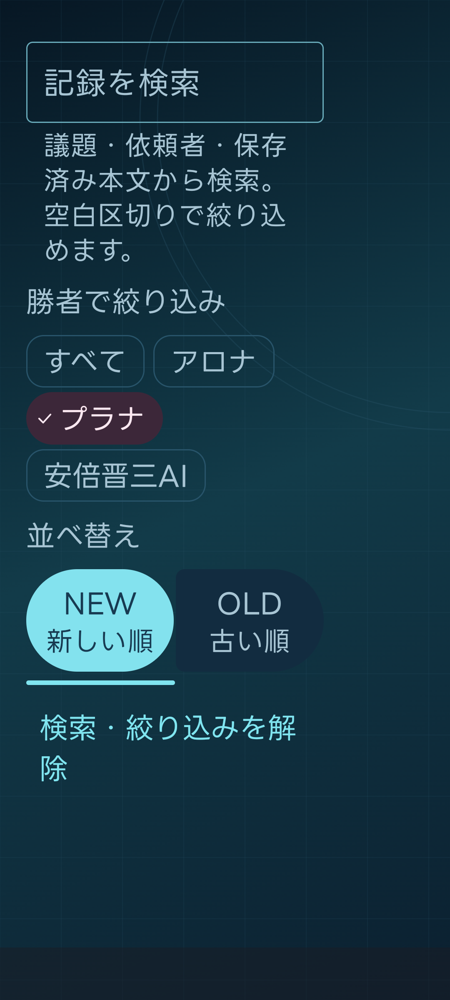
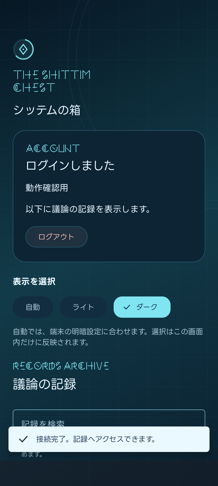

## C36：可変幅レイアウトと画面操作

- NavDisplayとMaterial 3 Adaptiveの標準ListDetailSceneStrategyで一覧／詳細を配置する。幅840dp以上・文字倍率1.5未満は左右2ペイン、それ以外は選択先を1ペインで表示する。詳細の本文幅は760dpまでとし、端末の戻る操作を使う。
- リサイズや詳細往復で選択・検索条件・一覧スクロールを維持する。認可を失えば両ペインを直ちに取り除く。認証・API・同期・保存形式は変更しない。
- 戻るgestureで標準ペイン遷移をプレビューし、確定時だけ一覧へ戻る。キャンセルでは詳細を開いたままにし、認可喪失や別記録への切替後に古いgestureを確定しない。通常の戻るボタンとアニメーション無効時も同じ選択・スクロールを維持する。
- 日本語のpane名・見出し・表示中の選択状態をsemanticsへ設定し、装飾アイコンの代替イニシャルを重複して読ませない。文字拡大時は1列へ戻して折り返す。TalkBack実聴と実機・Play配布はエミュレーターのsemantics確認と区別する。

### C36の画面写真

API 36・架空データ。標準のテスト用window／font scale overrideで広幅と320dp・文字2倍を確認し、アニメーション倍率0／1で戻るの取消・確定も確認する。実機のTalkBack・Discord認証・Play配布の証拠ではない。

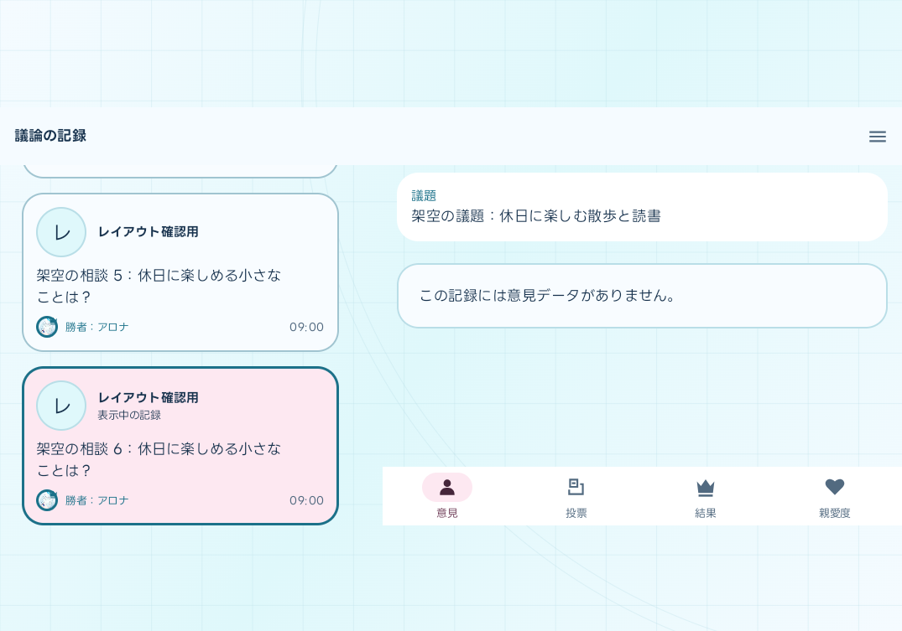
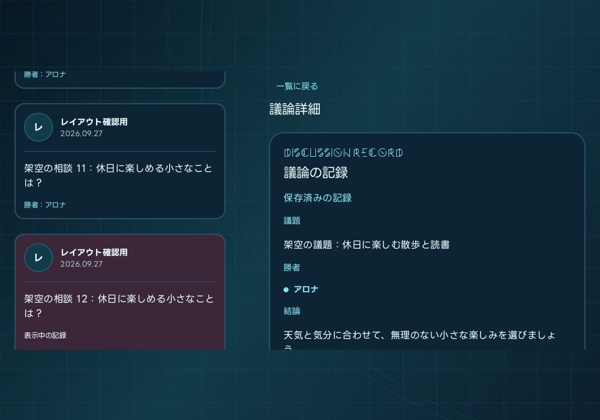
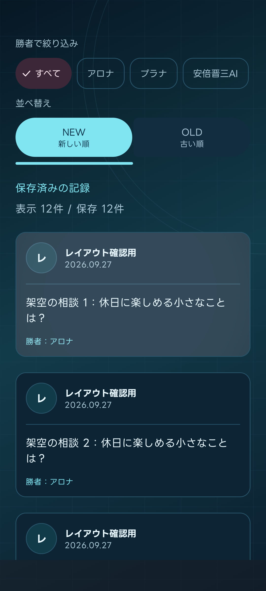
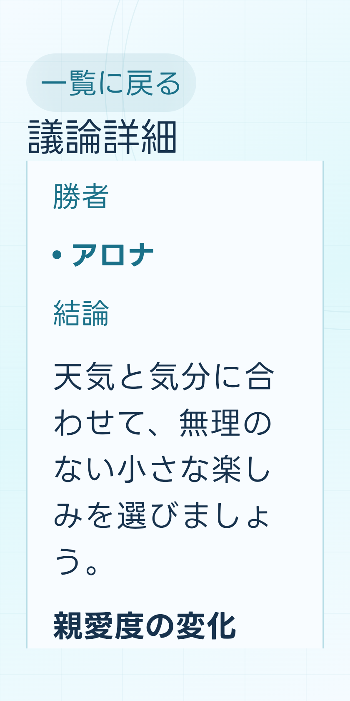

## C37：Web機能メニューとログアウト

- 認証済みの一覧・詳細の上部へメニューを追加。いろいろな記録、モモトーク、メモリアルロビー、サービス状態確認、プロンプト管理を固定URLでCustom Tabsへ開く。Web側の認可を使い、アプリのtokenはブラウザーへ渡さない。
- ログアウト・自動／ライト／ダーク切替をメニューへ移し、記録一覧にあったログイン状態カードと表示切替を撤去。通信不調によるオフライン閲覧でも同じログアウト操作が可能。
- ログイン前の常設説明文を削除。期限切れ・取消・失敗・ブラウザー不可の状態表示は残す。C35の短い完了通知は次の起動／ログイン演出PRで置き換える。
- 架空データの画面試験でメニューの導線とログアウト操作、一覧・詳細のスクロール維持を確認する。実Webへの接続とブラウザーからの復帰は内部テスト版で確認する。

## C39：GitHubからの内部テスト配布

C38を先に取り込み、`.github/workflows/android-release.yml`を`main`から手動実行する。
通常のCIやPRではPlay認証・署名・提出を行わない。Play掲載情報や本番トラックも変更しない。

管理者がGoogle WIFを、固定リポジトリ・数値repository/owner ID・`main`・このWorkflow・
`workflow_dispatch`・`android-internal` Environmentだけに限定する。
既存Play用サービスアカウントに`roles/iam.workloadIdentityUser`を付け、Play Consoleでは
対象アプリの読取・テストトラックへの配信だけを許可する。長期API秘密鍵をGitHubへ登録しない。

Environmentはmain限定とし、次を安全に登録する。

- Variables：`PLAY_WORKLOAD_IDENTITY_PROVIDER`、`PLAY_SERVICE_ACCOUNT`、
  `ANDROID_UPLOAD_KEY_ALIAS`、`ANDROID_UPLOAD_CERT_SHA256`、`ANDROID_RELEASE_ENABLED`。
- Secrets：`ANDROID_UPLOAD_KEYSTORE_BASE64`、`ANDROID_UPLOAD_STORE_PASSWORD`、
  `ANDROID_FIREBASE_CLIENT_CONFIG`。API認証とAAB署名は別物として扱う。

外部設定と読取確認が終わるまでは`ANDROID_RELEASE_ENABLED=false`を維持する。
有効化後も、配布は別の明示的な手動実行で行う。
固定SHAの最新main CI・Records CI・既存CodeQL成功を確認し、全トラック/bundle/APKの最大版番号より
大きいAABを一度ビルドする。Release Lint、JDK署名、固定bundletoolのmanifest、upload証明書とhashを検証し、
検証した同一AABだけを固定した提出Actionへ渡す。Actionがupload・internal track更新・commitを行い、helperのPlay再取得で版番号・hash・`completed`が一致したことを確認する。
`minimum_version_code`は指定下限であり、通常はPlay読取の最大番号＋1を使う。失敗後の新しい実行では、
Consoleで副作用を確認した前回試行番号＋1を下限に指定し、API未掲載の番号も再利用しない。
以後の更新を不可能にするPlayの最終番号`2100000000`は、下限指定・自動採番のどちらでもビルド前に拒否する。
署名検証はpinした公開証明書のUTC有効期間を確認し、その証明書だけの一時truststoreでJDKの厳格検証を行う。
自己署名を理由にexit code 4全体を許可せず、期限切れ・未有効やその他の重大警告は拒否する。一時truststoreは回収する。
`verification.json`は提出前のAAB検証、`receipt.json`はAction成功後の提出後照合の小さな記録とする。
receiptの`status=submitted`・`verified=true`はinternal/completedと同一AABのhash照合成功を表す。
trackの`completed`とreceiptは端末で更新可能な証拠ではない。審査・公開の状態をPlay Consoleで確認し、
Play内部テスト版を実機で取得・更新できることを別途確認して配布受入とする。

起動前にPlay Consoleで他の審査と未送信変更を確認し、実行中は同じアプリを編集しない。
失敗・タイムアウト・取消・応答不明ではWorkflowの「再実行」は使わず、Play側の版番号・hash・internal trackとreceiptを確認する。
副作用を把握してから新しい手動実行を判断し、自動再送・自動再番号付けは行わない。
artifactは非機密の`verification.json`と`receipt.json`だけ7日保持し、鍵・資格情報・Firebase設定・edit ID・AAB・Gradleログは含めない。
秘密入力と一時ログは`always()`で回収する。強制終了やreceipt保存失敗もupload／commit未実行の証拠とは扱わない。

架空データの接続試験は実提出の受入ではない。最初のActionによるWIF提出は別の配布依頼で行う。

詳しい外部設定と検証境界は[Androidアプリ設計](../../docs/29_Androidアプリ設計.md#c39内部テスト配布の自動化)を参照する。

## C40：依存と配布ツールの更新検知

Android専用の監視を増やさず、既存のDependabot・Dependency Graph・Release Tool Versionsを使用する。

| 対象 | 更新を確認する仕組み | 固定値の正本 |
|---|---|---|
| Gradle Wrapper・プラグイン・ライブラリ | Dependabotの既存Gradle設定 | Wrapper・Version Catalog・Gradle設定 |
| CI／配布のAction（upload-google-playを含む） | Dependabotの既存GitHub Actions設定 | Workflowの`uses:`（完全SHA） |
| JDK・SDK Platform／Build Tools・bundletool | 既存Release Tool Versionsの単一Issue | `apps/records-android/.java-version`・アプリのGradle設定・`.github/tool-versions.json` |
| 推移的依存の脆弱性 | 既存Dependency GraphへのGradle依存送信 | 実際に解決された依存。更新には親依存や制約の確認が必要 |

Gradleは月曜09:15、Actionsは月曜09:00、固定ツールは水曜13:29（日本時間）の既存予約を維持する。
Version Catalogの更新と同じライブラリを固定ツール側へ重複登録しない。
Emulator・system image・SDK command-line toolsはこの固定ツール監視の対象ではない。

検知は自動採用やPlay配布ではない。更新PRでは互換性、関連するビルド・Lint・試験、必須CIとCodeQLを確認する。
Kotlin・Compose・Materialの既定版、Actionの完全SHA、配布ツールのchecksum／署名条件を無断で変更しない。
固定ツールの取得失敗は未確認として残し、古い成功で更新Issueを閉じない。
依存グラフへ送信された推移的依存に警告があっても、Dependabotによる修正PRの生成は保証されない。

既存の検知設定とC38／C39の参照を確認した文書整理であり、依存更新・新Workflow・追加権限・Play提出は行わない。
詳しい担当範囲は[Androidアプリ設計](../../docs/29_Androidアプリ設計.md#c40android依存の更新検知)を参照する。

## Navigation 3：閲覧先の一本化（第1段階）

- Navigation 3 runtimeの`NavKey`と`rememberNavBackStack`で、一覧とopaqueな記録IDを持つ詳細を管理する。Circuit／Metroは描画状態・イベント・依存接続に継続使用し、別のback stackを追加しない。
- セッションモデルの現在の閲覧先を撤去する。検証済みApp Link・ログイン結果は一回限りの復帰先として受け渡し、有効なローカル閲覧許可の下で消費する。期限切れ中のrouteは非表示にし、明示ログアウトと確認済みアカウント切替で破棄する。
- back stackの保存対象はroute識別子だけ。質問・回答・検索語・token・アカウント識別子をSavedStateへ入れない。詳細を開き直すとアロナの初回意見から開始し、同じ閲覧中の回転・同期では位置を維持する。
- 第1段階では既存のAdaptive描画・約280msの戻りを維持し、描画の置換を第2段階へ分離した。未使用のUI依存や独自navigation wrapperは先行追加しない。
- 関連試験で一覧／詳細往復、認可喪失、一回限りの復帰先、ログアウト・アカウント切替を確認する。外部復帰と状態寿命の横断確認は後述の第3段階を参照する。C41は指定によりスキップし、Playへの配布は別操作とする。

詳細は[Androidアプリ設計のNav3移行](../../docs/29_Androidアプリ設計.md#navigation-3への段階的移行)を参照する。

## Navigation 3：描画・Adaptive Scene（第2段階）

- 一覧／詳細をNavDisplayのentryへ接続し、標準ListDetailSceneStrategyで1ペイン／2ペインを切り替える。内容幅840dp・文字倍率1.5の境界、hinge回避、一覧・本文の最大幅は維持する。
- 各entryを既存の不透明なブランド背景で覆い、背景ごとスライドする。詳細の余白に退出中の一覧が透けないこと、往復の途中フレームと一覧の読位置を`Nav3SceneMotionUiTest`で確認する。試験内だけ標準UiAutomationでアニメーションを有効にし、終了時に元の設定へ戻すため、既定で演出を無効にする試験環境でも途中フレームを確認できる。
- 予測型Backの進捗・取消と退出中のentry保持は標準処理へ任せる。NavigationBackHandlerをNavDisplayより前に置き、広幅はAdaptive Scene内部のBack処理を優先する。現在のrouteでnavigation event状態と広幅の描画scopeを切り替えて古いgestureを取り消し、狭幅のNavDisplayは維持して約280msの戻りスライドを保つ。独自PredictiveBackHandler・seekTo・取消時の復元は撤去し、確定時は認可確認済みの既存CloseRecordへ接続する。
- entryProviderを同じアカウントの描画scopeでrememberし、contentとAdaptive metadataのidentityを維持する。予測型Backのpreview先と確定後の一覧が別の遷移先と扱われ、詳細が即時消える状態を防ぐ。表示内容は既存rememberUpdatedStateで更新し、認可喪失・アカウント切替では保持しない。
- `Nav3SceneMotionUiTest`で通常の3ボタンBack、長文MarkdownからのBack、予測型の取消・確定を途中フレームで確認する。予測型の途中確定で詳細が即時消える回帰を防ぎ、読位置・選択・認可境界も維持する。これらの画面試験は任意のローカル確認とし、通常CIの重い画面試験を復活させない。
- 詳細のSaveable状態は標準entry decoratorで管理する。decorated entry・SaveableStateHolder・scene状態は描画scopeのroute keyより外側に置き、同じentryのリサイズ・回転・同期では読み位置を維持する。独自の詳細UUID・手動removeStateは使わず、pop後の再訪は初回意見から開始する。一覧のPaging・検索・読位置はdetail entryから独立して保持する。
- 認可喪失では退出中のentryも含め記録画面を直ちに外し、アカウント切替ではNavDisplayと旧entryを破棄する。検索語・本文・token・アカウント識別子をentryの保存状態へ追加しない。Sceneの自動focus移動を無効にし、検索画面から詳細へ進んだ後も一覧復帰時にキーボードやフォーカスを復活させない。
- 境界幅、文字拡大、戻る確定・取消、プレビュー中の認可喪失・アカウント切替、詳細再訪・回転を関連試験で確認する。外部リンク・認証・オフライン復帰の横断確認は後述の第3段階を参照する。

## Navigation 3：外部復帰・状態寿命（第3段階）

- MainActivityの既存cold／warm起動と再作成時のリンク再演拒否、retained MobileSessionModelのpending復帰先を横断確認する。onNewIntentの新しい入力は同じcanonical App Link・通知binding検証へ接続済みで、Intentの再読込や独自Nav3 decoder・ResultBusを追加する必要はない。本体は第1・第2段階の実装を維持する。
- 固定URI検証・一回限りのpending消費・Auth TabのActivity Resultを維持する。通知の旧binding拒否と認証取消・再試行・失効は既存の安全条件を使い、API・認証方式・通知設定・依存を変更しない。
- `RecordAppLinkTest`でcold／warm起動・再作成・旧通知binding拒否を確認する。`Nav3ReturnFlowUiTest`は標準ActivityMonitorと架空データを使い、Webを開いて戻った後の詳細の人物・回答段階・読位置と一覧の条件・読位置・focus非復活を確認する。pending・オフライン認可・再訪／回転・検索からの復帰は既存の関連試験を利用する。
- この工程では実機・実Discord認証・実FCM通知・Play配布を行わない。架空環境の画面・操作確認は、その受入を確認済みとする根拠にはしない。内部テスト版での主要操作確認は、別途配布後の受入として残す。

## 起動・ログインのブランド演出

- Android標準SplashScreenから全画面のシッテム演出につなぐ。起動は約1秒、対話的ログインが確認・保存まで成功したときは約1.5秒。認可確認や保存済み記録の表示は演出と並行して進む。
- ロゴ円弧を回転させ、ログイン前と記録一覧のヘッダーでも約8秒で一周する。タップ・戻る操作で演出をスキップでき、アニメーション無効なら即時に本画面を表示する。回転や通常の画面復帰では再演しない。
- 取消・失敗時にはログイン成功演出を出さない。C35の完了Snackbarを置き換え、保存token・本文・利用者名を演出状態へ保持しない。
- API 36の未認証・架空環境で確認した[ログイン画面](screenshots/login-refined.png)と[起動演出の短い録画](screenshots/brand-intro.mp4)。実認証や実機性能の証拠ではない。

## 人格アイコン

- 既存WebPを同梱し、一覧の勝者・絞り込み・意見・詳細の勝者へ顔アイコンと名前を表示する。勝者は王冠で区別する。
- 表示モデルにAPIの人格slotを残す。旧キャッシュは既知の人格名から補完し、不明なら汎用アイコンにする。暗号化保存の移行や全件再取得は不要。

## 記録一覧のジャーナル

- 日本時間の完了日で記録をまとめ、56dpの依頼者アイコン・大きな依頼者名・最大4行の議題を中心に表示する。勝者は下段の24dpの王冠付き顔と短い名称、時刻は補助情報とする。人格色のカード輪郭は維持し、全文は既存の詳細で読む。依頼者アイコン欠損時は大きな代替表示を使い、長い名前は2行まで表示する。
- 上部の画面名と小さな横並びブランド以外の重複見出しを撤去する。日付見出しはPagingの表示用行で、件数には含めない。
- 新しい議論は、右下の検索・フィルターの上にある独立した64dpの丸い「＋」から開く。上部バーには重複配置せず、末尾カードには両操作を避ける余白を設ける。認可済みの未読込・空一覧・オフラインでも下書きの入口を表示し、詳細・検索・シート・メニュー表示中は隠す。
- ローカル先行表示と同一アカウントのPaging Flow・読位置を維持する。同期通知は同じ高さの状態領域へまとめ、カードを動かさない。
- 公開API・保存形式・認可・同期・依存バージョンは変更しない。Play配布は別依頼で行う。

独立した「＋」の配置プレビューは[ライト](screenshots/debate-floating-action-light.png)と[ダーク](screenshots/debate-floating-action-dark.png)を参照する。API 36の架空データで採取しており、実機受入・配布の証拠ではない。

検索は右下の虫眼鏡からMaterialの全画面検索、依頼者・勝者・並べ替えはフィルターからBottom Sheetで開く。有効条件は解除できるChipで示し、条件変更時だけ結果の先頭へ移動する。閉じるだけでは条件と読位置を維持する。検索結果から詳細へ移る際は検索を閉じ、安定した記録keyから通常一覧へ読位置を渡す。戻ったときに検索・IME・focusを復活させない。検索語と入力状態はアカウントに紐づくメモリだけに置き、SavedStateには保存しない。

依頼者は保存済みの全一覧メタ情報から候補を作り、Discordディスプレイネームと保存済みアイコンのChipで1人を選ぶ。「すべて」または有効条件Chipから解除でき、検索・勝者条件とはANDで即時に絞り込む。絞り込み中も候補を減らさず、オフラインでは画像の追加通信をしない。画像欠損は代替表示とする。既存APIには依頼者IDがないため保存された表示名の完全一致を使い、同名は同じ候補、改名前後は別候補として扱う。条件・候補は認可されたアカウントのメモリだけに保持し、API・暗号化保存形式・DBは変更しない。

API 36の架空データで、日付境界・議題の4行上限・全人格と欠損アイコン、同期中の読位置、末尾カードと浮遊ツールの非重複、2ペインだけの選択強調を確認した。全画面検索・条件解除・即時絞り込み、詳細往復時の検索とfocusの非復活、認可喪失時の非表示、320dp・文字2倍の操作もinstrumentation testで確認している。Debug／ReleaseのビルドとLintは成功したが、Release署名は検証用証明書であり、実機受入・Play配布の証拠ではない。

画面資料は[ライト](screenshots/journal-light.png)、[ダーク](screenshots/journal-dark.png)、[320dp・文字2倍](screenshots/journal-320dp-2x.png)、[広幅](screenshots/journal-wide.png)、[絞り込み](screenshots/journal-filter-sheet.png)、[条件選択後](screenshots/journal-filter-selected.png)、[全画面検索](screenshots/journal-fullscreen-search.png)と[一覧から詳細へ往復する短い録画](screenshots/journal-preview.mp4)を参照する。実質問・利用者情報は使用していない。

任意の再採取では、`RecordJournalVisualTest`と`RecordSearchNavigationTest`へ`shittimCaptureJournal=true`を渡すと、対象アプリのcacheディレクトリへPNGを出力する。録画時は`RecordJournalVisualTest`へ`shittimRecordJournal=true`も渡し、`adb shell screenrecord`と併用する。録画用の待機・実時間フレーム送りは、これらの引数を指定した場合だけ行い、通常CIでは実行しない。

## 議論詳細の4画面

詳細は下部の意見・投票・結果・親愛度と左右スワイプで切り替える。6つの意見、投票、結果、3人の親愛度を1つの非ループHorizontalPagerでつなぐ。意見は回答を切り替えるたびに先頭へ戻し、同じ回答の同期・回転では読位置を維持する。新規・同じ記録の開き直しともアロナの初回意見から表示する。回転などの復元時は本文が揃ってからPagerと読位置を復元し、読み込み中の仮ページ数で選択を消費しない。選択中かつ停止しているページだけで演出を許可し、メニュー表示中・画面非表示中には停止する。標準のShortNavigationBar／HorizontalPagerを使用し、APIと保存形式は変更しない。

議題はPager外へ固定し、最初から最大5行の省略付きプレビューと「全文」を表示する。全文シートは広く展開し、見出しと閉じる操作を固定してMarkdown本文だけをスクロールする。本文は選択・コピー可能。文字2倍の狭幅でも議題の末尾・閉じる操作と回答／下部切替へ到達できることを確認する。結果は王冠付きの勝者と結論を主役に、勝利コメントと件数付きの実行案・注意点を表示する。実行案・注意点はアイコン、件数バッジ、回転矢印と展開アニメーション付きのカードで開閉でき、本文を削らない。演出完了を閲覧条件にせず、戻る操作では先にシートを閉じる。

意見ページは顔付きChipの1行目に人物名、2行目に初回意見／最終案を表示し、従来の人物Chipと同程度の大きさの1つのボタンへ統合する。選択中の人物を押すと段階を交互に切り替え、左右スワイプでも表示を同期する。各ボタンには人格色の輪郭と選択面を付け、狭幅・文字拡大では折り返す。アロナ初回→アロナ最終→プラナ初回→プラナ最終→安倍晋三AI初回→安倍晋三AI最終→投票の順に進み、投票から右スワイプすると安倍晋三AIの最終案へ戻る。アロナ初回の右側は標準Pagerの行き止まりで循環しない。旧記録は存在する人物の回答だけを対象にする。別の人物を押すとその人物の初回意見へ、回答の切替では本文の先頭へ戻る。非選択のChipは初回意見を表示する。選択した人物の96dpの顔アイコンを意見カード内へ表示する。選択欄は議題の後に固定し、本文だけが縦スクロールする。親愛度の人物選択も共通の四角い背景を付けず、人格色の丸いChipで区別する。詳細の「保存済みの記録」は表示せず、更新中・更新失敗の通知は維持する。長文の本文をSavedStateへ保存しない。

## 投票の表示

- 3人の顔を三角形に置き、投票先へ曲線矢印を順に描く。図が画面に完全に入ったら約1.8秒で描画し、画面内にある間は完成形を約0.9秒保って繰り返す。画面外・理由シート表示中・アニメーション無効時は完成形で静止する。得票数・勝者の王冠を併記し、顔を押すと投票理由と保存された5項目評価をBottom Sheetで開く。
- 文字拡大・狭幅では顔付きの3行表示へ切り替える。旧記録に採点がなければ理由だけを表示し、勝者を再計算しない。
- 投票の矢印は表示中に繰り返すため、演出済み状態を保持しない。演出のために本文をSavedStateへ入れない。
- 架空の循環投票による[関係図](screenshots/voting-graph.png)と[理由シート](screenshots/voting-detail.png)。

## 親愛度の表示

- 3人の顔・名前と10個のハート、変更前後の正確な点数、実際の増減を示す。質問評価点はカードに出さない。100点につきハート1個とし、端数は数字で確認できる。
- 詳細の親愛度タブは顔と実増減のChipまたは横スワイプで1人を選び、選択カードを大きく表示する。スワイプ順はアロナ→プラナ→安倍晋三AIで、最後の左側は行き止まり。結果から左スワイプでアロナ、親愛度アロナから右スワイプで結果へ戻る。直接タブを押した初期人物は従来どおり勝者とする。完全表示時に数値とハートを約1.1秒で動かす。人物切替、親愛度タブや記録の開き直しでは再生し、同じ表示中のスクロール・同期・回転では再演しない。画面内に収まりきらないカードとアニメーション無効時は最終値を即時表示し、一時的な小さい領域の計測だけで演出を消費しない。
- 上限・下限により質問評価と実増減が異なっても、表示する実増減には保存値を使う。増減0、評価不能、親愛度のない旧記録に架空の値を補わない。
- 「人格名から一言」の本文は数値カードと別の縦スクロール領域に置き、長文でも点数演出の表示判定へ影響させない。人格Chipとスワイプの選択、人物ごとの読位置を継続し、上限・下限で実増減が調整された場合は短い説明を添える。感想のHTMLやMarkdownは解釈しない。
- 架空の上限・減少・増減0の選択はinstrumentation testで確認する。新配置は[親愛度カード](screenshots/detail-affection-dark.png)を参照する。

## C16の認証画面

- `auth/MobileSessionModel.kt`：Activity再生成をまたぐ認証の寿命。保存tokenとsession APIを照合し、期限・失効・通信障害を区別する。
- `MainActivity.kt`／`RecordsGraph.kt`：既存AndroidX ViewModelをMetroへ注入。新規依存やRepository層は追加しない。
- `BootstrapPresenter.kt`：Circuitの表示状態・イベントと、C15のActivity Resultを接続する。
- `SessionPanel.kt`：ログイン前や認証不調時の説明と操作。tokenは受け取らず、閲覧中のログアウトはC37メニューへ移した。
- ログアウトは端末削除を先に行い、サーバー失効は1回だけ試す。応答不明では端末削除済み／サーバー失効未確認を明示する。
- 架空APIの状態遷移と画面操作をinstrumentation testで確認する。本番通信は行わず、実署名によるDiscordログインはC19に残す。

## C13のトークン保存

- `auth/StoredToken.kt`：43文字のBearer tokenと秒単位の絶対期限、C30からは任意の検証済みキャッシュ認可を保持する。`toString()`は常に伏せる。
- `auth/KeystoreTokenStore.kt`：`save`／`read`／`clear`。Android KeystoreのAES-256-GCM鍵を使用し、`noBackupFilesDir`へ暗号文だけを原子的に保存する。
- 鍵・保存形式はモバイル認証専用。鍵は書き出さず、IVは暗号化ごとに生成する。バックアップ・端末転送を禁止する既存Manifest／XMLも維持する。
- 破損・鍵消失・書込失敗は固定例外で通知し、平文保存へ切り替えない。鍵を失った保存データは明示的に`clear`してから再ログインする。
- `clear`は専用鍵と保存ファイルだけを削除する。サーバーでの失効は別処理であり、C14以降から接続する。
- ファイル／Keystore操作は同期処理のためUI thread外から呼ぶ。単一process内の複数インスタンスを直列化する。
- 有効期限の延長・認可判定・プロフィール保存は行わない。ログイン画面・通信・PQCによる記録キャッシュはこの工程へ含めない。

## C14の認証APIクライアント

- `auth/MobileAuthModels.kt`：既存モバイルAPIに対応する要求・応答。S256、取引ID、復帰先、Bearer、日時を検証する。
- DTOは通常classとし、文字列化で認証情報・本人情報を表示しない。
- Ktor 3.6.0＋OkHttp engine、kotlinx.serialization 1.11.0、Coroutines 1.11.0を固定。compiler pluginはKotlinと同じ版を使用する。
- `auth/MobileAuthClient.kt`：固定HTTPS originへ開始・交換・session・logoutを送るsuspend API。渡したengineを所有し、利用終了時に`close`する。
- native通信にはCookieを使わず、Bearerはsession／logoutにだけ付ける。TLSの標準検証・平文HTTP禁止を維持し、HTTP loggingやdisk cacheを持たせない。
- 接続10秒、request／socket 20秒、JSON応答64 KiB。redirect・接続復旧retryを無効化し、POSTはone-shot bodyとする。
- 401・grant不正・通信失敗・サーバー障害等は固定分類で返し、応答本文や原因例外を表示しない。キャンセルはそのまま伝播する。
- クライアントだけでは保存tokenの消去・延長・再認証を行わない。ブラウザー接続はC15、ログイン画面との接続はC16へ分離する。

## C15のブラウザーログイン

- `auth/MobileLoginActivity.kt`：AndroidX Browser 1.10.0のAuth Tabを起動し、Activity Resultで復帰・取消を受ける。`onResume`から取消を推測しない。
- 対応していないブラウザーではAuth TabのCustom Tabs fallbackを使い、公開するのは固定HTTPS callback専用のreceiverだけとする。
  両方の復帰経路を同じ検証へ渡し、通常の画面復帰や二重callbackで交換を繰り返さない。
- HTTPSのAuth TabにはDigital Asset Linksが必要。検証失敗・時間切れは拒否し、検証を迂回するブラウザーへ切り替えない。
  C19で実際のPlay署名証明書を設定するまでは、本番ブラウザー認証の完了を保証しない。
- `auth/MobileLoginFlow.kt`：既存の独自APIに合わせ、S256、独立したランダムstate、取引ID、固定callback、期限、一回限り交換を検証する。
  verifier／state／codeはメモリ内だけに保持する。process消失・取消・期限切れの復帰は、新しい認証取引を作らず拒否する。
- `auth/MobileLoginModel.kt`：回転をまたぐ進捗と交換・Keystore保存を管理。保存はUI thread外で行い、保存失敗をログイン成功にしない。
- `auth/MobileLoginContract.kt`：呼出元へは結果分類と元の目的画面だけを返し、tokenや復帰URLは渡さない。ログイン画面への接続はC16で行う。
- テストは合成データとMockEngineを使い、Auth Tab結果、fallback、取消、不正・古いcallback、二重交換、保存失敗を確認する。
  本番Discordや既存の保存tokenには触れない。端末のブラウザーと署名証明書による疎通確認はC19の配布確認で実施する。

## デザイン基盤

- `ui/ShittimTheme.kt`：surface／inverse／fixed色を含む意味別の配色、LINE Seed JP、Delogy、形状、Expressiveモーション。
- `ui/ShittimBackdrop.kt`：画像素材やblurを使わないグリッド・円弧・菱形。
- `BootstrapUi.kt`：幅・文字倍率に応じた1列／2列配置とExpressive List。未実装機能は押せるリンクに見せない。
- `BootstrapThemeSelector.kt`：ButtonGroupによる排他的な自動／明暗選択。均等幅を強制せず、文字が収まらない項目は標準overflow menuへ移す。押下時の幅・形状変化はMaterialのMotionSchemeを使用する。
- morphing Chipは実際の記録フィルターを作る段階で使用する。準備画面にダミーのフィルターや未使用の共通部品は置かない。
- Material 3 `1.5.0-alpha28`を全面採用し、Compose本体も`compose-bom-alpha:2026.09.00`で揃える。
  UI・Foundation・Runtime・Animation・Toolingは`1.13.0-alpha03`を使用する。
  stable版との混在を前提にせず、更新時はBOMとMaterial 3を一組として依存解決・ビルド・表示を確認する。
- 使用フォントの出典とライセンスは`app/src/main/assets/licenses/`を参照する。

設計と実装範囲は[Androidアプリ設計](../../docs/29_Androidアプリ設計.md)を参照する。
リファクタリングには指定の[Material Design 3 UI/UXスキル](https://github.com/skydashnet/material-design-3-ui-skill/tree/a7d28f28251b64740b74dd0046971f23fbe74758)を適用した。

## 議論詳細の4画面

- 下部の意見／投票／結果／親愛度で切り替える。6つの意見→投票→結果→3人の親愛度を横スワイプで読み、先頭と末尾は循環しない。意見の切替では本文先頭へ戻り、詳細を開き直すと同じ記録でもアロナ初回から始まる。詳細の状態はNavDisplayのentry単位で分離し、一覧の読位置は変えない。議題はPager外の共通領域へ固定し、タブ切替中も動かさない。議題は最大5行のプレビューと「全文」へ折りたたみ、固定見出し・閉じる操作付きのBottom Sheetで全文を読む。閉じると元の回答の読位置へ戻る。
- 親愛度は顔と実増減のChipまたは横スワイプから1人を選ぶ。直接タブを押した初期人物は勝者とし、選択・人物別の読位置を同期や回転で保持する。スワイプはアロナ→プラナ→安倍晋三AIの順で、安倍晋三AIの先には進まない。人物切替と親愛度画面・記録の開き直しではアニメーションを再生する。
- 投票画面にアイコンをタップすると投票理由・採点内訳を確認できる案内を表示する。採点のない旧記録では投票理由だけを案内する。投票理由の選択と人物別の読位置も保持し、Androidの戻る1回でシートを閉じる。旧記録の欠損情報を補完しない。
- 投票図は完全表示時だけ描画1.8秒＋静止0.9秒を繰り返し、親愛度は完全表示時に約1.1秒で一度だけ動かす。非選択ページ・移動中・非表示・シート表示中は停止する。
- API・認証・暗号化保存形式・差分同期・一覧の検索focus復帰抑止は変更しない。架空データによる画面確認と実機・Play配布は区別する。
- Androidの戻りはNavDisplayの約280msのスライドと標準の退出entry保持を使い、退場中に本文を空欄へ差し替えない。通常の戻るボタンでは予測型ジェスチャーの縮小を適用せず、元の大きさのまま横スライドする。予測型の追従・取消は標準処理へ任せ、アニメーション無効時は即時に戻る。狭幅の一覧に選択色を残さず、広幅では2ペインの選択強調を維持する。認可喪失時の非表示、一覧の読位置と検索focus抑止も維持する。

API 36・架空データで、[意見](screenshots/detail-opinions-light.png)、[投票](screenshots/detail-voting-light.png)、[結果](screenshots/detail-result-dark.png)、[開閉カード](screenshots/detail-result-expanded-dark.png)、[親愛度](screenshots/detail-affection-dark.png)、[320dp・文字2倍](screenshots/detail-large-text.png)を確認する。[前版の操作録画](screenshots/detail-pages.mp4)とは画面順と初期段階が異なる。
プレビューは`RecordDetailVisualTest`に`shittimCaptureUi=true`を渡して再取得できる。録画時だけ`shittimRecordUi=true`も渡す。通常CIでは録画用の待機や実時間フレーム送りを行わない。

戻りスライドの[途中](screenshots/adaptive-back-slide-middle.png)と[完了後](screenshots/adaptive-back-slide-complete.png)も架空データで確認する。`AdaptiveRecordsUiTest.threeButtonBackPopsOnceAndSlidesWithoutLeavingASelectedListCard`へ`shittimCaptureAdaptive=true`を渡して再取得できる。

## 新しい議論の通知

- 閲覧可能なすべての新しい議論がWebへ公開された後、FCMのdata-onlyメッセージを受信する。タイトルは「議論結果が投稿されました」、本文は依頼者のディスプレイネームと固定の案内を表示する。依頼者名は最大100文字の検証済み表示名だけをFCMへ送り、議題・本文・Discord IDは送信しない。改行・制御文字・不正な表示名は端末でも拒否し、名前をログ・永続キャッシュへ残さない。
- アプリ側の初期設定はオン。Firebase設定があり、有効なログインが確認された初回だけAndroidの通知許可を要求する。拒否・取消後は起動や復帰ごとに再要求せず、拒否しても記録を閲覧できる。メニューの「新しい議論の通知」にあるSwitchでオン／オフを選び、明示したオフは再起動・再ログイン後も維持する。OSの許可不足は別の設定ボタンで案内し、OS設定で許可して戻れば自動登録する。
- オフ・ログアウト・認可喪失では端末の通知を即時に消去し、遅延到着した旧bindingの通知を表示しない。OSの拒否はアプリ側のオン設定を書き換えない。ログアウトではbindingと登録情報を消去するが、通知の選択と権限要求済み状態は端末設定として維持する。
- アプリ全体の通知許可に加えて「議論結果」チャンネルの拒否も確認し、拒否中はOS設定への案内を表示する。初回でチャンネルが未作成の状態は拒否扱いにしない。
- 通知タップは既存の記録App Linkへ接続する。本文取得は既存の認証・認可に従う。通知到着後の保存は既存WorkManager差分同期へ任せ、通知前のネットワーク取得や常駐サービスは追加しない。
- FCMの現行`register()`／Firebase Installation ID（FID）を使用し、旧`getToken()`は使わない。自サービスAPIの`token`項目にはFIDを渡す。SDK auto-initは常に無効とし、現行セッション・アプリ側オン・OS許可を確認したWorkerだけが手動登録する。通常の起動・復帰ではbindingを再生成せず、セッション・FIDの変更や明示的な再有効化で更新する。SDKの自動収集・通知代理表示・BigQuery出力は無効で、Analyticsは導入しない。
- 登録APIの期限が端末側で保守的に短くした期限より長くても、正常応答を失敗扱いにしない。端末の登録期限はサーバー応答・保存セッション・保存済み閲覧認可の最短値に制限し、既存の期限を延長しない。期限切れ応答は拒否する。
- 登録失敗時はメニューへ固定の処理段階・失敗分類・試行番号だけを表示する。同じ分類だけを`RecordNotifications`のログへ出し、例外本文・stack trace・API本文・token・FID・binding・利用者情報は保存しない。SDKの待機は標準Coroutineで30秒に制限し、通信等の一時障害だけを既存WorkManagerで最大3回再試行する。応答形式・期限・保存・設定の不備はその場で失敗とし、同じ処理を数分繰り返さない。成功・明示再試行・OFFからON・ログアウトで古い診断を消去し、古いbindingの遅延失敗は新しい登録へ反映しない。
- Firebaseの公式`BAD_CONFIG`も設定不備として即時に停止し、`UNAVAILABLE`・`TOO_MANY_REQUESTS`だけを一時障害として扱う。Coroutineの待機終了後もSDKのTaskは完了する場合があるため、遅延した登録成功callbackは現在の保存済み認可・通知許可を再確認し、初回またはGoogleへの登録失敗中なら既存Workの後へ再確認を予約する。保存済みbindingと同じFIDの正常callbackでは再予約せず、自己キャンセルや登録ループを作らない。
- 回復用の独立した一意Workが、標準のWorkInfo Flowで既存処理の終了を観測し、失敗・取消を含め終端を確認してから登録を予約する。実行中Workへ後続を直接APPENDして失敗を引き継がせず、正常登録が先に完了した場合やAPI・保存の恒久エラーなら再予約しない。WorkDataにはtoken・FID・bindingを入れず、ログアウトでは回復用Workも取消す。
- 通知許可やFCMは到着時刻を保証しない。通知が届かなくても起動時・定期同期で記録を取得できる。通知の再送重複は端末の最大128件のopaque IDで抑える。

### Firebaseが未作成の場合

設定がないビルドも従来どおり起動・ログイン・閲覧でき、メニューは「通知設定の準備中」と無効表示になる。OSの通知許可も要求しない。架空のプロジェクト設定を同梱しない。

1. Firebase Consoleでプロジェクトを作成する。Google Analyticsの追加は不要。Androidアプリを`dev.pitekusu.shittim.records`で登録し、開発ビルドも使う場合は`.dev`付きの別Androidアプリを同じプロジェクトへ登録する。
2. Android用の`google-services.json`をリポジトリ外へ保管する。これはクライアント用の設定で、サーバーの秘密鍵・サービスアカウントJSONを代わりに指定してはいけない。
3. ビルド時だけ`SHITTIM_ANDROID_FIREBASE_CONFIG`へそのファイルを指定する。公式Google Services pluginがapplicationIdを検証してリソースを生成する。不一致・不存在・リポジトリ内の入力は拒否する。
4. サーバー側のFCM送信用認証と機能有効化はAndroidの設定とは別に行う。Play配布用サービスアカウントを流用したり、FCM送信鍵をAPKへ入れたりしない。

```bash
# リポジトリrootから実行する
SHITTIM_ANDROID_FIREBASE_CONFIG=/path/outside-repository/google-services.json \
  uv run --frozen python -m tools.run_android_build -- :app:assembleDebug :app:lintDebug
```

[FCM公式Androidガイド](https://firebase.google.com/docs/cloud-messaging/android/get-started)、[data-only受信とWorkManager](https://firebase.google.com/docs/cloud-messaging/android/receive-messages)、[公式Google Services plugin](https://firebase.google.com/docs/android/google-services-plugin-and-file)に従う。SDKはVersion CatalogのFirebase BoMで固定し、Messaging以外のFirebase製品を先行追加しない。

### 確認する操作

設定なしは準備中表示・許可要求なし・既存閲覧を確認する。接続後は、初回ログイン→許可→新記録1件→通知タップ→対象の記録表示、拒否・取消→再起動や復帰で再要求しないこと、OS設定で許可→復帰時に自動登録することを確認する。メニューのオフはOS拒否中も選択でき、再起動・再ログイン後も保持する。オフ・オフラインログアウト→通知が出ないこと、同じイベントの再送→再通知しないこと、アカウント切替→以前のセッションの通知が出ないことも確認する。Firebase Consoleの通知キャンペーンはOSが自動表示するnotification payloadを送るため、このアプリのdata-only経路の検証には使用しない。実際のサーバー公開イベントで確認し、端末tokenをログや共有資料へ出さない。
