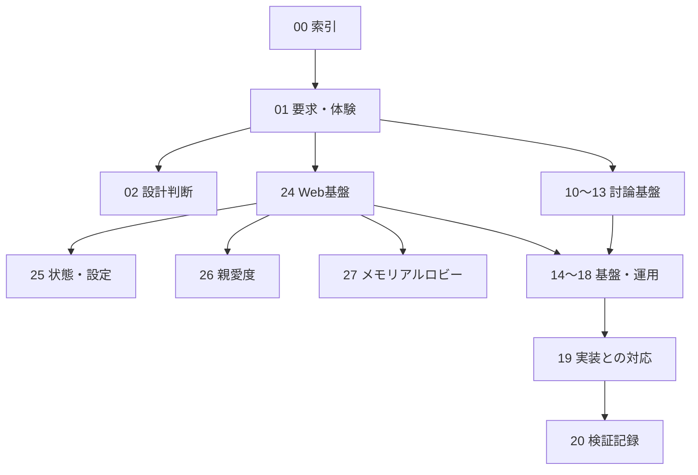

# シッテムの箱 ドキュメント索引

シッテムの箱は、友人同士がDiscordで3人のAIとの議論を楽しみ、その記録や思い出をWebで振り返るアプリである。
この索引は「何を読むか」と「どこを変更するか」の入口とする。

## まず読む文書

| 目的 | 読む順序 |
|---|---|
| アプリを知る | [要求・利用者体験](01_要求仕様書・基本設計書.md) → [設計判断](02_議論事項・意思決定記録.md) |
| 討論の仕組みを理解する | [アプリケーション](10_アプリケーション・Python詳細設計.md) → [AIとプロンプト](12_OpenAI・プロンプト詳細設計.md) → [永続化](13_DynamoDB・データ整合性詳細設計.md) |
| Web機能を変更する | [Records基盤](24_シッテムの箱%20議事録設計.md) → 下記の機能別設計 → [実装・試験との対応表](19_実装計画・トレーサビリティ.md) |
| 本番を配信・保守する | [AWS構成](14_AWS・CDK詳細設計.md) → [CI・配信](15_GitHub・CI-CD詳細設計.md) → [運用・障害対応](17_運用保守・監視・障害対応設計.md) |
| 確認済みの範囲を調べる | [試験方針](18_試験・品質保証設計.md) → [実装・検証の現状](20_実装・試験・検証記録.md) |

## 文書の全体構成

### 要求と基本方針

| 文書 | この文書が管理すること |
|---|---|
| [01 要求仕様・基本設計](01_要求仕様書・基本設計書.md) | 対象利用者、機能、利用体験、全体構成、製品としての制約 |
| [02 意思決定記録](02_議論事項・意思決定記録.md) | なぜその構成にしたか、採用しない案、再検討の条件 |

### 討論処理と共通基盤

| 文書 | この文書が管理すること |
|---|---|
| [10 アプリケーション・Python](10_アプリケーション・Python詳細設計.md) | 層の責務、討論の状態遷移、プロセスの起動と停止 |
| [11 Discord](11_Discord詳細設計.md) | 署名付き受付、Botの投稿、操作、表示順序 |
| [12 OpenAI・プロンプト](12_OpenAI・プロンプト詳細設計.md) | AIへの入力、参考情報、出力検証、失敗時の扱い |
| [13 DynamoDB・整合性](13_DynamoDB・データ整合性詳細設計.md) | 保存形式、トランザクション、排他制御、再開、投稿待ちデータ |
| [14 AWS・CDK](14_AWS・CDK詳細設計.md) | スタックとリソースの所有関係、ネットワーク、実行権限 |
| [15 GitHub・CI/CD](15_GitHub・CI-CD詳細設計.md) | 検証、依存更新、署名付き成果物、配信と後片付け |
| [16 セキュリティ・プライバシー](16_セキュリティ・プライバシー詳細設計.md) | 信頼境界、認証情報、公開範囲、データの保護 |
| [17 運用・監視・障害対応](17_運用保守・監視・障害対応設計.md) | 正常時の状態、警告の意味、調査・復旧の判断 |
| [18 試験・品質保証](18_試験・品質保証設計.md) | 変更に応じた試験、CIの必須条件、実環境での受入境界 |
| [21 GitHub・Discord通知](21_GitHub・Discord通知運用設計.md) | リポジトリの変更・検証結果を補助通知する仕組み |

### Webと利用者向け機能

| 文書 | この文書が管理すること |
|---|---|
| [24 Records基盤・議事録](24_シッテムの箱%20議事録設計.md) | Discord認証、議事録投影、閲覧API、Web共通設計、概算費用 |
| [25 サービス状態・プロンプト管理](25_サービス状態確認・プロンプト管理設計.md) | 状態取得、権限分離、プロンプト編集・履歴・反映 |
| [26 親愛度・ランキング](26_親愛度・ランキング設計.md) | 評価と増減、Discord/Web表示、ランキング、リセット回数 |
| [27 メモリアルロビー](27_メモリアルロビー設計.md) | 解放、本人確認、アップロード、生成、履歴、リセット |

### 実装の追跡と過去の記録

| 文書 | 位置付け |
|---|---|
| [19 実装・試験との対応表](19_実装計画・トレーサビリティ.md) | 要求から設計・コード・試験へ進むための一覧 |
| [20 実装・検証の現状](20_実装・試験・検証記録.md) | 配信済みの範囲、証拠の参照先、未実施の受入・訓練 |
| [22 受付・状態収束の是正](22_Discord受付・状態収束是正計画.md) | 完了した是正の背景。現行手順ではない |
| [23 討論過程表示の導入](23_Discord討論過程表示実装計画.md) | 完了した表示改善の背景。現行手順ではない |
| [Scale-to-Zeroの到達点](100_Ondemand%20Fargate/10_scale-to-zero-goal.md) | 常駐方式からの移行記録 |
| [Scale-to-Zeroの完了確認](100_Ondemand%20Fargate/20_scale-to-zero-completion-checklist.md) | 導入時の確認範囲 |
| [Scale-to-Zeroの導入順序](100_Ondemand%20Fargate/30_scale-to-zero-commit-plan.md) | 当時の変更順序と現行設計への引き継ぎ |

## 変更内容と編集先

| 変更内容 | 最初に編集する文書 | 必要に応じて追従する文書 |
|---|---|---|
| 利用者ができること | 01 | 対象機能の設計、19 |
| 討論・出力・再開の契約 | 10〜13の担当文書 | 11の表示、18の試験、19 |
| Web・API | 24〜27の担当文書 | 16の権限・公開範囲、18、19 |
| AWSの所有範囲・配信 | 14・15 | 16・17・18 |
| 採用方針が変わる判断 | 02 | 対象の設計 |
| 配信・受入を確認した事実 | 20 | 過去の計画へ新仕様を追記しない |
| パッケージ・ツールのバージョン | ロックファイルと固定ツール設定 | 互換性判断が変わるときだけ02・15 |

文書番号は参照用の識別子であり、実装順や優先順位ではない。
既存ファイル名はリンクとObsidian内の参照を維持するため残す。

## 共通用語

| 用語 | このプロジェクトでの意味 |
|---|---|
| Core | Discordでの受付・討論・結果保存を担う処理系 |
| Records | 保存した記録をWebへ投影し、認証・集計・管理・メモリアル機能を提供する処理系 |
| 投影 | 原本を検証し、閲覧・集計に適した形式へ変換して別の保存先へ反映すること |
| Evidence | 事前調査で用意し、参加者全員へ共通に渡す参考情報 |
| Outbox | 送信順序と送信状態を永続化した、Discordへの投稿待ちデータ |
| チェックポイント | 中断後に処理を再開するための保存点 |
| リース・フェンス | 処理権の有効期限と所有者の世代。期限切れ・古い所有者の書き込みを防ぐ |
| CAS | 読み取った版が変わっていないことを条件に更新する仕組み |
| リビジョン | プロンプトの一組を識別する版。内容と検証情報をまとめて扱う |
| マニフェスト | 配信成果物や設定の構成・識別情報・検証値をまとめた記録 |
| 縮退動作 | 一部の取得・生成に失敗しても、定義した条件で機能を限定して続行すること |

文書の`status: current`は現行設計、`status: completed`は完了した導入の記録を示す。
配信の成功・未実施はこの属性ではなく20で区別する。

## 文書を保守する原則

- 公開可能なObsidian文書を正本とし、GitHubの`docs/`へ内容を変えず同期する。
- 「要求」「設計の契約」「配信の証拠」を分け、細かな値や手順は担当文書へ一度だけ記載する。
- 本文は日本語を基本とし、コード識別子は原綴り、略語は初出で説明する。
- 文書間は相対Markdownリンク、構成や状態はMermaidで表す。どちらも両環境で読める形式にする。
- 公式資料の確認日、試験の成功、配信の完了を推測で更新しない。現在の実装との差異は根拠とともに整理する。
- 認証情報、質問・回答、人格プロンプト本文、非公開のDiscord識別子、端末固有パスを書かない。
- 過去の手順と矛盾した場合は、現行の担当文書と実装を確認する。判断がつかないものは未確認として残す。

図の形式は[GitHubの図表対応](https://docs.github.com/en/get-started/writing-on-github/working-with-advanced-formatting/creating-diagrams)と
[Obsidianの表・図の記法](https://obsidian.md/help/advanced-syntax)を参照する。
2026年9月5日に両環境の公式説明を確認した。環境による描画差を抑えるため、基本的なフロー・順序・状態図を使う。
