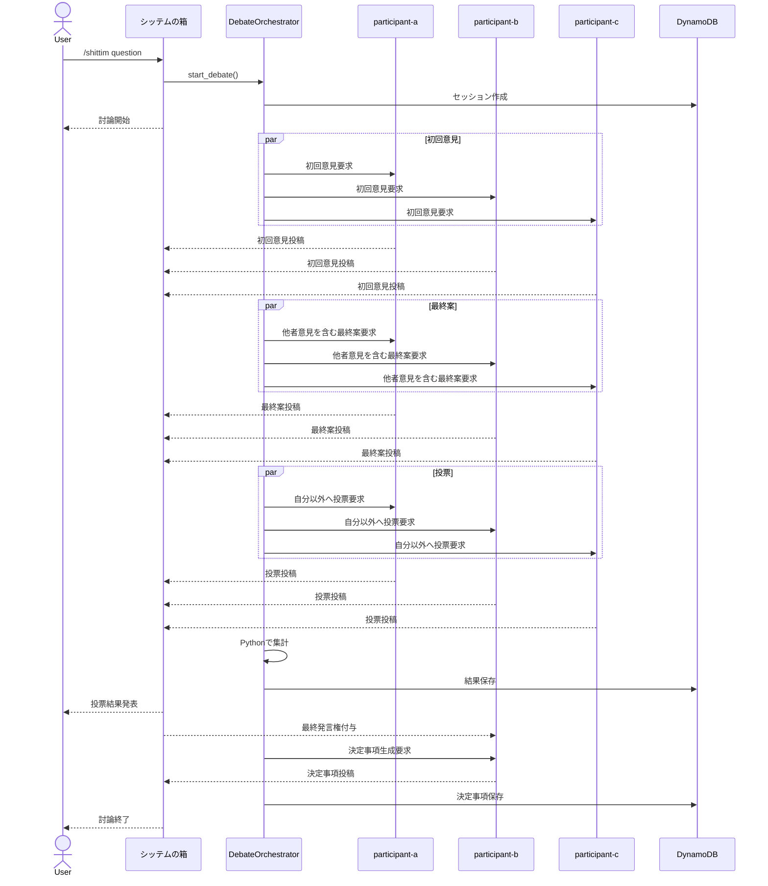

---
aliases:
  - シッテムの箱(Discord BOT) 要求仕様書・基本設計書
  - The Shittim Chest 要求仕様書・基本設計書
tags: [project, shittim-chest, requirements, basic-design]
status: decided
created: 2026-07-16
updated: 2026-07-16
---

# Discord マルチエージェント討論Bot
## 要求仕様書・基本設計書

- 文書種別: 要求仕様書／基本設計書
- 日本語名: シッテムの箱
- 正式英名: The Shittim Chest
- canonical ID: `shittim-chest`
- 対象システム: Discord上で複数AIエージェントが討論し、投票によって結論を決定するBot
- 想定実行基盤: AWS ECS Fargate Spot
- 想定言語: Python 3.14.6（通常GIL build）
- 想定Discordライブラリ: discord.py
- 想定AI API: OpenAI Responses API
- 想定モデル: `gpt-5.6-luna`
- ステータス: 主要設計決定済み・未実装
- 確認基準日: 2026-07-16
- 備考: 本書は要求仕様と基本設計を扱う。領域別の詳細は[[00_シッテムの箱_ドキュメント索引]]から各詳細設計書を参照する。実装直前とデプロイ直前に外部仕様、料金、モデル、依存versionを再確認すること

---

# 1. 目的

本システムは、Discord上で以下の4つの独立したBotアカウントを動作させ、3つのAI人格が議題について討論し、投票によって採択案を決定することを目的とする。

1. participant-a
2. participant-b
3. participant-c
4. シッテムの箱

ユーザーは「シッテムの箱」に対して討論を依頼する。

3つのAIエージェントは、それぞれ異なる人格、口調、判断傾向を持つ。討論後、3者が互いの最終案へ投票し、最多得票者が採択者となる。

投票結果の確定後、シッテムの箱は採択者へ再度発言権を与える。採択者は、自身の採択案を「決定事項」としてDiscord上で最終発言する。

シッテムの箱は討論内容そのものを判断せず、進行、集計、発言権付与、記録、終了宣言のみを担当する。

---

# 2. システムの位置付け

本システムは、一般的な1対1会話型Discord Botに、以下の要素を追加した中規模のAIワークフローシステムである。

- 複数Discord Botの同時接続
- 複数AI人格
- 討論フェーズ管理
- 相互参照
- 投票
- 採択者決定
- 最終発言権の付与
- 状態永続化
- 外部情報取得
- AWS上での運用監視
- API障害時の再試行
- 重複実行防止

---

# 3. 用語

| 用語 | 定義 |
|---|---|
| 議題 | ユーザーが3つのAIエージェントへ討論させる質問 |
| 討論セッション | 1つの議題について開始から終了までを管理する単位 |
| 初回意見 | 他のエージェントの意見を見る前に各エージェントが作成する意見 |
| 最終案 | 他のエージェントの初回意見を読んだ後に作成する完成版の回答 |
| 投票 | 各エージェントが自分以外の最終案から1つを選択する処理 |
| 採択者 | 投票で最も多く票を得たエージェント |
| 決定事項 | 採択者がシッテムの箱から最終発言権を得た後に投稿する最終回答 |
| シッテムの箱 | Discord上の司会・進行・集計担当Bot。正式英名はThe Shittim Chest |
| DebateOrchestrator | Discordには表示されない内部の討論進行制御コンポーネント |
| Evidence | 天気や最新情報など、外部から取得した共通参照情報 |
| Persona | 各エージェントの人格、口調、判断傾向を定義する設定 |

---

# 4. システム構成

## 4.1 論理構成

```text
Discord
  |
  | /shittim question:<質問>
  v
シッテムの箱 Bot
  |
  v
DebateOrchestrator
  |
  +-- participant-a Agent Runtime
  |
  +-- participant-b Agent Runtime
  |
  +-- participant-c Agent Runtime
  |
  +-- Evidence Service
  |
  +-- OpenAI Service
  |
  +-- Debate Repository
       |
       v
    DynamoDB
```

## 4.2 AWS構成

初期構成では、4つのDiscord Botを1つのARM64 ECS Fargate Spotタスク内で動作させる。

```text
AWS
|
+-- ECS Cluster
|    |
|    +-- ECS Service
|         |
|         +-- Fargate Task
|              |
|              +-- Python Container
|                   |
|                   +-- participant-aBot
|                   +-- participant-bBot
|                   +-- participant-cBot
|                   +-- シッテムの箱Bot
|                   +-- DebateOrchestrator
|
+-- DynamoDB
|
+-- SSM Parameter Store
|
+-- CloudWatch Logs
|
+-- ECR
```

## 4.3 初期リソース案

| 項目 | 初期値 |
|---|---|
| ECSタスク数 | 1（Fargate Spot専用） |
| vCPU | 0.5 vCPU |
| メモリ | 1 GB |
| CPUアーキテクチャ | ARM64 |
| OS | Linux |
| desiredCount | 1 |
| stopTimeout | 120秒 |
| パブリックIP | 有効 |
| インバウンド通信 | 原則なし |
| アウトバウンド通信 | TCP 443（Discord、OpenAI、AWS API） |
| DynamoDB | オンデマンド |
| CloudWatch Logs | 1ロググループ |
| コンテナイメージ | 1種類 |
| Discord Application | 4つ |
| Discord Bot Token | 4つ |

負荷が高い場合は、CPUまたはメモリを増強する。デプロイ直前の東京リージョンSpot合算単価がx86_64より高い場合、またはARM64互換性テストに失敗した場合のみx86_64へ切り替える。

---

# 5. Bot一覧

## 5.1 公開slot

| Slot | 役割 |
|---|---|
| `moderator` | 討論受付、進行、機械的集計、終了、error通知 |
| `participant-a` | 初回意見、最終案、匿名投票、採択時の決定生成 |
| `participant-b` | 初回意見、最終案、匿名投票、採択時の決定生成 |
| `participant-c` | 初回意見、最終案、匿名投票、採択時の決定生成 |

Application ID、display name、system promptはpublic sourceへ固定しない。version付きprivate `RuntimeConfig`と`PersonaConfig`から起動時に読み込み、slotとの対応だけをdomainで保持する。

## 5.2 Participant共通要件

- 同じimmutable Evidence bundleを参照する。
- 自分の最終案へ投票しない。
- 他participantの出力をsystem instructionとして扱わない。
- Structured Output schemaとapplication側validationに従う。
- provider refusalを迂回せず、正答や専門判断を保証しない。

公開sampleはこれらのinterfaceを説明する最小の汎用文だけとし、本番の名称、口調、判断傾向、system promptを含めない。

## 5.3 Moderator要件

- 独自の意見を述べない。
- 最終案を評価せず、投票結果を書き換えない。
- 採択案を独自に要約しない。
- 特定participantを優遇しない。
- Pythonで検証済みの状態と集計結果だけを表示する。

---

# 6. DebateOrchestrator

## 6.1 役割

DebateOrchestratorは、Discord上には表示されない内部コンポーネントである。

以下を担当する。

- 討論セッション作成
- フェーズ管理
- 各エージェントへの発言依頼
- 発言完了待ち
- 外部情報取得の要否判定
- Evidenceの配布
- 投票対象の制御
- 自己投票の禁止
- 投票集計
- 同票処理
- 採択者決定
- シッテムの箱への表示依頼
- 採択者への最終発言依頼
- 終了処理
- タイムアウト処理
- 再試行
- 重複処理防止
- 永続化

## 6.2 非担当事項

- Discord上で直接発言すること
- 人格を持つこと
- 討論内容を評価すること
- 結論を作文すること
- 投票内容を変更すること

---

# 7. 基本ユースケース

## 7.1 討論開始

ユーザーはシッテムの箱BotのSlash Commandを実行する。

```text
/shittim question:今日の晩ごはんは何がいいかな？昼は冷たいそばを食べた
```

## 7.2 討論スレッド

シッテムの箱は、原則として議題ごとにDiscordスレッドを作成する。

同時に複数の討論が行われてもメッセージが混ざらないようにする。

## 7.3 討論開始メッセージ

```text
討論を開始します。

議題:
今日の晩ごはんは何がいいかな？
昼は冷たいそばを食べた

参加者:
- participant-a
- participant-b
- participant-c
```

---

# 8. 討論フロー

## 8.1 全体フロー

```text
1. ユーザーが /shittim を実行
2. シッテムの箱がスレッドを作成
3. DebateOrchestratorがセッションを作成
4. 必要に応じて外部情報を取得
5. 3エージェントが初回意見を投稿
6. 3エージェントが他者の初回意見を読む
7. 3エージェントが最終案を投稿
8. 3エージェントが自分以外の最終案へ投票
9. DebateOrchestratorが投票を集計
10. シッテムの箱が結果を発表
11. シッテムの箱が採択者へ最終発言権を付与
12. 採択者が決定事項を投稿
13. シッテムの箱が決定事項を記録
14. シッテムの箱が討論終了を宣言
```

---

# 9. 状態遷移

実装状態の唯一の定義は[[10_アプリケーション・Python詳細設計#5. 状態遷移]]とする。本書では要求として、受付、Evidence準備、初回意見、討論、最終案、匿名投票・勝者選択、決定事項生成、完了の順序を保つことだけを定義する。

Spot中断はphaseではなく`recovery_state=checkpointed`として保存する。Spot容量待ちの時間は討論の実処理時間へ加算せず、既に完了・保存した生成結果を再利用して未完了のphaseだけを再実行する。

---

# 10. 投票仕様

## 10.1 基本ルール

- 各エージェントは1票を持つ
- 自分自身へ投票してはならない
- 投票対象は他の2エージェントの最終案
- 人格、知名度、好き嫌いではなく、回答内容で評価する
- 最多得票者を採択者とする
- 通常は2対1または3対0で決定する
- 循環票により1対1対1になる場合がある

## 10.2 投票評価軸

各投票には以下の評価を付与する。

- 正確性: 1〜5
- 実用性: 1〜5
- 安全性: 1〜5
- 投票理由: 500文字以内

## 10.3 同票処理

1対1対1の場合は、各候補が獲得した投票の評価点合計を比較する。

```text
総合点 = 正確性 + 実用性 + 安全性
```

それでも同点の場合は、以下の優先順位で決定する。

1. 正確性合計
2. 安全性合計
3. 実用性合計
4. 事前定義された安定的なエージェント順

完全同点時の順序例:

```text
participant-b
participant-a
participant-c
```

この順序は人格の優劣ではなく、処理結果を決定論的にするためだけに使用する。

## 10.4 投票集計

投票集計はPythonで行う。

LLMに勝者判定を行わせない。

---

# 11. 最終発言権

## 11.1 発言権付与

投票結果確定後、シッテムの箱は採択者に対して最終発言権を付与する。

例:

```text
投票を集計しました。

participant-a: 1票
participant-b: 2票
participant-c: 0票

今回の採択者はparticipant-bです。
participant-bに最終発言権を付与します。
決定事項を報告してください。
```

## 11.2 決定事項生成ルール

採択者は以下の情報を受け取る。

- 元の質問
- 自身の採択済み最終案
- 自身へ投じられた投票理由
- 共通Evidence

採択者は、採択された最終案の主要結論を変更してはならない。

最終発言は、採択案を利用者向けの決定事項として整形する。

## 11.3 決定事項プロンプト要件

- 元の主要結論を変更しない
- 投票結果を自慢しない
- 他エージェントを批判しない
- 新しい事実を追加しない
- 自身の人格と口調を維持する
- 具体的で実行可能にする
- 600文字以内を目安とする
- 「決定事項」であることを示す

---

# 12. 外部情報取得

## 12.1 基本方針

各エージェントが個別にWeb検索や天気取得を行ってはならない。

DebateOrchestratorまたはEvidence Serviceが外部情報を1回取得し、同じEvidenceを3エージェントへ配布する。

目的は、3エージェントが異なる情報源や異なる時点の情報を参照することを防止することである。

MVPではOpenAI Web searchをEvidence取得手段として使用する。Question Routerが検索を必須・任意・不要に分類し、必須検索の失敗はセッションをFAILED、任意検索の失敗は注意表示付きで討論続行とする。

## 12.2 分類例

| 質問 | 情報取得 |
|---|---|
| 明日の東京の天気 | 天気API |
| 今日の為替 | 金融・為替API |
| 最新ニュース | Web検索またはニュースAPI |
| うどんと蕎麦を比較 | 原則なし |
| 現在の価格を比較 | Web検索 |
| 東京駅周辺の蕎麦店 | 店舗検索またはWeb検索 |

## 12.3 Evidenceモデル

```python
@dataclass(frozen=True, slots=True)
class Evidence:
    source_type: str
    source_name: str
    retrieved_at: datetime
    title: str
    content: str
    source_url: str | None
```

## 12.4 Evidence表示

最新情報を使用した場合、Discord上に以下を表示する。

- 取得日時
- 情報源
- 対象日時
- 対象地域
- 必要に応じて出典URL

## 12.5 外部情報取得失敗

外部情報が必須の質問で取得に失敗した場合は、モデル知識だけで推測させない。

例:

```text
現在、最新の天気情報を取得できません。
時間をおいてもう一度お試しください。
```

---

# 13. Discord上の表示仕様

## 13.1 原則

- 討論ごとにスレッドを作成する
- 4つのBotは別々のDiscordアカウントとして表示する
- 各人格Botは自分の発言のみ投稿する
- シッテムの箱は進行メッセージのみ投稿する
- DebateOrchestratorはDiscordへ直接投稿しない

## 13.2 発言フェーズ表示

### 初回意見

```text
participant-a: 初回意見
participant-b: 初回意見
participant-c: 初回意見
```

### 最終案

```text
participant-a: 最終案
participant-b: 最終案
participant-c: 最終案
```

### 投票

各人格Botが投票先と理由をDiscord上で発言する。

### 決定事項

採択者のみが発言する。

## 13.3 Discord文字数制限

- 通常メッセージ: 2,000文字以内
- Embed description: 4,096文字以内
- 長文は分割送信
- 分割時は段落境界を優先する
- 同一発言が複数メッセージになる場合は連番を付ける

## 13.4 Bot同士の無限応答防止

通常の`on_message`で他Botの投稿へ反応してはならない。

発言生成は、DebateOrchestratorからの内部イベントによってのみ開始する。

```python
@bot.event
async def on_message(message: discord.Message) -> None:
    if message.author.bot:
        return
```

Slash Command以外の一般メッセージへ反応する機能は初期版では実装しない。

---

# 14. 操作仕様

## 14.1 `/shittim`

### 引数

| 引数 | 必須 | 型 | 説明 |
|---|---:|---|---|
| question | 必須 | str | 討論する質問 |

### バリデーション

- 空文字不可
- 前後空白除去
- 最大文字数を設定
- Discordの利用規約や運用ポリシーに反する入力は拒否可能
- Guildの日次上限30件とシステム同時上限3件を原子的に検査

## 14.2 進行状態表示

公開スレッド内の操作パネルへ、現在フェーズ、実処理経過時間、Spot中断・復元状態を表示する。

## 14.3 中止ボタン

開始ユーザーまたは`Manage Messages`権限保持者が進行中の討論を中止する。実行中のOpenAIリクエストと未送信のDiscord投稿をキャンセルし、状態をCANCELLEDとして保存する。

## 14.4 再試行ボタン

開始ユーザーまたは`Manage Messages`権限保持者がFAILED状態の討論を再試行する。FAILED attempt自体は終端・immutableのまま保持し、同じdebate IDとDiscord threadを継承した新しいattempt IDを作成する。新attemptは`retry_of`で直前attemptを参照し、保存済み成果物を再利用して`failed_from_phase`から未完了処理だけを実行する。再試行はGuild日次開始quotaへ加算しないが、global同時実行slotを通常どおり取得する。

---

# 15. 同時実行制御

## 15.1 初期制限

- システム全体: 最大3セッション
- Discord Guild単位: 30セッション/日
- OpenAI同時リクエスト: 最大6

## 15.2 排他制御

同一セッションの同一フェーズが二重実行されないようにする。

DynamoDBの条件付き更新を使用する。

セッション所有権は期限付きleaseと単調増加するfencing tokenで管理する。古いfencing tokenを持つタスクからの書き込みは拒否する。日次利用数と同時実行枠は`TransactWriteItems`でセッション作成と同時に確保する。

例:

```text
expected_phase = COLLECTING_INITIAL_OPINIONS
new_phase = DISCUSSING
```

期待状態が一致しない場合、処理を中止する。

---

# 16. 永続化設計

## 16.1 DynamoDBテーブル

テーブル名例:

```text
discord-debate-sessions
```

## 16.2 キー設計

```text
PK = DEBATE#{debate_id}
SK = レコード種別
```

## 16.3 レコード例

```text
PK                         SK
DEBATE#019f69e7-b31d-7693-b832-e299366b5e15          META
DEBATE#019f69e7-b31d-7693-b832-e299366b5e15          EVIDENCE#0001
DEBATE#019f69e7-b31d-7693-b832-e299366b5e15          INITIAL#PARTICIPANT_A
DEBATE#019f69e7-b31d-7693-b832-e299366b5e15          INITIAL#PARTICIPANT_B
DEBATE#019f69e7-b31d-7693-b832-e299366b5e15          INITIAL#PARTICIPANT_C
DEBATE#019f69e7-b31d-7693-b832-e299366b5e15          FINAL#PARTICIPANT_A
DEBATE#019f69e7-b31d-7693-b832-e299366b5e15          FINAL#PARTICIPANT_B
DEBATE#019f69e7-b31d-7693-b832-e299366b5e15          FINAL#PARTICIPANT_C
DEBATE#019f69e7-b31d-7693-b832-e299366b5e15          VOTE#PARTICIPANT_A
DEBATE#019f69e7-b31d-7693-b832-e299366b5e15          VOTE#PARTICIPANT_B
DEBATE#019f69e7-b31d-7693-b832-e299366b5e15          VOTE#PARTICIPANT_C
DEBATE#019f69e7-b31d-7693-b832-e299366b5e15          DECISION
DEBATE#019f69e7-b31d-7693-b832-e299366b5e15          RESULT
DEBATE#019f69e7-b31d-7693-b832-e299366b5e15          OUTBOX#<operation_id>
```

## 16.4 META属性

```json
{
  "schema_version": 1,
  "debate_id": "019f69e7-b31d-7693-b832-e299366b5e15",
  "guild_id": "<DISCORD_GUILD_ID>",
  "channel_id": "123456789",
  "thread_id": "987654321",
  "request_user_id": "555555555",
  "question": "うどんと蕎麦を比較して",
  "phase": "collecting_initial_opinions",
  "winner_agent_id": null,
  "created_at": "2026-07-16T06:00:00Z",
  "updated_at": "2026-07-16T06:00:00Z",
  "lease_owner": "ecs-task-id",
  "lease_expires_at": "2026-07-16T06:02:00Z",
  "fencing_token": 3,
  "active_elapsed_seconds": 42
}
```

## 16.5 保存期間

討論データとDiscord公開スレッドは自動期限なしで保存し、業務データにはTTLを設定しない。「永久保存」は自動削除しない意味であり、DynamoDBで過去状態へ復旧できる期間はPITRの35日までとする。AWS Backupは採用しない。

期限切れleaseなどの運用レコードにTTLを使用する場合も、即時解放をTTLへ依存せず、条件付き更新で無効化する。

## 16.6 Discord outbox

Discord投稿ごとに決定的な`operation_id`、Bot ID、UUIDv7をbase64url化した22文字`nonce`、content hash、chunk sequence、claim/retry状態、`message_id`、`thread_id`を保存する。投稿時は`enforce_nonce=true`を指定するが、Discord側の重複抑止は直近数分に限られる。送信成功後・DB更新前の停止や長時間停止ではnonce、content hash、chunk sequence、スレッド履歴を照合して既存投稿を再利用する。外部サービスを含む完全なexactly-onceは保証しない。

---

# 17. 内部データモデル

```python
class AgentId(StrEnum):
    PARTICIPANT_A = "participant-a"
    PARTICIPANT_B = "participant-b"
    PARTICIPANT_C = "participant-c"


@dataclass(frozen=True, slots=True)
class DebateAgent:
    id: AgentId
    display_name: str
    system_prompt: str


@dataclass(frozen=True, slots=True)
class AgentStatement:
    agent_id: AgentId
    display_name: str
    phase: str
    content: str


@dataclass(frozen=True, slots=True)
class AgentVote:
    voter_id: AgentId
    candidate_id: AgentId
    reason: str
    accuracy_score: int
    usefulness_score: int
    safety_score: int


@dataclass(frozen=True, slots=True)
class DebateResult:
    debate_id: UUID
    question: str
    winner_agent_id: AgentId
    decision: str
```

---

# 18. OpenAI API設計

## 18.1 クライアント

- `AsyncOpenAI`を使用する
- クライアントはプロセス内で再利用する
- リクエストごとにクライアントを生成しない
- Responses APIを使用する
- `responses.parse()`とPydantic schemaでrefusal、incomplete、parsed resultを検証する
- `await`で呼び出す
- Discordのイベントループをブロックしない
- OpenAI呼び出しは`asyncio.Semaphore(6)`で最大6並列とする

## 18.2 モデル

```text
OPENAI_MODEL=gpt-5.6-luna
```

ただし、実際に利用可能な正式なAPIモデルIDをデプロイ前に確認する。

## 18.3 タイムアウト

初期値:

| 種別 | 値 |
|---|---:|
| 接続 | 5秒 |
| 読み取り | 60秒 |
| 書き込み | 30秒 |
| プール | 5秒 |
| 討論全体目標 | 実処理180秒 |
| 討論全体ハード上限 | 実処理300秒 |

Spot容量待ちの停止時間は実処理時間へ加算しない。

## 18.4 再試行

再試行対象:

- 408
- 409
- 429
- 5xx
- 接続エラー
- タイムアウト

再試行対象外:

- 認証エラー
- 入力不正
- 権限不足
- モデル不存在
- 安全上の拒否

再試行方式:

```text
Exponential Backoff + Jitter
```

最大試行回数:

```text
3回
```

## 18.5 ログ禁止対象

以下は原則としてCloudWatch Logsへ記録しない。

- OpenAI APIキー
- Discord Bot Token
- ユーザーの質問全文
- AI回答全文
- 個人情報
- 外部情報APIの秘密情報

必要な場合は、文字数、ハッシュ、セッションIDのみを記録する。

---

# 19. Persona・runtime configuration管理

## 19.1 Public source

repositoryは`RuntimeConfig`、`PersonaConfig`のschemaとgeneric sampleだけを保持する。実Guild/channel/Application ID、display name、system promptをsource、fixture、document、GitHub artifactへ含めない。

## 19.2 Private runtime source

```text
/shittim-chest/production/runtime/v0001
/shittim-chest/production/personas/v0001/moderator
/shittim-chest/production/personas/v0001/participant-a
/shittim-chest/production/personas/v0001/participant-b
/shittim-chest/production/personas/v0001/participant-c
```

`RuntimeConfig`は`schema_version`、`config_version`、Guild ID、非空channel allowlist、4 Application IDを保持する。`PersonaConfig`は同version、slot、display name、system promptを保持し、UTF-8 3,500 bytes以下とする。

## 19.3 Version・監査

既存parameterを上書きせず、新しいversion pathを作成する。deploy manifestはparameter名とversionだけを保持し、値を読まない。各debateへconfig version、prompt hash、schema versionを保存し、prompt本文はlogへ出さない。

---

# 20. AWS Secrets設計

SSM Parameter Storeの標準`SecureString`に以下の5値を個別Parameterとして保存する。

- OpenAI APIキー
- moderator Discord Bot Token
- participant-a Discord Bot Token
- participant-b Discord Bot Token
- participant-c Discord Bot Token

ECSタスク定義の`secrets`から環境変数として注入する。

環境変数名例:

```text
OPENAI_API_KEY
DISCORD_TOKEN_MODERATOR
DISCORD_TOKEN_PARTICIPANT_A
DISCORD_TOKEN_PARTICIPANT_B
DISCORD_TOKEN_PARTICIPANT_C
```

ECSタスク定義の`secrets`から起動時に注入し、execution roleには対象Parameterに限定した`ssm:GetParameters`と必要なKMS復号権限だけを付与する。秘密値の更新は実行中taskへ反映されないため、Token rotationはstop-before-startの再deployを含む。秘密値をDocker Image、Git、CloudWatch Logsへ含めてはならない。

---

# 21. ロギング

## 21.1 形式

CloudWatch Logsへ1行JSONで出力する。

## 21.2 共通属性

```json
{
  "timestamp": "2026-07-16T06:00:00Z",
  "severity": "INFO",
  "service": "discord-multi-agent-debate",
  "environment": "production",
  "event": "debate.phase.completed",
  "debate_id": "019f69e7-b31d-7693-b832-e299366b5e15",
  "phase": "collecting_votes",
  "agent_id": "participant-b",
  "correlation_id": "..."
}
```

## 21.3 主要イベント

- application.started
- application.stopped
- discord.connected
- discord.disconnected
- debate.created
- debate.phase.started
- debate.phase.completed
- debate.failed
- debate.interrupting
- debate.interrupted
- debate.resuming
- debate.resumed
- agent.request.started
- agent.request.completed
- agent.request.failed
- vote.recorded
- vote.completed
- decision.completed
- evidence.fetch.started
- evidence.fetch.completed
- evidence.fetch.failed

---

# 22. エラー処理

## 22.1 エージェント1体のみ失敗

初期版では、1体でも失敗した場合はセッション全体を失敗とする。

理由:

- 3者投票の前提が崩れる
- 自己投票禁止時に2者だけでは投票設計が変わる
- 討論の一貫性が失われる

将来的には、欠席者ありの縮退運転を検討できる。

## 22.2 Discord投稿失敗

- 最大3回再試行
- 再試行後も失敗した場合はDynamoDBへ未投稿状態を保存
- シッテムの箱がエラーを通知できる場合は通知
- 同一メッセージの二重投稿を防止する

## 22.3 ECS再起動

SIGTERM受信時は新規受付を停止し、実行中のOpenAIリクエストをキャンセルする。完了済み成果物、現在フェーズ、active elapsed、outboxを保存し、Discordクライアントとログをflushして120秒以内に終了する。

再起動後は未完了セッションをQueryし、DynamoDBのleaseを条件付き取得してfencing tokenを更新する。保存済み成果物とDiscord投稿を照合し、未完了の生成・投稿だけを再実行する。古いfencing tokenを持つタスクの更新は拒否する。

Spot容量が確保できない間はBot停止を許容する。オンデマンドFargateへ自動退避せず、容量回復後のタスクで自動再開する。

## 22.4 OpenAI API失敗

ユーザー向け表示例:

```text
AI応答の生成に失敗しました。
討論を終了します。
時間をおいてもう一度お試しください。
```

---

# 23. セキュリティ

- セキュリティグループのインバウンドは原則なし
- ECSタスクロールは最小権限
- ECS実行ロールとタスクロールを分離
- DynamoDBアクセスは対象テーブルのみに限定
- Parameter Storeアクセスは対象Parameterのみに限定
- CloudWatch Logs書き込み権限のみ付与
- Discord Tokenをログへ出力しない
- OpenAI APIキーをログへ出力しない
- ユーザー入力をコマンドやSQLとして実行しない
- プロンプトインジェクションを想定する
- Evidence内の指示文を命令として扱わない
- 外部Webコンテンツを信頼済みシステムメッセージへ直接結合しない

---

# 24. コスト設計

## 24.1 ECS

4つのDiscord Botを4タスクへ分離せず、1タスク内で動作させる。

初期構成:

```text
0.5 vCPU
1 GB memory
ARM64
FARGATE_SPOT only
1 task (desiredCount=1)
stopTimeout=120 seconds
```

Fargate Spot容量がない間はBot停止を許容し、オンデマンドFargateへ自動退避しない。ARM64/Gravitonを既定とし、デプロイ直前に東京リージョンのSpot vCPU・memory合算単価をx86_64と比較する。ARM64が高い場合または互換性テスト失敗時だけx86_64へ切り替える。

AWSリソースへ`Project=shittim-chest`タグを付け、タグ対象の月額50 USD Budget通知を設定する。OpenAI側にも月額50 USD通知を設定する。

## 24.2 NAT Gateway

初期版ではNAT Gatewayを使用しない。

パブリックサブネットへFargateを配置し、パブリックIPを割り当てる。

インバウンドポートは開放しない。

## 24.3 OpenAI API

1回の討論で想定されるAI呼び出し回数:

```text
初回意見: 3回
最終案: 3回
投票: 3回
採択者の決定事項: 1回
合計: 10回
```

質問分類にLLMを使う場合:

```text
追加1回
```

最新情報取得後の要約をLLMへ任せる場合:

```text
追加0〜1回
```

したがって、1セッションあたり概ね10〜12回のAPI呼び出しを想定する。

ECS費用よりOpenAI API費用が支配的になる可能性がある。

## 24.4 コスト抑制策

- 各発言の最大文字数を制限
- max_output_tokensを制限
- 投票理由を短くする
- シッテムの箱ではLLMを使わない
- 同一質問の短時間再実行を制限
- 利用者単位のクールダウン
- 1日あたりのセッション上限
- 月間予算アラーム
- CloudWatch Logsの保持期間を制限

---

# 25. 非機能要件

## 25.1 可用性

- 趣味・個人利用を前提とし、複数AZのパブリックサブネットを利用する
- ECS Service desiredCount=1
- Capacity ProviderはFARGATE_SPOTのみ
- コンテナ異常終了時はECSが再配置を試みる
- Spot容量不足中の停止を許容し、厳密なSLAは設けない
- SIGTERMから120秒以内にチェックポイントを保存し、後続タスクが未完了フェーズから再開する

## 25.2 性能

目標値:

| 項目 | 目標 |
|---|---:|
| `/shittim`受付応答 | 3秒以内 |
| 討論開始表示 | 5秒以内 |
| 討論完了目標 | 実処理180秒以内 |
| 討論完了ハード上限 | 実処理300秒以内 |
| 同時セッション | 3 |
| 通常時CPU | 70%未満 |
| 通常時メモリ | 80%未満 |

DiscordのInteractionには早期に`defer()`を返す。

## 25.3 保守性

- 4 Botで同一コードベースを使用
- 人格設定を分離
- Discord表示と討論ロジックを分離
- AWSアクセスをRepositoryへ分離
- OpenAIアクセスをServiceへ分離
- 状態遷移をEnumで管理
- 構造化出力を使用
- 型ヒントを付与
- ruff、mypy、pytestを使用

## 25.4 テスト可能性

外部サービスを抽象化する。

- DiscordGateway
- OpenAIService
- DebateRepository
- EvidenceService
- Clock
- IdGenerator

---

# 26. パッケージ構成案

```text
src/shittim_chest/
├── __main__.py
├── bootstrap.py
├── config/
├── domain/
├── application/
├── adapters/
│   ├── discord/
│   ├── openai/
│   └── dynamodb/
└── observability/
tests/
├── unit/
├── contract/
├── integration/
└── fixtures/
tools/
```

`domain`は標準libraryだけ、`application`はdomainとProtocolだけに依存する。外部SDKは`adapters`へ隔離し、`bootstrap.py`だけが具体依存を組み立てる。DI framework、service locator、global mutable state、汎用`utils/`は使用しない。4 Botは共通Discord client実装を`BotIdentity`で構成する。

---

# 27. 主要インターフェース案

## 27.1 Application use cases

```python
async def accept_debate(request: AcceptDebateRequest) -> AcceptedDebate: ...
async def run_debate(debate_id: UUID) -> None: ...
async def resume_recoverable() -> None: ...
```

## 27.2 AgentRuntime

```python
class AgentRuntime(Protocol):
    agent_id: AgentId

    async def generate_initial_opinion(
        self,
        *,
        question: str,
        evidence: tuple[Evidence, ...],
        correlation_id: str,
    ) -> AgentStatement:
        ...

    async def generate_final_proposal(
        self,
        *,
        question: str,
        evidence: tuple[Evidence, ...],
        initial_opinions: tuple[AgentStatement, ...],
        correlation_id: str,
    ) -> AgentStatement:
        ...

    async def vote(
        self,
        *,
        question: str,
        evidence: tuple[Evidence, ...],
        candidates: tuple[AgentStatement, ...],
        correlation_id: str,
    ) -> AgentVote:
        ...

    async def generate_final_decision(
        self,
        *,
        question: str,
        winning_proposal: AgentStatement,
        vote_feedback: tuple[AgentVote, ...],
        evidence: tuple[Evidence, ...],
        correlation_id: str,
    ) -> str:
        ...
```

## 27.3 DebateRepository

```python
class DebateRepository(Protocol):
    """受付、lease、checkpoint、GSI検索、outbox準備、送信完了を扱う。"""


class DiscordPublisher(Protocol):
    """永続化済みoutbox operationだけをDiscordへ投稿する。"""


class OpenAIService(Protocol):
    """SDK Responseではなく検証済みdomain modelを返す。"""
```

`Clock`、`IdGenerator`、`Metrics`、`DiscordGateway`、`OpenAIService`、`DebateRepository`もProtocolとして定義する。

---

# 28. シーケンス例

## 28.1 一般質問



---

# 29. 動作例

## 29.1 入力

```text
/shittim question:今日の朝ごはんは何がいい？甘いものが食べたい
```

## 29.2 公開上の期待フロー

1. `moderator`が3秒以内にephemeral deferし、通常channelに起点messageとPublic Threadを作成する。
2. `participant-a`、`participant-b`、`participant-c`が同じEvidence判定結果を使い、`OpinionOutputV1`に適合する異なる候補を投稿する。
3. 各participantが他候補を参照して`FinalProposalOutputV1`を生成する。
4. candidate IDだけを使って匿名投票し、Pythonが自己投票、重複、未知ID、scoreを検証する。
5. `moderator`が機械的集計結果を表示し、winnerだけが`DecisionOutputV1`に適合する最終決定を生成する。
6. outbox、Discord message、DynamoDB artifactが一致し、phaseが`COMPLETED`になる。

display name、口調、実際の提案文をgolden textにせず、private `PersonaConfig`と評価rubricで検証する。

---

# 30. MVP範囲

## 30.1 MVPに含める

- 4つの独立Discord Botアカウント
- 1つのARM64 ECS Fargate Spotタスク
- `/shittim question:<質問>`
- スレッド内の進行状態・中止・再試行操作パネル
- Discordスレッド作成
- 初回意見
- 最終案
- 投票
- 投票集計
- 採択者決定
- 最終発言権付与
- 決定事項
- DynamoDB保存
- Spot中断チェックポイントと自動再開
- Discord outboxと重複抑止
- SSM Parameter Store
- CloudWatch Logs
- OpenAI API再試行
- 同時実行数制限
- エラー通知
- 基本テスト
- OpenAI Web searchと共通Evidence表示

## 30.2 MVPに含めない

- Web管理画面
- 課金
- 複数モデル自動切替
- 音声会話
- 長期記憶
- ユーザーごとの人格学習
- SQS
- 複数ECSタスクへの分散
- 自動スケーリング
- ベクトルDB
- RAG
- 多数決以外の高度な合意形成
- Bot同士の自由会話

---

# 31. 将来拡張

- エージェント追加
- エージェント選択式討論
- 討論ラウンド数変更
- 賛成側、反対側の役割付与
- 専門家エージェント
- 天気
- 金融データ
- ニュース
- RAG
- ユーザーごとの会話履歴
- 議論結果のWeb公開
- 討論ログの検索
- Discord外UI
- Step Functionsによるワークフロー化
- SQSによる分散処理
- ECSタスク分割
- 監査用S3保存
- 管理者ダッシュボード

---

# 32. 開発工程案

## フェーズ1: ローカル試作

- 4 Bot接続
- `/shittim`
- メモリ上で討論
- 固定人格
- 投票
- 最終発言

## フェーズ2: AWS実用化

- ECS Fargate
- ECR
- SSM Parameter Store
- CloudWatch Logs
- DynamoDB
- タイムアウト
- 再試行
- OpenAI Web searchと共通Evidence
- Spot中断チェックポイントと自動再開

## フェーズ3: 運用安定化

- 条件付き更新
- 重複防止
- クールダウン
- アラーム
- CI/CD
- テスト拡充
- コスト監視

## フェーズ4: 外部情報拡張

- Question Router
- Evidence Service
- 天気API
- 情報源表示

---

# 33. 工数目安

## 最小動作版

```text
5〜10人日
```

## 実用版

```text
15〜30人日
```

## 本格運用版

```text
30〜60人日以上
```

本書のMVPは、実用版の前半に相当する。

---

# 34. 設計reviewで使用した主要論点（履歴）

本章は検討履歴であり未決事項一覧ではない。現在の決定は[[02_議論事項・意思決定記録]]、実装interfaceは各詳細設計書を参照する。

以下の観点でレビューする。

## 34.1 アーキテクチャ

- 4 Botを1プロセスで動かす設計は妥当か
- 1 Botの障害時に全Botを再起動する方針でよいか
- SQSを初期版から導入すべきか
- DynamoDBだけで再開制御できるか
- Step Functionsを使用する価値があるか

## 34.2 Discord

- 4つの`discord.Client`を1イベントループで安定運用できるか
- `TaskGroup`でまとめるべきか
- BotごとにShardが必要になる条件は何か
- Discordスレッド作成権限の最小要件は何か
- Message Content Intentを不要にできるか
- Interactionの応答責務をシッテムの箱だけに限定できるか

## 34.3 OpenAI

- 1討論10回のAPI呼び出しは妥当か
- 初回意見と最終案を統合して呼び出し回数を減らせるか
- 投票をLLMではなくルールベースで代替できるか
- Structured Outputの型設計は十分か
- temperature、reasoning effort、max tokensの推奨値は何か
- プロンプトインジェクション対策は十分か

## 34.4 投票

- 自己投票禁止は妥当か
- 1対1対1時の評価点方式は妥当か
- 投票理由をDiscordへすべて表示するべきか
- 投票順によるバイアスを防ぐため候補順をランダム化すべきか
- エージェント名を隠した匿名投票にするべきか

## 34.5 永続化

- DynamoDBのPK/SK設計は妥当か
- セッションと各発言を1テーブルへまとめるべきか
- 条件付き更新の粒度は適切か
- 永久保存データの削除依頼と手動削除手順をどう運用するか
- Discord message_idを保存するべきか

## 34.6 運用

- 0.5 vCPU / 1 GBで足りるか
- ARM64で依存ライブラリに問題がないか
- ヘルスチェックをどう実装するか
- Discord Gateway接続断をどう検知するか
- CloudWatch Alarmの閾値は何がよいか
- OpenAI APIコスト上限をどう実装するか

## 34.7 安全性・表現

- private PersonaConfigの作成・review・version管理
- 第三者の名称、画像、音声、台詞をpublic sourceへ含めない境界
- AI生成物を本人・専門家の見解と誤認させないUI
- 政治的質問への回答方針
- 医療、法律、金融など高リスク質問への対応
- 最新情報が必要な質問の判定方法

---

# 35. Codexへの初回レビュー依頼文（履歴）

以下をCodexへ入力し、本書をレビューさせる。

```text
このMarkdownは、AWS ECS Fargate上で動作するDiscordマルチエージェント討論Botの要求仕様・基本設計です。

次の観点で厳しくレビューしてください。

1. 要求の矛盾、不足、曖昧さ
2. Discord.pyで4つのBot接続を1プロセスで動かす設計の問題
3. asyncioの並行処理、キャンセル、例外伝播の問題
4. ECS Fargate、DynamoDB、SSM Parameter Store、CloudWatchの設計問題
5. 投票、同票、重複処理、再実行の問題
6. OpenAI API呼び出し回数、レイテンシ、コストの問題
7. プロンプトインジェクション、秘密情報、ログ設計の問題
8. private configured personaの表示・安全設計
9. MVPとして削減できる機能
10. 実装前に決めるべき未決事項

レビュー結果は以下の形式で出してください。

- Critical
- High
- Medium
- Low
- 推奨アーキテクチャ
- MVP修正版
- 実装順序
- 追加すべき受入条件
```

---

# 36. 受入条件

## 36.1 正常系

- `/shittim`実行後、シッテムの箱が討論を開始する
- 操作パネルに進行状態が表示され、中止・再試行が権限どおり動作する
- 3エージェントが初回意見を投稿する
- 3エージェントが最終案を投稿する
- 3エージェントが自分以外へ投票する
- Pythonで投票が集計される
- シッテムの箱が採択者を発表する
- 採択者だけが決定事項を投稿する
- シッテムの箱が終了を宣言する
- DynamoDBの状態がCOMPLETEDになる

## 36.2 異常系

- OpenAI API失敗時にFAILEDになる
- Discord投稿失敗時に再試行される
- 自己投票は拒否される
- 不正なcandidate_idは拒否される
- 同一イベントの重複処理で二重投稿されない
- タイムアウト時にユーザーへ通知される
- ECS再起動後に進行中セッションが検出され、保存済み成果物を再利用して未完了フェーズから再開する
- SIGTERM受信後120秒以内にチェックポイント保存とプロセス終了が完了する
- Discord送信後・DynamoDB保存前に停止してもoutbox照合で二重投稿されない
- 外部情報必須時にEvidence取得失敗なら推測回答しない

## 36.3 運用

- TokenやAPIキーがログへ出力されない
- CloudWatch Logsでdebate_idを検索できる
- ECSタスク異常終了時に自動再起動する
- DynamoDBへの書き込み失敗が検知できる
- OpenAI API呼び出し回数をメトリクス化できる
- 1ユーザーによる連続実行を制限できる
- Fargate Spot専用、desiredCount 1、ARM64、`stopTimeout=120`をデプロイ定義で検証できる

---

# 37. 実装開始時の確認事項

- `gpt-5.6-luna`を実際のOpenAIプロジェクトで利用できること
- 東京リージョンのARM64/x86_64 Fargate Spot合算単価
- Python依存関係とコンテナイメージのARM64互換性
- 対象Guild ID、許可チャンネルID、予算通知先メールアドレス
- 平常taskがread-only root filesystemかつECS Exec無効で、break-glass手順だけが一時的にExecを有効化すること
- ローカルとCIへ4 Bot Tokenを保存せず、外部接続確認を本番deploy後の限定smoke testで行うこと

---

# 38. 決定済み初期設計

| 項目 | 決定 |
|---|---|
| 正式英名 | The Shittim Chest |
| canonical ID | `shittim-chest` |
| Slash Command | `/shittim question:<質問>` |
| ECS | Fargate Spot専用1タスク、オンデマンド退避なし |
| CPU | 0.5 vCPU |
| Memory | 1 GB |
| Architecture | ARM64 |
| stopTimeout | 120秒 |
| DynamoDB | オンデマンド |
| SQS | 使用しない |
| Step Functions | 使用しない |
| シッテムの箱LLM | 使用しない |
| 同時セッション | 3 |
| Guild利用上限 | 30セッション/日 |
| 討論データ | TTLなし・自動期限なし、過去状態の復旧はPITR 35日まで |
| Discordスレッド | 自動期限なし |
| ログ保持 | 90日 |
| DynamoDB TTL | 討論データには設定しない |
| Web検索 | OpenAI Web searchをMVPで実装 |
| IaC | AWS CDK TypeScript |
| CI/CD | GitHub Actions |
| GitHub plan | Public GitHub Free、main Ruleset、Production Environment、単一attested release |
| ECS Exec | 平常時無効、承認済みbreak-glass時だけ有効 |
| OpenAI data | `store=false`、既定abuse monitoring最大30日を受容・開示 |
| 再起動時 | fenced leaseとoutboxで未完了フェーズから再開 |
| 自己投票 | 禁止 |
| 投票候補順 | 投票者ごとにランダム化 |
| 投票時の名前 | 匿名化し、全投票完了後に公開 |
| 予算通知 | AWS/OpenAI各月額50 USD |

---

# 39. まとめ

本システムでは、Discord上の見た目としては4つの独立Botが会話する。

一方で、AWS上では1つのARM64 Fargate Spotタスクに統合し、運用コストを抑える。Spot容量不足中の停止を許容し、チェックポイントと自動再開で強制終了に耐える。

討論の進行はDebateOrchestratorが管理し、シッテムの箱はDiscord上の司会としてのみ動作する。

3つの人格は、初回意見、最終案、投票を行う。

投票結果確定後、シッテムの箱が採択者へ再度発言権を与え、採択者が決定事項を発言する。

最終的な結論をシッテムの箱や別の議長AIが生成することはない。

この構成により、Discord上の演出、人格の一貫性、投票による決定、AWS上の保守性とコスト抑制を両立する。

---

# 詳細設計への参照

本書の要求・基本設計を実装可能な粒度へ展開した文書は次の通り。詳細仕様、外部version、公式資料確認記録は各文書を正とする。

- [[10_アプリケーション・Python詳細設計]]
- [[11_Discord詳細設計]]
- [[12_OpenAI・プロンプト詳細設計]]
- [[13_DynamoDB・データ整合性詳細設計]]
- [[14_AWS・CDK詳細設計]]
- [[15_GitHub・CI-CD詳細設計]]
- [[16_セキュリティ・プライバシー詳細設計]]
- [[17_運用保守・監視・障害対応設計]]
- [[18_試験・品質保証設計]]
- [[19_実装計画・トレーサビリティ]]

検討履歴と最新の決定状態は[[02_議論事項・意思決定記録]]、文書全体の入口は[[00_シッテムの箱_ドキュメント索引]]を参照する。
