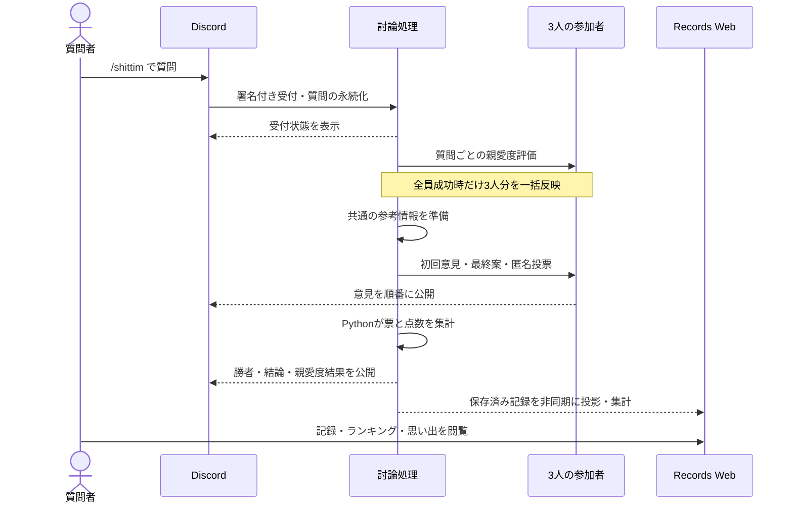
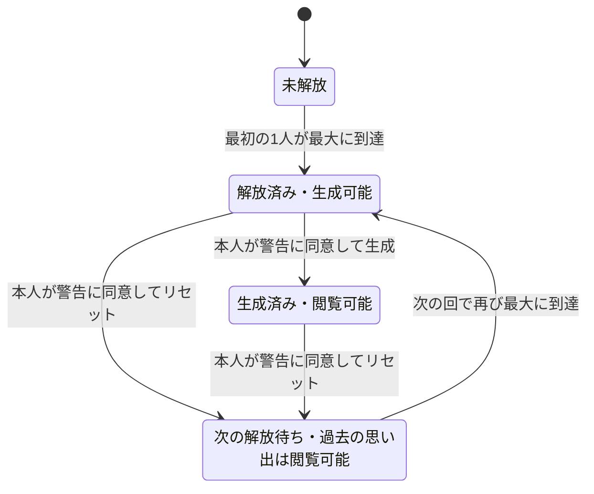
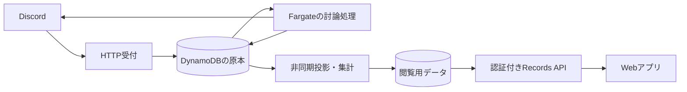

# 要求仕様書・基本設計書

[文書索引へ戻る](00_シッテムの箱_ドキュメント索引.md)

## 目的と対象

シッテムの箱は、友人同士がDiscordで3人のAI参加者に質問し、異なる個性による議論と結論を楽しむためのアプリである。
Webでは議論を振り返り、質問を重ねて変わる親愛度や、解放したメモリアルロビーの思い出を楽しめる。

対象は少人数の非公開Discordサーバーと1つの本番環境である。
一般公開Bot、複数組織向けサービス、外部向けの稼働保証、専門判断の代替、完全な事実調査サービスは目的にしない。
個性のある表現を優先する一方、権限、状態遷移、勝者決定、外部データの検証はコードで管理する。

## 利用者に提供する機能

| 機能 | 要求 | 詳細設計 |
|---|---|---|
| 討論 | 司会1体と参加者3体が質問を受け、意見・最終案・投票・結論を公開する | [10 アプリケーション](10_アプリケーション・Python詳細設計.md)、[11 Discord](11_Discord詳細設計.md) |
| 議論の記録 | 完了した議論の質問、意見、投票理由、結論、親愛度変化を閲覧する | [24 Records](24_シッテムの箱%20議事録設計.md) |
| いろいろな記録 | 勝利・依頼・親愛度のランキングと概算費用を確認する | [24 Records](24_シッテムの箱%20議事録設計.md)、[26 親愛度](26_親愛度・ランキング設計.md) |
| サービス状態確認 | 稼働状況、取得できない項目、警告とその原因を閲覧する。運用操作は提供しない | [25 状態・プロンプト管理](25_サービス状態確認・プロンプト管理設計.md) |
| プロンプト管理 | 5種類の設定と履歴を参照し、管理者だけが編集・反映・復元する | [25 状態・プロンプト管理](25_サービス状態確認・プロンプト管理設計.md) |
| メモリアルロビー | 親愛度最大の記念として本人用の画像・文章を生成し、過去の思い出を残す | [27 メモリアル](27_メモリアルロビー設計.md) |

## 質問から結論まで

```mermaid
sequenceDiagram
    actor User as 質問者
    participant Discord
    participant Core as 討論処理
    participant AI as 3人の参加者
    participant Web as Records Web
    User->>Discord: /shittim で質問
    Discord->>Core: 署名付き受付・質問の永続化
    Core-->>Discord: 受付状態を表示
    Core->>AI: 質問ごとの親愛度評価
    Note over Core,AI: 全員成功時だけ3人分を一括反映
    Core->>Core: 共通の参考情報を準備
    Core->>AI: 初回意見・最終案・匿名投票
    AI-->>Discord: 意見を順番に公開
    Core->>Core: Pythonが票と点数を集計
    Core-->>Discord: 勝者・結論・親愛度結果を公開
    Core-->>Web: 保存済み記録を非同期に投影・集計
    User->>Web: 記録・ランキング・思い出を閲覧
```

- 質問は司会Botの`/shittim`から受け付ける。参加者Botにはコマンドを登録しない。
- 受付は永続化してから応答し、必要なら討論用の実行環境を起動する。
- 通常チャンネルの受付状態と、公開スレッド内の操作・討論表示を同じ終了状態へ収束させる。
- 初回意見と最終案は3人分を順番に公開する。投票先と理由は全票が確定するまで公開しない。
- 勝者は司会の集計後に、自分の人格と口調で喜びと結論を発表する。
- 親愛度結果は質問者名と3人分の実増減を付け、スレッド外の通常チャンネルへ独立して投稿する。
- Webへの反映は非同期であり、Discordへの投稿と同時完了することは保証しない。

## 参加者・参考情報・公平性

| 項目 | 変えてよいもの | コードで維持するもの |
|---|---|---|
| 人格 | 非公開設定で管理する名前、価値観、口調 | 3人の固定枠と本人だけへの人格入力 |
| 親愛度 | 発言の熱意、口調、詳しさ | 匿名投票、参考情報、司会処理、勝者の決定規則 |
| プロンプト | 管理対象の本文 | 出力形式、許可ツール、検証、保存・再試行の契約 |
| 参考情報 | AIによる検索要否の判断 | 参加者間で共通の情報を使い、未知の情報源を検証済みと扱わない |
| 勝敗 | 参加者の投票と採点 | 自己投票禁止、候補の匿名化、Pythonによる決定と同点処理 |

Coreでは参加者を`participant-a/b/c`で識別する。運用設定そのものと人格本文を公開文書・Git・運用ログへ複製しない。
Webの画面名・アイコンや試験用の表示名とは区別する。
初回意見・最終案・勝者発表では名前の名簿を共有するが、他者の人格プロンプトは渡さない。

共通の参考情報（Evidence）は議題ごとに一度準備する。検索不要または既知の検索失敗なら、
その状態を明示して空の参考情報で続行する。未分類の実装エラーまで成功扱いにはしない。
個別の参加者には検索ツールを渡さない。AIへの入力と出力の契約は[12](12_OpenAI・プロンプト詳細設計.md)で管理する。

## 親愛度とメモリアルロビー

### 親愛度

質問者ごとに3人それぞれの親愛度を保持する。初期値500点、範囲0〜1,000点、質問の評価は各`-100〜+100`点とする。
3件すべてが成功した場合だけまとめて反映し、失敗があれば全員変更せず討論を続ける。
上限・下限で補正した実増減を表示し、同じ議論の再試行で二重加算しない。
評価後に議論が失敗・中止しても確定した変化は残す。

### 解放・生成・リセット

次の図は利用体験の概要である。生成待ち・生成中はリセットできず、失敗時にも保存済み成果物に応じた制限がある。
厳密な状態と再開条件は[27](27_メモリアルロビー設計.md)を参照する。

```mermaid
stateDiagram-v2
    [*] --> Locked
    state "未解放" as Locked
    state "解放済み・生成可能" as Unlocked
    state "生成済み・閲覧可能" as Created
    state "次の解放待ち・過去の思い出は閲覧可能" as Waiting
    Locked --> Unlocked: 最初の1人が最大に到達
    Unlocked --> Created: 本人が警告に同意して生成
    Unlocked --> Waiting: 本人が警告に同意してリセット
    Created --> Waiting: 本人が警告に同意してリセット
    Waiting --> Unlocked: 次の回で再び最大に到達
```

- 同じ質問で複数人が最大に到達した場合は、変更前の点数、質問評価の順で選ぶ。
  なお同点なら再試行で変わらない選択結果を保存する。解放中は2人目が到達しても再解放しない。
- 解放通知にはWebへのリンクを付ける。未解放時は理由を表示し、解放済みの本人には約3秒の入室演出を提供する。
- 本人が写真・アバターをアップロードし、到達した参加者とのデフォルメ調の2ショットを生成する。
  出力は1920×1080、直近10質問の思い出を反映し、`THE SHITTIM CHEST`と達成日を記載する。
- 画像とは別に、到達した参加者が質問者の表示名を交えて思い出を語る約800文字の文章を生成する。
- 1回の解放につき1回の生成とする。失敗からの再開や原本削除のタイミングは[27](27_メモリアルロビー設計.md)で定義する。
- リセットは3人を500点へ戻し、回数をランキングの王冠表示へ反映する。保存済みの思い出と入室権は維持する。

## Webの利用権限

| 操作 | 未認証 | 認証済みの一般利用者 | 管理者 |
|---|---|---|---|
| 議事録・ランキング・費用の閲覧 | 不可 | 可 | 可 |
| サービス状態の閲覧・明示更新 | 不可 | 可 | 可 |
| 現行プロンプト・履歴の閲覧 | 不可 | 読み取り専用 | 可 |
| プロンプトの反映・復元 | 不可 | 不可 | 可 |
| メモリアルの生成・閲覧・リセット | 不可 | 本人分のみ | 本人分のみ |

画面上でボタンを隠すだけでなく、各APIで認証・権限・所有者を検証する。
サービス状態画面からデプロイ、タスク停止、キュー削除などの運用操作は行えない。

## 全体構成と処理の継続性

```mermaid
flowchart LR
    Discord[Discord] --> Ingress[HTTP受付]
    Ingress --> DB[(DynamoDBの原本)]
    DB --> Runtime[Fargateの討論処理]
    Runtime --> Discord
    Runtime --> DB
    DB --> Projector[非同期投影・集計]
    Projector --> Records[(閲覧用データ)]
    Records --> API[認証付きRecords API]
    API --> Web[Webアプリ]
```

- 討論処理は司会1体と参加者3体を1プロセスで動かす。
- ARM64 On-Demand Fargateを通常0、必要時だけ最大1タスクで運用する。
- 保存済みの状態・生成結果・投稿待ちデータから再開し、所有者が変わっても古い処理の書き込みを拒否する。
- 全討論、投稿、状態表示、処理権が終了してから約30分の待機で停止する。帰宅の挨拶の失敗は停止を妨げない。
- 起動待ちの上限や期限は[11](11_Discord詳細設計.md)、保存・排他制御は[13](13_DynamoDB・データ整合性詳細設計.md)、構成の所有関係は[14](14_AWS・CDK詳細設計.md)を正とする。

## データ保護と品質

議論の本文は処理と閲覧に必要な範囲で保存し、自動的な保存期限は設けない。
認証情報、署名、人格本文を議論データや運用ログへ保存しない。
質問者の関連付けには推測できないキーを使い、Recordsへ非公開のDiscord識別子を公開しない。
詳細な信頼境界と保持方針は[16](16_セキュリティ・プライバシー詳細設計.md)で管理する。

低利用時のタスク0やBotのオフラインは正常である。権限違反、不正な保存形式、モデルの拒否を成功と見なさない。
明示した一部機能の縮退動作と、停止すべきエラーを区別する。

変更時の確認は実害につながる振る舞い・境界・再発防止を優先し、[18](18_試験・品質保証設計.md)に従う。
配信は署名付き成果物と変更計画を検証し、Recordsを先に、必要なCoreを同一コミットから後に配信する。
実際の配信・受入の確認範囲は[20](20_実装・試験・検証記録.md)を参照する。
