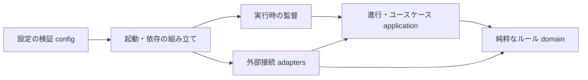
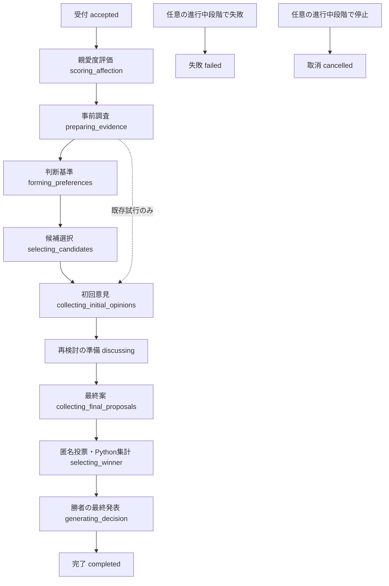

---
aliases:
  - The Shittim Chest アプリケーション詳細設計
tags: [project, shittim-chest, python, detailed-design]
status: current
created: 2026-07-16
updated: 2026-09-07
---

# アプリケーション・Python詳細設計

[文書索引へ戻る](00_シッテムの箱_ドキュメント索引.md)

## この文書の範囲

討論を動かすCoreの責務、状態遷移、並行処理、起動・終了を定義する。
Discordへの表示は[Discord詳細設計](11_Discord詳細設計.md)、生成内容は
[OpenAI・プロンプト詳細設計](12_OpenAI・プロンプト詳細設計.md)、保存と排他は
[DynamoDB・データ整合性詳細設計](13_DynamoDB・データ整合性詳細設計.md)を参照する。

Coreは司会役1体と討論者3体を**1プロセス**で動かす。LLMは発言と投票を生成するが、
進行、再試行、保存、勝者の確定はPythonが制御する。

## 1. 構成と依存方向

| 層・入口 | 所有する責務 | 境界 |
|---|---|---|
| `domain` | 識別子、討論段階、投票、親愛度などの純粋なルール | 外部SDKを参照しない |
| `application` | 進行、外部処理のインターフェース、再開点、送信計画、停止判断 | `domain`へ依存 |
| `adapters` | Discord、OpenAI、DynamoDB、AWSとの入出力 | SDK型を内側へ返さない |
| `config` | 非公開設定の構造・上限・相互関係の検証 | 設定本文をエラーへ含めない |
| `runtime` | 稼働監督、シグナル、ヘルスチェック、帰宅挨拶 | 起動時に組み立てた依存を使用 |
| `lambda_handlers` | Lambdaイベントとユースケースの接続 | 業務ルールを置かない |
| `bootstrap.py` | クライアント生成、依存注入、終了処理 | 外部接続の組み立て場所を集約 |

依存方向は`import-linter`で検査する。HTTPレスポンスやDynamoDBの`AttributeValue`を
`domain`／`application`へ持ち込まない。

## 2. 値と識別子

- 値オブジェクトは原則として不変の`frozen`／`slots`とし、時刻はタイムゾーン付きUTCを受け取る。
- 討論ID、試行ID、リース所有者、操作IDを用途別の型で区別する。
- 試行IDはUUIDv7。利用者による再試行では新しいIDを作り、失敗した旧試行を変更しない。
- 保存済みの列挙値やスキーマは検証し、未知の値を既定値へ読み替えない。
- 質問は前後の空白を除去し、1〜1,000文字の非空文字列とする。

## 3. 討論の状態遷移

通常は一方向に進む。`completed`、`failed`、`cancelled`は終了状態であり、同じ試行の
段階を戻さない。再開点は段階とは別の`recovery_state`へ記録し、終了状態には残さない。

新規試行は`deliberation_version=1`とし、人格ごとの判断基準、候補選択、発言を分離する。
追加は通常6呼び出しで、各段階の3人を並列実行する。初回意見までは他者の回答や内部情報を渡さず、
Pythonが本人の第1候補を採用する。同じ案を本当に好む場合の一致は許容し、重複回避の再生成は行わない。
属性のない既存試行は従来フローを維持し、過去の回答や判断基準を遡及生成しない。

### 1段階の処理単位

1. 世代番号付きリースを取得し、保存済み状態を読む。
2. 必要な生成処理を、討論者ごとの再開点を確保して並列実行する。
3. 検証済みの出力と再開点の完了を同時に保存する。
4. 必要な出力が揃ったら、その段階の送信計画とOutboxを同時に保存する。
5. 必須の送信がすべて`SENT`になってから、次の段階へ進む。

判断基準・候補は内部処理のため本文用Outboxを作らず、全員分の保存後に次段階へ進む。
既存の操作パネルでは「それぞれの考えを整理中」「提案を選択中」と表示する。
保存済みの判断・候補は同じ議論の復旧だけで再利用し、別の議論へ好みを学習・転用しない。

1つの論理出力について、アプリケーション層から生成アダプターへの呼び出しは最大2回。
保存時の比較更新（CAS）に成功した出力だけを正とし、再生成で上書きしない。
SDK内部の通信再試行とは別の上限である。判断基準・候補選択だけは、アダプター呼び出しごとに
出力上限による未完了を確認した場合の再生成を最大1回許可する。部分出力は採用せず、
成功済みの他者出力を再生成しない。論理段階120秒・試行全体600秒の期限は更新しない。

最終段階では、スレッド内の結果・勝者発表と、元チャンネルへの親愛度結果を同じ送信計画に含める。
必須表示が欠けたまま`completed`へ進めない。

### Pythonによる勝者決定

3人がそれぞれ1票を投じたこと、投票者の重複・欠落がないことを検証する。
まず得票数で選び、同票なら、その候補が受け取った票の採点を次の順に比較する。

1. 合計点
2. 正確性の点数
3. 安全性の点数
4. 有用性の点数
5. すべて同じなら固定順`participant-b → participant-a → participant-c`

同じ完全な投票結果からは同じ勝者になる。モデルはこの決定を変更できない。
実装は[domain/debate_content.py](https://github.com/pitekusu/shittim-chest/blob/main/src/shittim_chest/domain/debate_content.py)の
`select_winner`を正とする。

### 品質の観測と評価専用処理

#### 総合投票への移行実装（未配信）

利用者承認に基づき、新ルール`entertainment-v1`を旧投票とは別の型で実装する。
新規受付で版を固定し、採点・永続化・Discord結果・Records・Webへ引き継ぐ。
既存attemptは版なしを`legacy-v1`として扱い、retryでも投票版を変えない。
上記の旧ルールを過去記録へ引き続き適用し、旧3項目を新項目へ読み替えない。

| 項目 | 重み | 判定する内容 |
|---|---:|---|
| 面白さ・魅力 | 25 | 提案された体験・発想・依頼された作品自体の魅力。勢い、いじり、掛け合いだけでは加点しない |
| キャラクター性 | 25 | 最終案の選択・優先順位・妥協条件に表れた個性。演技、口癖、推測した人物像や投票者との一致ではない |
| 独創性 | 20 | 提案内容にある意味のある新しい視点・手法・具体性。名前や比喩の付け替え、根拠捏造ではない |
| 質問への応答 | 20 | 質問の種類と制約に応じた回答。無条件な実用性優先ではない |
| 議論への貢献 | 10 | 他案の発展・反論・取込みが最終案にもたらした内容上の改善。他者への言及・賛辞・いじりだけでは加点しない |

各人格が他の2案を0〜5の整数で採点し、Pythonが100点満点へ換算して投票先を選ぶ。
個人内で同点なら議論キー・投票者・ルール版に基づく再現可能な抽選を使う。
全体は3票の多数決、同票なら候補が受けた2件の総合点の和、さらに同点なら議論キーと
ルール版に基づく抽選で決める。抽選の入力を再試行回数や候補の提示順で変えない。
特定人格の固定優先や過去の勝率補正を行わない。安全境界は維持するが注意書きは加点しない。
採点対象の候補・投票者の重複、不足、自己採点、範囲外点数は拒否する。

投票確定後、`assess_escalation`が保存済みの票だけから品質の観測値を計算する。
3票の分散、勝者に付いた採点軸の低さ、平均点の低さを記録するが、
本番ではこの判定による追加のAI呼び出し・モデル切替・再討論を実行しない。
名前に「エスカレーション」が含まれていても、現在は観測専用である。

本番の生成方針と、手動比較評価用の方針は`application/generation_policy.py`で分離する。
比較用ツールの有料実行は[試験設計](18_試験・品質保証設計.md)の独立評価として扱い、通常の配信へ含めない。

### 親愛度評価とメモリアルの解放

3人の評価がすべて成功した場合だけ、プロフィール、討論別評価、次段階への遷移を同時に保存する。
1人でも評価できなければ全員の点数を変更せず、討論を続ける。

| 状況 | 処理 |
|---|---|
| プロフィールの同時更新 | 同じ評価値を最新点数へ再適用する。OpenAIは呼び直さない |
| 評価済み討論の再試行 | 保存済み評価を使い、二重加算しない |
| 評価後の失敗・取消 | 反映済み点数を維持し、親愛度結果を終了時の送信計画へ含める |
| 未解放の周期で1,000点へ到達 | 到達前の点数、質問評価の順で1人を選ぶ。同点は試行由来の種から決定 |
| 旧v8プロフィールの移行 | 成功評価時だけ移行し、移行前から1,000点の人格も解放候補へ含める |

選出人物、到達時刻、討論ID、当時の質問者表示名、周期を同じトランザクションへ保存する。
通常のv9評価は、今回初めて1,000点へ到達した人格だけを候補とする。
機能全体は[親愛度・ランキング設計](26_親愛度・ランキング設計.md)と
[メモリアルロビー設計](27_メモリアルロビー設計.md)を参照する。

## 4. 並行処理と実行期限

| 対象 | 境界 |
|---|---|
| 討論者3人の生成 | 所有者を明確にした非同期タスクで並列実行 |
| OpenAI共有限流器 | 最大6リクエスト |
| 投票の公開・Discord送信 | 永続化された順序に従い直列実行 |
| 討論の生成期限 | 親愛度評価を含め、受付または明示的再試行から600秒 |
| 1つの論理生成段階 | SDKの再試行を含め120秒 |
| OpenAI通信の1試行 | 読み取り60秒。詳細はOpenAI設計を参照 |

非同期タスクは取り消した後も完了を待ち、取り消しを通常エラーへ変換しない。
試行作成日時から残り時間を計算し、途中の投稿・自動復旧で期限を計り直さない。
期限切れ後は新しい生成や遅着した生成結果の採用を行わない。利用者の明示的再試行だけで
新しい600秒を開始する。失敗通知などのDiscord配送は別の配送期限に従い、全投稿完了までの上限とはしない。
停止要求では新規処理の取得を閉じ、進行中の状態を保存してから、各クライアントを期限付きで終了する。

## 5. 起動・終了と設定

### 起動順序

1. 環境変数、版付きの討論実行設定、人格設定を厳密に検証する。
2. 共通の本人識別HMAC鍵と管理プロンプトの版を読み、クライアントをプロセス単位で生成する。
3. 4つのBotの`READY`と、許可サーバー・チャンネルとの対応を確認する。
4. コマンド定義のハッシュが前回と異なる場合だけ、司会Botのサーバー内コマンドを同期する。
5. 再開、受付処理、公開状態、ハートビート、帰宅挨拶の監視を開始する。
6. シグナルや監督処理の異常で新規受付を閉じ、再開点を保存して終了する。

コンテナのヘルスチェックはプロセス内の準備状態とハートビートを読む。
ヘルスチェック自体から外部APIを呼ばない。

### 設定ごとの検証責務

| 設定 | 検証する内容 |
|---|---|
| 討論実行設定 | スキーマv2、司会と3討論者、サーバー、許可チャンネル、帰宅先、OpenAIプロジェクト |
| 人格設定 | スキーマv1、4スロットの過不足、討論者表示名の重複、本文の非空・3,500 UTF-8バイト上限 |
| 秘密値 | 指定したSSMパスだけを取得し、配下を走査しない |
| 本人識別HMAC鍵 | Recordsと共通の鍵を起動時に1回取得。欠落・短すぎる値・取得失敗なら接続を始めない |
| メモリアル公開URL | `SHITTIM_RECORDS_MEMORIAL_URL`は`https://<hostname>/memorial`のみ。ポート・クエリ・フラグメント・ユーザー情報を拒否 |

討論実行設定の版は配信処理が指定する。プロンプトはタスク起動時に1版だけ読み、稼働中に差し替えない。
配信・履歴保持は[サービス状態確認・プロンプト管理設計](25_サービス状態確認・プロンプト管理設計.md)を参照する。

## 6. Recordsの非同期生成との分担

メモリアルの画像・文章はCoreでは生成しない。Recordsの本人専用APIが操作を受け、SQSと生成ワーカーが
処理する。所有者と周期をすべての書き込みで確認し、画像と文章の両方を保存してから公開する。

課金処理の試行上限、部分成果からの回復、リセットの原子性は
[DynamoDB・データ整合性詳細設計](13_DynamoDB・データ整合性詳細設計.md)に集約する。
API・画面は[メモリアルロビー設計](27_メモリアルロビー設計.md)、生成入力は
[OpenAI・プロンプト詳細設計](12_OpenAI・プロンプト詳細設計.md)を参照する。

## 7. エラーと観測

- 外部通信失敗、条件付き更新の競合、リース喪失を区別し、安定した本文なしのコードへ変換する。
- 既知の事前調査失敗は、承認済みの縮退状態へ変換して続行する。
- 帰宅挨拶は最善努力型とし、失敗しても終了を妨げない。
- 質問、人格、モデル出力、URL、クエリ、Discord識別子、秘密値をログや指標の次元へ入れない。
  不透明な討論IDと提供元応答IDは、本文を含まない障害相関に限り使用する。

## 8. 変更時の参照先

| 変更するもの | 実装の入口 |
|---|---|
| 状態遷移・再試行 | [domain/debate_state.py](https://github.com/pitekusu/shittim-chest/blob/main/src/shittim_chest/domain/debate_state.py)、[application/service.py](https://github.com/pitekusu/shittim-chest/blob/main/src/shittim_chest/application/service.py) |
| 親愛度・解放選出 | [domain/affection.py](https://github.com/pitekusu/shittim-chest/blob/main/src/shittim_chest/domain/affection.py) |
| 依存の組み立て | [bootstrap.py](https://github.com/pitekusu/shittim-chest/blob/main/src/shittim_chest/bootstrap.py) |
| 設定検証 | [config/models.py](https://github.com/pitekusu/shittim-chest/blob/main/src/shittim_chest/config/models.py) |

依存の正確な版はロックファイル、実行上限とフィールド制約はコードを正とする。
文書は責務と不変条件を維持し、変更した契約に対応する試験だけを更新する。

## 公式資料確認記録

| 確認日 | 対象 | 公式資料 | 設計への反映 |
|---|---|---|---|
| 2026-08-14 | Python asyncio | [タスクとコルーチン](https://docs.python.org/3/library/asyncio-task.html) | 並行処理、期限、取り消し |
| 2026-08-14 | Python typing | [型ヒント](https://docs.python.org/3/library/typing.html) | SDKに依存しないインターフェース境界 |
| 2026-08-14 | Pydantic | [モデル](https://docs.pydantic.dev/latest/concepts/models/) | 厳密・不変・余剰フィールド禁止の検証 |
| 2026-08-14 | uv | [プロジェクト同期](https://docs.astral.sh/uv/concepts/projects/sync/) | 固定ロックファイルによる再現可能な環境 |
