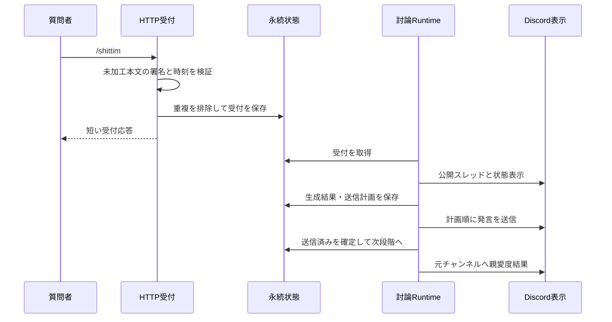
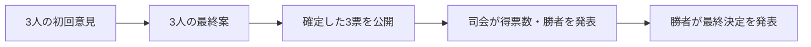

---
aliases:
  - The Shittim Chest Discord詳細設計
tags: [project, shittim-chest, discord, detailed-design]
status: current
created: 2026-07-16
updated: 2026-09-05
---

# Discord詳細設計

[文書索引へ戻る](00_シッテムの箱_ドキュメント索引.md)

## この文書の範囲

Discordでの受付、Botの役割、投稿先と順序、操作ボタン、送信失敗からの回復を定義する。
討論そのものの進行は[アプリケーション・Python詳細設計](10_アプリケーション・Python詳細設計.md)、
Outboxの保存条件は[DynamoDB・データ整合性詳細設計](13_DynamoDB・データ整合性詳細設計.md)を参照する。

## 1. Botの役割と権限境界

| Botスロット | コマンド | 公開する内容 |
|---|---|---|
| `moderator`（司会） | サーバー内の`/shittim` | 受付、進行状態、得票数、勝者、親愛度結果、システム通知 |
| `participant-a/b/c`（討論者） | 登録しない | 初回意見、最終案、投票、勝者の最終発表、帰宅挨拶 |

4つのBotは1プロセスで動くが、トークン、Application ID、表示名、人格をスロット間で混同しない。
起動時と操作時に、許可されたサーバー（Guild）とチャンネルかを確認する。

## 2. 受付から表示まで

### HTTP受付

- 司会Botの操作受付用エンドポイントだけをAPI Gatewayへ接続する。
- 時刻の新しさとEd25519署名を**未加工の本文**で確認した後、JSONを解析する。
- `PING`と、既知の`/shittim`・操作ボタンだけを受け付ける。
- 質問は1〜1,000文字。操作要求の識別子（Interaction ID）への条件付き書き込みで重複を除く。
- 永続受付後、Discordの初回応答期限内に短い受付結果を返す。受付LambdaはSnapStart対応エイリアスを使用する。
- コマンドがDiscord Gatewayへ誤配信されても処理しない。受付経路を二重化しない。

### 受付容量と起動待ちの期限

| 対象 | 制限・利用者への表示 |
|---|---|
| 質問本文 | 1〜1,000文字 |
| 永続受付キュー | 待機・取得中・再試行中を合わせ最大20件 |
| 受付から3分 | 起動できなければ警告を表示する。受付は失敗にせず、自動復旧を続ける |
| 受付から15分 | 処理を開始できなければ起動不能として終了させる |

3分の警告は再入力を求めるものではない。復旧した受付は同じ要求として処理し、重複した討論を作らない。
起動待ちの期限は、処理開始後の討論セッション期限やOutboxの配送期限とは別である。
正確な定義は[scale_to_zero.py](https://github.com/pitekusu/shittim-chest/blob/main/src/shittim_chest/application/scale_to_zero.py)、
期限後の収束は[runtime_reconciler.py](https://github.com/pitekusu/shittim-chest/blob/main/src/shittim_chest/application/runtime_reconciler.py)を参照する。

### スレッドと公開状態

| 表示場所 | 役割 |
|---|---|
| 元の通常テキストチャンネル | 受付・起動・処理・終了状態、親愛度の独立投稿 |
| 討論ごとの公開スレッド | 3人の発言、投票結果、勝者の最終発表、操作パネル |

チャンネル側の状態とスレッドの操作パネルは、同じ討論・同じ試行の終了状態へ収束させる。
共通の実行環境の状態だけで個別の討論表示を書き換えない。公開状態の送信器は「表示すべき状態」と
「表示済み状態」を比較し、古いイベントで終了状態を受付中へ戻さない。

操作ボタンの識別子（custom ID）は、版、操作、討論ID、試行IDを100文字以内で表す。
停止は現在の進行中試行、再試行は現在の失敗試行だけに許可する。
古いボタン、別試行、別サーバー・チャンネル、権限不足は書き込み前に拒否する。
再試行でも旧メッセージを削除せず、新しい試行との関係を保存する。

## 3. 討論の表示順序

| 段階 | 表示内容 | 公開条件 |
|---|---|---|
| 初回意見 | 各人格の初期判断と提案 | 保存済みの出力を使用 |
| 最終案 | 他者の初回意見を踏まえた各人格の完成案 | 初回意見の必須送信が完了 |
| 投票 | 投票者、投票先、理由 | 3票すべてが確定するまで投稿しない |
| 結果 | 得票数と勝者 | Pythonの集計結果を使用 |
| 最終発表 | 勝利の言葉、最終決定、実行案、注意点 | 保存済み勝者と一致するBotだけが投稿 |

討論者3人の公開順は`participant-a → participant-b → participant-c`に固定する。
投票時は候補を匿名IDで扱う。投票前に勝者を決めたり、モデルへ勝者選びを委ねたりしない。

## 4. 親愛度結果とメモリアル解放通知

親愛度結果はスレッドの外、**元の通常テキストチャンネルへ司会Botが独立投稿**する。
質問者名を見出しにし、各人格を固定色の絵文字、10個のハート、適用後の点数、実増減で示す。
100点ごとにハートを1個塗り、正確な点数は`/ 1000`と併記する。

| 評価・討論の状態 | 通知する内容 |
|---|---|
| 3人の評価が成功 | 保存済みの適用後点数と実増減 |
| 上限・下限で変動が丸められた | 質問評価値ではなく、実際に増減した点数 |
| 1人以上の評価が失敗 | 全員の親愛度を変更しなかったことだけ |
| 評価確定後に討論が失敗・取消 | 反映済みの変動を同じ独立投稿で通知 |
| 評価前に討論が失敗・取消 | 親愛度結果を投稿しない |

同じ周期で初めて1,000点に到達して解放人物が選ばれた場合は、親愛度の投稿へ次を追記する。

- 「メモリアルロビーが開放されました！」
- 選出された人格の名前
- 検証済みのWeb `/memorial`リンク

保存済み解放情報から同じOutbox操作を再構成し、通知の再試行で別の解放投稿を作らない。
通知へ質問本文や非公開識別子を含めない。表示要件の全体像は
[親愛度・ランキング設計](26_親愛度・ランキング設計.md)と
[メモリアルロビー設計](27_メモリアルロビー設計.md)を参照する。

## 5. 順序付きOutboxと送信回復

Outboxは「送る内容と順序」を永続化した送信待ち記録である。
その場で生成結果を直接投稿せず、保存済み操作を1件ずつ送る。

| 契約 | 上限・条件 |
|---|---|
| 1メッセージ | 表示用に正規化した後、2,000文字以内へ分割 |
| 討論者ごとの段階表示 | 1人あたり最大8分割 |
| 完了時の送信計画 | 結果・勝者発表・親愛度の独立1投稿を合わせ最大21操作 |
| 操作の識別 | 試行、段階、Bot、投稿先、分割番号の組 |
| 重複照合用の値（`nonce`） | 操作から決定的に導出する22文字のbase64url |
| 送信順 | 全体の送信番号が小さい未完了操作から1件ずつ取得 |
| Discordのレート制限待ち | クライアントの上限300秒。`Retry-After`処理後に結果を分類 |
| 送信断念 | 最大3回の配送試行または期限超過で残件を`ABANDONED`へ収束 |

親愛度投稿はスレッドIDと元チャンネルIDの両方に結び付け、別チャンネルへの送信を拒否する。

### 成功した投稿を繰り返さないための境界

- DiscordへのPOST成功後、DynamoDBの送信済み確定だけが一時的に失敗した場合は、
  取得済みメッセージIDと同じ時刻を使い、0.1／0.2／0.4秒で最大3回だけ保存を再試行する。
  **この間、Discordへ再POSTしない。**
- 通信タイムアウトで受理結果が不明なら、履歴の`nonce`、投稿者、チャンネル、本文を照合する。
  完全一致した場合だけ送信済みとみなす。
- 本文不一致、不明なメッセージ、権限不足を成功扱いしない。
- 必須投稿を断念した試行は失敗へ収束させ、表示が欠けたまま完了にしない。

利用者・ロールへのメンションは`AllowedMentions.none()`で無効化し、リンクの埋め込みを抑止する。
モデル本文は改行・Unicode・Markdownを表示用に正規化する。
親愛度の装飾はDiscord MarkdownとUnicode絵文字に限定し、非公開絵文字IDや埋め込み用データを保存しない。

## 6. コマンド同期と帰宅挨拶

### コマンド同期

4つのBotが準備できた後、配信時に渡された前回の定義ハッシュとローカルのハッシュを比較する。
差分がある場合だけ司会Botのサーバー内コマンドを同期する。
討論者のコマンド、グローバルコマンド、権限変更APIは使用しない。

### 帰宅挨拶の例外

帰宅挨拶は討論Outboxに含めない、最善努力型の機能である。

- 停止予定の約5分前に、選ばれた討論者が設定済みの通常チャンネルへ1件投稿する。
- 生成後と再試行前に、同じ待機世代のままかを確認する。
- 同じ`nonce`で最大2回送信し、タイムアウト時は履歴を照合する。
- 権限不足や投稿者・チャンネル・本文の不一致では再試行しない。
- 新しい処理、世代変更、待機解除があれば未送信の挨拶を破棄する。
- 失敗してもSIGTERMによる終了や、タスクを0へ戻す自然停止を遅らせない。

## 7. ログと変更時の参照先

トークン、未加工本文、署名、質問、投稿本文、URL、クエリ、サーバー・チャンネルIDをログへ出さない。
安定したエラーコード、試行数、レート制限の数値など、本文を含まない診断情報だけを残す。

| 変更するもの | 実装の入口 |
|---|---|
| 表示・Outbox構成 | [application/discord.py](https://github.com/pitekusu/shittim-chest/blob/main/src/shittim_chest/application/discord.py) |
| 公開状態の収束 | [application/status_publication.py](https://github.com/pitekusu/shittim-chest/blob/main/src/shittim_chest/application/status_publication.py) |
| Discord接続・送信 | [adapters/discord](https://github.com/pitekusu/shittim-chest/tree/main/src/shittim_chest/adapters/discord) |

過去の導入経緯は[受付・状態収束是正の完了記録](22_Discord受付・状態収束是正計画.md)と
[討論過程表示の完了記録](23_Discord討論過程表示実装計画.md)に分離する。

## 公式資料確認記録

| 確認日 | 対象 | 公式資料 | 設計への反映 |
|---|---|---|---|
| 2026-08-14 | Interactions | [受付と応答](https://docs.discord.com/developers/interactions/receiving-and-responding) | 署名、PING、初回応答 |
| 2026-08-14 | Application Commands | [コマンド](https://docs.discord.com/developers/interactions/application-commands) | サーバー内コマンド、入力制約 |
| 2026-08-14 | Message Resource | [メッセージ](https://docs.discord.com/developers/resources/message) | 本文、nonce、メンション抑止 |
| 2026-08-14 | Rate Limits | [レート制限](https://docs.discord.com/developers/topics/rate-limits) | Retry-Afterと有限の再試行 |
| 2026-08-14 | Threads | [スレッド](https://docs.discord.com/developers/topics/threads) | 公開スレッド、権限境界 |
