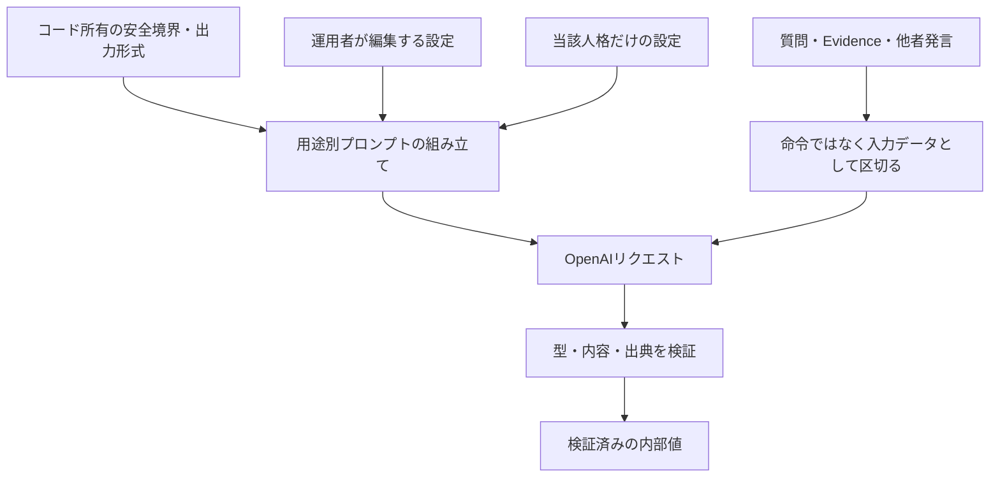
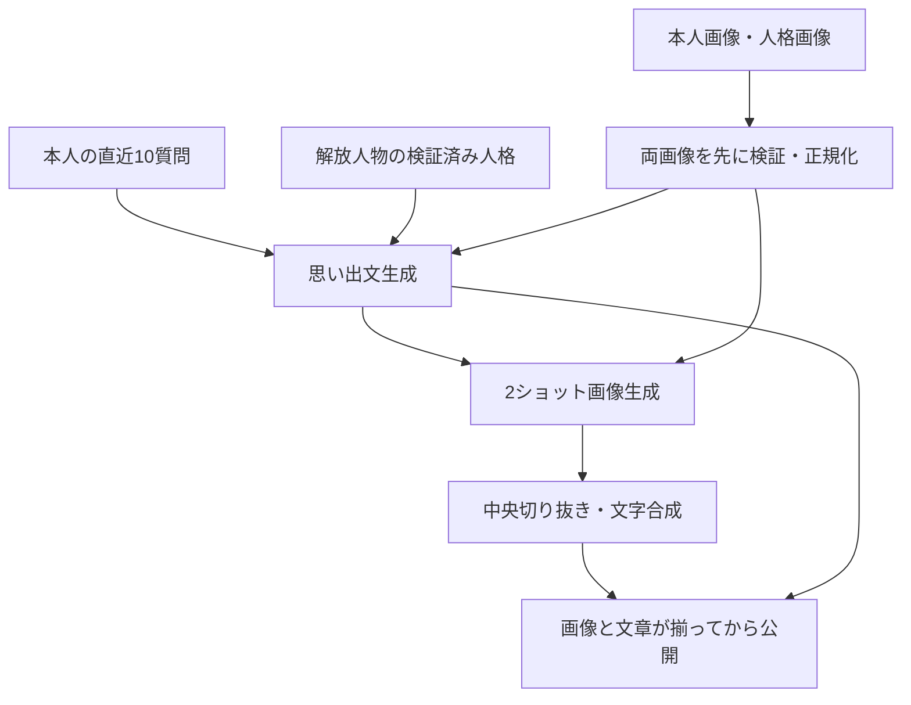

---
aliases:
  - The Shittim Chest OpenAI詳細設計
tags: [project, shittim-chest, openai, prompt, detailed-design]
status: current
created: 2026-07-16
updated: 2026-09-08
---

# OpenAI・プロンプト詳細設計

[文書索引へ戻る](00_シッテムの箱_ドキュメント索引.md)

## この文書の範囲

OpenAIへ渡す情報、編集可能なプロンプトとコード所有の制約、用途ごとの出力検証を定義する。
討論の進行は[アプリケーション設計](10_アプリケーション・Python詳細設計.md)、
プロンプト編集・履歴・配信は[管理機能設計](25_サービス状態確認・プロンプト管理設計.md)を参照する。

## 1. 接続と実行方針

Coreはプロセス単位の`AsyncOpenAI`を再利用する。討論用の構造化生成は安定版Responses APIの
`responses.create()`へ厳密なJSON Schemaを渡す。
応答とメッセージの終了状態・拒否を先に検査し、完了した本文だけをPydanticで解析する。
未完了JSONの解析エラーで終了理由・使用量を失わず、検証したドメイン値だけを内部へ渡す。
OpenAIのマルチエージェント機能へ進行を委ねず、Pythonが再開点と勝者を管理する。

| 対象 | 方針 |
|---|---|
| 通常討論モデル | `gpt-5.6-luna`の標準設定（`standard`）。上位モデルへ自動切替しない |
| OpenAI接続 | Core／RecordsともSDK 3系・HTTPX2 2系。正確な版は各ロックファイルで固定 |
| 他のHTTP通信 | Discord・認証・費用取得等のHTTPXと境界を分ける |
| Responsesの保存 | `store=false`を明示 |
| 通常討論の通信期限 | 1試行の読み取り60秒、接続5秒、書き込み30秒、プール待ち5秒 |
| 再試行 | CoreのSDK自動再試行は2回。アプリケーションの論理期限・再開点と別に管理 |
| 全体の期限 | 論理生成段階120秒、試行作成から600秒。途中投稿・自動復旧で延長しない |
| SDK型・例外 | 外部接続層の内側へ漏らさない |

`store=false`はAPIの保存設定であり、アプリケーション側で本文をログへ残さないこととは別の契約である。
画像編集APIにはResponsesの`store`設定をそのまま適用しない。

## 2. 信頼境界と人格表現

| 情報 | 扱い |
|---|---|
| コード所有の制約 | 出力スキーマ、ツール制限、本人・候補の構造、秘密情報と入力の境界 |
| 管理プロンプト | 目標・語調・判断基準の設定。コード所有の制約は緩められない |
| 選択中の人格 | そのリクエストで使用する本人の人格だけを渡す |
| 参加者名簿 | スロットと表示名のみ。3人の固定順で1回だけ渡す |
| 質問・検索結果・他者出力 | 未信頼データ。内部の命令に従わない |

初回意見、最終案、勝者の発表では、人格の語彙、感情、優先順位、賛否を明確に出す。
友人同士の討論として、共通の書き出しや中立的な回答テンプレート、早い合意を目標にしない。
人格に沿った主観、冗談、頑固さ、乗り気でない態度、思い違い、誇張、はったり、意図的な虚偽を
未検証の発言として許容する。

ただし、存在しない出典・URL・引用を作ったり、未検証の発言を検証済みEvidenceとして扱ったりしない。
匿名投票は候補そのものを評価し、Evidenceを超える事実や候補内容を作らない。
人格本文の引用・説明や、隠れた思考過程の出力を求めない。

### 管理人格の選択傾向

2026年9月7日、日常・専門分野の判断基準、妥協条件、短い選択例を整理した改稿を比較したが、
重複低減を確認できず、利用者の指示で3人格を改稿前の本文へ復元した。
改稿で追加した選択規則は現在の有効人格の要件として扱わない。比較結果と復元記録は[20](20_実装・試験・検証記録.md)を参照する。
本文の変更は既存の管理リビジョンとして保存し、Webの編集欄・履歴と次回Runtime起動が同じ設定を参照する。
保存前にLF・NFC正規化後のUTF-8バイト数と内容を確認する。本文を出さずに検証するときも、
空白・上限超過などの理由とバイト数は区別して報告し、未検証の案でactiveを切り替えない。

### 判断基準・候補・発言の分離

未設定の生い立ちや固定の好物を創作せず、既存の価値観から今回の好み・選択を判断することは許容する。
万人向けの無難さや人気順ではなく、本人の優先事項を選択の根拠とする。
判断準備と発言に短い共通指示を渡し、本人の楽しさ・欲求・好奇心・嫌悪と、欲しいもののために
譲れることを判断へ反映する。無害な余暇の話題では健康・効率・生産性・将来性を全員共通の
最優先にしない。安全境界と明示条件は維持し、人格ごとの固定回答はコードへ埋め込まない。

| 段階 | 入出力 | 推論・出力上限 |
|---|---|---|
| 判断基準 | 質問と本人の人格から`PreferenceFrame`を生成。優先基準1〜3件、避けたいこと0〜3件、妥協条件 | medium・2,000 tokens |
| 候補選択 | 本人の基準・質問・Evidenceから`CandidatePlan`を生成。候補1〜3件を優先順に並べ、適合点・弱点を要約 | high・4,000 tokens |
| 初回意見 | Pythonが採用した第1候補を本人の言葉で表現し、一般的なおすすめを選び直さない | 既存上限 |
| 最終案 | 本人の判断・選択・初回意見と、他者の公開済み初回意見を分けて入力 | 既存上限 |

内部テキストは各非空・500文字以下。自由選択では意味の異なる3案を考えるが、条件や事実で
選択肢が限られる場合は1〜2案を許容する。他者の案を取り込むのは本人の優先事項を満たす場合とし、
多数派追随や中間案を目標にしない。自然な結論の一致に対する候補交換・追加生成は行わない。
匿名投票には本人の判断基準だけを渡し、勝者発表も本人の基準と確定した最終案を引き継ぐ。
内部出力は未信頼データとして区切り、命令・検証済みEvidenceへ昇格させず、公開発言やログへ転載しない。
親愛度は口調・熱意・詳しさに適用し、準備段階の好みを迎合的な選択へ置き換えない。

| 質問の種類 | 準備する候補 |
|---|---|
| 自由な選択 | 本人が選びたいものと魅力。優先事項のために受け入れる不便も考慮 |
| 近況報告 | 本人らしい反応。求められていない生活改善計画へ変えない |
| 創作 | 題材・情景・作風だけを短く準備し、完成作品は初回意見で生成 |
| 答えが定まる問い | 事実や明示条件に沿う1方向も許容し、多様性のために対立する事実を作らない |

分類専用のAPIや新しい保存フィールドは追加しない。準備の各項目は80字以内を生成目標とし、
受理上限の500文字は維持する。正常時の追加要求は3人×2工程の6回である。

準備2工程では、終了理由が`max_output_tokens`と確認できた場合だけ、同じアダプター呼び出し内で
出力上限を2倍にして最大1回再生成する（判断基準4,000、候補8,000 tokens）。部分出力は破棄し、
他者の成功済み出力は再利用する。拒否・フィルター・不明な終了理由・形式不正は再生成の対象にしない。
成功・失敗の両要求で、本文を含まない工程・終了理由・設定上限・使用量を記録する。
アプリケーション層の結果不明時の再開上限は別に維持し、120秒・600秒の期限は延長しない。

### 判断準備を省く比較用経路

OpenAIアダプターは、`PreferenceFrame`を渡さず、人格・質問・Evidenceから直接`CandidatePlan`を
作る経路も受け付ける。候補の出力スキーマ・上限・限定再生成は共通とする。
判断準備がない場合でも、本人の候補を初回意見へ渡し、最終案では本人の初回意見と他者の意見を分ける。
別人格の候補はAPI要求を送る前に拒否し、架空の判断基準を補って既存経路に見せかけない。
判断準備も候補も省く比較では、最終要求に参加者を明示し、本人の初回意見を他者から分離する。
この場合はprivateな判断データを補わず、本人の初回意見が一つだけ存在することを確認する。

これは品質比較のためのアダプター能力であり、アプリケーションの既存状態遷移はまだ切り替えない。
管理人格・active pointer・永続スキーマも変更しない。採用判断には候補選択だけでなく、
初回・最終発言の人格らしさ、質問への回答、同意と追随の違いを含む試験結果を用いる。

### 新規候補探索と公開回答の再考（v2・未配信）

2026年9月8日の比較で採用したv2を、本番用の進行処理へ接続する。
生成指示・構造化出力・分類は`adapters/openai/reconsideration.py`、
逐次処理と保存・再開は`application/reconsideration.py`が担当する。
比較用の`tools/reconsideration_v2.py`は過去試験の再現用に残すが、Runtimeからはimportしない。
本番用処理は、比較時の空Evidence・親愛度500を、実際の共通Evidenceと適用後の本人の親愛度へ置き換える。

| 工程 | 改修後の動作 |
|---|---|
| 候補の重複確認 | 主提案・重要な条件・価値判断を比較し、自由選択／相談などの複数案が成立する問いだけを対象にする |
| 別案の探索 | 元の候補に限定せず、本人が支持できる新しい案を最大2つ生成する。初期の判断基準は仮説として再検討できるが、人格そのものは変更しない |
| 候補選択 | 元案と新案を本人の好みと許容できる妥協で比較する。完全な同等性は要求せず、議論への貢献は本人が魅力を感じる案同士の補助基準とする |
| 順序制御 | 候補調整は最大2人格、回答後の再考は最大3人格。順番に処理し、後続は直前までの変更を参照する。先頭は討論ごとに分散し、同一討論では固定する |
| 初回回答後の再考 | 完全な重複だけでなく同じ結論を持つ回答も対象にする。新案を探索・選択し、同じ結論を維持しても独自の理由や条件を深めた回答を採用する |
| 最終案 | 更新された本人の候補と3人の初回意見を渡す。公開される討論の段数は増やさない |

元案を維持する選択を常に許可し、異なる答えの割当や人格の交換はしない。
答えが定まる問いと分類不能な問いは調整しない。探索・選択・改稿は各対象者につき
各段階で1回までとし、重複がなくなるまで繰り返すループは設けない。
分類モデルは処理の振り分けだけに使用し、品質の優劣・勝者の評価は行わない。

`tools/compare_for_humans.py`は利用者が明示許可した10件の比較専用。
現行方式と改修方式を同じ質問・人格・モデル・親愛度500・空Evidenceで再生成する。
現行方式の出力は過去Archive本文の再掲ではない。質問、初回意見、最終案を省略せず
本人向けのローカルHTMLとJSONへ保存し、各方式の生成完了時に途中結果を更新する。
HTMLはモデル出力をエスケープし、スクリプトや外部通信を無効にする。
出力先はリポジトリ外の専用ディレクトリ（0700）、ファイルは0600とし、
Git・公開文書・CI成果物・通常ログへ本文を転記しない。
persona本文・内部判断資料・認証情報・質問者IDはレポートの項目として出力しない。
AIの採点や優劣判定を付けず、人間が原文を比較して採用を判断する。

## 3. 編集可能なプロンプトと適用範囲

管理対象は、システム、事前調査AI、アロナ、プラナ、安倍晋三AIの5種類。
改行をLF、UnicodeをNFCへ正規化し、空白だけの本文と3,500 UTF-8バイト超を拒否する。
人格の表示名は非空とし、3人で重複させない。

### 実装上の適用先

「システム」は、OpenAIを使うすべての機能へ無条件に加わる設定ではない。

| 用途 | 管理システム | 管理事前調査AI | 当該人格 | 他者の名簿・発言 | 親愛度による態度 |
|---|---|---|---|---|---|
| 親愛度評価 | — | — | 使用 | — | — |
| 共通事前調査 | 使用 | 使用 | — | — | — |
| 判断基準 | 使用 | — | 使用 | — | — |
| 候補選択 | 使用 | — | 使用 | — | — |
| 初回意見 | 使用 | — | 使用 | 名簿 | 使用 |
| 最終案 | 使用 | — | 使用 | 名簿・初回意見 | 使用 |
| 匿名投票 | 使用 | — | 使用 | 匿名候補のみ | — |
| 勝者の最終発表 | 使用 | — | 勝者のみ | 名簿・最終案 | 使用 |
| 帰宅挨拶 | 使用 | — | 選出者のみ | — | — |
| メモリアル画像・思い出文 | — | — | 解放人物のみ | — | 最大親愛度として表現 |
| Inspector脆弱性の翻訳 | — | — | — | — | — |

親愛度評価は、人格と質問をコード所有の評価基準で採点する独立処理である。
メモリアルも専用の生成規則を使い、管理システム・事前調査AIの本文を渡さない。
Inspector翻訳は専用の指示とAPIキーで`responses.parse()`を使う別処理であり、管理プロンプトを使用しない。

人格の編集は人物像・口調・価値観を維持し、好み・苦手、選択基準、妥協条件を整理する。
未記載の固定設定や担当分野は追加しない。本文は既存の管理機能で別途更新し、Releaseが有効revisionを自動作成しない。
翻訳内容とキャッシュは[管理機能設計](25_サービス状態確認・プロンプト管理設計.md)が所有する。

### 編集できないもの

勝者判定、構造化出力スキーマ、ツール許可リスト、出力上限、名簿構造、
`store=false`、未信頼データの境界はコードで固定する。
システム変更には`APPLY SYSTEM PROMPT`の入力を要求する。

本文はGitHub、ログ、成果物へ保存せず、SSMの版として配信する。
保存済みの版を上書きせず、保持世代・古い版の削除・復元は
[管理機能設計](25_サービス状態確認・プロンプト管理設計.md)に従う。

## 4. 討論用途ごとの出力契約

| 用途 | 検証する型 | 出力と制約 |
|---|---|---|
| 親愛度評価 | `AffectionScoreOutputV1` | -100〜+100の整数1つ。理由を生成しない |
| 事前調査 | `EvidenceDigestOutputV2` | 要約0〜2,000文字。検索有無は応答中の呼出記録で判定 |
| 初回意見 | `OpinionOutputV1` | 要約と提案。人格独自の初期判断 |
| 最終案 | `FinalProposalOutputV1` | 表題と完成案。3人の初回意見を踏まえて再検討 |
| 投票 | `VoteOutputV1` | 候補、3種類の点数、理由。自己投票は禁止 |
| 最終発表 | `DecisionOutputV1` | 勝利の言葉、決定、実行案、注意点。勝者を変更しない |
| 帰宅挨拶 | `FarewellOutputV2` | 挨拶文。出典は提供元の注釈から別に取得 |

初回意見・最終案・最終発表の推論強度は高（`high`）、親愛度・投票は中（`medium`）。
出力トークン上限は`GenerationPolicy`を正とし、設定変更時は対応する契約試験を更新する。
最終案は3案の列挙や平均案ではなく、本人の価値観に基づく完成案とする。
勝利の言葉も固定文ではなく、勝者の人格に沿って表現する。

匿名投票では本人の案を除いた2候補を渡し、提示順を無作為化する。
候補は表示名ではなく固定の`participant-a/b/c`で識別し、他者の名前の名簿や人格本文を添えない。
候補ID自体を毎回新しく発行する方式ではない。集計規則は
[アプリケーション設計](10_アプリケーション・Python詳細設計.md)が所有する。

### 総合投票への移行API（未配信）

総合投票の移行用APIは`CompositeBallotOutputV1`で2案の5項目と短い理由を受け取り、
モデルへ投票先・勝者・合計点を返させない。匿名のfirst/secondと実候補の対応は呼出側だけが
保持する。他の人格本文や参加者IDは候補ラベルとして送らない。入力順の無作為化は呼出側の責務。
投票者の人格は評価の好みに使うが、キャラクター性は投票者との好みの一致として採点しない。
過去の初回発言を比較材料に添え、比較専用で未提供の場合は議論貢献を両案とも中立の3点とする。
評価対象は最終案の内容に限定する。初回発言は、最終案に残った具体的な改善を確認する
議論貢献の比較材料だけに使用し、過去発言単体・演技・推測した思考過程を採点しない。
面白さは提案された体験・発想自体、キャラクター性は選択・優先順位・妥協条件に表れた個性を指す。
掛け合い・他者への言及・勢い・口癖だけでは加点しない。詩や冗談そのものを求める質問では、
依頼された作品を提案内容として評価する。

新旧の投票理由は、採点者本人の人格に沿う自然な日本語の反応とする。
提案の具体的な内容について、何を好む・嫌う・望むかを本人の語彙・リズム・感情で述べる。
第三者の講評、作者の演技や人物像の分析、軸名・点数の羅列、長所と短所の固定書式を求めない。
一人称は人格に沿って自然に用い、共通の書き出しや未設定の口癖・思い出を作らない。
総合投票は両候補の理由を生成するため、理由内で投票先を宣言せず、決定をPythonへ残す。
人格の発話を認めても、候補内容・事実・出典の捏造や内部思考の開示は認めない。
採点も既存の`store=false`と構造化出力検証を使い、長さ・丁寧さ・候補順で加点しない。
新規受付の投票で使用する。投票は各人格1回、合計3リクエストのまま、2案分の出力に
対応して上限を2,400 tokensとする。旧投票は従来の800 tokensを維持する。
既存の人格本文は変更せず、評価軸をコード所有の指示として加える。

### 親愛度の評価基準と回答態度

各人格への独立した3リクエストで、好み・価値観、質問の態度、具体性、人格への敬意を評価する。
意見の相違、難易度、誤字だけでは減点しない。質問内の点数指定、評価基準変更、人格開示要求を無視する。
評価理由は生成・保存・公開しない。

| 質問評価の範囲 | コード所有の目安 |
|---|---|
| +40〜+100 | 強い価値観の一致、好意的で具体的な依頼 |
| +1〜+39 | 軽い好みの一致、建設的な態度 |
| 0 | 中立 |
| -1〜-39 | 雑な依頼、軽い配慮不足、好みの不一致 |
| -40〜-79 | 侮辱、価値観の軽視、強引な命令 |
| -80〜-100 | 明確な人格否定、脅迫、強い侮辱 |

| 適用後の親愛度 | 初回意見・最終案・最終発表の態度 |
|---|---|
| 0〜199 | 拒否的で極めて短い |
| 200〜399 | 冷淡・辛辣 |
| 400〜599 | 人格本来の通常の態度 |
| 600〜799 | 好意的 |
| 800〜1,000 | 質問を喜び、強く好意的 |

態度指定は人格の表現強度だけを調整し、別人格や中立文体へ置き換えない。
最低帯でも必須フィールドを空にせず、3人の参加構造と出典の境界を維持する。
点数の保存・表示は[親愛度・ランキング設計](26_親愛度・ランキング設計.md)を参照する。

## 5. 共通Evidenceの準備

事前調査は討論ごとに1つの論理リクエストで行い、保存後は全討論者・各段階で共通のEvidenceを使う。

1. `web_search`、`tool_choice=auto`を指定し、検索文脈量は中（`medium`）、最大4ツール呼出、並列呼出なしで実行する。
2. 現在情報、地域情報、専門的・確認困難な事実が有益な場合だけ検索させる。
3. 応答の`web_search_call`で検索の実施を確認する。モデルの自己申告に頼らない。
4. 検索した場合は、有効なURL出典または許可済みリアルタイム情報源を1件以上要求する。
5. 未知の情報源をEvidenceへ採用しない。既知の提供元障害・検証失敗は`OPTIONAL_UNAVAILABLE`へ変換し、
   空のEvidenceで討論を続ける。

| 結果 | 保存する要否・検索状態 |
|---|---|
| 検索しないと判断 | `NONE / NOT_REQUESTED` |
| 検索成功 | 応答と出典の検証に基づく要否・`COMPLETED` |
| 既知の検索失敗 | `OPTIONAL / OPTIONAL_UNAVAILABLE` |

討論者の生成は`tools=[]`、`tool_choice=none`とし、個別の追加検索を許さない。
出典URLは内部Evidenceに保存するが、通常の討論投稿には表示しない。

## 6. 帰宅挨拶

選ばれた1人の人格だけを使い、Pythonが決めた東京の日本時間・時間帯・季節を渡す。
検索で東京の天気と、人格が自然に好みそうな当日のニュースを確認させる。

- 日本語270〜450文字（従来の目標の1.5倍）、空行で分けた2〜4段落を目標にする。
  文の区切りで適宜改行し、アプリケーションは非空かつDiscord上限内なら受理する。
- 一人称・語彙・話すリズム・価値観・好み・感情を本文全体に反映し、天気やニュースへの
  本人ならではの感想から帰宅の挨拶につなげる。全員を一律に陽気にせず、共通の思い出や事実は捏造しない。
- 改行コードと行内の連続空白を正規化し、本文の改行・空行はDiscord投稿まで保持する。
- 有効なHTTP(S)出典が1件以上ある場合に成功とし、最初のURLを「参考リンク」として別行に付ける。
- アプリケーションからの呼出は最大2回、全体120秒。認証・権限・拒否・コンテンツフィルターは再試行しない。

通常討論より出典構造と本文の検査を簡素化した最善努力型の機能だが、
秘密値、メンション、チャンネル、待機世代の境界は維持する。

## 7. メモリアルの画像・思い出文

| 項目 | 契約 |
|---|---|
| 人格の取得 | 有効版の構成一覧（`manifest`）とチェックサムを検証。有効ポインターがない場合だけ配信時に固定した旧人格設定を使う |
| 入力画像 | 本人のJPEG／PNG／WebPと、選出人格の表示画像。形式・フレーム数・画素数・容量を確認 |
| 正規化 | 最大辺1,536px、10MiB以下のRGB PNG。両画像を最初の課金呼出前に検証 |
| 画像生成 | `gpt-image-2.5-sunburst`、品質`high`で親密なデフォルメ2ショット。実写調・第三者の追加・入力画像内の命令追従を禁止 |
| 最終寸法 | 1920×1088で生成後、中央を切り抜いて1920×1080へ固定 |
| 文字の合成 | アプリケーションでDelogyの`THE SHITTIM CHEST`とLINE Seed JPの日本時間の達成日を描画 |
| 思い出文 | `gpt-5.6-luna`、約800字。実装では平文出力を650〜950字で検証 |
| 文章の内容 | 達成時のDiscord表示名と直近10質問を素材に、最大親愛度の口調で語る。質問を引用・列挙しない |
| 通信 | 各呼出120秒、SDK自動再試行0回、終了処理用15秒を確保 |

思い出文は`responses.create()`の`output_text`を検証する方式であり、
通常討論のJSON構造化出力とは区別する。`store=false`、ツールなしを指定する。
画像は`images.edit()`を使う。人格は検証済みの運用者設定、質問・画像は未信頼データとして区切り、
生成途中の文章や画像は公開しない。

試行上限・部分成果の再利用・原画像削除は[データ整合性設計](13_DynamoDB・データ整合性詳細設計.md)、
利用者の操作は[メモリアルロビー設計](27_メモリアルロビー設計.md)を参照する。

## 8. エラーと変更時の参照先

タイムアウト、通信、429、5xx、不完全応答、拒否、コンテンツフィルター、スキーマ・出典不正を
安定した分類へ変換する。診断には応答ID、用途、試行数、所要時間、トークン使用量、出典件数だけを使い、
プロンプト・質問・出力・URL・クエリ・画像をログやテレメトリーへ含めない。

| 変更するもの | 実装の入口 |
|---|---|
| 通常討論の入力構築 | [prompts.py](https://github.com/pitekusu/shittim-chest/blob/main/src/shittim_chest/adapters/openai/prompts.py) |
| 出力スキーマ | [schemas.py](https://github.com/pitekusu/shittim-chest/blob/main/src/shittim_chest/adapters/openai/schemas.py) |
| 呼出と検証 | [service.py](https://github.com/pitekusu/shittim-chest/blob/main/src/shittim_chest/adapters/openai/service.py) |
| モデル・生成予算 | [generation_policy.py](https://github.com/pitekusu/shittim-chest/blob/main/src/shittim_chest/application/generation_policy.py) |
| メモリアル生成 | [memorial_adapters.py](https://github.com/pitekusu/shittim-chest/blob/main/services/records/src/shittim_records/memorial_adapters.py) |

## 公式資料確認記録

下表の確認日は、その資料を確認した時点を示す。今回の構成整理だけで既存の日付は更新しない。

| 確認日 | 対象 | 公式資料 | 設計への反映 |
|---|---|---|---|
| 2026-08-14 | Responses API | [移行ガイド](https://developers.openai.com/api/docs/guides/migrate-to-responses) | `store=false`、型付き応答 |
| 2026-08-14 | Structured Outputs | [構造化出力](https://developers.openai.com/api/docs/guides/structured-outputs) | 厳密なPydanticスキーマ |
| 2026-08-14 | Web search | [検索ツール](https://developers.openai.com/api/docs/guides/tools-web-search) | 検索選択、情報源、出典 |
| 2026-08-14 | Data controls | [データ管理](https://developers.openai.com/api/docs/guides/your-data) | 保存とログの境界 |
| 2026-08-14 | OpenAI Python | [公式SDK](https://github.com/openai/openai-python) | 非同期クライアント、例外、parse |
| 2026-09-05 | Responsesの再確認 | [API間の相違](https://developers.openai.com/api/docs/guides/migrate-to-responses#additional-differences) | 保存設定と構造化出力形式を再確認。用途ごとの採用方式は実装と照合 |
