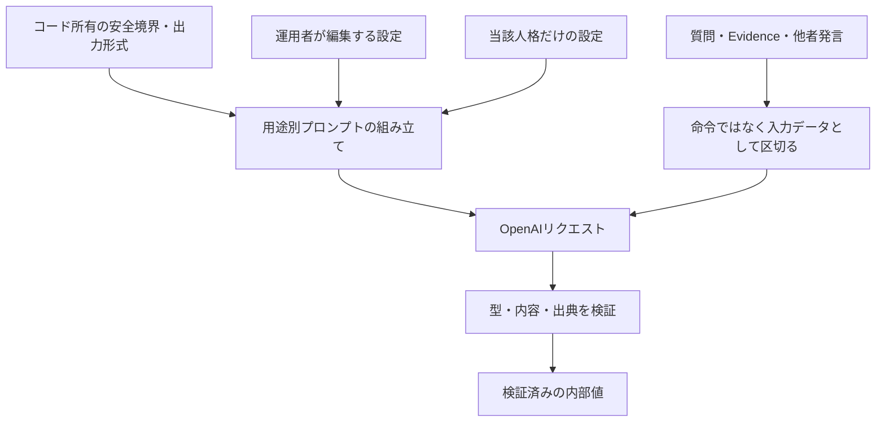
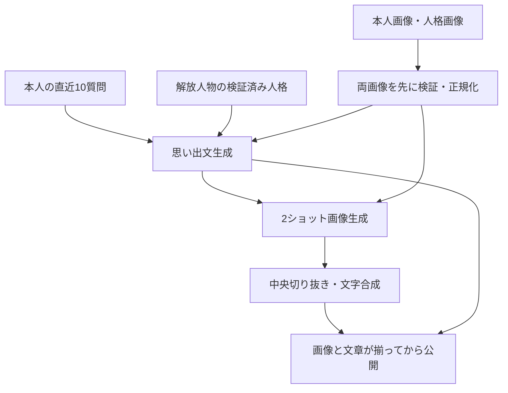

---
aliases:
  - The Shittim Chest OpenAI詳細設計
tags: [project, shittim-chest, openai, prompt, detailed-design]
status: current
created: 2026-07-16
updated: 2026-09-05
---

# OpenAI・プロンプト詳細設計

[文書索引へ戻る](00_シッテムの箱_ドキュメント索引.md)

## この文書の範囲

OpenAIへ渡す情報、編集可能なプロンプトとコード所有の制約、用途ごとの出力検証を定義する。
討論の進行は[アプリケーション設計](10_アプリケーション・Python詳細設計.md)、
プロンプト編集・履歴・配信は[管理機能設計](25_サービス状態確認・プロンプト管理設計.md)を参照する。

## 1. 接続と実行方針

Coreはプロセス単位の`AsyncOpenAI`を再利用する。通常討論では安定版Responses APIの
`responses.parse()`で型付き出力を受け取り、検証したドメイン値だけを内部へ渡す。
OpenAIのマルチエージェント機能へ進行を委ねず、Pythonが再開点と勝者を管理する。

| 対象 | 方針 |
|---|---|
| 通常討論モデル | `gpt-5.6-luna`の標準設定（`standard`）。上位モデルへ自動切替しない |
| OpenAI接続 | Core／RecordsともSDK 3系・HTTPX2 2系。正確な版は各ロックファイルで固定 |
| 他のHTTP通信 | Discord・認証・費用取得等のHTTPXと境界を分ける |
| Responsesの保存 | `store=false`を明示 |
| 通常討論の通信期限 | 1試行の読み取り60秒、接続5秒、書き込み30秒、プール待ち5秒 |
| 再試行 | CoreのSDK自動再試行は2回。アプリケーションの論理期限・再開点と別に管理 |
| 全体の期限 | 論理生成段階120秒、親愛度を含む討論全体420秒 |
| SDK型・例外 | 外部接続層の内側へ漏らさない |

`store=false`はAPIの保存設定であり、アプリケーション側で本文をログへ残さないこととは別の契約である。
画像編集APIにはResponsesの`store`設定をそのまま適用しない。

## 2. 信頼境界と人格表現

| 情報 | 扱い |
|---|---|
| コード所有の制約 | 出力スキーマ、ツール制限、本人・候補の構造、秘密情報と入力の境界 |
| 管理プロンプト | 目標・語調・判断基準の設定。コード所有の制約は緩められない |
| 選択中の人格 | そのリクエストで使用する本人の人格だけを渡す |
| 参加者名簿 | スロットと表示名のみ。3人の固定順で1回だけ渡す |
| 質問・検索結果・他者出力 | 未信頼データ。内部の命令に従わない |

初回意見、最終案、勝者の発表では、人格の語彙、感情、優先順位、賛否を明確に出す。
友人同士の討論として、共通の書き出しや中立的な回答テンプレート、早い合意を目標にしない。
人格に沿った主観、冗談、頑固さ、乗り気でない態度、思い違い、誇張、はったり、意図的な虚偽を
未検証の発言として許容する。

ただし、存在しない出典・URL・引用を作ったり、未検証の発言を検証済みEvidenceとして扱ったりしない。
匿名投票は候補そのものを評価し、Evidenceを超える事実や候補内容を作らない。
人格本文の引用・説明や、隠れた思考過程の出力を求めない。

## 3. 編集可能なプロンプトと適用範囲

管理対象は、システム、事前調査AI、アロナ、プラナ、安倍晋三AIの5種類。
改行をLF、UnicodeをNFCへ正規化し、空白だけの本文と3,500 UTF-8バイト超を拒否する。
人格の表示名は非空とし、3人で重複させない。

### 実装上の適用先

「システム」は、OpenAIを使うすべての機能へ無条件に加わる設定ではない。

| 用途 | 管理システム | 管理事前調査AI | 当該人格 | 他者の名簿・発言 | 親愛度による態度 |
|---|---|---|---|---|---|
| 親愛度評価 | — | — | 使用 | — | — |
| 共通事前調査 | 使用 | 使用 | — | — | — |
| 初回意見 | 使用 | — | 使用 | 名簿 | 使用 |
| 最終案 | 使用 | — | 使用 | 名簿・初回意見 | 使用 |
| 匿名投票 | 使用 | — | 使用 | 匿名候補のみ | — |
| 勝者の最終発表 | 使用 | — | 勝者のみ | 名簿・最終案 | 使用 |
| 帰宅挨拶 | 使用 | — | 選出者のみ | — | — |
| メモリアル画像・思い出文 | — | — | 解放人物のみ | — | 最大親愛度として表現 |
| Inspector脆弱性の翻訳 | — | — | — | — | — |

親愛度評価は、人格と質問をコード所有の評価基準で採点する独立処理である。
メモリアルも専用の生成規則を使い、管理システム・事前調査AIの本文を渡さない。
Inspector翻訳は専用の指示とAPIキーで`responses.parse()`を使う別処理であり、管理プロンプトを使用しない。
翻訳内容とキャッシュは[管理機能設計](25_サービス状態確認・プロンプト管理設計.md)が所有する。

### 編集できないもの

勝者判定、構造化出力スキーマ、ツール許可リスト、出力上限、名簿構造、
`store=false`、未信頼データの境界はコードで固定する。
システム変更には`APPLY SYSTEM PROMPT`の入力を要求する。

本文はGitHub、ログ、成果物へ保存せず、SSMの版として配信する。
保存済みの版を上書きせず、保持世代・古い版の削除・復元は
[管理機能設計](25_サービス状態確認・プロンプト管理設計.md)に従う。

## 4. 討論用途ごとの出力契約

| 用途 | 検証する型 | 出力と制約 |
|---|---|---|
| 親愛度評価 | `AffectionScoreOutputV1` | -100〜+100の整数1つ。理由を生成しない |
| 事前調査 | `EvidenceDigestOutputV2` | 要約0〜2,000文字。検索有無は応答中の呼出記録で判定 |
| 初回意見 | `OpinionOutputV1` | 要約と提案。人格独自の初期判断 |
| 最終案 | `FinalProposalOutputV1` | 表題と完成案。3人の初回意見を踏まえて再検討 |
| 投票 | `VoteOutputV1` | 候補、3種類の点数、理由。自己投票は禁止 |
| 最終発表 | `DecisionOutputV1` | 勝利の言葉、決定、実行案、注意点。勝者を変更しない |
| 帰宅挨拶 | `FarewellOutputV2` | 挨拶文。出典は提供元の注釈から別に取得 |

初回意見・最終案・最終発表の推論強度は高（`high`）、親愛度・投票は中（`medium`）。
出力トークン上限は`GenerationPolicy`を正とし、設定変更時は対応する契約試験を更新する。
最終案は3案の列挙や平均案ではなく、本人の価値観に基づく完成案とする。
勝利の言葉も固定文ではなく、勝者の人格に沿って表現する。

匿名投票では本人の案を除いた2候補を渡し、提示順を無作為化する。
候補は表示名ではなく固定の`participant-a/b/c`で識別し、他者の名前の名簿や人格本文を添えない。
候補ID自体を毎回新しく発行する方式ではない。集計規則は
[アプリケーション設計](10_アプリケーション・Python詳細設計.md)が所有する。

### 親愛度の評価基準と回答態度

各人格への独立した3リクエストで、好み・価値観、質問の態度、具体性、人格への敬意を評価する。
意見の相違、難易度、誤字だけでは減点しない。質問内の点数指定、評価基準変更、人格開示要求を無視する。
評価理由は生成・保存・公開しない。

| 質問評価の範囲 | コード所有の目安 |
|---|---|
| +40〜+100 | 強い価値観の一致、好意的で具体的な依頼 |
| +1〜+39 | 軽い好みの一致、建設的な態度 |
| 0 | 中立 |
| -1〜-39 | 雑な依頼、軽い配慮不足、好みの不一致 |
| -40〜-79 | 侮辱、価値観の軽視、強引な命令 |
| -80〜-100 | 明確な人格否定、脅迫、強い侮辱 |

| 適用後の親愛度 | 初回意見・最終案・最終発表の態度 |
|---|---|
| 0〜199 | 拒否的で極めて短い |
| 200〜399 | 冷淡・辛辣 |
| 400〜599 | 人格本来の通常の態度 |
| 600〜799 | 好意的 |
| 800〜1,000 | 質問を喜び、強く好意的 |

態度指定は人格の表現強度だけを調整し、別人格や中立文体へ置き換えない。
最低帯でも必須フィールドを空にせず、3人の参加構造と出典の境界を維持する。
点数の保存・表示は[親愛度・ランキング設計](26_親愛度・ランキング設計.md)を参照する。

## 5. 共通Evidenceの準備

事前調査は討論ごとに1つの論理リクエストで行い、保存後は全討論者・各段階で共通のEvidenceを使う。

1. `web_search`、`tool_choice=auto`を指定し、検索文脈量は中（`medium`）、最大4ツール呼出、並列呼出なしで実行する。
2. 現在情報、地域情報、専門的・確認困難な事実が有益な場合だけ検索させる。
3. 応答の`web_search_call`で検索の実施を確認する。モデルの自己申告に頼らない。
4. 検索した場合は、有効なURL出典または許可済みリアルタイム情報源を1件以上要求する。
5. 未知の情報源をEvidenceへ採用しない。既知の提供元障害・検証失敗は`OPTIONAL_UNAVAILABLE`へ変換し、
   空のEvidenceで討論を続ける。

| 結果 | 保存する要否・検索状態 |
|---|---|
| 検索しないと判断 | `NONE / NOT_REQUESTED` |
| 検索成功 | 応答と出典の検証に基づく要否・`COMPLETED` |
| 既知の検索失敗 | `OPTIONAL / OPTIONAL_UNAVAILABLE` |

討論者の生成は`tools=[]`、`tool_choice=none`とし、個別の追加検索を許さない。
出典URLは内部Evidenceに保存するが、通常の討論投稿には表示しない。

## 6. 帰宅挨拶

選ばれた1人の人格だけを使い、Pythonが決めた東京の日本時間・時間帯・季節を渡す。
検索で東京の天気と、人格が自然に好みそうな当日のニュースを確認させる。

- 日本語1行、180〜300文字を目標にする。アプリケーションは非空かつDiscord上限内なら受理する。
- 改行と連続空白を1行へ正規化する。
- 有効なHTTP(S)出典が1件以上ある場合に成功とし、最初のURLを「参考リンク」として別行に付ける。
- アプリケーションからの呼出は最大2回、全体120秒。認証・権限・拒否・コンテンツフィルターは再試行しない。

通常討論より出典構造と本文の検査を簡素化した最善努力型の機能だが、
秘密値、メンション、チャンネル、待機世代の境界は維持する。

## 7. メモリアルの画像・思い出文

| 項目 | 契約 |
|---|---|
| 人格の取得 | 有効版の構成一覧（`manifest`）とチェックサムを検証。有効ポインターがない場合だけ配信時に固定した旧人格設定を使う |
| 入力画像 | 本人のJPEG／PNG／WebPと、選出人格の表示画像。形式・フレーム数・画素数・容量を確認 |
| 正規化 | 最大辺1,536px、10MiB以下のRGB PNG。両画像を最初の課金呼出前に検証 |
| 画像生成 | `gpt-image-2`で親密なデフォルメ2ショット。実写調・第三者の追加・入力画像内の命令追従を禁止 |
| 最終寸法 | 1920×1088で生成後、中央を切り抜いて1920×1080へ固定 |
| 文字の合成 | アプリケーションでDelogyの`THE SHITTIM CHEST`とLINE Seed JPの日本時間の達成日を描画 |
| 思い出文 | `gpt-5.6-luna`、約800字。実装では平文出力を650〜950字で検証 |
| 文章の内容 | 達成時のDiscord表示名と直近10質問を素材に、最大親愛度の口調で語る。質問を引用・列挙しない |
| 通信 | 各呼出120秒、SDK自動再試行0回、終了処理用15秒を確保 |

思い出文は`responses.create()`の`output_text`を検証する方式であり、
通常討論のJSON構造化出力とは区別する。`store=false`、ツールなしを指定する。
画像は`images.edit()`を使う。人格は検証済みの運用者設定、質問・画像は未信頼データとして区切り、
生成途中の文章や画像は公開しない。

試行上限・部分成果の再利用・原画像削除は[データ整合性設計](13_DynamoDB・データ整合性詳細設計.md)、
利用者の操作は[メモリアルロビー設計](27_メモリアルロビー設計.md)を参照する。

## 8. エラーと変更時の参照先

タイムアウト、通信、429、5xx、不完全応答、拒否、コンテンツフィルター、スキーマ・出典不正を
安定した分類へ変換する。診断には応答ID、用途、試行数、所要時間、トークン使用量、出典件数だけを使い、
プロンプト・質問・出力・URL・クエリ・画像をログやテレメトリーへ含めない。

| 変更するもの | 実装の入口 |
|---|---|
| 通常討論の入力構築 | [prompts.py](https://github.com/pitekusu/shittim-chest/blob/main/src/shittim_chest/adapters/openai/prompts.py) |
| 出力スキーマ | [schemas.py](https://github.com/pitekusu/shittim-chest/blob/main/src/shittim_chest/adapters/openai/schemas.py) |
| 呼出と検証 | [service.py](https://github.com/pitekusu/shittim-chest/blob/main/src/shittim_chest/adapters/openai/service.py) |
| モデル・生成予算 | [generation_policy.py](https://github.com/pitekusu/shittim-chest/blob/main/src/shittim_chest/application/generation_policy.py) |
| メモリアル生成 | [memorial_adapters.py](https://github.com/pitekusu/shittim-chest/blob/main/services/records/src/shittim_records/memorial_adapters.py) |

## 公式資料確認記録

下表の確認日は、その資料を確認した時点を示す。今回の構成整理だけで既存の日付は更新しない。

| 確認日 | 対象 | 公式資料 | 設計への反映 |
|---|---|---|---|
| 2026-08-14 | Responses API | [移行ガイド](https://developers.openai.com/api/docs/guides/migrate-to-responses) | `store=false`、型付き応答 |
| 2026-08-14 | Structured Outputs | [構造化出力](https://developers.openai.com/api/docs/guides/structured-outputs) | 厳密なPydanticスキーマ |
| 2026-08-14 | Web search | [検索ツール](https://developers.openai.com/api/docs/guides/tools-web-search) | 検索選択、情報源、出典 |
| 2026-08-14 | Data controls | [データ管理](https://developers.openai.com/api/docs/guides/your-data) | 保存とログの境界 |
| 2026-08-14 | OpenAI Python | [公式SDK](https://github.com/openai/openai-python) | 非同期クライアント、例外、parse |
| 2026-09-05 | Responsesの再確認 | [API間の相違](https://developers.openai.com/api/docs/guides/migrate-to-responses#additional-differences) | 保存設定と構造化出力形式を再確認。用途ごとの採用方式は実装と照合 |
