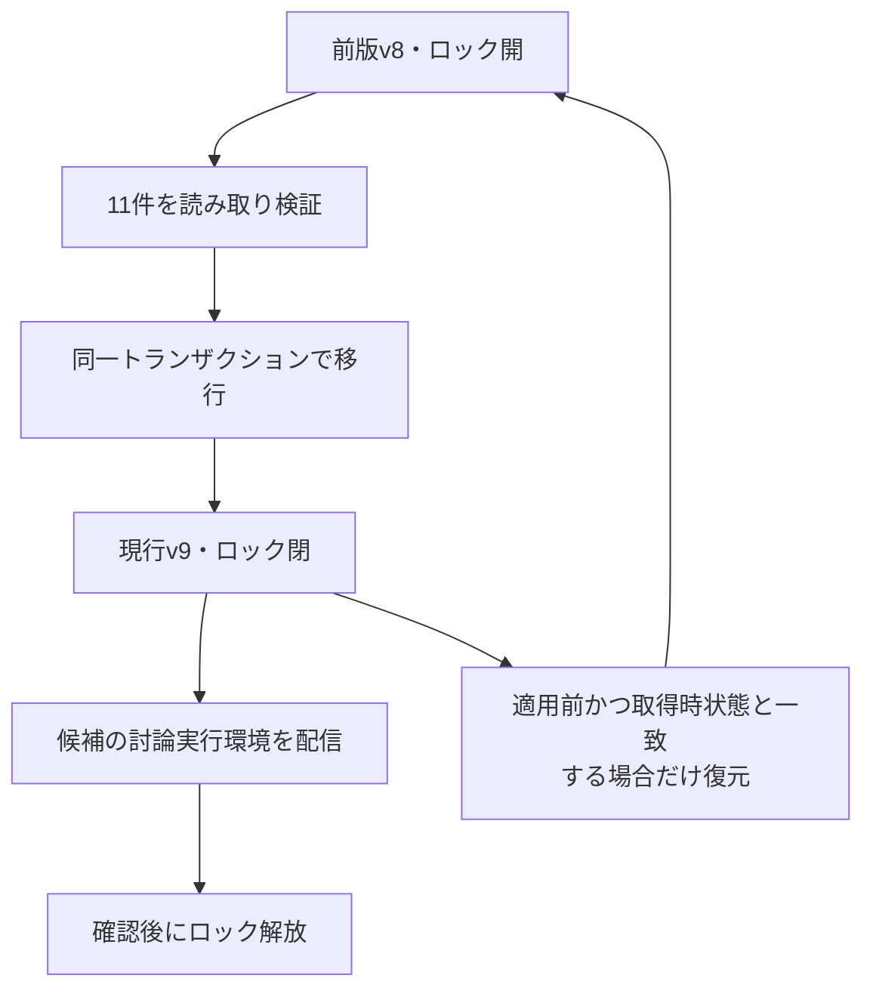
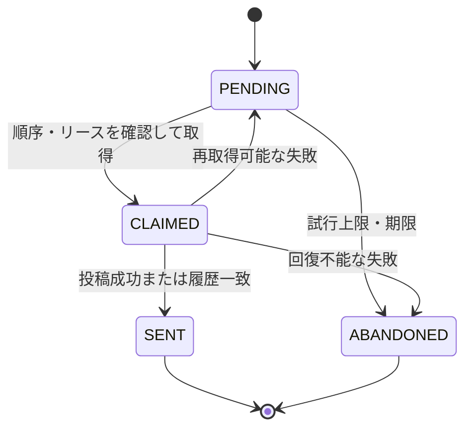
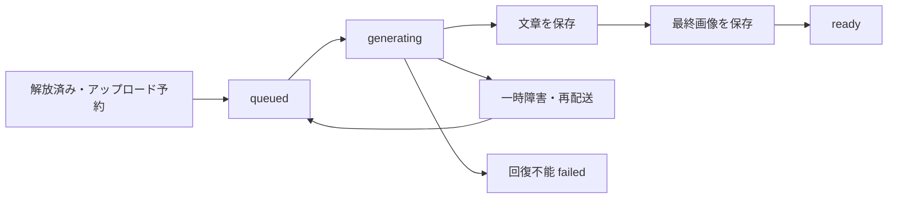

---
aliases:
  - The Shittim Chest DynamoDB詳細設計
tags: [project, shittim-chest, dynamodb, data, detailed-design]
status: current
created: 2026-07-16
updated: 2026-09-05
---

# DynamoDB・データ整合性詳細設計

[文書索引へ戻る](00_シッテムの箱_ドキュメント索引.md)

## この文書の範囲

データの所有場所、スキーマ互換性、同時更新、送信・生成の再試行で守る条件を定義する。
AWS資源の構成は[AWS・CDK設計](14_AWS・CDK詳細設計.md)、APIと画面は
[議事録設計](24_シッテムの箱%20議事録設計.md)を参照する。

## 1. データの所有場所と保存方針

「単一テーブル設計」はCoreの討論データの設計であり、アプリ全体が1テーブルという意味ではない。
Recordsは閲覧用の投影データとセッションを分離する。

| 所有テーブル | 主な内容 | 変更する側 |
|---|---|---|
| Coreの討論テーブル | 質問、試行、発言、投票、Outbox、実行制御、親愛度の正本 | Core。親愛度リセットのみRecordsとの契約で更新 |
| Recordsの議事録テーブル（Archive） | 議論記録と質問者別の検索索引 | 閲覧用データへの投影・取込処理 |
| Recordsの統計テーブル（Statistics） | ランキング・集計、プロンプト監査、翻訳キャッシュ、メモリアルの生成状態 | 各担当Records機能 |
| Recordsのセッションテーブル（Session） | セッションと認証に必要な記録 | 認証API |

テーブルは文字列のPK／SK、オンデマンド課金、削除保護、`RETAIN`、35日間のPITRを基本とする。
議論本文とスレッド対応にはTTLを設定しない。**PITRの復元可能期間と、データの保存期間は別**である。
TTLは期限付き補助記録に使い、期限切れの判定やリース解放を物理削除の遅延へ依存させない。

保存前に項目サイズを400KB以下へ収める。大きな討論・Outboxトランザクションは
100操作／4MB以内かを事前検査し、受付などはフィールド上限と操作数で範囲を制限する。

## 2. スキーマ互換性と配信時の移行

### 現行スキーマ

| 記録 | 現行と読み込み互換性 |
|---|---|
| Core共有スキーマ | 現行v9、前版v8を構造検証後にメモリ上で変換 |
| 討論実行の制御一覧 | 構成一覧（`manifest`）のスキーマv2 |
| 通常討論Outbox | レコードv2 |
| 元チャンネルへの親愛度Outbox | 投稿先を持つレコードv3。読込はv1〜v3に対応 |
| 公開状態の送信記録 | レコードv3 |
| 生成再開点・段階送信計画 | 共有v9系列の記録 |

共有v7以前、未知の将来版、未知のフィールド・列挙値は、黙って読み替えず処理を止める。
レコード固有の版と共有スキーマの版は区別する。
Recordsの議事録テーブルの互換読込は[議事録設計](24_シッテムの箱%20議事録設計.md)を参照する。

### 討論実行の制御記録の移行

配信前検査では、固定の制御記録11件が**すべて現行v9、またはすべて前版v8**であることを確認する。
混在、欠落、管理マーカーのハッシュ不一致は受理しない。

移行トランザクションは、制御記録10件、現行版の閉じた配信ロック、変更不可の取得監査を同時に保存する。
途中の混在状態を公開しない。取得直後の11件から本文を含まないSHA-256を作り、監査へ記録する。

候補の討論実行環境が有効にならず前版へ戻す場合は、直前の11件が取得時のハッシュと一致し、
各記録の条件式も満たす場合だけ、前版の制御記録と開いたロックへ同時に戻す。
状態不一致や候補の適用状況が不明な場合は、復元もロック解放も行わず、運用者の判断へ委ねる。
過去の移行手順を現行要件へ累積せず、旧経緯はGit履歴を参照する。
配信時の自動復元は、議論の永続データやDiscordのメッセージを削除する操作ではない。

## 3. 記録の種類

| 記録系列 | 所有する内容 |
|---|---|
| 討論・試行（`Debate`／`Attempt`） | 質問、現在段階、再試行との関係、終了結果 |
| 出力・投票（`Output`／`Vote`） | 討論者の生成結果、匿名票、勝者集計への入力 |
| 品質観測（`EscalationAssessment`） | 投票から計算した品質の信号、規則の版、判定時刻。本番での追加生成は行わない |
| 生成再開点（`GenerationCheckpoint`） | `PLANNED / IN_FLIGHT / COMPLETED / FAILED` |
| 段階送信計画（`PhaseDeliveryPlan`） | `STAGED / TERMINATING / DELIVERED / ABANDONED` |
| 送信待ち記録（Outbox） | Discord操作、送信順、`nonce`、取得者、配送状態 |
| 受付 | 先入れ先出しの永続キュー、操作要求の重複排除、起動期限 |
| 実行状態・稼働情報 | 実行世代、排他番号、リース、未処理・処理中件数 |
| 公開状態の送信記録 | 表示すべき状態と表示済み状態 |
| 配信の検査・ロック | 配信前提、所有者、期限、スタックの排他 |
| `ADMIN#PROMPT` | 現行版、本文を含まない版監査、ハッシュ化した冪等キー |
| `AFFECTION#REQUESTER#<opaque requester key> / PROFILE` | 3人の点数、比較更新用の版、リセット回数、周期、解放情報 |
| `DEBATE#<Debate ID> / AFFECTION` | 評価状態、変更前、質問評価、実増減、変更後、今回の解放 |
| `MEMORIAL#REQUESTER#<opaque requester key> / CYCLE#<cycle>` | アップロード予約、生成再開点、画像参照、思い出文、リセット情報 |

前半の実行・親愛度記録はCoreの討論テーブル、`ADMIN#PROMPT`と`MEMORIAL#REQUESTER#...`はRecordsの統計テーブルが所有する。
正確な属性名と変換処理は各リポジトリ実装を正とする。

## 4. 討論を同時に確定する範囲

| 更新 | 同じトランザクションに含めるもの |
|---|---|
| 出力保存 | 検証済み出力＋生成再開点の完了 |
| 段階の送信準備 | 全出力の確認＋送信計画＋Outbox |
| 次段階への遷移 | 全必須Outboxの`SENT`確認＋計画完了＋次段階 |
| 投票公開 | 3票の確定確認＋公開Outbox |
| 終了 | 勝者結果、終了時Outbox、稼働件数が矛盾しない状態 |
| 親愛度評価 | 3人分のプロフィール＋討論別評価＋次段階 |

更新条件には共有スキーマ、現在段階、試行ID、リース所有者、世代番号を含める。
配信ロックが閉じている間は、討論実行環境からの新規書き込みを拒否する。
トランザクション取消理由は操作順に分類し、データ本文やSDKのエラー本文をログへ出さない。

### リースと世代番号

- 期限内の所有者だけがリースを延長し、状態を書き換える。
- 古い所有者、別試行、別世代、閉じた配信ロックからの書き込みを条件式で拒否する。
- GSIは候補探索に使えるが、排他判断はベーステーブルの強整合読み取りと条件式で行う。
- プロセス終了時には可能な範囲でリースを解放する。ただし正しさは期限と世代確認で保つ。

## 5. 親愛度・解放情報の整合性

3人の評価がすべて成功した場合だけ、`scoring_affection`からの遷移とともに反映する。
各点数は0〜1,000に丸め、実増減と適用後点数を保存する。
同じ討論を再試行しても再評価・二重加算しない。プロフィールの比較更新が競合した場合は、
同じ質問評価を最新点数に再適用し、OpenAIを再実行しない。

### 旧プロフィールの識別子移行

v8の非公開Discord IDをキーとするプロフィールは、本人の**次の成功評価時だけ**、
HMACから導出した不透明キーのv9記録へ移す。新記録の追加と旧記録の削除を同時に行い、
新規v9プロフィールには変換前のDiscord IDを保存しない。

評価不能時は旧記録を読み取り・条件確認するだけで、移行も解放判定も行わない。
成功移行時に限り、移行前から1,000点だった人格もメモリアル解放候補にできる。

### 解放の確定

未解放の周期で新たに1,000点へ到達した場合、選出した1人の解放情報をプロフィールと討論別評価へ
同時保存する。通常到達か移行時の遡及解放かを、本文を含まない真偽値で区別する。
すでに解放済みの周期では、別の人格が到達しても追加解放しない。

点数・選出の業務ルールは[親愛度・ランキング設計](26_親愛度・ランキング設計.md)を参照する。

## 6. Outboxの順序と送信済み確定

同じ試行では、小さい`delivery_sequence`がすべて終了するまで次を取得しない。
取得期限切れ後は再取得できるが、Discordの履歴照合で既送信を確認する。

Discordが受理したメッセージIDの保存では、同じID、取得情報、確定時刻から冪等トークンを導出する。
完全な`TransactionConflict`またはSDK結果不明だけを短時間で再試行し、条件不一致や識別子の競合は繰り返さない。
SDK例外は接続層で`RepositoryUnavailable`へ変換する。

最大3回の配送試行、準備から15分の期限、または再試行不能な失敗で新規取得を止め、残件を`ABANDONED`にする。
必須表示の断念は試行の失敗とし、完了扱いしない。送信・履歴照合の詳細は
[Discord設計](11_Discord詳細設計.md)を参照する。

## 7. プロンプトの監査とSSMの切替

本文はSSMへ保存し、DynamoDBには版、作成時刻、操作、元の版、内容・要求のチェックサム、
処理中／完了状態だけを保存する。本文、差分、冪等キーそのものは保存しない。

公開・復元操作では、処理中監査、冪等記録、`CURRENT`をトランザクションで整合させる。
SSMの有効ポインターを最後に切り替え、その後の監査完了が失敗した場合は、
次回アクセスでポインターと構成一覧（`manifest`）を照合して完了させる。
SSMとDynamoDBを1つのトランザクションとみなさず、再開できる手順として設計する。
版の保持と削除は[管理機能設計](25_サービス状態確認・プロンプト管理設計.md)を参照する。

## 8. メモリアル生成とリセット

### 所有者・周期・冪等性

本人専用APIは、セッションから導いた不透明な質問者キーだけを保存処理へ渡す。
リクエストから他人を指定させない。アップロード予約、生成投入、リセットの全POSTは
`expectedCycle`を必須とし、正本プロフィールの現在周期との一致を条件付き更新で確認する。
古い画面から次の周期を操作する要求は409で拒否する。

生成状態とハッシュ化した冪等記録は統計テーブルの本人別パーティションへ保存する。
DynamoDB式では予約語との衝突を避けるため`cycle`を`#cycle`で参照する。

### キューと永続再開点

APIの状態更新とSQS送信は別操作である。`queued`の同じ仕事は固定の成果物キーを維持して再送でき、
APIが状態更新後・送信前に止まっても失わない。SQSの本文は不透明な質問者キーと周期だけを持つ。

ワーカーは状態、周期、所有者を確認し、生成試行番号をCASで増やす。
取得ごとのランダムな識別トークンと試行番号で、文章・画像の保存、完了、失敗、キュー復帰を保護する。
条件付き更新の応答を失っても、記録に残るトークンが同じ場合だけ成功済みとみなす。

### 課金呼出と回復の境界

| 状況 | 処理 |
|---|---|
| 通常の生成 | 永続の生成試行番号で、課金を伴う生成試行を最大3回に制限 |
| 同じ仕事の再配送 | 保存済み文章・画像と同じ成果物キーを再利用 |
| その取得で課金呼出を始める前に時間不足 | 同じ試行・トークンの条件で`queued`へ戻し、試行番号を1だけ払い戻す |
| その取得で課金呼出を開始済み | 試行を払い戻さない |
| 試行上限後に文章と検証済み最終画像が残る | 新規課金なしの完了処理だけを許可 |
| 試行上限後に最終画像がない | 文章だけの部分成果を除去し、リセット可能な`failed`へ収束 |
| 画像と文章が両方保存済み | `ready`を確定して初めて本人APIへ公開 |

SQSの`ApproximateReceiveCount`は物理配送回数であり、課金可否の正本にしない。
DLQへの移送は最大4回の受信を基準とするが、3回目の取得がタイムアウト等で中断した後の4回目は、
成果の完了処理か、新規課金なしの失敗確定だけを行う。

通信先での厳密な1回実行を仮定しない。保存済み成果を再利用して不要な再生成を避け、
保存前に結果を失ったケースも永続試行上限で制限する。
各API呼出の120秒と終了処理用15秒を含む予算判定は[OpenAI設計](12_OpenAI・プロンプト詳細設計.md)に従う。

成功時または再試行不能な終了失敗時にアップロード原本を削除する。
一時障害では原本・部分成果を保持して再配送へ委ねる。
生成中の部分成果を本人APIへ返さない。

### リセット

リセットはCoreのv9親愛度プロフィールと統計テーブルの該当周期を**同じトランザクション**で更新する。

| 現在の状態 | リセット |
|---|---|
| 初回の`locked` | 未解放のため不可 |
| 解放済みで再開点のない`unlocked` | 可 |
| `queued`／`generating` | 409で拒否 |
| 文章または最終画像が残る`failed` | 回復を優先し、409で拒否。両方揃っていれば完了処理だけを行う |
| 部分成果がない終了済み`failed` | 可 |
| `ready` | 可。過去の生成物は保持 |

3人の点数を500へ戻し、リセット回数と周期をそれぞれ1増やし、解放情報を除去する。
一方のテーブルだけが進む状態や二重加算を許さない。
次周期がまだ`locked`なら同じ冪等キーの完了済みリセットを再応答できるが、
次周期が再解放済みになった後の旧要求は409にする。

## 9. 読み取り・検索とプライバシー

- 整合性判断にはベーステーブルの`ConsistentRead=true`を使う。
- 全件処理が必要なQuery／Scanは`LastEvaluatedKey`がなくなるまで続け、打切りを全件完了とみなさない。
- メモリアルの材料は議事録テーブルの索引`GSI3`を降順で**最大10質問**だけ取得する。索引の遅延を生成可否や本人認可に使わない。
- 内部へはPythonの値を返し、SDKの`AttributeValue`を持ち込まない。
- 再開に必要な質問・出力は保存するが、ログへ複製しない。トークン、署名、人格本文、OpenAIキーを項目に保存しない。
- 指標の次元に討論ID等を使用せず、操作数、段階、安定したエラー分類を使う。

## 10. 変更時の参照先

| 変更するもの | 実装の入口 |
|---|---|
| Coreの形式・互換読込 | [serializer.py](https://github.com/pitekusu/shittim-chest/blob/main/src/shittim_chest/adapters/dynamodb/serializer.py) |
| 配信ロックとスキーマ移行 | [deployment_guard.py](https://github.com/pitekusu/shittim-chest/blob/main/src/shittim_chest/adapters/dynamodb/deployment_guard.py) |
| Outboxの条件付き保存 | [outbox.py](https://github.com/pitekusu/shittim-chest/blob/main/src/shittim_chest/adapters/dynamodb/outbox.py) |
| メモリアルの保存・再試行 | [memorial_adapters.py](https://github.com/pitekusu/shittim-chest/blob/main/services/records/src/shittim_records/memorial_adapters.py) |
| テーブルの保護設定 | [RecordsStateful](https://github.com/pitekusu/shittim-chest/blob/main/infra/lib/records-stateful-stack.ts) |

## 公式資料確認記録

| 確認日 | 対象 | 公式資料 | 設計への反映 |
|---|---|---|---|
| 2026-08-14 | DynamoDBの基本 | [構成要素](https://docs.aws.amazon.com/amazondynamodb/latest/developerguide/HowItWorks.CoreComponents.html) | 単一テーブル内の所有関係 |
| 2026-08-14 | トランザクション | [TransactWriteItems](https://docs.aws.amazon.com/amazondynamodb/latest/APIReference/API_TransactWriteItems.html) | 排他と段階更新の原子性 |
| 2026-08-14 | ページング | [Queryのページ処理](https://docs.aws.amazon.com/amazondynamodb/latest/developerguide/Query.Pagination.html) | 必要な全件を取得 |
| 2026-08-14 | PITR | [継続的バックアップ](https://docs.aws.amazon.com/amazondynamodb/latest/developerguide/Point-in-time-recovery.html) | 35日間の復元可能期間 |
| 2026-08-14 | 項目サイズ | [容量計算](https://docs.aws.amazon.com/amazondynamodb/latest/developerguide/CapacityUnitCalculations.html) | 400KBの保存前検証 |
