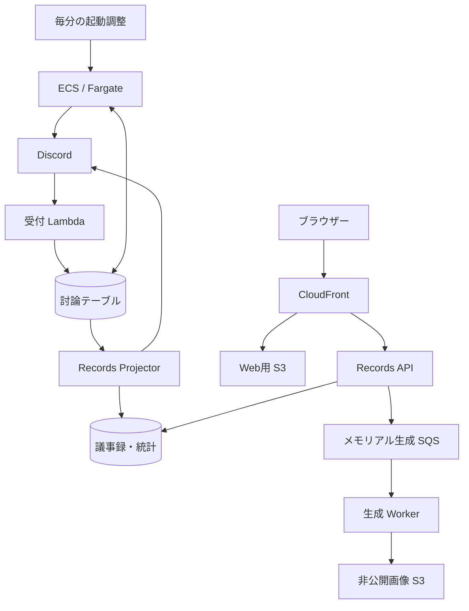

---
aliases:
  - The Shittim Chest AWS詳細設計
tags: [project, shittim-chest, aws, cdk, ecs, detailed-design]
status: current
created: 2026-07-16
updated: 2026-09-05
---

# AWS・CDK詳細設計

[ドキュメント索引へ戻る](00_シッテムの箱_ドキュメント索引.md)

## この文書の役割

AWSリソースの配置、所有スタック、保護設定、権限の分担を定義する。
配信手順は[GitHub・CI/CD設計](15_GitHub・CI-CD詳細設計.md)、障害時の確認順は
[運用保守設計](17_運用保守・監視・障害対応設計.md)、Web/APIの契約は
[議事録設計](24_シッテムの箱%20議事録設計.md)を参照する。

## 1. 全体構成とスタックの責務

単一AWSアカウントを使い、討論・API・データを東京リージョンに置く。
費用管理とCloudFront向け証明書・Web配信スタックはバージニア北部に置く。
全リソースに`Project`、`Environment`、`ManagedBy`タグを付与する。

図はデータと呼出しの関係を示す。スタック間の詳細な参照はCDKを正とする。

| スタック | リージョン | 所有するもの | 保護・変更の扱い |
|---|---|---|---|
| Stateful | 東京 | 討論DynamoDB、ECR、Signer | 終了保護。永続リソースは`RETAIN` |
| ReleaseIdentity | 東京 | Core/Records別のGitHub OIDCロール | 終了保護。必要時に単独で先行更新 |
| Runtime | 東京 | ネットワーク、受付API、4 Lambda、ECS、Scheduler、ログ | 通常のCore配信で更新 |
| Operations | 東京 | メトリクス、アラーム、ダッシュボード、SNS、EventBridge | 通常のCore配信で更新 |
| CostGovernance | バージニア北部 | Budgets、費用異常通知 | 通常のCore配信で更新 |
| RecordsStateful | 東京 | Archive/Statistics/Session、画像、一時アップロード、生成キュー/DLQ | 終了保護。テーブル・画像・生成キューを保持 |
| RecordsApplication | 東京 | 認証/閲覧API、Projector、集計、管理、メモリアルのLambda | 終了保護。アプリケーションを更新 |
| RecordsEdge | バージニア北部 | Web用S3、CloudFront、証明書、DNSレコード、セキュリティヘッダー | 終了保護。Webバケットを保持 |

Core配信の変更セット実行順はStateful → Runtime → Operations → CostGovernance。
ReleaseIdentityは配信を実行する権限そのものなので、この順序へ含めない。

## 2. 永続リソースと保持

| 対象 | 設定 | 保持上の注意 |
|---|---|---|
| DynamoDB | オンデマンド、暗号化、PITR 35日、削除保護、`RETAIN` | Sessionのみ`expiresAt`によるTTLを使用 |
| 討論テーブルのStream | `NEW_IMAGE` | Records Projectorが購読。元テーブルのキー・インデックス・保持を変えない |
| ECR | タグ変更不可、暗号化、継続的な拡張スキャン | タグ付き・タグなしをそれぞれ最新3世代保持 |
| Signer/Notation | 署名プロファイルとECR参照成果物を使用 | 配信時に署名・来歴・SBOMを検証 |
| Media用S3 | バージョニング、暗号化、公開アクセス遮断、TLS、`RETAIN` | アクセスログは専用バケットへ保存 |
| Web用S3 | バージョニング、暗号化、公開アクセス遮断、TLS、`RETAIN` | CloudFront経由で配信。アクセスログは90日保持 |
| 一時アップロード用S3 | バージョニングなし、暗号化、公開アクセス遮断、TLS、`RETAIN` | 原本と未完了マルチパートを1日で期限切れにする |

一時アップロードは本番オリジンからの署名付きPOSTだけをCORSで許可する。
アクセスログは既存Mediaログ用バケットの専用プレフィックスへ分離する。

### メモリアル生成の配送と課金上限

| 項目 | 値・責務 |
|---|---|
| 生成キュー | SQS管理暗号化、TLS必須、保持1日、可視性タイムアウト30分 |
| 生成DLQ | 専用キュー、保持14日。Projector DLQとは分離 |
| Worker | 1メッセージずつ処理 |
| DLQへの移動 | 最大受信回数4 |
| 有料生成の論理試行 | 永続チェックポイントで最大3回 |

SQSの受信回数と有料生成の回数は別の制限である。
最後の有料試行中にタイムアウトやOOMで停止しても、次の配送が期限切れリースを回収できる。
この回収は保存済み成果物の確定、またはプロバイダーを呼ばない失敗確定だけを行い、4回目の有料生成を許可しない。

## 3. 討論コンテナとネットワーク

| 項目 | 本番設定 |
|---|---|
| サブネット | パブリックのみ。NAT Gatewayなし |
| タスク通信 | パブリックIPv4あり。受信許可なし、送信はHTTPSのみ |
| 実行基盤 | ARM64 On-Demand Fargate |
| リソース | CPU 512ユニット、メモリ1,024 MiB |
| タスク数 | 平常`desiredCount=0`、最大1タスク |
| コンテナ保護 | `root`以外のユーザー、読み取り専用ルートファイルシステム、tmpfs |
| 停止猶予 | `stopTimeout=120`秒 |
| Container Insights | 個人規模の費用を考慮し無効 |
| イメージ指定 | 固定ソースSHAからARM64でビルドし、ダイジェストで固定 |

ECS Exec用の専用イメージや特権タスク定義は作らない。
Runtimeは配信で検証された`RecordsPublicHostname`から`SHITTIM_RECORDS_MEMORIAL_URL`を構成する。
用途はDiscordの公開解放リンクであり、秘密設定へURLを複製しない。

## 4. APIとLambdaの分担

| コンポーネント | 主な責務 |
|---|---|
| HTTP API/Ingress | Discord Interaction受付、未加工本文の署名検証、受付の永続化 |
| Status Publisher | 永続化された公開状態をDiscord RESTの表示へ反映 |
| Runtime Reconciler | 永続状態に従いECSの希望タスク数を0/1へ収束 |
| Image Admission | タスク定義、イメージ、署名、アテステーションを検証 |
| Records Projector | 完了討論をArchiveへ投影し、保存後に元チャットへWeb記録リンクを投稿 |
| Records Admin Status | 許可されたAWS/CloudWatch状態だけを集約。予約同時実行数2 |
| Records Admin Config | プロンプトの参照・更新・復元・履歴保持。予約同時実行数2 |
| Records Memorial API | 本人の状態、アップロード、生成、履歴、リセット。15秒、予約同時実行数2 |
| Records Memorial Worker | SQSから画像・文章を生成。5分、1,024 MiB、予約同時実行数1 |

LambdaはVPC外で動かし、外部APIへの到達にNATを必要としない。
EventBridge SchedulerがReconcilerを毎分起動する。
HTTP関数のバージョン/エイリアス、SnapStart、各タイムアウトの実値はCDKの関数定義で管理する。
管理APIの同時実行数は並行した閲覧を受け付けつつ下流負荷を制限する値である。

## 5. IAMの責務分離

| ロール | 許可する範囲 | 許可しないもの |
|---|---|---|
| タスク実行ロール | 本番イメージ取得、指定SSMの注入、ログ出力 | アプリケーション全体のデータ操作 |
| タスクロール | 必要なDynamoDB区画、Status Publisher呼出し、指定の識別子HMAC設定読込 | SSMパスの列挙、任意Lambda呼出し |
| 各Lambdaロール | ハンドラーごとのテーブルキー・関数・サービス・ログ | 関数間で共有した管理権限 |
| Records Projector | 元討論の読込、Archiveのトランザクション書込、Statisticsの`RECORD_LINK_NOTIFICATION`、固定RuntimeConfig／モデレーターtokenの読込 | Backfillからの投稿、元討論の変更、任意SSM／Statistics操作 |
| Admin Config | セッションの`SESSION#*`読込、Statisticsの`ADMIN#PROMPT`操作、指定SSM | AWS状態収集や任意設定の書換え |
| Admin Status | 許可リソースの状態とメトリクス読込 | メッセージ本文取得、シークレット復号、業務データ変更、任意呼出し |
| Memorial API | セッション、本人の親愛度/チェックポイント、一時画像、生成キュー送信、完成画像読込 | 任意の所有者やバケット全体の列挙 |
| Memorial Worker | Statisticsチェックポイント、Archive GSI3、対象画像、キュー消費、専用OpenAIキー/人格設定 | 元の討論テーブル読込、一時写真の列挙 |
| Release | 固定スタック、`release-*`変更セット、ECR、Signer、成果物バケット | 任意スタックの配信 |

Admin Configのリビジョン作成は`ssm:Overwrite=false`に限定し、上書きを明示的に拒否する。
保持対象から外れた未使用リビジョンの削除は、固定長リビジョン配下の`DeleteParameters`だけを許可する。
`active`は削除可能なリソース集合に含めず、更新は専用の権限で行う。

S3の不存在判定に必要な`ListBucket`は、APIでは一時バケットの`uploads/*`とMediaの`memorials/*`、
WorkerではMediaの`memorials/*`だけをプレフィックス条件で許可する。
Admin Statusが確認できるメモリアル情報は関数状態とキュー/DLQ属性だけであり、所有者や画像を読まない。

`ecs:DescribeTaskDefinition`はリソース単位の権限制御に対応しないため、独立した`Resource: "*"`の文を使う。
Admission/Releaseはファミリー、リビジョン、コンテナ、ダイジェストを厳密に照合する。
Admin StatusはリージョンをIAMで限定し、実サービスが参照するタスク定義、アプリケーションコンテナ、
ECRリポジトリ、ダイジェストを検証してからタグを解決する。

GitHubでは長期AWSキーを使わず、変更不能なリポジトリ識別情報に基づくOIDCを使う。
Core用とRecords用の計画・配信・バックフィル・ドリフト検査ロールを分ける。
計画/ドリフト検査は`main`、配信/バックフィルはGitHubの`production`環境に紐づく認証主体だけを信頼する。
Recordsの配信ロールには元の討論テーブルの読み書きを許可しない。

## 6. 非公開設定とWebオリジン

- RuntimeConfigはバージョン付きの設定で、スキーマv2として4体のBot、Discordサーバー、許可チャンネル、帰宅挨拶先を検証する。
  現在選択されたバージョンはRuntimeスタックの`RuntimeConfigVersion`を正とし、文書へ固定しない。
- PersonaConfigはスキーマv1の4枠。CDKは本文を読み込まず、名前とメタデータだけを扱う。
- Records配信はRuntimeの`vNNNN`形式の設定バージョンを検証し、`LegacyRuntimeConfigVersion`として渡す。
  Admin Configは有効リビジョンの参照先が未登録の場合だけ、この既存設定から5種類のプロンプトを読む。
- 設定移行やキー登録では本文を表示・ローカル保存しない。メモリアル用OpenAIキーは専用登録ツールを使い、
  配信はSecureStringのメタデータだけを確認する。値をCloudFormation、Lambda環境変数、成果物へ出さない。
- RecordsEdgeは同じアカウント/リージョンの一時アップロードバケットから得た正確なS3ドメインを受け取る。
  CSPの`connect-src`は`'self'`とそのオリジンだけを許可し、バケットのワイルドカードや任意URLを許可しない。

RecordsEdgeはOACで非公開S3へ接続し、Route 53のA/AAAAレコードを管理する。
公開証明書はECDSA P-256、CloudFrontの閲覧者向けTLSポリシーは`TLSv1.3_2025`。
`/api/*`はキャッシュせずCookieをAPI Gatewayへ転送し、`/assets/*`だけを変更不能なアセットとしてキャッシュする。
過去のRSAからECDSAへの一度限りの変更を、今後の証明書置換への包括承認として扱わない。

## 7. 監視・費用・変更の検証

CloudWatch Logsはコンポーネント別に分け、保持期間とデータ保護ポリシーを設定する。
EMFは固定した名前空間・ディメンション・メトリクスだけを使い、`_aws`をルートに持つ1行JSONとして出力する。
Lambdaのログメッセージへ文字列として二重に格納しない。
重大/警告の複合アラーム、ダッシュボード、ECS異常停止通知を設け、SNSメールは運用者の購読確認を必要とする。

費用管理はプロジェクト20 USD、アカウント30 USDの予算と実績/予測通知を使う。
指標は`NetUnblendedCost`。AWS管理のサービス別費用異常モニターから日次通知を受ける。

CDKの依存はルートのロックファイルで固定する。TypeScript、Vitest、CDKアサーション、cdk-nag、認証不要のテンプレート生成で
論理ID・スタック名・エクスポート・権限・保持設定を検証する。
週次ドリフト検査は構成差分を報告するだけで、自動修復しない。

## 実装への入口

| 対象 | 実装 |
|---|---|
| Coreのスタック組立て | [infra/bin/shittim-chest.ts](https://github.com/pitekusu/shittim-chest/blob/main/infra/bin/shittim-chest.ts) |
| Recordsのスタック組立て | [infra/bin/shittim-records.ts](https://github.com/pitekusu/shittim-chest/blob/main/infra/bin/shittim-records.ts) |
| リソース・IAM・パラメーター | [infra/lib](https://github.com/pitekusu/shittim-chest/tree/main/infra/lib) |
| 構成の回帰試験 | [infra/test](https://github.com/pitekusu/shittim-chest/tree/main/infra/test) |

## 公式資料確認記録

以下は設計時の確認記録であり、この文書の整理日を再確認日として扱わない。

| 確認日 | 対象 | 公式資料 | 設計への反映 |
|---|---|---|---|
| 2026-08-14 | Fargateの通信 | [タスクネットワーク](https://docs.aws.amazon.com/AmazonECS/latest/developerguide/fargate-task-networking.html) | awsvpcとパブリックIP |
| 2026-08-14 | Fargateの実行容量 | [キャパシティープロバイダー](https://docs.aws.amazon.com/AmazonECS/latest/developerguide/fargate-capacity-providers.html) | On-DemandとScale-to-Zero |
| 2026-08-29 | ECS IAM | [サービス認可](https://docs.aws.amazon.com/service-authorization/latest/reference/list_amazonelasticcontainerservice.html) | DescribeTaskDefinitionの権限とアプリ側検証 |
| 2026-08-14 | AWS CDK | [CDKガイド](https://docs.aws.amazon.com/cdk/v2/guide/home.html) | スタック責務とテンプレート生成 |
| 2026-08-14 | AWS Budgets | [予算管理](https://docs.aws.amazon.com/cost-management/latest/userguide/budgets-managing-costs.html) | 予算通知 |
