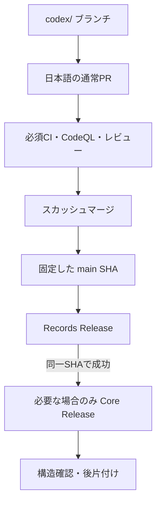
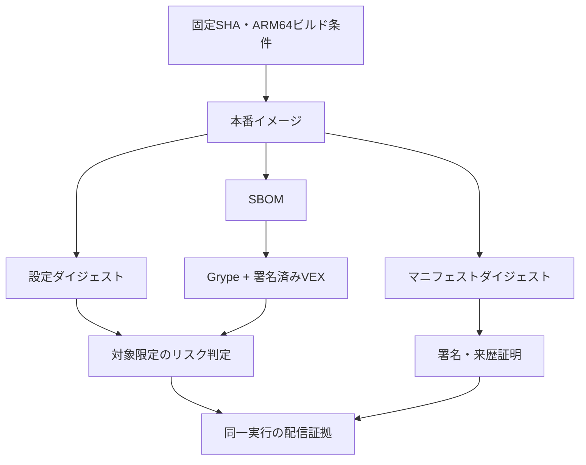
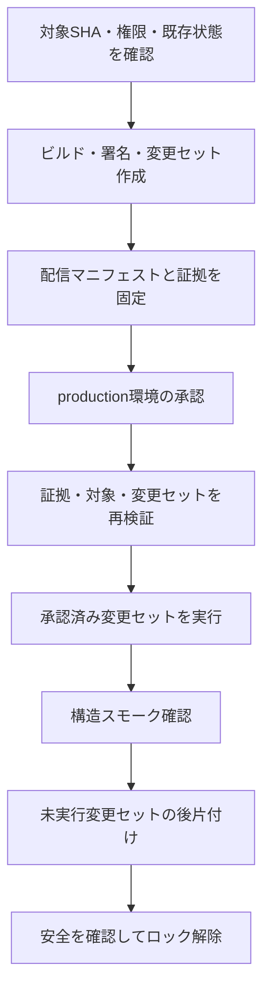

---
aliases:
  - The Shittim Chest GitHub詳細設計
tags: [project, shittim-chest, github, ci-cd, detailed-design]
status: current
created: 2026-07-16
updated: 2026-09-05
---

# GitHub・CI-CD詳細設計

[ドキュメント索引へ戻る](00_シッテムの箱_ドキュメント索引.md)

## この文書の役割

変更を通常PRから本番へ届ける手順、成果物の照合、失敗時の安全境界を定義する。
個別試験の目的は[試験設計](18_試験・品質保証設計.md)、スタックの所有範囲は
[AWS設計](14_AWS・CDK詳細設計.md)、実際の配信・検証履歴は
[実装・試験・検証記録](20_実装・試験・検証記録.md)を参照する。

## 1. リポジトリと変更の流れ

公開リポジトリの既定ブランチは`main`。
ソース・IaC・ツール・サンプルはMIT、`docs/`と`AGENTS.md`は留保された文書として扱う。
秘密情報、非公開Discord識別子、質問、人格本文をコミット、成果物名、実行サマリーへ含めない。

`main`へ直接プッシュせず、下書きではない通常PRを使う。
GitHubへ書き込む前に`gh auth status`と`gh api user --jq '.login'`で操作アカウントを確認する。
承認済みの工程は重ねて承認を求めないが、承認範囲を超える本番操作へ拡張しない。

### 変更対象の決定

配信とCIの範囲は[変更パス分類](https://github.com/pitekusu/shittim-chest/blob/main/tools/classify_ci_paths.py)と
実際の差分で決める。「Webだけ」「文書だけ」という呼び名だけでは判定しない。
例えばREADMEはイメージのビルド対象なので、その変更は現在の分類ではコンテナ検証対象になる。
Recordsだけの変更でFargateイメージを変更しない場合は、Core配信を追加しない。
Core配信を行う場合は、変更内容にかかわらず同じSHAのRecords配信成功が必要である。

## 2. 継続的インテグレーション

### Coreと共通検証

`ci.yml`はPR、`main`へのプッシュ、手動実行に対応する。
最初の`changes`が範囲を判定し、次の検証を必要な条件で実行する。

| ジョブ | 確かめるもの |
|---|---|
| quality | ロックファイル、整形、Ruff、ty、依存方向、ツール固定値 |
| tests | Pythonの単体・性質・永続化試験、DynamoDB Local |
| security | シークレット検査、依存監査、ソースSBOM |
| package | 再現可能なwheel/sdist |
| cdk | TypeScript、Vitest、cdk-nag、テンプレート生成、npm audit |
| container-arm64 | 本番イメージ、実行方針、SBOM、設定ダイジェスト |
| grype | 生スキャン、VEX適用、修正可能/残存リスクの判定 |
| docs-public-safety | 文書構造、参照、公開情報、ライセンス境界 |

### Records検証

| ジョブ | 確かめるもの |
|---|---|
| records-changes | Recordsの変更範囲 |
| records-python | 固定依存、監査、整形・型・単体・DynamoDB Local |
| records-contract | OpenAPI、JSON Schema等の生成物一致 |
| records-web | 整形・型・単体試験・ビルド・Playwright・依存監査 |
| records-infra | Records固有スタックのテンプレート生成 |
| records-gate | 必須チェックとしてRecords全体の結果を集約 |

ルートのロックファイル監査、TypeScript、Recordsを含む全インフラのVitestは同じSHAの`cdk`へ集約する。
`records-infra`では共通検証を繰り返さない。
対象外PRでも`records-gate`は明示的な対象外の成功結果を返す。
`container-arm64`と`grype`も必須チェック名を維持し、分類上の対象外だけ重い処理を省く。
CodeQLはPython、JavaScript/TypeScript、GitHub Actionsを解析する。
ブランチ保護のチェック名は実際のジョブ名に合わせ、失敗を隠すための再実行はしない。

### npm監査サービスの障害

`npm audit`/`pnpm audit`は通常どおり必須である。
npm公式Statuspageで「Security Auditコンポーネントの劣化」と「同コンポーネントに紐づく進行中インシデント」を
同時に確認できた実行だけ、Node系の外部監査を省略し、警告を残す。
公式情報の取得失敗・不正な形式・インシデント不明は拒否し、監査で検出された脆弱性や通常の非0終了を省略理由にしない。
ビルド、試験、CodeQL、Grype、依存レビュー等は継続する。省略した監査を成功として記録しない。

## 3. 依存と配信ツールの更新

正確なバージョンは各ロックファイル、`pyproject.toml`、`package.json`、`.node-version`、ワークフローを正とする。
設計書へパッチバージョンを重複記載しない。

| 更新対象 | 一緒に確認・更新するもの |
|---|---|
| Node | 正式対応は24系。ローカルの固定値、CI/配信、ルート/Webの`engines`、Node型定義を合わせる |
| Nodeの次期系列 | CDKの対応、Corepack導入、jsdomとNode標準Web APIの競合を評価してから採用 |
| Vite Plus | 本体、coreエイリアス、Web Vitestの依存上書き設定を一組として更新 |
| OpenAI SDK | Core/Recordsの3系、HTTPX2のクライアント・タイムアウト・例外境界を合わせる。モデル/人格変更は分離 |
| uv/ビルド基盤 | 両Pythonプロジェクトの対応系列、`required-version`、`uv_build`、ワークフロー、Docker、更新監視を合わせる |
| Actions | `uses:`を完全なコミットSHAで固定し、Dependabotで追従 |
| Buildx/BuildKit/直接取得CLI | バージョン、ダイジェスト、配布物チェックサム、署名主体を固定し、専用監視で追従 |

互換性のない自動更新は理由を記録してDependabot側で保留する。
uvの系列変更ではロックファイル、ビルド、SBOMの互換性を検証し、反映後は両プロジェクトのDependabot更新処理も確認する。

### 固定ツール監視

DependabotのActions更新は`uses:`を扱い、`with.version`、`driver-opts`、環境変数、直接取得CLIの固定値を網羅しない。
これらは`Release Tool Versions`が毎週と手動実行で確認する。

- `.github/tool-versions.json`の`tools`は配布物・チェックサム・署名主体の正本。
  `sources`はワークフロー/パッケージ管理設定の参照先であり、同じバージョンを複製しない。
- 通常CIはネットワークを使わず、固定値の形式と複数箇所の整合を検査する。
- 定期監視は公式リリースの安定版を、明示したPython/Node/uv/pnpm系列の中で比較する。系列変更を自動採用しない。
- AWS Signerのインストーラーは`latest`配布物・署名・公開鍵のチェックサム差分だけを検出する。
  取得したツールの実行・インストール・署名鍵の自動交換はしない。
- 結果は実行サマリーと通知Botが管理する単一Issueへ集約する。変化がなければ再投稿しない。
  全項目が確認済みで最新の場合だけIssueを閉じ、一部取得失敗を「最新」にしない。
- 終了値は最新`0`、更新候補あり`1`、取得/設定不正`2`。
  `main`限定で`contents: read`と`issues: write`を使い、書換え・自動マージ・AWS操作・配信開始はしない。

## 4. イメージと成果物の信頼性

本番イメージは固定SHAから共通のARM64パス・Docker出力形式で作る。
設定ダイジェスト（config digest）、SBOM、VEX、Grype、リスク結果を同一SHA・実行の成果物として照合する。
マニフェストダイジェスト（manifest digest）と設定ダイジェストは別物であり、一方から他方を推測しない。

PRの必須条件として固定された旧基準値や別実行との完全な設定ダイジェスト一致を要求しない。
例外承認を必要とする脆弱性だけ、本番イメージ種別、検出項目、実測の設定ダイジェスト、期限へ結び付ける。
同じ種別の独立ビルドには有限個のダイジェストを登録できるが、未登録のものは拒否する。
修正可能な高・重大の脆弱性は拒否し、残存リスクは検証済みVEXまたは期限付き承認だけを認める。

`fault-test`イメージと強制停止・復旧訓練は手動のRuntime検証に限定する。
通常PR/`main`では本番イメージの基本検証を行い、訓練用イメージを本番リスク承認の対象へ含めない。

## 5. 本番配信

### 共通の工程

手動ワークフローは`main`の固定SHAを使う。CoreはRuntimeConfigのバージョンも入力する。
開始前にOIDCのリポジトリ識別情報、必須mainチェック、CodeQL、非公開設定のメタデータ、
スタック、残存変更セット、ロック、Runtimeの稼働状況を確認する。
環境への配信承認は利用者が許可した範囲内で実施する。

### Records配信

配信マニフェストのスキーマv4は、東京のStateful/Applicationとバージニア北部のEdge変更セット、
Lambdaバンドルのハッシュ、再現可能なWeb ZIPのハッシュ、公開ホスト名を同じ`main` SHAへ結び付ける。
Lambdaのbase64 SHA-256は既定値のないCloudFormationパラメーター、変更セット、マニフェスト、
公開Lambdaバージョンへ一貫して渡し、計画時と配信時の両方で照合する。

1. Records Python/Web成果物とStateful → Application → Edgeの変更計画を固定する。
2. 元Runtimeスタックから`RuntimeConfigVersion`を読み、`vNNNN`を検証してApplicationへ渡す。
3. 一時アップロードバケットの正確なS3オリジンをEdgeへ渡す。
   公開ホスト名は本番CORSオリジンと完全一致させ、マニフェストにも固定する。
4. 承認後に変更を配信し、Application/Edgeのパラメーターと公開オリジンを照合する。
5. 匿名の`GET /api/v1/admin/prompts`が401と`private, no-store`を返す等の構造確認を行う。

変更セットは次の条件で扱う。

| 対象 | 受理する条件・処理 |
|---|---|
| 作成/更新の区分 | 作成前のスタック状態から決め、`CREATE`/`UPDATE`としてマニフェストへ固定。`DescribeChangeSet`から推測しない |
| 実行対象 | `CREATE_COMPLETE / AVAILABLE`のみ |
| 変更なし | `FAILED / UNAVAILABLE`かつ変更なしと判定できる場合、正常な処理不要として記録し、承認待ち前に削除 |
| 変更のないスタックの安定状態 | `CREATE_COMPLETE`、`UPDATE_COMPLETE`、`UPDATE_ROLLBACK_COMPLETE`、`IMPORT_COMPLETE` |
| 終了保護 | 各スタックの更新または変更不要の確認直後に明示的に有効化し、再取得で`true`を確認してから次へ進む |

CDKを介さず変更セットを直接実行するため、CDKメタデータだけを実際の終了保護の証拠にしない。
`ROLLBACK_COMPLETE`は受理せず、初回作成失敗の後始末は[運用手順](17_運用保守・監視・障害対応設計.md)に従う。

Webは配信直前にZIPの署名/ハッシュと固定SyftによるSBOMハッシュを再検証する。
ハッシュ付きアセットを先に配置し、`index.html`を最後に更新して`/index.html`だけを無効化する。
過去のハッシュ付きアセットは即削除しない。公開後のスモークが失敗した場合は、直前のバージョン付き
`index.html`を戻して再無効化する。回復はLambdaエイリアス、S3オブジェクトバージョン、
CloudFront無効化を使い、Archiveや親愛度レコードを削除しない。

Lambdaのネイティブ依存はPython 3.14の`aarch64-manylinux_2_28`向けのビルド済みwheelだけをハッシュ付きで解決する。
x86_64の実行環境で得たPillow等のネイティブ拡張を混入させない。
プロンプトの有効参照先の初回作成、アップロード、画像生成、親愛度リセットは配信処理では行わない。
匿名の疎通確認では、セッションの200と`no-store`、`Set-Cookie`なし、記録一覧の401も確認する。
OAuth開始は状態の書込を伴うため自動実行しない。Records配信ではECRへの登録やFargateビルドを行わない。

### Core配信

同じSHAの最新の完了済みRecords Releaseを選ぶ。その最新試行が失敗なら、過去の成功へ戻って選び直さない。
最新の選定は更新時刻、実行ID、試行番号で固定する。
実行ID/試行番号、署名主体、ソースダイジェスト、マニフェストを検証し、RecordsマニフェストをCoreの証拠へ同梱する。
配信側でも再検証し、ホスト名は各処理がそのマニフェストから直接読む。
シークレットマスクで消える可能性があるジョブ間出力や変更可能なリポジトリ変数へ依存させない。

Coreは本番イメージを再ビルドし、同じ実行のダイジェスト・署名・脆弱性判定を確認する。
参照成果物を追加する前に既存一覧を保存し、差分から今回の来歴・SBOM・脆弱性証明を各1件特定する。
過去の参照成果物は削除しない。

承認後、配信ロックを原子的に取得して署名済み変更セットだけを固定順で実行する。
構造スモークはスタック、ECSタスク数、候補イメージ、Image Admission、メモリアルURLの設定を確認する。
実際のDiscord討論やOpenAI生成は別の受入操作である。

### スキーマとロックの収束

| 判定段階 | 必須条件・処理 |
|---|---|
| 事前確認 | 制御レコード11件が現行または直前スキーマで均一。不明・混在は拒否 |
| ロック取得 | 直前スキーマの場合、ロックと全件の現行化を同じトランザクションで行う |
| 候補Runtimeの適用確認 | スタックが安定し、サービスが正確な候補イメージを参照すれば現行スキーマを維持 |
| 旧Runtimeのまま | 安定した旧構成と確認できた場合、制御レコードを直前スキーマへ一括で戻す |
| 状態が曖昧 | ロックを保持し、追加調査へ進む |

スキーマの前後・移行有無・ロック判断だけを本文なしの証拠に残す。
後片付けの成功で元の配信失敗を成功へ変えない。
ReleaseIdentity更新、失敗したワークフローの再実行、手動CloudFormation配信は通常配信へ暗黙に含めず、原因と副作用を確認して判断する。

## 6. 定期実行と秘密情報の保護

| ワークフロー | 頻度 | 役割 |
|---|---|---|
| Infrastructure Drift | 毎週火曜 | Core 5/Records 3スタックの構成差分を検出。自動修復なし |
| Dependency Graph | 毎週火曜 | GitHub管理の依存一覧とソースSBOMを比較 |
| Release Tool Versions | 毎週水曜 | 固定ツールの更新候補を通知 |
| Discord Security Digest | 毎日 | セキュリティ情報を補助通知 |
| Discord通知 | 対象イベント発生時 | PR/対象ワークフローの状態を補助通知 |

正確な時刻・対象・権限は[ワークフロー定義](https://github.com/pitekusu/shittim-chest/tree/main/.github/workflows)、
通知の挙動は[通知運用設計](21_GitHub・Discord通知運用設計.md)を正とする。
ソース取得は`persist-credentials=false`、権限はジョブ単位で最小化する。
信頼できないPRのコードへAWS資格情報、本番環境の秘密、DHI資格情報を渡さない。
成果物には保持期限を設定し、取得後にダイジェスト・スキーマ・SHAを再検証する。
アテステーションURLの公開サマリーでは、公開リポジトリ所有者を意図せずマスクしない。

## 実装への入口

| 対象 | 実装 |
|---|---|
| Core配信 | [release.yml](https://github.com/pitekusu/shittim-chest/blob/main/.github/workflows/release.yml) |
| Records配信 | [records-release.yml](https://github.com/pitekusu/shittim-chest/blob/main/.github/workflows/records-release.yml) |
| 証拠の検証 | [release_supply_chain.py](https://github.com/pitekusu/shittim-chest/blob/main/tools/release_supply_chain.py)、[records_release_manifest.py](https://github.com/pitekusu/shittim-chest/blob/main/tools/records_release_manifest.py) |
| ロック・スキーマ | [control_records.py](https://github.com/pitekusu/shittim-chest/blob/main/tools/control_records.py) |

## 公式資料確認記録

以下は設計時の確認記録であり、文書整理による再確認を示さない。

| 確認日 | 対象 | 公式資料 | 設計への反映 |
|---|---|---|---|
| 2026-08-14 | GitHub Actions security | [安全な利用](https://docs.github.com/en/actions/reference/security/secure-use) | 固定参照・権限・信頼できないPRの分離 |
| 2026-08-14 | GitHub Environments | [デプロイ環境](https://docs.github.com/en/actions/reference/workflows-and-actions/deployments-and-environments) | 本番承認の境界 |
| 2026-08-14 | GitHub OIDC for AWS | [AWS向けOIDC](https://docs.github.com/en/actions/how-tos/secure-your-work/security-harden-deployments/oidc-in-aws) | 短期資格情報 |
| 2026-08-14 | Artifact attestations | [成果物の証明](https://docs.github.com/en/actions/concepts/security/artifact-attestations) | 来歴・SBOMの証拠 |
| 2026-08-14 | CodeQL | [コードスキャン](https://docs.github.com/en/code-security/concepts/code-scanning/codeql-code-scanning) | 3言語の解析 |
