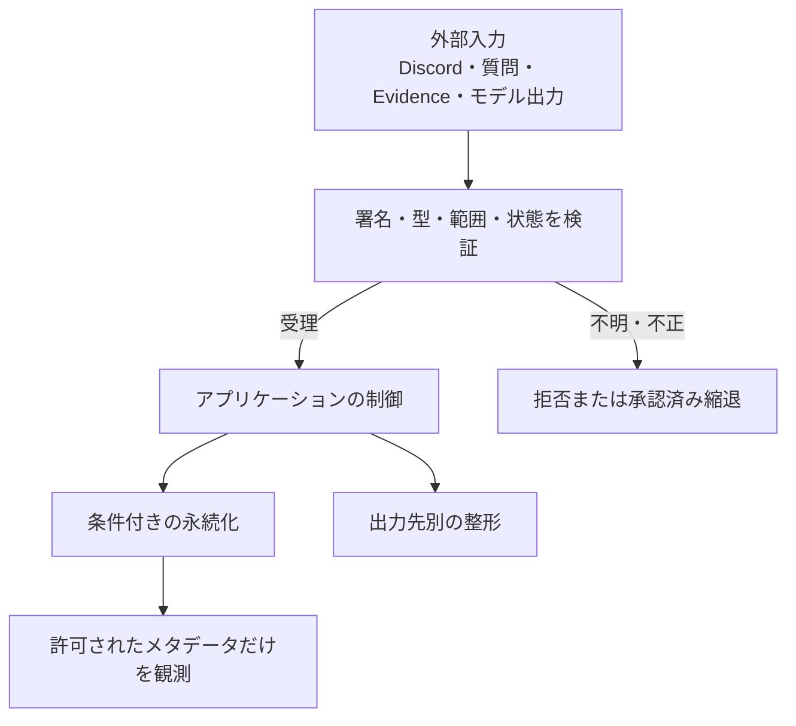

---
aliases:
  - The Shittim Chest セキュリティ詳細設計
tags: [project, shittim-chest, security, privacy, detailed-design]
status: current
created: 2026-07-16
updated: 2026-09-05
---

# セキュリティ・プライバシー詳細設計

[ドキュメント索引へ戻る](00_シッテムの箱_ドキュメント索引.md)

## この文書の役割

入力を信頼する条件、利用者ごとの認可、秘密情報と個人情報の保存・公開境界を定義する。
IAMの詳細は[AWS設計](14_AWS・CDK詳細設計.md)、配信の信頼性は
[CI/CD設計](15_GitHub・CI-CD詳細設計.md)、認証セッションは
[議事録設計](24_シッテムの箱%20議事録設計.md)を参照する。

## 1. 守るもの

| 保護対象 | 方針 |
|---|---|
| 資格情報・非公開本文 | 秘密、人格本文、質問をGit・イメージ・成果物・ログ・公開文書へ漏らさない |
| 利用者の権限 | サーバー側で本人/管理者を照合し、画面の非表示だけに頼らない |
| 受付済みの処理 | プロセス喪失、再試行、重複配送でも永続成果物や課金を重複させない |
| 討論の制御 | 勝者判定、遷移、親愛度の範囲をコードが所有する |
| 配信の同一性 | リポジトリ識別情報からソースSHA、イメージ、変更セットまで照合する |
| 規模に合った可用性 | 常時稼働の追加基盤を増やさず、明示した縮退動作で継続する |

## 2. 入力の信頼境界

| 境界 | 必須の検証 |
|---|---|
| Discord → Ingress | 時刻の鮮度、未加工本文のEd25519署名、コマンドスキーマ、重複受付 |
| Discord Gateway/REST | Bot、サーバー、チャンネル、権限、一意な送信識別子（nonce）、送信結果と履歴の照合 |
| 質問/Evidence → OpenAI | データ領域の分離、入力内命令の無効化、構造化出力 |
| OpenAI → アプリケーション | 応答状態、生成拒否、スキーマ、フェーズごとの出力規則 |
| 質問 → 親愛度評価 | コード所有の評価基準、点数操作/人格開示要求の無視、3件の一括採否 |
| アプリケーション → DynamoDB | スキーマ、サイズ、フェーズ、リース、所有権世代、トランザクション条件 |
| プロンプト書込 → Config API | 管理者、完全一致のオリジン、CSRF、冪等キー、厳密なJSON |
| ブラウザー → Memorial API | セッション本人、オリジン、CSRF、冪等キー、サイクルとアップロード情報 |
| Memorial入力 → OpenAI | 所有者、MIME、サイズ、SHA-256、画像と直近質問のデータ分離 |
| GitHub → AWS | 固定OIDC主体、ロール、SHA、署名証拠、変更セット、配信ロック |

未確認の値を正しいEvidenceや永続レコードへ昇格させない。
ただしEvidence検索は利用可能な出典がなければ空Evidenceで継続でき、帰宅挨拶は失敗時に省略できる。
これらは個別アダプターに定義した縮退動作であり、任意の検証省略を認めるものではない。

## 3. 利用者と管理者の認可

| 機能 | 認証済み利用者 | 管理者 | 非本人への公開 |
|---|---|---|---|
| 記録・ランキング・サービス状態 | 閲覧可能 | 閲覧可能 | 認証済みの公開契約内のみ |
| プロンプトの現行値・履歴 | 読み取り専用 | 閲覧可能 | 認証済み利用者に限定 |
| プロンプトの反映・復元 | 403 | 操作可能 | 不可 |
| メモリアル画像・文章・履歴・操作 | セッション本人のみ | 管理者であっても別人分へ切替不可 | 不可 |

未認証APIは401。管理者判定は登録済みDiscordユーザーIDから導出したHMACキーをサーバー側で比較する。
表示名、ユーザー名、アバター、セッション応答の`isAdmin`だけでは認可しない。
詳細は[サービス状態・プロンプト管理設計](25_サービス状態確認・プロンプト管理設計.md)を参照する。

## 4. 秘密設定の管理

- GitHub Actionsのシークレット、SSM SecureString、配信環境のシークレットを用途ごとに分ける。
  認証や復旧に必要な元のDiscord識別子は、許可したDynamoDB領域へ暗号化して保存する。
- 実行時は指定パラメーターだけを取得し、秘密値のパス列挙を許可しない。
  CDKのテンプレート生成、PR CI、文書同期は秘密値を取得しない。
- 例外、`repr`、トレース、ワークフロー出力にキー、トークン、人格、質問、非公開識別子を含めない。
  仮名化された討論IDとプロバイダー応答IDは、本文を伴わない障害相関に限って使える。
- 設定のローテーションは新バージョンを作り、検証後に参照先を変更する。
  実値を手順書、シェル履歴、文書へ転記しない。
- プロンプトは5本文とマニフェストをSecureStringとして保存し、再読込とチェックサム検証後に有効参照先を切り替える。
  未完成・破損・参照先不整合は利用不可とする。上書き禁止と5世代保持は
  [管理設計](25_サービス状態確認・プロンプト管理設計.md)に従う。
- Inspector翻訳とメモリアル生成のOpenAIキーは用途別に分離する。
  メモリアルキーを読むのはWorkerだけ。登録/配信はメタデータを確認し、環境変数やCloudFormationへ値を渡さない。

## 5. アプリケーションの保護

### 討論・親愛度・Discord出力

勝者はPythonが決定し、モデル出力の勝者指定を採用しない。
匿名投票は候補順を入れ替え、自分への投票と3票確定前の公開を拒否する。
質問、Evidence、他者の出力内の命令は上位の制御を変更できない。

親愛度の評価基準・範囲・応答態度帯はコード所有である。
質問や編集可能な人格設定からその契約を上書きさせず、評価理由を生成・保存・公開しない。
1人でも評価不能なら部分点を採用しない。

通常の討論出力は文字数、分割数、Unicode、Markdown、メンション、URL表示を検証する。
帰宅挨拶は非空、Discord上限、有効な出典1件、同一世代、メンション抑止に絞り、失敗しても停止を進める例外である。
固定免責文は表示しないが、生成拒否、コンテンツフィルター、プロバイダーの安全境界を緩和しない。

### メモリアル画像と生成処理

| 段階 | 保護 |
|---|---|
| 所有者決定 | セッションから固定。リクエストの識別子で切り替えない |
| 予約・生成・リセット | 厳密な整数の`expectedCycle`を必須とし、遅延操作は409 |
| 署名付きPOST | サーバー生成キー、許可MIME、最大サイズ、SHA-256、短い有効期間へ固定 |
| 画像検証 | JPEG/PNG/WebPの実形式、フレーム、ピクセル数、バイト数を検証し、上限内のRGB PNGへ正規化 |
| プロバイダー呼出し | 本人画像と人格画像の両方の検証が完了してから実行。画像/質問内の命令を採用しない |
| 重複防止 | 1サイクル1生成と条件付きチェックポイントで制御 |
| 完了確定 | `memorials/*`内のS3実在、PNG、サイズ、チェックサム、寸法を再検証 |

チェックポイントだけを根拠に欠落・破損した画像を公開しない。最終検証に失敗した場合は503とする。
詳細な試行回復は[メモリアルロビー設計](27_メモリアルロビー設計.md)を参照する。

## 6. データの保存・公開・ログ

| データ | 保存先・閲覧範囲 | ログ/公開成果物の扱い |
|---|---|---|
| 質問・討論出力・投票 | DynamoDB、Discord、契約に沿ったRecords | 本文を記録しない |
| 元Discord識別子と対応表 | 許可されたDynamoDB区画 | 公開文書・成果物・ログへ出さない |
| 現行親愛度プロフィール | 元DynamoDBの仮名化キー、3スコア、サイクル/解放情報 | 元の質問者IDを持たせない |
| 投影した親愛度 | Statisticsの仮名化キー、点数、リセット回数、解放メタデータ | 公開APIは内部キーを出さない |
| 討論ごとの親愛度評価 | 元DynamoDB/Archive | 評価理由なし。Archiveに元IDなし |
| メモリアル原本画像 | 非公開の一時S3 | 成功/最終失敗時に削除。1日の期限設定を併用 |
| 完成画像・思い出文 | 非公開Media S3/Statistics、本人限定 | 画像は本人用の期限付きGET。公開URL化しない |
| 生成チェックポイント | Statisticsの所有者/サイクル/状態/冪等メタデータ | 本文なしの失敗分類だけ |
| 人格・管理プロンプト本文 | 非公開SSM。認証済み閲覧APIの契約内で参照 | 本文・差分・リビジョン内容を出さない |
| プロンプト監査 | Statistics | チェックサムとリビジョンのメタデータのみ |
| キー・トークン・署名 | GitHubのシークレット/SSM/リクエスト処理中メモリ | 出力しない |
| Evidence要約・出典 | DynamoDBの内部記録 | URL・クエリー・要約をログへ出さない |
| 運用情報 | DynamoDB/CloudWatch | 許可されたコード・件数・本文なし相関情報のみ |

Responses APIでは`store=false`を指定する。
Images APIには同等の`store`パラメーターがないため、画像を含むプロバイダー側の保持や不正利用監視は
OpenAIのデータ管理契約に従う。アプリケーション側の削除を、プロバイダー側の即時削除と同一視しない。

## 7. AWS・コンテナ・脆弱性

ロールは受付、状態通知、起動調整、Admission、タスク実行/業務処理、配信計画/実行/ドリフト検査で分離する。
リソース単位に制御できないActionだけ理由を付けて`Resource: "*"`を許し、Action全体のワイルドカードは使わない。
コンテナは`root`以外のユーザー・読み取り専用ルート・tmpfs、ネットワークは受信なし・HTTPS送信のみとする。

DHIベースイメージをダイジェストで固定し、SBOM、VEX、Grype、期限付きリスク承認、Notation、
アテステーションを検証する。ECRのタグ変更禁止、拡張スキャン、世代保持、Image Admissionを維持する。
Dependabot、pip-audit、npm audit、CodeQL、Grype、シークレット検査で更新候補と脆弱性を確認する。
修正可能な高・重大の脆弱性を配信前に拒否し、修正不能な項目は検証済みVEXか対象限定・期限付き承認だけを認める。
npm監査障害の限定的な省略条件は[CI/CD設計](15_GitHub・CI-CD詳細設計.md)に従い、任意の環境変数やタイムアウトでは迂回しない。

脆弱性報告は非公開報告を入口とし、公開Issueへ資格情報、非公開本文、コード断片を転記しない。

## 公式資料確認記録

以下は設計時の確認日を保持した記録である。

| 確認日 | 対象 | 公式資料 | 設計への反映 |
|---|---|---|---|
| 2026-08-14 | AWS IAM | [IAMのベストプラクティス](https://docs.aws.amazon.com/IAM/latest/UserGuide/best-practices.html) | 短期資格情報・最小権限 |
| 2026-08-14 | SSM Parameter Store | [Parameter Store](https://docs.aws.amazon.com/systems-manager/latest/userguide/systems-manager-parameter-store.html) | SecureString・対象限定読込 |
| 2026-08-14 | ECSのセキュリティ | [ECSのセキュリティ](https://docs.aws.amazon.com/AmazonECS/latest/developerguide/security.html) | ロール・通信・コンテナ境界 |
| 2026-08-14 | OpenAIのデータ管理 | [データ管理](https://developers.openai.com/api/docs/guides/your-data) | 保存設定とプロバイダー側保持 |
| 2026-08-14 | ECR署名 | [ECR管理署名](https://docs.aws.amazon.com/AmazonECR/latest/userguide/managed-signing.html) | 署名検証 |
