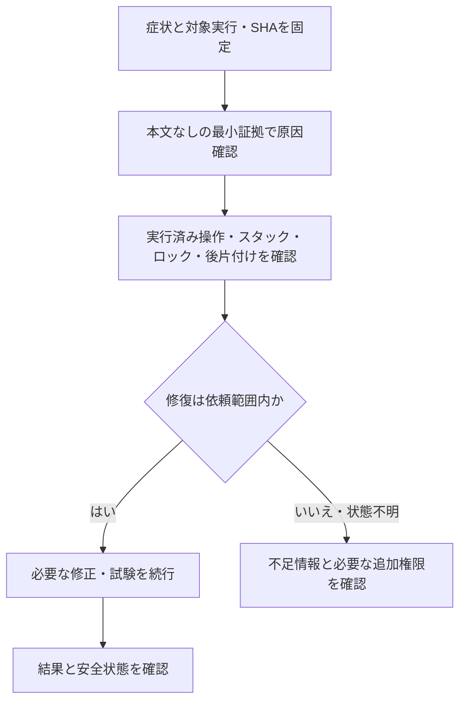

---
aliases:
  - The Shittim Chest 運用保守設計
tags: [project, shittim-chest, operations, observability, runbook, detailed-design]
status: current
created: 2026-07-16
updated: 2026-09-10
---

# 運用保守・監視・障害対応設計

[ドキュメント索引へ戻る](00_シッテムの箱_ドキュメント索引.md)

## この文書の役割

正常とみなす状態、日常確認、設定変更、障害時に調べる順番をまとめる。
配信そのものの手順は[CI/CD設計](15_GitHub・CI-CD詳細設計.md)、機能ごとの詳細は
[サービス状態・プロンプト管理](25_サービス状態確認・プロンプト管理設計.md)、
[親愛度](26_親愛度・ランキング設計.md)、[メモリアルロビー](27_メモリアルロビー設計.md)を参照する。

## 1. 正常状態を見分ける

外部向けSLAは設定しない。起動していないことを、そのまま障害と判断しない。

| 観測対象 | 平常の待機状態 | 補足 |
|---|---|---|
| CloudFormation | 対象スタックが安定状態 | Core/Recordsと配信権限を含む |
| ECS | 希望/稼働/起動待ちタスク数 = 0/0/0 | Scale-to-Zeroによる正常停止 |
| Runtime制御 | `STOPPED`、未完了作業なし | 30分の`IDLE`待機中はタスクと4 Botが稼働 |
| Bot・Runtimeメトリクス | タスク0ならオフライン/欠測を許容 | 稼働中の欠測とは区別する |
| 配信 | ロック解放済み、実行中/未実行の配信変更セットなし | 失敗時は後片付け結果も確認 |
| 生成キュー/DLQ | 通常0件 | 生成中はチェックポイントが処理状態の正本 |
| 一時アップロード | 生成完了後に削除、未使用分は期限削除の対象 | S3の1日ライフサイクルは非同期。指定時刻の即時削除を意味しない |

## 2. 観測する情報

### 配布ZIPの手動整理

リリース成功後はCore・Recordsそれぞれ3世代の配布ZIPを自動保持する。
初回整理や失敗後の再試行では、Core/Recordsリリースが実行中・承認待ちでないことを確認し、
管理済みの本番アカウント番号を`SHITTIM_EXPECTED_AWS_ACCOUNT_ID`へ設定して以下を行う。

```sh
# まず削除予定件数・容量と計画ハッシュだけを確認する。recordsも同じ手順で行う。
uv run --frozen python -m tools.prune_release_bundles \
  --account-id "$SHITTIM_EXPECTED_AWS_ACCOUNT_ID" --family core

# 上の出力のplan_sha256を指定する。途中で参照や一覧が変わっていたら停止する。
uv run --frozen python -m tools.prune_release_bundles \
  --account-id "$SHITTIM_EXPECTED_AWS_ACCOUNT_ID" --family core \
  --apply --expected-plan-sha256 <確認した計画ハッシュ>
```

各系統の整理前にdry-runをやり直す。削除は旧バージョンを含めて恒久的で、S3から取り消せない。
途中失敗時は一部だけ削除済みの場合があるため、再びdry-runで残りを確認する。
現行ZIPとその参照バージョン、他系統が参照する補助ZIP、JSONテンプレートは削除しない。
サービス状態画面の容量は日次CloudWatch値のため、整理直後には減らない場合がある。

### ログ・メトリクス・通知

- コンポーネント別ログへ本文を含まない構造化情報とEMFを出す。
  EMFは`_aws`がルートの単一JSONであり、ロガーの`message`に二重シリアライズしない。
- 質問、出力、人格、URL、検索語、Discord IDをログやメトリクスのディメンションに使わない。
- フェーズ、ハートビート、Bot準備状態、キュー、Outbox、失敗分類、Lambda、ECSを観測する。
- ダッシュボードはRuntime/ECS、受付/Outbox、Bot/ハートビート、制御失敗、CPU/メモリ、
  DynamoDB抑制、アラームをまとめる。
- 重大/警告の複合アラームとECS異常停止をSNSへ通知する。
  GitHub関連のDiscord通知は[通知運用設計](21_GitHub・Discord通知運用設計.md)の補助経路である。

### シッテムの箱Botからの手動アナウンス

利用者から告知を依頼された場合は`tools/announce_discord.py`を使う。
GitHub通知用Webhookではなく、本番のシッテムの箱Botとして通常チャンネルへ投稿する。
本文はUTF-8ファイルで受け取り、余分なタイトルや説明を付けず、DiscordのMarkdownを保つ。
本番アカウントへAWS CLIで認証してから使い、複数アカウントを扱う場合は`AWS_PROFILE`を明示する。
期待する本番アカウント番号を`SHITTIM_EXPECTED_AWS_ACCOUNT_ID`または`--expected-account-id`で指定する。
この期待値は管理済みの本番設定から確認し、その場のSTS応答をコピーして設定しない。
STSの実アカウントと一致しなければ、設定やtokenを取得する前に停止する。
Botトークン・許可チャンネルは稼働構成が参照するSSMからプロセス内だけに読み込む。
必要なAPIアクセスはSTSの本人確認、状態通知Lambdaの設定読取、
その設定が指定するRuntime/Moderator tokenのSSM読取である。
Runtimeのversionは、配信済みLambdaが参照するparameter名のversionと本文を照合する。

```sh
# 期待する本番アカウントを上記環境変数に設定し、本文をnotice.txtに用意する。
# 最初に接続先・本文の妥当性・既存投稿を確認する。まだ投稿しない。
uv run --frozen python -m tools.announce_discord \
  --message-file notice.txt --announcement-id model-update-20260910

# 同じ内容を送信する。メンション通知は無効、送信後に本文と投稿者を再確認する。
uv run --frozen python -m tools.announce_discord \
  --message-file notice.txt --announcement-id model-update-20260910 --send
```

- BotであることとModerator Application IDを別々に確認する。BotのユーザーIDとApplication IDが
  同一であるとは仮定しない。
- 許可チャンネルのID・Guild・種類（通常テキストまたはアナウンス）を検証する。
  複数ある場合は`--channel-name`で1つを選び、候補が0件・複数件なら停止する。
  スレッドや許可外の投稿先は指定できない。
- 本文は空白のみを禁止し、Discordの上限に合わせて2,000 UTF-16コード単位以内とする。
  本文・token・元のIDはログやGitへ保存しない。本文ファイルはGit管理外に置き、使用後は運用者が片付ける。
- 同じ告知の再確認には同じ`--announcement-id`を使う。別の告知には新しいIDを使う。
  確認のみの実行でも直近100投稿を取得し、Bot自身のnonce・本文・旧Embedのタイトルと説明文を照合する。
  同じnonceで内容が異なる場合は競合として停止する。他Botの同じ本文は投稿済み扱いしない。
  旧Embedのタイトルは重複検出専用であり、新規投稿には付けない。
  別の旧告知を確認する場合は`--legacy-embed-title`で明示する。
- 二重送信対策は、直近履歴の照合、Discordの`nonce`と`enforce_nonce`、ローカルの排他的な試行記録を併用する。
  Discord側のnonce照合は短期間のため、永続的な記録の代わりにはしない。
  記録は利用者ホーム配下の`.local/state/shittim-chest/announcements`にハッシュだけを保存する。
  ファイル名は告知ID由来の`<nonce>.attempt`、内容はBot・投稿先・本文のfingerprintとし、
  送信前に排他的作成・ディスク同期を行う。別告知の送信を固定ファイル名で妨げない。
  以前の使い捨てスクリプトの`send.attempt`は、この共通ツールへ自動移行・削除しない。
  実行端末を変える場合は同じ記録を引き継ぐ。端末間での永久的な重複排除を保証する仕組みではない。
- 通信失敗で送信結果が不明な場合は自動再送しない。Discord側を確認し、未送信と確定するまで
  試行記録を消したり新しい告知IDで再実行したりしない。
- 投稿後はGETで再取得し、投稿ID・投稿先・投稿者・本文・Embedなしを検証してから成功とする。
  URLを含む告知で自動プレビューが付いた場合も検証失敗となるため、投稿を確認し、再送しない。
- 結果はJSONで返す。`ready`（確認済み・未送信）、`already_posted`（既存投稿あり）、
  `posted_and_verified`（投稿後検証済み）は標準出力、`stopped`と固定の`category`は標準エラーへ出す。
  本文・API応答・例外の詳細は出力しない。SDKのデバッグログは復号値を含み得るため、
  CLI処理中はloggingを抑止し、終了時に元の設定へ戻す。
- このツールは手動告知用であり、リリース成功を理由に自動投稿しない。確認だけなら`--send`を付けない。

### Webの「サービス状態確認」

認証済み利用者向けの補助表示であり、AWS操作画面ではない。
許可済みリソースのAPI/CloudWatch情報を60秒キャッシュし、期限前は前回値を返す。
期限後は明示的な更新で再取得する。一部障害で正常なサービス情報まで消さない。

| 状態 | 読み方 | 最初に行うこと |
|---|---|---|
| 正常/IDLE | 取得済みの条件を満たす | 停止が想定どおりか確認 |
| 注意/異常 | 取得した値が警告・異常条件に該当 | 該当アラームや関数、未処理件数を確認 |
| 未確認/部分取得 | 一部または全部の値を取得できなかった | 対象サービスと安定した失敗コードを確認 |
| 古い情報 | キャッシュの有効期間を超過 | 取得日時を確認して更新 |

確認対象はECS、ECR、Inspector、S3、DynamoDB、Lambda、CloudFront、SQS、API Gateway、
EventBridge/Scheduler、CloudFormation、SNS、Signer、Parameter Store、費用管理、外部集計である。
状態表示から配信、関数呼出し、タスク停止、DLQ削除、ドリフト検査開始、シークレット復号、予算変更は行わない。

ECRはタグ付きイメージ単位の一覧、Inspectorは同じイメージ単位の重大度集計を表示する。
重大・高の詳細はCVEと対象パッケージ/バージョン、日本語概要へ限定する。
翻訳Lambdaだけが説明原文を一時取得し、100〜300文字の概要へ変換する。
原文を保存せず、ハッシュと日本語概要をStatisticsへキャッシュする。未翻訳は「翻訳準備中」とし、取得失敗と区別する。

親愛度とメモリアルの状態は既存DynamoDB/Lambda/SQS等のカードに含める。
利用者、サイクル、画像キー、キューメッセージ本文は返さない。

## 3. 定期確認

| タイミング | 確認内容 |
|---|---|
| PRごと | 必須CI、CodeQL、レビュー、スカッシュマージ |
| 配信ごと | 計画の証拠、承認、配信、構造スモーク、後片付け |
| 配信後の受入を依頼されたとき | 指定された範囲の実操作を最小件数で確認 |
| 毎日 | セキュリティ通知の結果。GitHubを最終判断に使う |
| 毎週 | Core 5/Records 3スタックのドリフト、依存一覧、固定ツール更新候補 |
| 毎月または警告時 | 予算、費用異常、脆弱性、ログ量 |
| ローテーション時 | 新設定の検証、参照先変更、旧設定の失効 |

CI/配信は1つの監視処理で原則60秒以上の間隔で終端まで確認し、変化のない報告を繰り返さない。

## 4. 非公開設定を登録・変更する

### 登録ツール

まず`--check`で値を復号しないメタデータ確認を行う。
登録が依頼範囲に含まれる場合だけ、同じツールを`--check`なしで実行する。
既に許可された操作について、工程ごとに許可を求め直す必要はない。

| 用途 | ツール | 入力・検証 |
|---|---|---|
| 本番共通設定 | `tools/configure_production_inputs.py` | 非表示入力、必要設定とバージョン移行を検証 |
| プロンプト管理者 | `tools/configure_records_admin_input.py` | Discord IDの2回照合、上書き拒否、アカウント紐付け |
| Inspector翻訳キー | `tools/configure_records_inspector_translation.py` | キーの2回照合、上書き拒否、SecureString情報確認 |
| メモリアル生成キー | `tools/configure_records_memorial.py` | キーの2回照合、上書き拒否、アカウント/バージョン確認 |

```sh
# 読み取り確認の例。値そのものは表示しない。
uv run --frozen python tools/configure_production_inputs.py --check
uv run --frozen python tools/configure_records_admin_input.py --check
uv run --frozen python tools/configure_records_inspector_translation.py --check
uv run --frozen python tools/configure_records_memorial.py --check
```

ツールが扱う本文や元の識別子を手順書、シェル履歴、GitHub、成果物へ転記しない。
移行に旧設定を読む場合も、表示・ログ出力・ローカル保存しない。

### プロンプトの更新

管理者が「プロンプト管理」で下書き、システム差分、バイト数を確認して「変更を反映」する。
新リビジョンを完全保存・再検証してから有効参照先を切り替え、復元時も新リビジョンを作る。
初回配信は管理リビジョンを作らず、「現在の設定を管理版として登録」を別の管理操作として行う。

| 保存・稼働状態 | 表示と挙動 |
|---|---|
| 有効参照先が未登録 | 既存のバージョン付き設定を継続 |
| 有効参照先が登録済みだが不完全/不正 | 次タスクの読込を拒否。手動で参照先を改変しない |
| 保存済み、タスク停止中 | 「次回task待ち」 |
| 旧リビジョンのタスク稼働中 | 「自然停止待ち」 |
| 稼働タスクと有効リビジョンが一致 | 「適用済み」 |

タスクは起動時に1リビジョンだけを読み、稼働中に再読込しない。
反映のために進行中の討論やタスクを強制停止しない。

## 5. 障害対応の順番



対象コンポーネント、失敗段階、安定したエラーコードから直接原因を絞る。
不要に全PRや過去の実行履歴の再監査へ広げず、本文や秘密値を取らない。
外部書込の副作用、ECS件数、永続作業、変更セット、ロックを確認する前に、同じワークフローや配送を重複実行しない。
原因修正と安全確認が依頼内なら続行する。新たな破壊操作や手動配信など、範囲外の操作だけを確認対象にする。

### 初回スタック作成が失敗した場合

`ROLLBACK_COMPLETE`のRecordsApplicationは通常配信で再利用できない。
ロールバック後に残った空のスタックの削除は独立した破壊操作として対象と許可を確認する。
削除後はスタック不存在、対象の空ロググループ不存在、有効な変更セット0件、配信ロック解放を確認してから再配信する。
配信ワークフローが暗黙に空スタックを削除したり、その存在を正常な変更不要状態として扱ったりしない。

## 6. 症状別の確認先

| 症状 | 最初に見る証拠 | 対応の境界 |
|---|---|---|
| 受付応答なし | Ingress分類、受付の永続化有無 | 受付済みなら重複依頼を防ぐ |
| `STARTING`が長い | Reconciler、ECSイベント、Admission | 終端期限とタスク数を確認 |
| フェーズが進まない | 生成チェックポイント、リース、Outbox | 古い所有権を手動上書きしない |
| Discord投稿がない | 操作順、送信識別子、試行数、失敗分類 | 履歴照合と重複防止を維持 |
| Outbox滞留アラーム | 未送信件数、最古時刻、EMF取得日時 | 最新値・欠測と実際の滞留を分ける |
| Evidence取得不能 | 検索状態、プロバイダー失敗分類 | 定義済みの失敗なら空Evidenceで継続 |
| 帰宅挨拶なし | 生成/出典/送信分類 | 失敗時も停止を継続し、本文をログ取得しない |
| 配信計画失敗 | 失敗した処理、変更セット、ロック、後片付け | 副作用確認前に再実行しない |
| 配信実行失敗 | CloudFormationイベント、構造スモーク | 後片付け成功で元の失敗を上書きしない |
| プロンプト読込失敗 | 検証分類、有効参照先の有無、タスク状態 | 現行タスクを保護し、検証済みの更新経路で回復 |
| サービス状態が部分取得 | 対象サービス、キャッシュ経過、失敗コード | 正常情報を残して対象だけを再確認 |
| 親愛度がWebへ反映されない | Projector失敗分類、DLQ件数、ランキング更新時刻 | 元評価・投影・集計のどこで止まったか分ける |
| メモリアル生成停止 | チェックポイント状態、キュー/DLQ、Worker分類 | 有料再試行可否と完了確定のみの回復を区別 |
| 一時写真が残る | 終端状態、オブジェクト経過、ライフサイクル | 原本を閲覧せず、後片付けと期限削除の収束を確認 |

キューメッセージの削除、手動再投入、実画像の参照、Discord/OpenAIへの試験呼出しは、調査だけでは許可されない。
必要な場合は対象と影響を特定し、既存の依頼で許可されているか判断する。

## 7. 自然停止・復旧・訓練

全討論、Outbox、状態通知、リースが解消された時刻を`idle_since`とする。
停止予定の約5分前に帰宅挨拶を生成・送信し、同じ世代の`IDLE`であることを再確認する。
OpenAI/Discordそれぞれ最大2回で打ち切り、失敗しても約30分後の停止を妨げない。
SIGTERMでは新規受付を閉じ、進行状態を保存し、子タスクと通信クライアントを期限付きで終了する。
シャットダウン中に帰宅挨拶を始めない。

復旧と訓練は次を守る。

- DynamoDB PITRは別テーブルへ復元して検証し、切替を個別に計画する。現行テーブルへ上書きしない。
- ECS Exec用特権タスクは作らず、ログ・メトリクス・ECSイベント・永続状態を調べ、署名済み通常イメージで復旧する。
- トークン交換は新旧の重複期間を短くし、4 Botの識別情報をまとめて確認する。
- ドリフト検査はCore 5/Records 3スタックの差分を検出するだけで、自動修復しない。
- サービス状態画面に運用操作を追加しない。プロンプト更新は独立したConfig APIの責務とする。

PITR復元やトークン交換の実機訓練は通常受入から分離し、実施した範囲と未実施を
[検証記録](20_実装・試験・検証記録.md)へ記録する。

## 公式資料確認記録

以下は設計時の確認日を保持した記録である。

| 確認日 | 対象 | 公式資料 | 設計への反映 |
|---|---|---|---|
| 2026-08-14 | CloudWatchアラーム | [アラーム通知](https://docs.aws.amazon.com/AmazonCloudWatch/latest/monitoring/AlarmThatSendsEmail.html) | 欠測・通知 |
| 2026-08-14 | CloudWatch EMF | [埋め込みメトリクス](https://docs.aws.amazon.com/AmazonCloudWatch/latest/monitoring/CloudWatch_Embedded_Metric_Format.html) | 本文なしメトリクス |
| 2026-08-14 | ECSタスクイベント | [タスクイベント](https://docs.aws.amazon.com/AmazonECS/latest/developerguide/ecs_task_events.html) | 異常停止の診断 |
| 2026-08-14 | DynamoDB PITR | [ポイントインタイムリカバリ](https://docs.aws.amazon.com/amazondynamodb/latest/developerguide/Point-in-time-recovery.html) | 既存データを壊さない復元 |
| 2026-08-14 | CloudFormationドリフト | [ドリフト検出](https://docs.aws.amazon.com/AWSCloudFormation/latest/UserGuide/using-cfn-stack-drift.html) | 週次の差分検出 |
