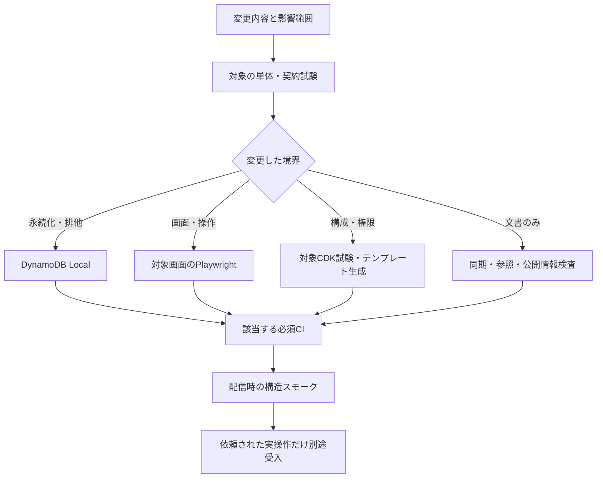

---
aliases:
  - The Shittim Chest 試験設計
tags: [project, shittim-chest, test, quality, detailed-design]
status: current
created: 2026-07-16
updated: 2026-09-07
---

# 試験・品質保証設計

[ドキュメント索引へ戻る](00_シッテムの箱_ドキュメント索引.md)

## この文書の役割

変更に応じて選ぶ検証と、失うと実害がある回帰試験を定義する。
機能の仕様そのものは各設計書、CIの実行条件は[CI/CD設計](15_GitHub・CI-CD詳細設計.md)、
実施結果は[検証記録](20_実装・試験・検証記録.md)に分ける。

## 1. 必要十分な試験方針

友人同士で使う個人開発アプリとして、利用不能、権限漏れ、重複課金、データ破損を防ぐ試験を優先する。
行数、件数、網羅率の数値目標や装飾の全組合せを維持することは目的にしない。

- ドメイン層とアプリケーション層は外部SDKなしで再現可能に試験する。
- 外部境界は要求・応答形式、失敗分類、再試行条件を契約試験で確認する。
- 時刻、乱数、ID、再試行、プロセス喪失を試験用の共通準備処理で制御し、失敗を隠すための再実行はしない。
- PR CIへ本番資格情報、実質問、人格本文、実Discord/OpenAI書込を持ち込まない。試験には合成データを使う。
- 一度成功した検証は、新しい変更や懸念がなければ繰り返さない。ローカルの対象試験と必須CIの範囲は分ける。
- 網羅率は未確認箇所の調査に必要な場合だけ`--cov`で取得し、合否条件にしない。

## 2. 変更別の検証マップ

| 層・変更 | 主に確かめるもの | 入口 |
|---|---|---|
| ドメイン | 状態遷移、投票、同点処理、親愛度、識別子の性質 | `tests/unit/` |
| アプリケーション | 生成復旧、Outbox順序、取消、親愛度一括反映、自然停止 | `tests/unit/`、`tests/integration/` |
| Discord/OpenAI/AWS | 署名、入力出力形式、失敗分類、タイムアウト、再試行 | `tests/contract/` |
| DynamoDB | スキーマ互換、サイズ、条件付き更新、排他、ページング | `tests/integration/dynamodb/` |
| Records | 認証、公開契約、投影、集計、管理、メモリアル | `services/records/tests/` |
| Web | 通常操作、認可表示、キーボード、はみ出し、アクセシビリティ | `apps/records-web/`の試験設定 |
| CDK | リソース、権限、保持、置換、認証不要のテンプレート生成 | `infra/test/` |
| 供給網 | ロックファイル、監査、SBOM、VEX、署名、成果物照合 | `tests/unit/tools/`、ワークフロー |
| 文書 | 正本とのバイト一致、リンク、公式確認記録、公開禁止情報、ライセンス | `tools/sync_docs.py`、`tools/check_docs.py`、`tools/check_public_surface.py` |

Pythonは対象プロジェクトで`uv run --frozen`を使い、関連するRuff、ty、import-linter、pytestを選ぶ。
DynamoDB Localはダイジェスト固定の公式コンテナをループバック接続で起動し、本番資格情報を使わない。
共通インフラの型・Vitest・監査はCIの`cdk`で1回、Records固有のテンプレート生成は`records-infra`で行う。

### 試験コードを保守しやすくする

| 残すもの | 重ねないもの |
|---|---|
| 振る舞い・境界・再発防止の期待値 | 実装や生成スキーマを逐語的に写した検査 |
| 権限・整合性・課金後復旧の異なる失敗条件 | 同じ正常完走を検査項目ごとに繰り返す試験 |
| キーボード、はみ出し、重要表示、代表画面の比較 | 装飾だけのスナップショット、CSS固定値やブラウザー対応の再検査 |
| ケース別の小さな準備処理、名前付きパラメーター | 行数だけを減らす分割、試験省略、汎用試験基盤 |
| 実際のトランザクションと検証器による判定 | 期待値の計算やトランザクション自体を補助関数・代用品へ隠す構造 |

読み取り専用CDKテンプレートは同じ試験群内で共有し、生成を反復しない。
生成契約は再生成の一致、参照解決、不正入力の拒否を確認する。
ランキング計算・順位・ハート数の境界は単体試験、E2Eは代表表示と操作に絞る。
読込中などの表示を単体試験で確認した場合、同じ組合せをE2Eでも網羅しない。
実在しない文字列の非含有や、要件にない画像のバイト一致を合否にしない。

## 3. Coreで守る回帰境界

### 受付・状態・生成

| 対象 | 必須ケース |
|---|---|
| 署名/コマンド | 未加工本文以外、期限切れ時刻、不明コマンドの拒否 |
| 受付の一意性 | 同一Interactionの重複で討論を増やさない。後続依頼が先行討論の状態/試行IDを変えない |
| キューと表示 | 上限20件、警告3分、終端15分。スレッドとチャンネル状態が完了/失敗/取消へ収束 |
| 生成の復旧 | 呼出し前、応答後保存前、保存後、2回目の結果不明で停止しても同じ出力の永続化は1件 |
| Evidence | 検索なし/成功/出典欠落/未知出典/429/認証/スキーマ不正。既知の検索失敗は空Evidenceで継続 |
| 入力の分離 | 個別参加者のWeb検索0件。参加者名簿は対象フェーズだけに入り、投票・帰宅挨拶へ他者人格を渡さない |
| 期限 | 通常の論理生成フェーズ120秒、試行作成から600秒。途中投稿・自動復旧で延長せず、個別期限と全体期限を区別する |
| Runtimeプロセス | 4体のBotの準備完了、再開、ヘルス、SIGTERM、子処理/クライアントの期限付き終了 |

### 人格別の判断基準・候補

本番用v2の確認はSDK契約・進行・永続化の境界へ絞る。固定回答・不明分類のスキップ、
先頭の分散、同じ結論の維持、更新済みの他者案の引渡し、実際のEvidence・親愛度、
完了前の下書き非公開を確認する。分類・探索・選択・改稿での失敗から再開し、
保存済み結果を再生成しないこと、後継リースでの呼出上限、同時刻の古い進捗による
上書き拒否を確認する。実質問の有料再比較は通常CIや組込み確認には追加しない。

- 本人の設定だけを準備段階へ渡し、初回意見・最終案・投票へ必要な内部情報だけを引き継ぐ。
- 同じ候補の選択、候補1件、一部失敗からの成功済み結果再利用、既存試行の従来フローを確認する。
- DynamoDB Localで内部出力とチェックポイントの同時保存・古い書き手の拒否を確認する。
- 内部情報を増やしても公開Archiveと内容ハッシュが変わらず、Discordやログへ漏れないことを確認する。
- 不完全な本文を解析する前に終了状態を確認し、準備の出力上限時だけ上限2倍・再生成1回とする。
  再失敗・フィルター・不明な未完了で停止することと、既存の発言工程へ再生成を広げないことを確認する。

`tools/evaluate_deliberation.py`は実際の完了記録から質問・完了日時だけを読み取る独立した有料比較である。
`--catalog`では本文を出さず、分類ラベル・日付・選択肢数を表示する。ラベルは選定補助であり、
意見の一致や品質を機械的に判定するものではない。
比較は`--live`、`--baseline-ref`、`--history-table`と、事前選定した質問1〜6件の索引を
`--different`・`--similar`へ指定して実施する。一方の分類だけの指定も許可する。
通常の6件比較では各3件とし、利用者が対象を限定した場合はその範囲だけを実行する。
成功結果を見て質問を差し替えない。
通常モードは同一の有効人格・モデル・親愛度500・空Evidenceで初回意見と最終案を新旧生成する。
人格本文だけを比較するときは`--before-revision`・`--after-revision`へ異なる管理リビジョンを指定する。
両方を明示し、同一の`--baseline-ref`の共通指示・従来フローを使用する。システムプロンプトが異なる場合は
比較を開始しない。新しい判断準備2工程を混ぜず、人格変更の影響とフロー変更の影響を切り分ける。
人格変更と追加ロジックを組み合わせる比較では、両リビジョンに加えて`--combined`を指定する。
変更前は旧人格・従来フロー、変更後は新人格・判断準備・候補選択を含む現在のロジックで生成する。
人格だけの比較と混同しないよう、モードと変更後の準備工程の有効状態を出力する。
質問・人格・元の生成本文・APIキーはメモリ内だけに保持し、投稿、親愛度更新、SSM更新はしない。
通常CIやRelease smokeから実行せず、通常・組合せモードは1問あたり18生成要求と1件の比較要約、
必要時の限定再生成が課金対象となる。人格だけのリビジョン比較は1問あたり12生成要求と1件の比較要約であり、
設定の保存操作とは独立して実行する。
比較要約には人格本文を渡さず、公開回答の選択内容・初回から最終への変化だけを短く要約する。
モデルによる観察であって客観的な品質採点ではない。自然な一致を失敗扱いせず、選択の違いと理由の違いを分ける。
失敗時も工程・終了理由・使用量だけを出し、失敗応答分も要求数・トークン集計に含める。
開始済みの並列要求が終了してから中止し、未実施分や親愛度・検索・投票・配送を含む本番全体の検証と混同しない。
少数例で差が確認できない場合や対象外の品質に懸念がある場合は、改善成功として配信しない。

#### 重複判定・限定再考の比較実験

`tools/evaluate_overlap.py`は本番の状態遷移へ組み込まない独立した比較ツールである。
同じ管理人格・モデル・親愛度500・空Evidenceで判断準備、候補選択、初回意見を1回だけ生成し、
同じ初回意見から「そのまま最終案」と「重複判定・必要時の再考を経て最終案」を比較する。

- 判定は全3組について、主案・行動・重要条件・立場を比較し、実質的重複、相違、
  結論は同じだが立場が異なる、不明に分ける。口調の違いや副案の一致だけで判定しない。
- 選択・相談に分類され、実質的重複がある人格だけを最大1回、並列に再考させる。
  固定回答・その他・分類不明では再考しない。未知の人格や組の重複・欠落を受理しない。
  `--reconsider-shared-conclusions`を指定した実験では、条件・立場に差があっても主結論が同じ組を
  再考対象に含める。分類基準・人格・候補生成・再考の指示は変えず、入口の条件だけを比較する。
  この指定でも固定回答・その他・分類不明は対象外で、自然な一致を変更する義務はない。
- 再考は本人の既存候補から、同程度に好ましい別案がある場合だけ選び直す。
  別案なしなら元の候補・初回意見をそのまま保持する。新しい嗜好の創作、強制的な反対、
  他人格の候補の割当は行わない。並列の選び直しが再び重なる可能性は許容し、再考ループは作らない。
- 選び直した候補と初回意見を揃えて最終案へ渡す。全員が維持した場合は最終生成を共有し、
  同一入力を無用に再生成しない。その場合の結果一致は構造上の再利用であって改善効果ではない。
- 対象は事前指定した1〜6件。実記録は本文非表示の分類情報で選び、追加の合成例題は標準入力から
  メモリ内に読み込む。元の質問、人格、内部の判断準備・候補、生成本文をファイルへ保存しない。
  合成例題だけの実行では実記録を取得しない。同一例を複数回比較するときは実行前に回数を決める。
- 要約には公開回答だけを渡し、最終案の全3組も判定する。モデルによる要約・分類であり、人による品質採点ではない。
  候補番号の変更と、回答の意味・主方針の変更は別々に扱う。番号変更だけで重複低減の成功と判定しない。
  所要時間は共通生成時間と各分岐の実測時間を合算し、要約時間を除く。実際の本番全体の待ち時間とは区別する。
- `--diagnose`は候補の主方針と初回・再考後・最終発言をメモリ内で照合する追加1要求である。
  人格本文・判断準備・候補の適合理由は渡さず、候補間の実質的な違い、選択候補への発言の追従を
  カテゴリだけで返す。原文・理由を保存せず、この診断もモデルの観察として扱う。

判定1要求と対象人格あたり1要求が追加処理に当たる。比較用のもう一方の最終案・要約を含め、
1例あたり通常14〜20要求、工程診断付きでは15〜21要求となる。
既存の準備上限に達した場合だけ限定再生成が発生する。
この実験では本番のプロンプト、議論状態、親愛度、Discord、AWSリソースを更新しない。

#### 判断準備の有無を比較する選択工程の切り分け

`tools/evaluate_preference_ablation.py`は、候補を事前固定して、旧人格から直接選ぶAと、
同じ人格で判断準備を生成してから選ぶBを比較する。本番フローの再現ではなく、
判断準備の有無による選択の違いだけを調べる実験である。

- 質問・3〜6個の候補を標準入力からメモリ内へ読み込み、全人格とA/Bへ同じ候補を渡す。
  候補の自由生成、初回・最終発言、重複判定・再考、投票・winner判定は行わない。
- 選択要求は同じ指示・モデル・生成設定を使い、Bだけに本人の判断準備データを付ける。
  他人格の設定・判断・回答は参加者へ渡さない。各人格が全候補を順位付けし、先頭を選択結果とする。
  重複・欠落・候補範囲外の順位は受理しない。
- 1〜3題材を実行前に決め、各2回だけ試行する。2回目は候補提示順を逆転し、
  A/Bの実行順も交互にする。A/B間の提示順は常に同じだが、全順列を網羅した評価ではない。
- 人格への適合は独立した観察要求に匿名のA/B選択と各人格設定を渡し、
  明確な好み・価値観による支持、矛盾しない一般案、明確な矛盾、不明のカテゴリで返す。
  判断準備は観察要求へ渡さず、同じ選択への分類不一致を受理しない。
  人格の原文や理由は出力せず、モデル観察と人による品質評価を区別する。
- 出力は題材、試行番号、提示・実行順、候補IDの順位、先頭候補の種類数、適合カテゴリ、
  時間・使用量だけとする。質問、人格、内部判断・候補本文はGit・log・artifactに残さない。
- 通常は各試行10要求（準備3、選択6、観察1）、各題材20要求。
  準備の既存上限に達した場合だけ限定再生成が発生する。時間はAが選択、Bが準備＋選択で、観察を除く。
  本番の人格・SSM・AWSリソース・議論状態・親愛度を変更せず、Discord投稿もしない。

選択が分かれたことだけを改善とせず、人格との矛盾、同じ人格の試行間変動も確認する。
少数の固定候補で差がなければ判断準備の一般的な有効性・不要性を断定せず、
自然文の発言品質や最終案への効果が未検証であることを記録する。

#### 初回・最終発言まで含めた品質比較

`tools/evaluate_speech_quality.py`は判断準備ありと、判断準備なし・候補選択ありの2経路で
自由な候補生成・初回意見・最終案を実行する。固定候補の対照実験とは異なる。
同一revision、同一モデル、親愛度500、空Evidenceを使い、実行順を交互にする。
公開発言と人格設定をモデルに渡して比較し、同じ出力を左右逆順でも観察する。
質問・人格・内部候補・生成全文は保存せず、公開立場の短い言い換えとカテゴリだけを出力する。

評価軸は質問への回答、人格との明確な矛盾、本人の立場が最終案へ残ること、
無理な反対や一般案への追随である。意見の違いを語調の違いと分け、自然な一致は許容する。
丁寧さ・長さ・無条件な親切さを品質の代用にしない。モデル観察だけで自動的な品質認定をしない。
優劣の一致は`preference_agrees`、順序を戻して照合した評価項目の不一致は`assessment_disagreements`へ
分けて出力する。`stable_observation`は両方が一致した場合だけ真とし、品質認定とは区別する。
例えば両観察とも同等でも、人格矛盾の有無が変われば安定した観察とは扱わない。
通常23要求（判断準備あり12、なし9、順序を反転した観察2）に、既存の限定再生成が加わる場合がある。
`--spontaneous`では比較対象の候補選択も省き、人格から直接初回意見を作る。
同じ判断準備あり方式と比較し、最終要求では本人の初回意見を明示して渡す。
この場合は通常20要求（判断準備あり12、直接発言6、観察2）で、生成・評価のモデルと基準は変えない。

`--coordinate`は同じ判断準備・候補を共有して比較する。主提案の重複を分類した後、
他人の候補を見せず、各人格に第一候補と同程度に選びたい自分の別案だけを承認させる。
Pythonは承認済み候補だけから主提案の種類を増やし、同数なら変更人数・順位移動を最小にする。
分類出力は候補IDの配列を再生成させず、入力の候補数に応じた必須フィールドで受け取る。
スキーマには固定の候補位置と分類番号だけを含め、質問や本文を含めない。
欠落・余分なフィールド・範囲外の分類番号は構造化出力の検証で拒否する。
固定回答、不明な分類、既に3種類に分かれている場合は元の選択を維持する。
選択が変わらなければ発言を再生成せず、同じ発言を比較側へ再利用する。
通常15〜24要求に既存の限定再生成が加わり、未承認候補の選択禁止と共有候補の引渡しを試験する。
これは比較専用であり、永続化・本番経路には組み込まない。

開発比較は合成の仕事・夕飯・休日の3題を先に固定する。次段階へ進める条件は、
質問への回答を損なわず人格の立場を最終案まで保ち、2題以上で観察順を反転しても改善判定が一致すること。
満たした場合も未調整題材と固定回答・創作等の退行確認を行い、回答内容の確認を含めて採用を判断する。
満たさなければ単に試行を重ねて良い結果だけを採らず、失敗箇所を記録して変更仮説を見直す。
アプリケーション経路の切替・本番配信・人格変更はこの実験に含めない。

`--baseline-commit`は指定した配信済みコミットのプロンプトモジュールを読み込み、
共通指示を含む未リリース改修全体と比較する別モードとする。
同一人格revision・モデル・発言予算・親愛度・Evidenceを維持し、比較元コミットを出力する。
初回3・最終3要求の配信版と、準備を含む12要求の改修版を比較し、観察2要求を加える。
配信版コードとの比較であり、Discord・事前調査等を含む本番全体の再現とは呼ばない。
既存の未リリース案同士の比較や、その不採用結果と混ぜず、同じ品質基準を適用する。

### 親愛度評価と応答

- 人格別3要求、`-100/0/+100`、上下限、初期値500、固定人格順、上限反映後の実増減を確認する。
- 点数指定、評価基準変更、人格開示要求を命令にしない。単なる意見の相違を自動減点しない。
- 1件失敗時の全変更破棄、同じ評価値でのCAS再試行、同じ討論の二重加算防止を確認する。
  反映後の失敗/取消でもプロフィールを維持することをDynamoDB Localで確認する。
- 5段階の態度は初回意見・最終案・勝者の発表文だけに適用する。
  投票、Evidence、モデレーター処理、Pythonの勝者判定へ影響させない。

### Discord配送と帰宅挨拶

| 対象 | 必須ケース |
|---|---|
| 順序・重複 | フェーズ/人格/分割ごとの送信識別子は22文字で一意。429、タイムアウト、送信済み保存の競合でも後続が追い越さない |
| 送信後の保存失敗 | POST成功直後の`TransactionConflict`/結果不明で、同じメッセージID・確定時刻の`SENT`保存だけを再試行。POSTは1回 |
| 投票 | 3票確定前の公開0件。確定後は表示名と投票先を公開 |
| 終端失敗 | 権限、削除/ロックされたスレッド、内容不一致、期限により、上限内で失敗確定 |
| Discord制限 | `max_ratelimit_timeout=300`、文字数、画面部品数/操作数の上限 |
| 親愛度投稿 | 元チャンネルへ独立投稿。質問者、人格アイコン、10ハート、変更後点、実増減、評価不能を表示 |
| 配送先の固定 | 別スレッド/サーバー/チャンネル/保存状態の不一致を拒否。履歴照合と再試行で二重投稿しない |
| 帰宅挨拶の時刻 | 待機開始25分未満は送信0、停止約5分前に1件。新規作業、世代変更、待機解除、SIGTERMで送信しない |
| 帰宅挨拶の縮退 | 天気/当日ニュース要求と出典契約、OpenAI/Discord各最大2回。失敗しても30分停止を妨げない |

親愛度上限の例は`1000点（+13）`を含める。
帰宅挨拶の内容反映は必要な実機表示で確認し、話題が欠けることだけで配送を拒否しない。
テレメトリーに本文、URL、検索語、人格、チャンネルIDを含めない。

## 4. Recordsと管理機能の回帰境界

### プロンプトとサービス状態

| 対象 | 必須ケース |
|---|---|
| Runtime読込 | 有効参照先が未登録なら既存設定、登録後はマニフェスト/5本文/チェックサム一致。欠落・不正は拒否 |
| 入力 | LF/NFC、空白、多バイトの3,499/3,500/3,501バイト、Crockford形式のリビジョン、システム確認 |
| 更新・復元 | 初回登録、通常更新、復元から新リビジョン、同一内容拒否、基準リビジョンの競合、冪等キーの同一再試行/不正再利用 |
| 原子的切替 | SSM途中失敗、参照先切替の直前/直後、監査失敗の回復。不完全リビジョンを有効化しない |
| 保持 | 使用中を含む5世代、未使用分だけの期限削除、削除途中からの再開、使用中の保護 |
| 認証・認可 | 全APIの匿名401、一般利用者の状態/現行/履歴参照200、反映/復元403。名前/画像一致で管理者化しない |
| HTTP | 5プロンプト経路、余分/重複クエリー、64 KiB本文、base64、オリジン、CSRF、冪等キー、404/409/503、`no-store` |
| Web | 5タブ、バイト数表示、差分/確認、初回登録、履歴遅延取得、復元、競合時の下書き保持と明示的な基準更新 |
| 分離 | 本文のブラウザーストレージ保存なし。状態取得失敗でも編集継続。Config/Statusの別ロール/エイリアス |
| 負荷 | 予約同時実行数2。GETの429/503だけ250〜500 ms後に1回、POST自動再試行なし、取得中の更新重複なし |

状態APIは各サービス応答の欠落、ページング、個別障害、60秒キャッシュ、明示更新、正常な0/0/0を確認する。
AWS操作、任意関数の呼出し、復号、メッセージ受信、ドリフト開始の権限を持たせない。
SQS本文、SSM値、予算金額、通知先、内部カーソル、リソース識別子、Discord情報を公開応答へ含めない。

ECR/Inspectorでは複数タグ、タグなし成果物の除外、イメージ単位集計、低/未分類の補助集計、
重大/高のパッケージ詳細、スキャン対象情報の欠落、総数不整合を確認する。
重大度を色だけに依存せず識別でき、CVE・検出版・修正版候補をキーボードと読み上げで確認できることを確かめる。

Inspector翻訳は正規化/ハッシュ、1回最大50件・10件単位、100〜300文字、構造化出力を確認する。
同一原文の再翻訳を防ぎ、原文・キー・検出結果のARNを保存しない。
SSM/プロバイダー/DynamoDBの失敗は本文なしのコードへ変換し、キャッシュ取得不能を0件と表示しない。
Lambdaの毎時7分、予約同時実行数1、5分、非同期再試行0、指定リソースだけのIAM、非表示入力と上書き拒否も確認する。

### 議事録リンク通知

議事録リンク通知は、Archiveと通知待ち項目の同時保存、元チャットへの初回投稿、
試行後の履歴照合による二重投稿防止、Discord失敗時の未送信維持を確認する。
通知項目のない既存投影とBackfillは投稿せず、Projector以外のロールへモデレーターtoken読込や
通知状態の更新権限を与えない。

OGPについては画像保存がDiscord投稿より先になること、投稿は画像添付や明示的な埋め込みを使わない通常リンクであること、準備失敗・20秒の待機上限でも
リンクを一度だけ送ること、画像キャッシュ再利用・過去分の初回生成を確認する。
架空の長い日本語・結合絵文字名・アイコン欠損で原寸／縮小画像を確認する。
公開HTMLのエスケープ・個別メタタグ・配信アセット維持、HEAD、失敗時の短期退避、
本文APIの401、SPA遷移時の更新／共通OGP復帰、限定IAMを関連試験で扱う。
Discord実機プレビューはテストデータで手動確認し、本番投稿や過去通知再送を自動試験に含めない。

### 親愛度の投影・集計・閲覧

| 対象 | 必須ケース |
|---|---|
| Archive互換 | v1/v2を読み分け、v1詳細は`affection=null`。v2は3人の変更前/評価/実増減/変更後 |
| Stream順序 | 重複・逆順でも元データの新しいバージョンだけを採用。同じバージョンで別内容は拒否 |
| 投影形式の更新 | 同内容のスキーマ1から既定値だけのスキーマ2へ一度昇格し、再配送で再更新しない |
| 旧プロフィール | v8/v9を読込。成功評価の同一トランザクションで仮名化したv9へ移行し、旧レコード削除。評価不能では移行しない |
| 移行後の遅延イベント | 旧レコード欠落と17〜20桁ASCII識別子を確認し、同じHMACのv9を強い整合性で読む。対応欠落・不正キーは拒否 |
| 討論の混在スキーマ | v8開始/v9完了の混在を受理する条件は、完了討論/現在の試行の`META`がv9で一致すること。従来v8の同一性判定値は維持 |
| 解放の選出 | 旧v8ですでに1000、v9で新規到達、同時到達、解放済み無視。変更前点→質問評価→乱数、CASでも選出不変 |
| 初回集計 | 既存質問者の500点初期登録は実プロフィールを上書きしない |
| 順位 | 全質問者、3人格、同点同順位、点数降順/表示名/仮名化キーの安定順 |
| 集計世代 | 50人ページ、400 KB上限、完全保存後の参照先CAS、途中失敗、1時間のカーソル有効期間+15分猶予、期限削除の再開 |
| API | 認証、件数上限、不明/重複クエリー、カーソル改ざん/期限/上限不一致、3人格の同じ開始位置、ページ境界の順位/重複 |
| Web | AFFECTION、人格アイコン、正確な点数、`floor(score/100)`個を塗る10ハート、質問者アバター/名、追記/再試行、独立した取得失敗 |

元のDiscord IDを現行プロフィール、投影、API、ログへ残さず、HMAC設定の読込は対象を限定した権限だけにする。
状態画面はランキング参照先と初期登録チェックポイントだけから件数・初期化・鮮度を確認する。
35分超、未来時刻、欠落、ページ/日時不一致を検証し、利用者キー・点数・世代ID・チェックサムを返さない。
親愛度用の独立サービスカードやECS項目を追加せず、既存DynamoDB/Lambda/EventBridge/SQSで用途を示す。

## 5. メモリアルロビーの回帰境界

段階導入時のPR番号ではなく、現在の機能境界ごとに試験を選ぶ。
仕様は[メモリアルロビー設計](27_メモリアルロビー設計.md)を正とする。

### 本人確認・サイクル・画像

| 対象 | 必須ケース |
|---|---|
| API | 5経路の401、別所有者指定拒否、オリジン/CSRF/冪等性、厳密な本文/パス、`no-store` |
| サイクル | `expectedCycle`必須、真偽値/小数/文字列を拒否、古い操作409、前回リセットが新サイクルを壊さない |
| アップロード | JPEG/PNG/WebP、サイズ/SHA-256、署名POST条件、期限、メタデータ再検証、RGB PNG正規化。ダミー資格情報の実SDKでSigV4予約応答を生成し、HTTP応答契約まで外部送信なしで確認 |
| 完成確認 | S3の欠落/形式/寸法/サイズ/チェックサム不正では503。部分画像・文章は公開しない |
| リセット | Coreの実シリアライザーで作ったv9プロフィールとチェックポイントを原子的更新。更新後のプロフィールをRecords投影処理が受理すること、予約語`cycle`の別名使用と冪等性をDynamoDB Localで検証 |
| 互換 | `resetCount=0`の省略/受理、非0の受理、旧Webとの互換 |

本人画像と人格画像の両方を検証する前にプロバイダーを呼ばない。
成功/最終失敗時の原本削除と、未使用原本の1日ライフサイクルを確認する。

### 配送・課金・クラッシュ復旧

| 障害境界 | 必須の収束 |
|---|---|
| 通常/重複配送 | `queued` → `generating` → `ready`/`failed`。1サイクル1生成、受付済み状態の安全な再送 |
| キュー送信失敗 | 状態が`queued`に残っても画面から受付を再送できる。画面再読込で再試行導線を失わない |
| 保存済み最終成果物 | 失敗状態からでも画像・文章を再生成せず、完了確定のみで再開 |
| 回復の再失敗 | 同じHTTP冪等キーで再投入してもトランザクショントークンが衝突しない。成果物キーと有料試行上限は維持 |
| 有料試行上限 | チェックポイントのCASで最大3回。SQSの物理受信回数とは分離し、再投入やアップロード更新で回数を消さない |
| 上限後の不完全成果物 | 最終画像のない文章だけのチェックポイントを破棄。回復可能な失敗状態をリセット/上書きしない |
| 最終試行の呼出し前期限切れ | 処理取得トークン付きCASで1回だけ払い戻し、受付済み状態へ戻す。アップロード/部分保存を維持 |
| 古い処理権限/再実行 | 二重払い戻しなし。古いトークンや異なるトークンを成功扱いしない |
| 文章生成開始後の画像期限 | 試行を払い戻さず、課金上限を迂回しない |
| 最終試行の強制終了/メモリ不足/異常停止 | 次配送が期限切れリースを回収。4回目は有料呼出しなしで完了確定または最終失敗 |

処理権限の取得、払い戻し、原子的リセット、重複トランザクションはDynamoDB Localで確認し、プロバイダー呼出しは代用品を使う。

### 生成・UI・配信接点

- 有効リビジョン/既存人格の厳密読込、本人の直近10質問、画像/質問を命令として信頼しない境界を確認する。
  画像は1920×1088から中央切出しした1920×1080、非リアル調、アプリ側の`THE SHITTIM CHEST`/JST達成日を確認する。
  思い出文は約800文字、選出人格のみ、ツール呼出しなし、`store=false`。
  `gpt-image-2.5-sunburst`、品質`high`、参照画像2枚を使い、`input_fidelity`は送らない。
  プロバイダー120秒、SDK再試行0、後片付け猶予15秒を守る。
- 生成キュー/DLQの保持・可視性・最大受信4、有料上限3との分離、API/Workerの同時実行・時間、
  S3プレフィックス条件付き`ListBucket`とWorkerの一時写真列挙禁止、既存永続リソースの置換防止を確認する。
- `/memorial`の遅延読込、サイドバー/モバイル、未解放表示、約3秒演出、ドラッグ＆ドロップ/選択、1回限り警告、生成待ち、履歴、リセットを確認する。
  受付済み/生成中は不定進捗として表示し、生成済みだけを完了とする。
- 通信再試行は同じ冪等キーとアップロード予約票を再利用する。期限切れ予約の選び直し、ローカル試行の明示破棄、
  新しい生成済み履歴の選択、リセット後の過去履歴閲覧と未再解放時の生成非表示を確認する。
  完成画像の読込だけが失敗した場合、再読込で画像URLを取り直せることと、有料生成を呼ばないことを確認する。
- リセット確認はブラウザー標準のモーダルとし、Escape、初期フォーカス、閉じた後のフォーカス復帰を確認する。
  代表的な320px、キーボード、タッチ、明暗テーマ、動きの抑制設定、axe、画面比較を残す。
- ランキングの王冠は`resetCount`が正のときだけ表示する。
  Discordは保存済み解放情報がある終端結果で、既存親愛度投稿内に見出し・選出人格・正規URLを1回追加する。
- Runtimeのホスト名、メモリアルURL、Edgeの限定アップロードCSP、同じSHAの署名済みRecords証拠を検証する。
  ホスト名をマスクされ得るジョブ間の未加工出力に依存させない。

### 本人による一連の受入確認

ローカル試験と配信スモークは、実際の有料生成が成功した証拠ではない。
対象のRecords Release成功後、本人が生成の課金・周回の消費を理解して実施する。
テストのために本番の親愛度を直接書き換えない。既に解放済みなら、到達前の確認は別の未解放利用者で行う。

| 順番 | 操作 | 確認する結果 |
|---|---|---|
| 1 | 未解放の本人でロビーを開く | 未解放メッセージが出て、画像の送信・生成はできない |
| 2 | 通常の質問で1人が1000点へ到達する | Discordの親愛度結果に解放通知・人格・Webリンクが出る。ロビーへ演出付きで入室できる |
| 3 | 使用権のある写真・アバターを1枚選ぶ | JPEG/PNG/WebP・10MiB以内の画像がアップロードできる。予約APIが409にならず、送信先は承認済みS3オリジンだけ |
| 4 | 警告を確認して生成を1回開始する | `queued`、`generating`を経て`ready`になる。1920×1080の非リアル調2ショット、ブランド・JST達成日、650〜950文字の思い出文が表示される。名前・最近の話題を本人が確認する |
| 5 | 完成後に再読込・再ログインし、5分以上経過後にも開く | 同じ作品を閲覧でき、もう一度生成する操作はない。画像だけ通信失敗させても、再読込で復旧する |
| 6 | 別の利用者でロビー・同じ周回の作品APIを開く | その利用者自身の状態・作品、または404となり、元の本人の作品は返らない。署名付きURLを他人へ渡す試験とは区別する |
| 7 | 運用担当が状態とメタデータだけを確認する | 対応する生成状態が`ready`、原本が削除済み、生成DLQに新しい滞留がない。S3の403を削除済みの証拠にしない |
| 8（任意） | 本人が警告を確認してリセットする | 3人とも500点、王冠回数+1、次周回は未解放。過去作品は残る。再達成後にだけ次作品を生成できる |

手順8は親愛度を実際に変更するため、生成・閲覧だけを確認したい場合は行わない。
次作品まで生成すると追加の課金と周回消費が発生する。生成時間はキュー待ち・再試行も含み一定ではない。
止まった場合は状態と本文を含まないエラー分類を確認し、生成操作の連打やDLQ削除で解消しようとしない。
キュー送信失敗・重複要求などの故障注入はローカルの代用品で確認し、本番権限を壊して再現しない。
質問・生成本文・画像・署名付きURL・認証情報をPR、スクリーンショット、HAR、ログへ保存しない。
公開する受入記録は実施日時、確認した工程、成功/失敗/未実施だけとする。

## 6. コンテナと配信時の検証

本番ARM64イメージ、設定ダイジェスト、SBOM、VEX、Grype、リスク承認、署名、変更セットを同一配信の証拠で照合する。
別実行とのダイジェスト一致を一般条件にしない。
ネイティブwheelはPython/ARM64の対象形式とハッシュを確認し、x86_64依存を混入させない。

制御スキーマを変更する場合は、直前スキーマの読み取り確認、ロックと11件移行の同一トランザクション、
候補適用後の現行維持、未適用時の一括復元、取消/再実行、混在拒否、曖昧な状態でのロック維持を確認する。
Config/Statusの権限分離、リビジョン上書き拒否と未使用分のみの保持削除、永続リソースの置換/削除防止を確認する。

通常CIは本番イメージのアーキテクチャ、非特権ユーザー、読み取り専用ファイルシステム、ヘルスチェックを検証する。
`fault-test`と全フェーズ強制停止訓練は手動CI、または`tools/run_container_gate.py --fault-image`の明示実行に分ける。
配信の構造スモークは設定・スタック・エイリアス・匿名API・ロックを確認し、有料生成、アップロード、リセット、有効参照先の作成を実行しない。

## 7. 実操作の受入と運用訓練

構造スモーク後、明示された範囲の実操作だけを最小件数で行う。

| 受入対象 | 最小確認 |
|---|---|
| Discord討論 | 約3秒の受付、3人の意見/最終案/投票/集計/発表、正しいBotと順序、終端表示 |
| 親愛度 | 元チャンネルの独立投稿、討論詳細、ランキングの実増減一致、次回態度への反映 |
| 検索 | 時間非依存の議題では省略、現在情報は共有検索。本文なしの観測で確認 |
| 自然停止 | 約25分の挨拶、約30分でECS 0/0/0 |
| 管理 | 一般利用者の参照と書込403、管理者の編集、本文漏れなし、初回登録は独立操作 |
| メモリアル | 依頼された本人の生成/閲覧だけ。生成やリセットを配信完了の追加条件にしない |

全勝者組合せ、全分割数、障害注入を本番で反復せず、ローカルの契約試験へ委ねる。
トークン交換とPITR復元は本番へ影響する訓練として、対象・許可・復旧・証拠を別途計画する。
未実施や省略を成功扱いしない。

### モデル・昇格方針を比較する独立評価

通常CIや配信の自動検証とは別に、応答品質・所要時間・費用を比較する道具を用意する。
実APIを呼ぶ比較生成は有料なので、評価実施を依頼された場合だけ行う。

| 工程 | ツール | 入力・出力と境界 |
|---|---|---|
| A/B比較生成 | [evaluate_escalation.py](https://github.com/pitekusu/shittim-chest/blob/main/tools/evaluate_escalation.py) | `--live`と`OPENAI_API_KEY`が必須。方針名を隠した比較結果と、その方針対応表は、リポジトリ外の互いに独立したディレクトリへ保存 |
| 人手比較 | [review_escalation.py](https://github.com/pitekusu/shittim-chest/blob/main/tools/review_escalation.py) | 方針名を隠した結果を比較し、元の結果を上書きせず評価を保存 |
| 集計 | [score_escalation.py](https://github.com/pitekusu/shittim-chest/blob/main/tools/score_escalation.py) | 評価と方針対応表から、本文を含まない品質・時間・費用の集計を生成 |

応答本文、比較用の質問、方針対応表をGit・公開文書・CI成果物へ転記しない。
評価の実行や結果だけで本番方針を自動変更せず、採用判断と変更は通常の設計・PR工程に分ける。

## 公式資料確認記録

以下は設計時の確認日を保持した記録である。

| 確認日 | 対象 | 公式資料 | 設計への反映 |
|---|---|---|---|
| 2026-08-14 | pytest | [pytest](https://docs.pytest.org/en/stable/) | 共通準備処理と試験の独立性 |
| 2026-08-14 | Hypothesis | [Hypothesis](https://hypothesis.readthedocs.io/en/latest/) | 状態・識別子の性質検証 |
| 2026-08-14 | DynamoDB Local | [DynamoDB Local](https://docs.aws.amazon.com/amazondynamodb/latest/developerguide/DynamoDBLocal.html) | ローカルトランザクション試験 |
| 2026-08-14 | AWS CDKの試験 | [CDK試験](https://docs.aws.amazon.com/cdk/v2/guide/testing.html) | テンプレートの検証 |
| 2026-08-14 | GitHubのアテステーション | [成果物の検証](https://docs.github.com/en/actions/how-tos/secure-your-work/use-artifact-attestations/use-artifact-attestations) | 成果物の同一性 |
