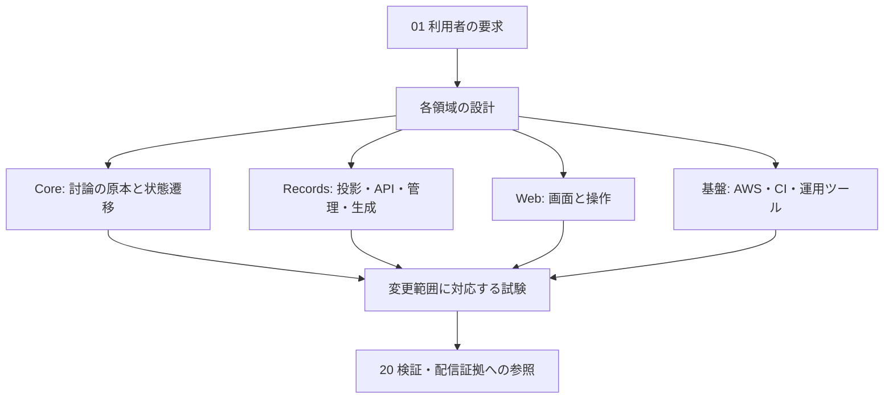

# 要求・実装・試験の対応表

[文書索引へ戻る](00_シッテムの箱_ドキュメント索引.md)

変更する要求から、担当する設計・コード・試験へ進むための地図である。
ファイル名は従来の参照を維持するため残しているが、完了済みのPR分割計画を現行の作業指示として扱わない。
現在の配信状況は[20](20_実装・試験・検証記録.md)、試験の実行範囲は[18](18_試験・品質保証設計.md)で管理する。

## リポジトリの責務

| ディレクトリ | 役割 |
|---|---|
| [src/shittim_chest](https://github.com/pitekusu/shittim-chest/tree/main/src/shittim_chest) | 討論の規則、進行、Discord/OpenAI/DynamoDBとの接続、実行プロセス |
| [services/records](https://github.com/pitekusu/shittim-chest/tree/main/services/records) | 議事録への投影、認証、読取・管理・メモリアルAPI、定期集計 |
| [contracts/records](https://github.com/pitekusu/shittim-chest/tree/main/contracts/records) | APIと保存・表示データの公開契約 |
| [apps/records-web](https://github.com/pitekusu/shittim-chest/tree/main/apps/records-web) | React画面、APIクライアント、ブラウザー試験 |
| [infra](https://github.com/pitekusu/shittim-chest/tree/main/infra) | AWS CDKのスタック、権限、構成の検証 |
| [tools](https://github.com/pitekusu/shittim-chest/tree/main/tools) | 文書同期、配信証跡、設定登録、依存更新の検出など |
| [.github/workflows](https://github.com/pitekusu/shittim-chest/tree/main/.github/workflows) | CI、配信、監視、補助通知 |

## 討論・受付・保存

| 要求 | 設計の正本 | 主な実装 | 主な確認 |
|---|---|---|---|
| Pythonが勝者を決める | [10](10_アプリケーション・Python詳細設計.md)、[12](12_OpenAI・プロンプト詳細設計.md) | [debate_content.py](https://github.com/pitekusu/shittim-chest/blob/main/src/shittim_chest/domain/debate_content.py)、[service.py](https://github.com/pitekusu/shittim-chest/blob/main/src/shittim_chest/application/service.py) | 得票・採点・同点、自己投票拒否、失敗時の状態 |
| 3人の意見・匿名投票 | [11](11_Discord詳細設計.md)、[12](12_OpenAI・プロンプト詳細設計.md) | [OpenAIアダプター](https://github.com/pitekusu/shittim-chest/tree/main/src/shittim_chest/adapters/openai) | 人格入力、名簿の用途別制限、厳密な出力形式 |
| 共通の参考情報 | [12](12_OpenAI・プロンプト詳細設計.md) | [evidence.py](https://github.com/pitekusu/shittim-chest/blob/main/src/shittim_chest/adapters/openai/evidence.py) | 検索不要・検索成功・既知失敗・未知情報源 |
| 署名付きの永続受付 | [11](11_Discord詳細設計.md)、[13](13_DynamoDB・データ整合性詳細設計.md) | [discord_ingress.py](https://github.com/pitekusu/shittim-chest/blob/main/src/shittim_chest/lambda_handlers/discord_ingress.py)、[ingress.py](https://github.com/pitekusu/shittim-chest/blob/main/src/shittim_chest/application/ingress.py) | 未加工本文の署名、重複受付、待ち件数・期限 |
| 途中表示と送信順序 | [11](11_Discord詳細設計.md)、[13](13_DynamoDB・データ整合性詳細設計.md) | [discord.py](https://github.com/pitekusu/shittim-chest/blob/main/src/shittim_chest/application/discord.py)、[outbox.py](https://github.com/pitekusu/shittim-chest/blob/main/src/shittim_chest/adapters/dynamodb/outbox.py) | 順序、送信結果照合、確定保存の再試行、重複防止 |
| 受付とスレッドの状態収束 | [11](11_Discord詳細設計.md) | [status_publication.py](https://github.com/pitekusu/shittim-chest/blob/main/src/shittim_chest/application/status_publication.py) | 古い更新の拒否、終了・中止・再試行 |
| 起動・待機・停止 | [10](10_アプリケーション・Python詳細設計.md)、[14](14_AWS・CDK詳細設計.md) | [scale_to_zero.py](https://github.com/pitekusu/shittim-chest/blob/main/src/shittim_chest/application/scale_to_zero.py)、[runtime_reconciler.py](https://github.com/pitekusu/shittim-chest/blob/main/src/shittim_chest/application/runtime_reconciler.py) | 処理権、残存作業、0/1制御、停止と再開 |
| 帰宅の挨拶 | [12](12_OpenAI・プロンプト詳細設計.md)、[17](17_運用保守・監視・障害対応設計.md) | [farewell.py](https://github.com/pitekusu/shittim-chest/blob/main/src/shittim_chest/application/farewell.py) | 実行時刻、出典、再試行上限、停止を妨げないこと |
| 保存形式と移行 | [13](13_DynamoDB・データ整合性詳細設計.md) | [serializer.py](https://github.com/pitekusu/shittim-chest/blob/main/src/shittim_chest/adapters/dynamodb/serializer.py)、[repository.py](https://github.com/pitekusu/shittim-chest/blob/main/src/shittim_chest/adapters/dynamodb/repository.py) | 現行・旧版、トランザクション、競合、所有者交代 |
| 品質観測・手動の生成方針比較 | [10](10_アプリケーション・Python詳細設計.md)、[18](18_試験・品質保証設計.md) | [escalation.py](https://github.com/pitekusu/shittim-chest/blob/main/src/shittim_chest/domain/escalation.py)、`tools/evaluate_escalation.py`・`review_escalation.py`・`score_escalation.py` | 本番は観測のみ。有料比較の明示指定、結果の秘匿、本文なし集計 |

Coreの試験は[単体試験](https://github.com/pitekusu/shittim-chest/tree/main/tests/unit)と
[DynamoDB統合試験](https://github.com/pitekusu/shittim-chest/tree/main/tests/integration/dynamodb)へ分ける。

## Web・親愛度・メモリアル

| 要求 | 設計の正本 | 主な実装 | 主な確認 |
|---|---|---|---|
| 議事録への投影・過去分取り込み | [24](24_シッテムの箱%20議事録設計.md) | Recordsの`archive.py`、`projector.py`、`adapters.py` | 保存形式、勝者再検証、重複・逆順イベント、ログへの本文非出力 |
| 認証・セッション・閲覧 | [24](24_シッテムの箱%20議事録設計.md)、[16](16_セキュリティ・プライバシー詳細設計.md) | `auth.py`、`auth_adapters.py`、`read_api.py`、`http_api.py` | 認証、Origin/CSRF、失効、API形式、非公開識別子の遮断 |
| 勝利・依頼の集計と費用 | [24](24_シッテムの箱%20議事録設計.md) | `rankings.py`、`ranking_adapters.py`、`costs.py`、`cost_adapters.py` | 同順位、集計の原子更新、期間境界、欠測・暫定換算 |
| サービス状態・脆弱性概要 | [25](25_サービス状態確認・プロンプト管理設計.md) | `admin_status.py`、`admin_status_adapters.py`、`inspector_translations.py` | 部分失敗、取得制限、キャッシュ、公開項目、翻訳の再利用 |
| プロンプト参照・更新・復元 | [25](25_サービス状態確認・プロンプト管理設計.md)、[12](12_OpenAI・プロンプト詳細設計.md) | `admin.py`、`admin_http.py`、`admin_adapters.py`、Core設定読込 | 一般利用者の読取、管理者判定、競合、部分失敗、使用中保護、保持5世代 |
| 親愛度の評価と反映 | [26](26_親愛度・ランキング設計.md)、[13](13_DynamoDB・データ整合性詳細設計.md) | [affection.py](https://github.com/pitekusu/shittim-chest/blob/main/src/shittim_chest/domain/affection.py)、Coreサービス、Records投影・集計 | 全件成功条件、上下限、二重加算防止、Discord/Web結果、ハート表示 |
| メモリアルの解放と本人操作 | [27](27_メモリアルロビー設計.md) | Core親愛度、Recordsの`memorial.py`、`memorial_http.py` | 同時到達、本人以外拒否、生成予約、失敗回復、リセット競合 |
| 画像・文章生成と履歴 | [27](27_メモリアルロビー設計.md)、[12](12_OpenAI・プロンプト詳細設計.md) | `memorial_adapters.py`、Webの`MemorialPage.tsx` | 課金試行上限、保存点、原本削除、期限付き閲覧、過去の思い出保持 |

表内のRecords Pythonファイルは[shittim_records](https://github.com/pitekusu/shittim-chest/tree/main/services/records/src/shittim_records)、
対応する試験は[services/records/tests](https://github.com/pitekusu/shittim-chest/tree/main/services/records/tests)にある。
画面は[Webのroutes](https://github.com/pitekusu/shittim-chest/tree/main/apps/records-web/src/routes)、
契約は[contracts/records](https://github.com/pitekusu/shittim-chest/tree/main/contracts/records)を参照する。

## 基盤・配信・文書

| 要求 | 設計の正本 | 実装と試験の入口 |
|---|---|---|
| スタックの所有・最小権限 | [14](14_AWS・CDK詳細設計.md)、[16](16_セキュリティ・プライバシー詳細設計.md) | [CDK](https://github.com/pitekusu/shittim-chest/tree/main/infra/lib)、[構成試験](https://github.com/pitekusu/shittim-chest/tree/main/infra/test) |
| 署名付き配信・ロック | [15](15_GitHub・CI-CD詳細設計.md)、[13](13_DynamoDB・データ整合性詳細設計.md) | `release.yml`、`records-release.yml`、`tools/release_supply_chain.py`、`tools/control_records.py` |
| イメージ検査・期限付きリスク | [15](15_GitHub・CI-CD詳細設計.md)、[18](18_試験・品質保証設計.md) | `Dockerfile`、`security/container-risk-acceptance.json`、コンテナ検査ツール |
| 監視・費用・ドリフト | [14](14_AWS・CDK詳細設計.md)、[17](17_運用保守・監視・障害対応設計.md) | Operations/CostGovernanceスタック、`drift.yml` |
| 依存更新の追跡 | [15](15_GitHub・CI-CD詳細設計.md) | `dependabot.yml`、`tool-versions.yml`、`tools/check_tool_versions.py` |
| GitHubのDiscord通知 | [21](21_GitHub・Discord通知運用設計.md) | `tools/github_discord_notifications/`、通知用workflow |
| 正本の同期と公開範囲 | [索引](00_シッテムの箱_ドキュメント索引.md)、[18](18_試験・品質保証設計.md) | `tools/sync_docs.py`、`tools/check_docs.py`、`tools/check_public_surface.py`、対応するツール試験 |

## 変更を進める順序

1. 変更の目的と対象を確認し、担当文書の契約と現在の実装を読む。
2. 影響する状態・権限・保存境界を決め、対象のコードと必要な試験を変更する。
3. 仕様を管理する正本文書と本表を更新し、公開版へ同期する。
4. 変更範囲の検証と既存の必須CIを通し、通常PRからスカッシュマージする。
5. 許可された配信を行い、結果と未実施の受入を20へ集約する。

保存形式やAPIを変える場合は、読み手を先に配信し、書き手を後に配信する。
Core Releaseには同じコミットのRecords Release成功が必要である。
過去の段階導入順を、完了後も毎回実施する手順として残さない。

## 対応表の保守

- 実装ファイルを移動したら、該当行とリンクを更新する。関数一覧を文書へ複製しない。
- インターフェースの詳細は担当文書、厳密なデータ形式はコード・生成契約で管理する。
- 試験数、パッケージのパッチ版、個人スコア、環境固有の識別子を本表へ固定しない。
- 未実施の検証は未実施と書く。配信成功と実利用確認を区別する。

## 公式資料確認記録

以下は各設計の根拠を整理した際の確認記録であり、本書の編集日に全資料を再確認したという意味ではない。

| 確認日 | 対象 | 公式資料 | 設計への反映 |
|---|---|---|---|
| 2026-08-14 | Python | https://docs.python.org/3/ | 実装層と型・試験の境界 |
| 2026-08-14 | Discord | https://docs.discord.com/developers/intro | 受付・投稿の契約 |
| 2026-08-14 | OpenAI | https://developers.openai.com/api/docs | モデル・出力形式・ツールの契約 |
| 2026-08-14 | AWS Fargate | https://docs.aws.amazon.com/AmazonECS/latest/developerguide/AWS_Fargate.html | 実行と配信の境界 |
| 2026-08-14 | GitHub Actions | https://docs.github.com/en/actions | CIと配信の境界 |
