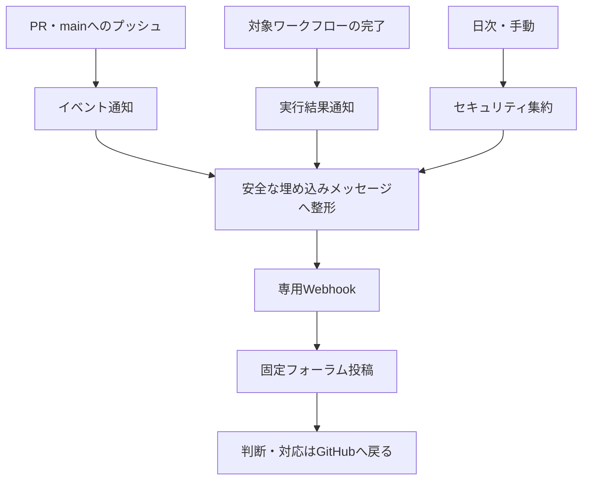

---
aliases:
  - The Shittim Chest GitHub Discord通知運用設計
tags: [project, shittim-chest, github, discord, operations, notifications]
status: current
created: 2026-07-23
updated: 2026-09-05
---

# GitHub・Discord通知運用設計

[ドキュメント索引へ戻る](00_シッテムの箱_ドキュメント索引.md)

## 1. 目的と位置付け

GitHubのPR、対象ワークフロー、依存・コードスキャンの情報を、非公開Discordフォーラムの固定投稿へ通知する。
最終判断の正本はGitHubであり、Discordは見落としを減らす補助表示である。
配送は重複し得るため、通知を一度限りの処理台帳として使わない。

通知からGitHubを操作せず、自動修正、自動マージ、AWS操作は行わない。
討論用の4体のBotとは別のIncoming Webhookを使う。
配信全体は[CI/CD設計](15_GitHub・CI-CD詳細設計.md)、通知後の調査は
[運用保守設計](17_運用保守・監視・障害対応設計.md)を参照する。

## 2. 通知するイベント

| ワークフロー | 起動条件 | 内容・除外 |
|---|---|---|
| `discord-repository-events.yml` | PRの開始/再開/レビュー準備完了/終了、mainへのプッシュ | PR状態・作成者・参照先。Dependabot PRは個別通知から除外 |
| `discord-workflow-run.yml` | 許可リスト内のワークフロー完了 | 結果、実行ID、SHA、実行者、URLを用途別投稿へ振分け |
| `discord-security-digest.yml` | 毎日またはmainから手動実行 | Dependabot、CodeQL、シークレット検査状態の集約 |

PRに由来するmainへのプッシュは関連PRを調べて重複通知を抑止する。
直接プッシュまたは由来を確認できないプッシュは、その区別を付けて通知する。
IssueやGitHub Releaseのライフサイクルを直接通知する設定は持たない。

ワークフロー完了通知の対象はYAMLの明示リストが正本であり、すべてのActionsが自動的に対象になるわけではない。
例えばRecords CI/Records Releaseは現在そのリストに含まれないため、Actionsで直接確認する。
全通知は`DISCORD_NOTIFICATIONS_ENABLED`が`true`の場合だけ有効になる。

## 3. 入力と配送の保護

| 境界 | 保護 |
|---|---|
| 実行するコード | 信頼された既定ブランチから取得。PR側コードを秘密付きで実行しない |
| Webhook URL | GitHub Actionsのシークレットに保存。ログ・例外へ値や応答本文を出さない |
| 投稿先 | 設定済みフォーラム投稿/スレッドへ固定し、元IDをリポジトリへ保存しない |
| PRのタイトル等 | 信頼できない文字列として整形し、コマンドとして解釈しない |
| 埋め込みメッセージとリンク | 文字数・URLを検証し、GitHub URL以外をリンクとして採用しない |
| メンション | 利用者/ロールへの通知を抑止 |
| セキュリティ情報 | 秘密値、非公開アラート本文、コード断片は送らない |

## 4. 配送失敗の扱い

送信は一時的な通信失敗、429、5xxだけを上限付きで再試行する。
最大4回、1回の接続期限10秒・全体30秒とし、`Retry-After`は最大30秒まで受理する。
取得できなければ短い指数的待機を使う。その他の失敗や上限到達は失敗として残す。

通知失敗で元のCI/配信結果を変更したり、本体ワークフローを再実行したりしない。
日次集約のページ取得未完了、未知スキーマ、権限不足は成功扱いしない。
最終判断はGitHubのChecks、Security、Actionsを参照し、Discordだけを監視源にしない。

## 5. 変更と動作確認

- ワークフローの試験では権限、イベント許可リスト、信頼されたソース取得、秘密の扱い、メンション、URLを確認する。
- Webhook交換が依頼された場合はGitHubのシークレットを更新し、許可された通知確認を1回だけ行う。
  手動起動できるのは日次集約ワークフローであり、通知経路の確認にアプリケーションやOpenAIを呼ばない。
- フォーラム構造を変更した場合は投稿先メタデータだけを変更する。Webhook URLや実IDを文書へ転記しない。
- 新しいワークフローの通知を追加するときは、対象リストと振分け、必要な権限、通知ループの防止を確認する。

## 実装への入口

| 対象 | 実装 |
|---|---|
| イベントと権限 | [通知ワークフロー](https://github.com/pitekusu/shittim-chest/tree/main/.github/workflows) |
| 通知の整形・分類・配送 | [github_discord_notifications](https://github.com/pitekusu/shittim-chest/tree/main/tools/github_discord_notifications) |
| ワークフロー契約検査 | [check_notification_workflows.py](https://github.com/pitekusu/shittim-chest/blob/main/tools/check_notification_workflows.py) |
