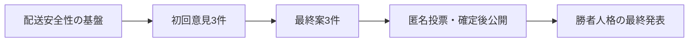

---
aliases:
  - Discord討論過程表示実装記録
tags: [project, discord, application, dynamodb, outbox, retrospective]
status: completed
created: 2026-08-09
updated: 2026-09-05
---

# Discord討論過程表示 実装完了記録

[文書索引へ戻る](00_シッテムの箱_ドキュメント索引.md)

> 完了した段階導入の記録。現在の状態遷移・上限・スキーマを定義する文書ではない。

## 1. 導入の目的

最終結果だけでなく、3人の初回意見、再検討した最終案、投票を順序どおり利用者へ見せる。
途中の必須投稿が欠けたまま、討論を完了にしない。

## 2. 導入した基盤

| 基盤 | 解決した課題 |
|---|---|
| 討論者・段階別の生成再開点 | 再開時に保存済み出力を使う |
| 段階送信計画とOutbox v2 | 出力保存と公開予定を矛盾させない |
| 試行全体の送信番号 | 複数人格・段階の投稿順を固定する |
| 決定的な22文字の重複照合用の値（`nonce`）と履歴照合 | 受理結果が不明な送信を調べ、重複投稿を避ける |
| 有限の再試行と`ABANDONED` | 回復できない送信を終了状態へ収束させる |
| 3票確定まで公開しない制御 | 投票途中の内容を見せない |
| 司会の結果と勝者Botの発表を分離 | Pythonの勝者と発言者を一致させる |

OpenAI側で厳密に1回だけ実行されることには依存せず、永続出力と送信履歴を使って再開する。
権限不足、本文不一致、期限超過で必須表示を完了できない場合は、試行を失敗にする。

## 3. 段階導入と受入

各段階を個別に配信し、本番受入で次を確認した。

- 正しいBotが、決めた順序で投稿する。
- 重複投稿を避け、Pythonの集計結果と勝者が一致する。
- 公開状態が終了へ収束し、タスクが0の待機状態へ戻る。

この記述は導入時の確認を示す。今回の文書整理で本番投稿や生成試験を再実行したものではない。

## 4. 現行設計の参照先

| 現在の契約 | 正本文書 |
|---|---|
| 進行・再開・終了 | [アプリケーション設計](10_アプリケーション・Python詳細設計.md) |
| 投稿順・送信回復 | [Discord設計](11_Discord詳細設計.md) |
| 生成入力と検証 | [OpenAI設計](12_OpenAI・プロンプト詳細設計.md) |
| 保存・排他・互換読込 | [データ整合性設計](13_DynamoDB・データ整合性詳細設計.md) |
| 必要な試験 | [試験・品質保証設計](18_試験・品質保証設計.md) |

静的な過去イメージ基準、当時のPR分割・作業上限、旧スキーマを現行要件として再利用しない。
新しい機能は上記の担当文書へ反映し、本書へ累積しない。
