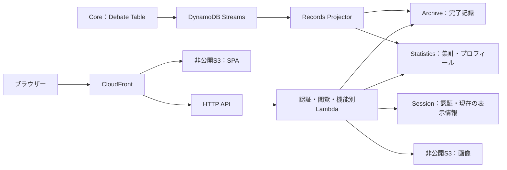

---
aliases:
  - シッテムの箱 議事録
tags: [project, records, web, archive, aws]
status: current
created: 2026-08-15
updated: 2026-09-05
---

# シッテムの箱 議事録設計

[ドキュメント索引へ戻る](00_シッテムの箱_ドキュメント索引.md)

## 1. 目的と読み方

「シッテムの箱 議事録」は、対象の非公開Discordサーバーで正常終了した討論を、
認証済みメンバーが振り返るためのWebアプリケーションである。本書はRecordsの共通基盤、
認証、記録の投影・閲覧、画面共通設計、概算費用を扱う。

機能ごとの詳細は次の文書に分ける。設計変更時は該当文書と実装を更新し、
配信済みかどうか、実測件数、受入結果は[実装・試験・検証記録](20_実装・試験・検証記録.md)へ記録する。
本書の説明を本番環境の稼働確認の代わりにしない。

| 変更したい対象 | 設計の正本 |
|---|---|
| 認証・記録API・投影・Web共通・概算費用 | 本書 |
| サービス状態確認・プロンプト参照／更新・Inspector翻訳 | [サービス状態確認・プロンプト管理設計](25_サービス状態確認・プロンプト管理設計.md) |
| 親愛度評価・記録への投影・各ランキング | [親愛度・ランキング設計](26_親愛度・ランキング設計.md) |
| メモリアルの解放・生成・履歴・リセット | [メモリアルロビー設計](27_メモリアルロビー設計.md) |
| CI・配信手順・証跡・本番操作 | [GitHub・CI/CD詳細設計](15_GitHub・CI-CD詳細設計.md)、[運用保守設計](17_運用保守・監視・障害対応設計.md) |

### 対象と対象外

記録には、質問、3人の初回意見と最終案、投票先と理由、保存済みの勝者・勝利の言葉・
最終決定を表示する。親愛度、ランキング、概算費用、サービス状態、プロンプト、
本人専用のメモリアルは、それぞれ独立した機能として提供する。

リアルタイム進行配信、WebSocket、討論の長時間再生、Web側の勝者再計算やLLM再生成は行わない。
Evidence、出典URL、所要時間も記録画面へ公開しない。汎用SaaSテンプレートや参考作品の
ロゴ・画面・素材を流用せず、独自のCSS／SVGで構成する。

## 2. 構成と責務

Coreの討論処理とRecordsの閲覧・集計処理は分離する。Records専用のサービス、
Web、CDK入口、リリース成果物を持ち、Recordsだけの変更でFargateイメージを作り直さない。

| 実装の入口 | 責務 |
|---|---|
| [services/records](https://github.com/pitekusu/shittim-chest/tree/main/services/records) | 投影、認証、閲覧、集計、管理機能、メモリアルのPython実装 |
| [apps/records-web](https://github.com/pitekusu/shittim-chest/tree/main/apps/records-web) | React SPA、画面、専用pnpm依存関係 |
| [contracts/records/v1](https://github.com/pitekusu/shittim-chest/tree/main/contracts/records/v1) | Pydanticから生成したOpenAPI／JSON Schemaと共有不変条件 |
| [records CDK入口](https://github.com/pitekusu/shittim-chest/blob/main/infra/bin/shittim-records.ts) | Recordsの3スタック構成 |
| [Records Application](https://github.com/pitekusu/shittim-chest/blob/main/infra/lib/records-application-stack.ts) | Lambda、HTTP API、スケジュール、機能別IAM |
| [Records CI](https://github.com/pitekusu/shittim-chest/blob/main/.github/workflows/records-ci.yml) | Python・契約・Web・関連CDK・セキュリティ検証 |

パッケージ・API・スタック・リソースの命名には `records` または `archive` を使い、
`minutes` は使わない。

## 3. 完了記録の投影と保存

### 3.1 公開できる記録の条件

Projectorはストリームの内容だけで公開可否を決めず、対象のCoreパーティションを強い整合性で読み直す。
次の条件をすべて満たした討論だけをArchiveへ投影する。

- 討論と現在の試行がともに `COMPLETED`。
- 初回意見・最終案・投票がそれぞれ3件あり、最終決定と最終通知が確定している。
- 親愛度対応後の討論では、評価状態が `applied` または `unavailable` として確定している。
- Coreのドメイン検証と、Pythonの `select_winner()` による保存済み勝者の再検証に成功する。

失敗・取消の討論はArchiveへ作らない。Evidence、Discordのメッセージ／インタラクションID、
配送・排他制御情報、外部サービスの応答IDは複製しない。旧v7討論を遡及評価しない。

Coreの現行保存スキーマはv9で、v8をメモリ上で互換読込する。再開により同じパーティションに
v8／v9の項目が混在していても、完了した討論METAと現在の試行METAが一致するスキーマを
投影の基準とする。全項目が同一スキーマであることは要求しない。PK・SK・GSIは変更せず、
`NEW_IMAGE` のストリームを投影入口にする。

### 3.2 Archiveテーブル

`PK=RECORD#<record-id>` の配下へ1討論分を12項目で保存する。

| SK | 内容 |
|---|---|
| `META` | 完了日時、質問、依頼者の表示情報、参加者情報、勝者、票数、同票判定。v2は親愛度評価も保持 |
| `INITIAL#<slot>` | 3人の初回意見 |
| `FINAL#<slot>` | 3人の最終案 |
| `VOTE#<voter>` | 3人の投票先と理由 |
| `DECISION` | 勝者、勝利の言葉、最終決定、実行案、注意点 |
| `PROJECTION#V1` または `PROJECTION#V2` | 対応スキーマの内容照合用ハッシュ（fingerprint）と投影メタデータ |

GSIは完了日時、勝者、内部の質問者キーの3経路を持つ。質問者キーはDiscordユーザーIDを
本番用の鍵でHMAC化した不透明な識別子であり、生IDはRecordsへ保存・公開しない。

Archive v1とv2はいずれも12項目構成を保つ。v2では親愛度をMETAに含め、評価不能も記録する。
v1の照合用ハッシュと保存形は変えず、詳細APIだけをv2応答へ揃えて `affection=null` とする。
既存v1をv2へ遡及変換しない。

同一ハッシュの再投影は何もしない。異なるハッシュは `PROJECTION_CONFLICT` とし、
自動上書きしない。書込み前にトランザクションの操作数、各項目400KB、全体4MBを検証する。
Projector／Backfillの `PutItem` はIAM条件
`dynamodb:EnclosingOperation=TransactWriteItems` でトランザクション内に限定する。

ストリームの部分失敗は対象の `SequenceNumber` を返す。ログへ残すのは安定したエラーコードと
トランザクション取消理由コードだけで、キー・本文・個人識別子・例外メッセージは出さない。

### 3.3 テーブルごとの保存責務

| テーブル | 保存内容 | 正本 |
|---|---|---|
| Archive | 検証済みの完了記録 | 本節 |
| Statistics | 勝利／依頼／親愛度ランキングと初期化状態 | [ランキング設計](26_親愛度・ランキング設計.md) |
| Statistics | プロンプト監査、Inspector翻訳キャッシュ | [管理機能設計](25_サービス状態確認・プロンプト管理設計.md) |
| Statistics | メモリアルの本人別周回・履歴・再開状態 | [メモリアル設計](27_メモリアルロビー設計.md) |
| Statistics | 日次費用・為替・外部収集の再開状態 | 第7節 |
| Session | OAuthの状態情報、セッション、現在の質問者プロフィール | 第4節 |

機能ごとの保持期間を混同しない。たとえばセッションのTTLを質問者プロフィールへ適用せず、
プロンプトの5世代保持をメモリアル履歴へ適用しない。

## 4. 認証・認可・プライバシー

### 4.1 Discordログイン

既存のモデレーター用DiscordアプリケーションのOAuth2認可コードフローを使い、
`identify` と `guilds.members.read` で対象サーバーへの現在の所属をコールバック時に確認する。

OAuthの状態情報は強い整合性の読込と条件付きの使用権取得により一度だけ使う。
トークン交換、本人情報、サーバー所属のいずれかを取得できなければセッションを発行しない。
OAuthのアクセストークン・更新トークンは所属確認後に破棄する。

| 保存対象 | 有効期間・保持 |
|---|---|
| OAuthの状態情報 | 10分 |
| セッション | 90日 |
| 質問者の表示名・アバター参照 | TTLなし。本人のログイン時に更新 |
| 旧30日プロフィール | 次回ログイン時に無期限の形式へ置換 |

期限判定にはハンドラーでも `expiresAt` を使い、DynamoDBのTTL削除遅延を認可に利用しない。
OAuthの状態情報、ブラウザーの使い捨て値、セッション、CSRFトークンは用途別に分離したHMACだけを保存する。

OAuthの使い捨て値とセッションのCookieは `__Host-` 名、Secure、HttpOnly、SameSite=Lax、Path=/、
Domain属性なしとする。CSRFは認証済みセッション応答で返し、送信値をCookieおよび保存HMACと
定数時間比較する。ログアウトのPOSTではOriginとCSRFを検証する。

### 4.2 機能別のアクセス権

| 操作 | 未認証 | 一般メンバー | 管理者 |
|---|---|---|---|
| セッション確認 | 匿名状態を200で返す | 許可 | 許可 |
| 記録・ランキング・費用の閲覧 | 401 | 許可 | 許可 |
| サービス状態の閲覧・明示更新 | 401 | 許可 | 許可 |
| プロンプト本文・履歴・比較の閲覧 | 401 | 許可 | 許可 |
| プロンプトの反映・復元 | 401 | 403 | 許可 |
| メモリアルの閲覧・生成・リセット | 401 | 本人の状態で判定 | 本人の状態で判定 |

導線の表示は権限判定ではない。管理者ID照合と書込の共通条件は[管理機能設計](25_サービス状態確認・プロンプト管理設計.md)、
本人単位の制御は[メモリアル設計](27_メモリアルロビー設計.md)を正とする。

APIのJSON応答は `Cache-Control: private, no-store` とする。
Discordのクライアントシークレット、OpenAIキー、AWS認証情報、生のDiscord ID、内部DynamoDBキーを
ブラウザーへ渡さない。例外的な署名付き画像URLも用途と期限を絞り、画像キーを独立フィールドで公開しない。

### 4.3 現在のアバターを表示する

参加者画像の正本は3体のBotの現在のアバターであり、
[専用同期ツール](https://github.com/pitekusu/shittim-chest/blob/main/tools/sync_records_participant_avatars.py)で
非公開Mediaバケットの `participants/<slot>/avatar.webp` へ同期する。BotトークンはRecords Lambda、
ブラウザー、Archiveへ渡さない。全記録で現在の画像を使い、過去のアバターは保存しない。

同期ツールは3体の本人情報と256px WebPをすべて取得・検証してから確認付きで上書きする。
RIFF検査に加えてImageMagickで実デコードし、256×256を確認する。上書き前の `VersionId` を記録し、
失敗時はSDK再試行分を含む新規バージョンを列挙・削除して再照合する。報告は参加枠ごとの復旧結果だけとする。
`--check` は秘密値を復号せず、SSMメタデータとMediaバケットの到達性だけを確認する。

質問者画像は本人のOAuthログイン時に取得する。サーバー専用アバターを優先し、128px WebP・512KiB以下を
不透明な `requesters/` キーへ保存する。画像取得失敗でもログインは継続する。
未同期・未ログイン・取得失敗は円形の幾何学模様の代替画像へ置き換える。

閲覧APIの署名付きGET URLは5分有効とし、CSPが許可した同リージョンのS3仮想ホスト形式のエンドポイントを使う。
旧Archiveに `avatar_asset_key` があっても参照せず、現在のプロフィールを優先する。

## 5. APIと生成契約

### 5.1 基本API

| メソッド・パス | 用途 |
|---|---|
| `GET /api/v1/auth/discord/start` | OAuth開始 |
| `GET /api/v1/auth/discord/callback` | サーバー所属確認・セッション発行 |
| `GET /api/v1/session` | 匿名を含むセッション確認 |
| `POST /api/v1/logout` | セッション削除 |
| `GET /api/v1/records` | 完了記録一覧 |
| `GET /api/v1/records/{recordId}` | 完了記録詳細 |
| `GET /api/v1/insights/costs` | 期間別の円換算概算費用 |

ランキングAPIは[26](26_親愛度・ランキング設計.md)、管理APIは[25](25_サービス状態確認・プロンプト管理設計.md)、
メモリアルAPIは[27](27_メモリアルロビー設計.md)へ集約する。
ルートの正確な集合は `contracts/records/v1/openapi.json` とCDKのHTTP API定義を照合する。
機能追加のたびに本文中の総ルート数を手で増減させない。

### 5.2 一覧・詳細の境界

一覧は既定12件、最大50件。通常はGSI1、勝者指定時はGSI2を使う。期間フィルターは設けず、
`sort=newest|oldest`（既定 `newest`）で全Archiveを並べる。
カーソルには使用インデックス、勝者、並び順、取得件数、`LastEvaluatedKey` と1時間の期限を含め、セッション鍵でHMAC署名する。

詳細は43文字の不透明な記録IDだけを受け取り、ベーステーブルを強い整合性で全ページ読込し、
Archiveの12項目を厳密に再構成する。欠落・重複・未知の記録種別・勝者不一致は503とし、公開しない。
表示には保存済みの勝者・勝利の言葉・最終決定を使い、閲覧APIで勝者を再計算しない。

投票スコア、Evidence、正本の照合用ハッシュ、質問者キー、試行ID、所要時間は返さない。
v1の詳細は `affection=null`、v2は3人の変更前・質問評価・実増減・変更後を返す。

### 5.3 契約の正本とチャンク分割

Pythonの `contracts.py` にあるPydanticモデルを正本とし、OpenAPI／JSON Schemaを決定的に生成する。
CIは再生成結果とGit管理成果物のバイト一致を確認する。Webは同じ契約から生成した
単独実行可能な検証器を使い、Pythonの勝者判定やドメイン規則を再実装しない。

検証器はError、Session、一覧、詳細、通常ランキング、親愛度ランキング、費用、状態確認、
プロンプト4種、メモリアル3種の15ファイル群へ分ける。
初期エントリーはError／Sessionだけ、各遅延読込ルートは自身のAPIクライアントと検証器だけを持つ。
生成器はファイル集合と内容を検証し、旧統合検証器の残置も拒否する。

## 6. Web共通の表示と操作

### 6.1 ブランド・文字・色

日本語製品名は「シッテムの箱 議事録」。ログイン・サイドバー・OGPの英字ロックアップは
`THE SHITTIM`／`CHEST ARCHIVE` の2行に固定する。

| 対象 | 表示規則 |
|---|---|
| 日本語本文・数値 | LINE Seed JP。公式 `v20251119` のOFL・チェックサムを固定したRegular／Bold／ExtraBold WOFF2を自己配信 |
| 英字ブランド・AUTHENTICATE・LOGOFF | Delogy、`lang="en"`。320pxでもブランド各行の途中で改行しない |
| 日時 | 保存ISO 8601を変えず、JSTの `YYYY年M月D日 HH:mm` へ表示変換 |
| 日本語組版 | `lang="ja"`、`line-break: strict`、`word-break: auto-phrase`、`text-autospace: normal`。未対応時は通常改行 |
| 見出し・段落 | `text-wrap: balance`／`pretty`、単独長文は最大48ic |
| 明るいテーマ | 透き通る水色・白・淡いシアン／ピンク |
| 暗いテーマ | 純黒ではなく深紺、低彩度の光と薄い格子。参加者のシアン／ピンク／ラベンダー、勝者の金色を維持 |

本文のコントラストは4.5:1以上、操作・フォーカス・境界は3:1以上を満たす。
JavaScriptによる日本語分割、両端揃え、文字の比例幅指定は使わない。装飾はCSS／SVGの
リング・格子・三角形等とし、本文を覆わず、操作・支援技術の対象外にする。

### 6.2 導線・テーマ・動き

デスクトップは固定サイドバーと複数列、モバイルは1列と下部ナビゲーションを使う。
`SYSTEM ACCESS` に「サービス状態確認」「プロンプト管理」を置き、テーマ切替より上に配置する。
「メモリアルロビー」も両ナビゲーションへ表示する。機能固有の権限や演出は分冊を参照する。

テーマは初回だけOS設定に追従し、手動切替後は `shittim-records-theme-v1` へ保存する。
不正値はOS設定へ戻し、再読込・ログアウト後も有効な手動設定を維持する。
同一オリジンから配信する外部初期化スクリプトが描画前に `data-theme`、`color-scheme`、
`theme-color` を揃える。CSPを緩めず、セッションやQueryClientを作り直さない。
OGP画像は明るいテーマで固定する。

テーマ切替は44px以上の `button role="switch"`、`aria-checked` と太陽／月SVGで表現する。
デスクトップはアカウント欄の直前、モバイルは下部ナビ内に置き、320pxで切れないようにする。

| 動き | 契機・時間・制限 |
|---|---|
| WELCOME／GOODBYE | 認証成功／ログアウト成功時の約2秒。終了後に画面遷移し、ログアウト時は保護対象キャッシュを消す |
| ルート切替 | URLのパス変更時だけ中央コンテンツを描画。場面260ms、内容220ms、時間差最大120ms、全体340ms以内 |
| 一覧の追加読込 | 新規カードだけ180msのフェード。ルート全体を再演出しない |
| 新旧切替 | NEW／OLDのラジオボタン。選択部分の丸角背景を `transform` で200ms移動 |
| 動きを減らす設定（reduced motion） | ルート・内容・テーマの動きを停止し、WELCOME／GOODBYEは150ms以下 |

初回表示、WELCOME直後、テーマ、検索、絞り込み、並び順変更ではルート演出を再生しない。
退出待ち・共有要素の変形・演出キュー・一時的な背面幾何学レイヤーは置かず、`opacity` と `transform` だけを動かす。
ルート変更後は新しい `h1[tabindex="-1"]` へフォーカスを移す。遅延読込中は場面を待機状態にし、
準備完了を示す印を確認してから描画とフォーカスを始める。

### 6.3 記録一覧・投票図

一覧の検索は読み込み済みカードの質問／勝者名を対象とし、依頼者は読込済み候補の完全一致、
勝者と並び順はAPI条件とする。開始日・終了日入力は置かない。
カード全体を1つのHTML標準リンクにし、「記録を読む」は視覚的な手掛かりだけとして重複リンクにしない。

カード装飾は12種類（orbit、triad、constellation、reticle、prism、wave、lattice、compass、
horizon、helix、vector、portal）の基本形と、5背景・4色・位置・角度・縮尺・左右反転・不透明度を
記録ID由来の安定疑似乱数で組み合わせる。再描画や並べ替えで変化させず、カード内へ収める。

投票図はHTMLの円形ノードとSVGの3次ベジェ曲線で構成する。デスクトップは横並び、
899px以下は三角形にし、独立した経路・始点の点・外周直前の濃色矢印で静止時にも方向を読めるようにする。
キーボード／ポインター／タッチでノードと経路を選び、投票関係の強調とツールチップを表示する。
同じ内容の文章・一覧を併設し、図だけに情報を閉じ込めない。

初回に表示領域へ入ったときだけ1経路760ms、参加枠順140ms差で描画する。表示中の弱い強調は表示領域外で停止し、
動きを減らす設定では描画・明滅・強調の動きをすべて停止する。動きで図の寸法を変えない。

### 6.4 実装・検証の境界

Webの実行バージョン・コマンドは `package.json`、pnpm lock、`vite.config.ts`、
ルートの `.node-version` とCI定義を正とする。Web依存をCDK用のnpm lockへ混ぜない。
Vite+のOxfmt／Oxlint、Vitest、Playwright／axeを使い、変更した振る舞いに必要な検証を選ぶ。

React Compilerは未導入。既存のDOM・取得状態の同期に対する新しい静的検査の例外は `vite.config.ts` の
対象ファイルに限定し、新規ファイルの規則、型検証、`maxWarnings: 0` は維持する。

初期エントリーはセッション・認証・ログイン・WELCOME／GOODBYE・共通レイアウトだけを保持する。
RecordsHome、RecordDetail、RankingsPage、AdminPage、MemorialPageはモジュールスコープの
`React.lazy()` で分割し、VoteGraphは詳細ルートだけに含める。
Suspenseと本文を含まないError Boundaryは中央だけを切り替え、固定ナビやQueryClientを再マウントしない。

CSSもデザイントークン／フォント、共通部品、画面枠、ルート演出、機能画面、投票図へ責務を分ける。
ビルド時に初期JSのgzipを分割前の113.56kB未満に保ち、独立したJS／CSSとモジュール所有関係を検証する。
旧画面が参照するハッシュ付き資産ファイルは配信時に即削除しない。

## 7. 概算費用

### 7.1 収集・台帳・換算

| 取得元 | 条件・分類 |
|---|---|
| AWS Cost Explorer | Projectタグ、日次UnblendedCost、Service／Usage Typeを全ページ取得。Fargate、Lambda、その他AWSへ分類 |
| OpenAI Organization Costs | 専用管理キーと完全一致のプロジェクトIDでUSDの日次集計区間を取得。プロジェクト・通貨・期間境界・非負額を検証 |
| Frankfurter v2 | 固定した接続先の `/rates` へリダイレクトなしで接続。USD／JPY・日付・正数・重複・欠落を検証 |

AWSのクレジット／返金と共有固定費のRoute 53は除く。その他AWSの内部内訳には
CloudWatch、Public IPv4、DynamoDB、S3、CloudFront、API Gateway、ECR、Inspectorと未知サービスの残余を保持する。

Statisticsの `COST#DAILY / <date>#<分類>` に原価、`FX#DAILY / <date>#USDJPY` に為替を保存する。
公開通貨はJPYのみ。Python Decimalで計算し、6桁のROUND_HALF_EVENで丸めた4分類の和を合計とする。
APIの小数文字列は6桁を維持し、Web表示だけ1円単位へ切り上げる。棒の比率以外をJavaScript Numberで再計算しない。

### 7.2 鮮度・失敗・再開

初回はJSTの当日を含む180日を30日ずつ6区間で収集し、以降は直近7日を再取得する。
AWS／為替は03:17 UTC（12:17 JST）、OpenAIは毎時37分に別の実行モードで同じCost Lambdaへ送る。
Lambdaは予約同時実行数1、タイムアウト300秒、非同期再試行0回とする。

再開用の進捗情報は次の日付、初回完了、最終成功を保持する。失敗時は進捗を動かさず、
本文のない失敗コード・時刻だけを記録し、次の成功時に失敗情報を消す。
取得元は独立して保存し、一方の失敗で他方の原価を消さない。日次台帳は無期限に保持する。

確定済みの過去日の為替欠落を別日で補わない。JST当日だけは日次レート公開前の末尾欠落を許容し、
保存済み直前日レートで暫定換算して `partial` を保つ。後続の7日再取得で当日レートへ置換する。
レート取得失敗時もUSD原価は保持する。監査可能な取得元の日次集計区間自体は変えず、
時刻別データを推測配賦して厳密なJST費用を作らない。

通信障害・429・5xxだけをRetry-Afterの上限付きで1回再試行し、認証・422・不正スキーマでは再試行しない。
ログは実行モード・件数・失敗コードだけとし、カーソル、プロジェクトID、金額、秘密値、クエリ付きURLを出さない。

### 7.3 費用画面

「今日／直近7日／今月／全期間」をJSTで選び、合計と4分類の積み上げ棒・同内容の意味的な一覧を表示する。
当日・AWS推定値・データ／レート欠落は「一部集計中」、換算可能な値がない場合は「取得不能」と区別する。
Route 53共有固定費の除外を常時注記する。費用の取得処理とエラー表示の境界をランキングから分離し、
費用取得失敗でもランキングを隠さない。

## 8. 過去記録の取込（Backfill）

Coreの正本には状態別のGSIがないため、手動Backfill Lambdaが `debate_meta` を低速走査する。
書込なしの試行（dry-run）と実反映（apply）は、候補パーティションを強い整合性で読み直し、Projectorと同じ純粋関数で
スキーマ・完了状態・最終通知・勝者・公開項目を検証する。

- 1回のLambdaは正本の項目を最大100件評価し、15分以内に終了する。
- 承認済みワークフローは同じ実行モード・ページ上限で最大25回順次呼び出し、60分以内に終える。
- `complete=true` になったときだけ成功する。未完了なら保存済み進捗から次回実行で再開する。
- dry-runはArchiveへ書かないが、Statisticsの専用進捗情報へカーソルと累積件数を保存する。
- applyは別の進捗情報で先頭から始め、投影済みの印でストリームとの重複を吸収する。
- 完了後は変更しない。v1取込の進捗をリセットする操作は設けず、再取込は投影バージョンを上げる独立工程にする。
- 応答・ログ・成果物には件数と完了状態だけを出し、カーソル、正本キー、質問、討論ID、本文を出さない。

## 9. AWS所有と配信の接点

| スタック | 所有対象 |
|---|---|
| RecordsStateful | Archive／Statistics／Session、Media、Projector DLQ、メモリアルの一時画像保存先／キュー／DLQ |
| RecordsApplication | 投影・認証・閲覧・ランキング・費用・翻訳・管理・メモリアルLambda、HTTP API |
| RecordsEdge | SPA用S3、CloudFront／OAC、ACM、Route 53 |

3テーブルはPITR・削除保護・RETAIN、Mediaはバージョン管理・RETAINを使う。
スタックの終了保護はCDK指定だけでなく配信後の実値で確認する。
LambdaはPython3.14／ARM64で、配布物はハッシュ検証済みのaarch64-manylinux_2_28向けバイナリwheelを使う。
Auth／Read／機能別Lambdaは役割を分け、公開バージョンと `live` エイリアスをHTTP APIのペイロードv2へ接続する。

Edgeはバージョン管理を有効にした非公開S3とOAC、us-east-1のECDSA P-256証明書、
TLS1.3のみの `TLSv1.3_2025`、A／AAAAレコードを持つ。
`/api/*` はCookieを転送してキャッシュせず、`/assets/*` だけ内容不変のキャッシュとする。
アクセスログはリクエストID、ルート、状態コード、応答時間、応答容量だけを90日保持する。

配信・変更セット・成果物署名・変更なしの判定・復旧の共通手順は[CI/CD設計](15_GitHub・CI-CD詳細設計.md)へ集約する。
Records ReleaseはECRへの登録とFargateイメージのビルドを行わない。Core更新を伴う場合は同一SHAのRecords Releaseを先行する。
公開ホスト名を含むマニフェスト、Application／Edge設定、メモリアル画像アップロードのCORS許可元を一致させる。
リリース処理は有料生成、Discord投稿、親愛度リセット、プロンプト有効化を自動実行しない。

本番入力は専用設定ツールで非表示のまま入力し、上書きを禁止して対象AWSアカウントへ紐づけて登録する。
リリース処理は既存Records6件、費用2件、Inspector翻訳1件、メモリアル生成1件の計10パラメーターについて
メタデータだけを確認し、GitHubの実行環境へ秘密値を取得しない。
