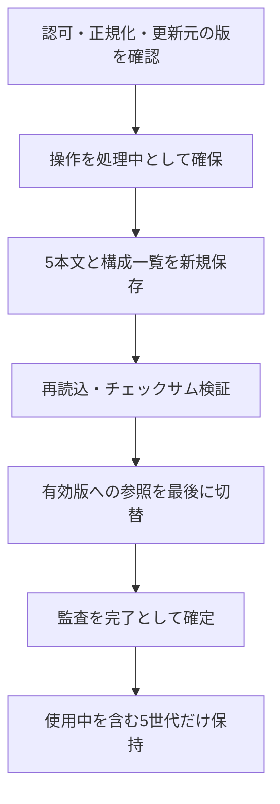

---
aliases:
  - Records管理機能
  - サービス状態確認とプロンプト管理
tags: [project, records, admin, prompts, monitoring]
status: current
created: 2026-09-05
updated: 2026-09-05
---

# サービス状態確認・プロンプト管理設計

[ドキュメント索引へ戻る](00_シッテムの箱_ドキュメント索引.md)

## 1. 責務と境界

サービス状態確認は認証済み利用者全員へ運用情報を見せる機能、プロンプト管理は全員が内容を参照し、
管理者だけが変更できる機能である。URLに `admin` が含まれていても、閲覧を管理者へ限定する意味ではない。
共通認証・画像・Web基盤は[議事録設計](24_シッテムの箱%20議事録設計.md)を参照する。

| 機能 | Lambdaの責務 | 許可する操作 |
|---|---|---|
| サービス状態確認 | Admin Statusが許可済みAWS資源を読み、公開可能な集約値へ変換 | 閲覧・キャッシュの明示更新 |
| プロンプト管理 | Admin Configが5本文・版・監査・保持期間を管理 | 全員が参照、管理者だけ反映・復元 |
| Inspector概要翻訳 | 専用Lambdaが脆弱性説明を日本語化して保存 | スケジュール収集のみ |

Admin StatusとAdmin Configは、関数、IAMロール、公開バージョン、エイリアスを分離する。
画面からデプロイ、タスク停止、DLQ削除、Lambda呼び出しなどの運用操作を提供しない。
Admin Statusのロールへ書込権限を追加して、設定管理を代用しない。

### 実装の入口

- [admin.py／admin_http.py](https://github.com/pitekusu/shittim-chest/tree/main/services/records/src/shittim_records)：認可、入力、版管理。
- [admin_status_adapters.py](https://github.com/pitekusu/shittim-chest/blob/main/services/records/src/shittim_records/admin_status_adapters.py)：AWS取得と公開値への変換。
- [AdminPage.tsx](https://github.com/pitekusu/shittim-chest/blob/main/apps/records-web/src/routes/AdminPage.tsx)：状態確認と管理ルート。
- [AdminPromptManager.tsx](https://github.com/pitekusu/shittim-chest/blob/main/apps/records-web/src/components/AdminPromptManager.tsx)：編集・履歴・競合操作。
- [Records Application](https://github.com/pitekusu/shittim-chest/blob/main/infra/lib/records-application-stack.ts)：対象資源、IAM、Lambda設定。

## 2. APIと認可

| API | 用途 | 利用者 |
|---|---|---|
| `GET /api/v1/admin/status` | 保存済み状態の参照、初回だけ収集 | 認証済み全員 |
| `POST /api/v1/admin/status/refresh` | 期限切れ状態の明示更新 | 認証済み全員 |
| `GET /api/v1/admin/prompts` | 現行または既存設定の5本文 | 認証済み全員 |
| `GET /api/v1/admin/prompts/revisions` | 本文を含まない履歴 | 認証済み全員 |
| `GET /api/v1/admin/prompts/revisions/{revision}` | 選択した版の本文 | 認証済み全員 |
| `POST /api/v1/admin/prompts/apply` | 新しい版の保存・有効化 | 管理者のみ |
| `POST /api/v1/admin/prompts/rollback` | 過去の内容から新しい版を作る | 管理者のみ |

全APIで有効なセッションを毎回検証し、未認証は401とする。管理者は専用の非公開入力に登録した
1つのDiscordユーザーIDから既存の本人識別用HMACで導いた値と、セッションの不透明な質問者キーを定数時間比較する。
ユーザー名、表示名、アバター、ロール名では認可しない。セッション応答の `isAdmin` は操作要素の表示用であり、
反映・復元ではサーバー側で再判定し、非管理者を403にする。

書込と状態の明示更新は、許可元と完全一致するOrigin、CSRF、16～128文字の冪等キーを要求する。
状態更新には管理者判定を要求しない。プロンプトのJSONは64KiB以下とし、未知フィールド、
Base64化された本文、余分なクエリ、重複クエリを拒否する。JSONはすべて `private, no-store` とする。
秘密値、プロンプト本文・差分、非公開ID、AWS資源識別子、冪等キーをエラー・ログ・利用状況の計測へ出さない。

## 3. サービス状態確認

### 3.1 取得・キャッシュ・部分失敗

Admin Statusは許可リストにある資源だけをAWS API／CloudWatchから読み、16区分の状態を返す。
温存されたLambda実行環境ごとに60秒のメモリキャッシュを持つ。初回GETは収集するが、
以後のGETは期限切れでも取得済み情報へ `stale` を付けて返す。
明示更新のPOSTは60秒未満なら同じキャッシュを返し、期限後だけ再収集する。環境をまたぐ共有キャッシュではない。

個別サービスの取得失敗はその区分を `unknown` とし、他の正常情報を残す。
未取得とゼロ件、状態不明と実際の障害を区別する。
管理画面のGETは429／503だけを250～500msのランダムな待機後に1回再試行し、POSTは自動再試行しない。
画面内では取得中の手動更新を無効化する。Admin Statusはタイムアウト30秒・予約同時実行数2とする。

### 3.2 何を表示するか

| 区分 | 運用判断に使う情報 |
|---|---|
| ECS | 希望数／実行数／起動待ち数、デプロイ、稼働確認信号、進行中討論、送信待ちイベント、読込済みプロンプト版、次回タスク定義とECRタグ |
| ECR | タグ付きイメージ一覧、形式、容量、登録日時、最終取得記録、タグ不変設定、暗号化 |
| Inspector | イメージ別の重大度件数、検査状態・日時、重大／高のCVEと日本語概要 |
| S3 | Web・Media・リリース成果物・メモリアル一時保存のバージョン管理、暗号化、公開防止 |
| DynamoDB | Debate・Archive・Statistics・Sessionの状態、PITR、削除保護、ストリーム、TTL、概算件数、抑制、親愛度集計・翻訳キャッシュ |
| Lambda | Core／Records各関数の状態、更新、実行環境、アーキテクチャ、予約同時実行数、直近1時間の呼出・エラー・抑制・処理時間の95パーセンタイル |
| CloudFront | 配信状態、キャッシュ無効化、TLS、証明書形式と期限、直近1時間の4xx／5xx／キャッシュ命中率 |
| SQS | 記録・親愛度投影DLQ、およびメモリアル生成キュー／DLQの滞留・処理中・遅延・最古経過時間、暗号化、保持 |
| API Gateway | HTTP APIの4xx／5xx／応答時間等 |
| EventBridge／Scheduler | Runtime調整、ランキング、費用収集、通知等の設定と実行・失敗 |
| CloudFormation | スタック状態、記録済みの最新ドリフト検査結果 |
| SNS | 運用通知の購読と配信・失敗 |
| Parameter Store | 必要設定の存在数、最終更新、実行時プロンプト切替の準備状態。値は取得しない |
| Cost Management | 予算消化率、Cost Anomaly通知の準備状態。予算金額・通知先は返さない |
| Signer | 署名プロファイルの状態、方式、有効期間 |
| External APIs | AWS／OpenAI／Frankfurter収集の初回完了、最終成功、失敗、鮮度 |

ECSの希望数／実行数／起動待ち数がすべて0なら、正常なScale-to-Zero待機として扱う。
質問評価そのものをECS欄に追加せず、親愛度は既存DynamoDB・Lambda・EventBridge・SQSの用途として示す。
新しい「親愛度サービス」カードは作らない。

親愛度監視は有効ランキングへの参照と初期値登録の進捗を強い整合性で読み、初期化完了、プロフィール集計数、
ページ数、最終生成日時を返す。15分集計に対し35分超の未更新、進捗情報の欠落、初期値登録の未完了は
`warning`、不正スキーマや一括保存した進捗情報の不一致は `unknown` とする。
質問者キー、点数、世代ID、チェックサムは返さない。

AWS取得に必要な識別子はサーバー内の設定だけで扱い、ARN、リソースID、バケット名、キューURL、Discord情報を返さない。
SQSメッセージ本文、SSM値、収集処理のカーソル、OpenAIプロジェクトID、外部API応答本文も取得対象・公開値にしない。

### 3.3 アラーム・イメージ・脆弱性の表示

全体には警告／重大アラーム数、取得日時、部分取得状態を示す。
発生中の複合アラームから、許可済みの個別メトリクスアラームのコードだけを日本語の原因名・重大度・サービスへ変換し、
対象カードへのリンクを付ける。`AlarmDescription`、未知のアラーム名、ARNは公開しない。

ECRとInspectorはダイジェストごとにイメージをまとめる。1つのダイジェストに複数タグが付く場合は、同じ行・カードに
複数タグを並べるのであり、イメージを二重計上する意味ではない。表示は登録日時順とし、固定の「本番版」ラベルは付けない。
ECSの次回タスク定義から特定したタグを結び、ECR一覧の該当イメージを強調する。ダイジェスト自体は公開しない。

InspectorのCritical／High／Medium／全件数は `ListFindingAggregations` を正とし、
独立した件数がないLow／未分類は有効な検出結果の全ページから補助集計して合計との整合を確認する。
重大～低は色分けし、重大／高についてCVE番号、日本語概要、影響パッケージ、検出版、修正版候補、
パッケージ管理方式、修正可否を表示する。検出結果のARN、英語の説明原文、資源IDは公開結果へ残さない。

### 3.4 Inspectorの日本語概要キャッシュ

専用翻訳Lambdaは毎時7分、予約同時実行数1、タイムアウト5分で動く。現存するタグ付きイメージの
有効な重大／高の未翻訳説明から1回最大50件を選び、10件ずつ `gpt-5.6-luna` へ渡す。
説明文を信頼できないデータとして扱い、構造化出力、推論量 `none`、`store=false`、
ツールなしで100～300文字の平易な日本語にする。未翻訳を推測で埋めない。

CVE IDと正規化した説明から内容ハッシュを作り、Statisticsの `ADMIN#INSPECTOR_TRANSLATION` へ
元説明のハッシュ、日本語概要、モデル名、翻訳時刻だけを保存する。元の英語説明、APIキー、検出結果のARNは保存・ログ出力しない。
現在の対象に対する「翻訳キャッシュ件数」「未翻訳件数」「最終翻訳日時」をDynamoDBカードへ表示する。
キャッシュ読込失敗は未取得とし、0件に見せない。

## 4. プロンプトの保存契約

### 4.1 管理対象と変更できないもの

| API上の名前 | 対象 |
|---|---|
| `system` | 事前調査・意見・投票・最終決定・終了挨拶で使う共通指示本文 |
| `moderator` | 事前調査AIの本文 |
| `participantA` | アロナの人格本文 |
| `participantB` | プラナの人格本文 |
| `participantC` | 安倍晋三AIの人格本文 |

コードが所有する勝者判定、構造化出力のスキーマ、ツール許可リスト、Evidence境界、出力制限、
`store=false` 等は編集させない。`system` の適用先は[OpenAI・プロンプト設計](12_OpenAI・プロンプト詳細設計.md)の
適用表を正とし、親愛度採点・Inspector翻訳・メモリアルへ一律適用されるわけではない。
メモリアルではこのうち選出された人格の本文だけを使い、共通の `system` と `moderator` は送らない。

本文はCRLF／CRをLFへ揃え、Unicode NFCへ正規化する。空文字・空白のみは禁止、各3,500 UTF-8 bytes以下とする。
`system` が変わる反映・復元には `APPLY SYSTEM PROMPT` の確認文字列を要求する。
管理版で現在と同じ内容なら409 `PROMPT_CONTENT_UNCHANGED`。既存設定からの初回登録は同一内容でも許可する。

### 4.2 SSMと監査の構造

版IDは `r` と26文字の小文字Crockford ULID。SSMは次の範囲だけを使う。

```text
/shittim-chest/production/runtime-prompts/
  <revision>/system
  <revision>/moderator
  <revision>/participant-a
  <revision>/participant-b
  <revision>/participant-c
  <revision>/manifest
  active
```

5本文と構成一覧の `manifest` はStandard SecureString、`Overwrite=false` で保存する。
`manifest` はスキーマ、版、UTC作成日時、操作種別（`publish`／`rollback`）、更新元の版、本文別SHA-256を持つ。
`active` は本文を含まないStringである。

Statisticsの `PK=ADMIN#PROMPT` には `CURRENT`、`REVISION#<revision>`、
`IDEMPOTENCY#<hashed-key>` を保存する。作成・操作・元版・集約チェックサム・リクエストのチェックサム・
`pending`／`completed` 等の監査情報だけを置き、本文や差分を保存しない。

### 4.3 原子的な切替・再試行・保持



| 条件 | 動作 |
|---|---|
| `baseRevision` が現在と異なる | 409 `PROMPT_REVISION_CONFLICT`。他画面の変更を上書きしない |
| 同じ冪等キー・同じリクエスト | 同じ結果へ収束。保存済みパラメーターが同一内容なら残りから再開 |
| 同じキー・異なるリクエスト | 409 `IDEMPOTENCY_CONFLICT` |
| SSMの保存途中で失敗 | 不完全な版を有効にせず、現行の有効版を維持 |
| 完全保存済みの処理中操作が残る | 次回アクセスで現在の参照先・構成一覧・監査を照合して切替／完了へ収束 |
| 有効版の切替後に監査完了が失敗 | 次回アクセスで同じ版を照合し、監査を完了 |
| 欠落・チェックサム不一致・不完全な有効版 | 503で処理を拒否し、既存設定へ黙って戻さない |

参照GETでも、過去に管理者が開始して処理中になった操作の回復や、保持世代数の整理に伴う内部書込は行われる。
一般利用者が新しい反映・復元操作を開始できる意味ではない。「読み取り専用」は利用者に許される操作を指し、
Config Lambdaの実装からすべての書込がなくなるという意味ではない。

復元は選択した過去の内容から新しい版を作る。有効版への参照を過去へ直接戻さず、既存本文を上書きしない。
保持数は使用中1＋過去4の計5世代。`active` から更新元の版を順にたどって保持対象を決め、
新版の検証・有効化・監査完了後にだけ対象外の5本文と `manifest` を削除し、続いて履歴の要約情報を削除する。
削除途中の失敗は次の読込・書込で再処理し、`active` は削除しない。本文の上書き禁止と無期限保持は別の契約である。

### 4.4 Runtime適用と画面

Runtimeはタスク開始時に1版だけを読み、実行中に再読込しない。`active` の未登録時だけ、リリース時に
版を固定した既存の人格設定へ戻る。`active` が存在して不正なら起動を失敗させる。
読み込んだ版は本文を含めず永続化された実行制御情報へ記録する。
保存しても稼働タスクを止めず、自然停止後の次回起動から新しい内容を使う。

| 表示 | 判定 |
|---|---|
| 既存設定 | `active` なし |
| 保存済み | 状態APIが未取得・期限切れ・不明などで適用を確認できない |
| 適用済み | 有効期限内のECS情報で、読込済みの版が `active` と一致 |
| 自然停止待ち | 版が未一致で、タスクの希望数または実行数が1以上 |
| 次回task待ち | 版が未一致で、タスクの希望数・実行数がともに0 |

5本文はキーボード対応のタブ、明確なラベル・説明・バイト数で切り替える。一般メンバーは読み取り専用とし、
反映・復元の操作を表示しない。管理者は `system` の差分を確認して「変更を反映」を押す。
既存設定の未編集状態だけ「現在の設定を管理版として登録」を使い、管理版の未編集時は反映を無効にする。

履歴は最大50件の要約情報を先に読み、本文は過去版の選択時だけ取得する。
使用中は操作ボタンを置かず、復元ボタンと同じ大きさの「使用中」表示にする。
差分は「過去の選択版→現在」の向きで、過去にだけある行を `-`、現在で加わった行を `+` にする。
復元前に確認し、現在と同じ内容になる復元はUI・APIの両方で拒否する。
409時は未保存の編集内容を保持し、比較後の「最新revisionを基準にする」でだけ更新元の版を変更する。

本文はReact Queryとコンポーネントのメモリだけで保持し、localStorage／sessionStorage／URL／利用状況の計測へ残さない。
ログアウト時はQueryClientの消去処理で破棄する。状態取得の障害で編集画面全体を停止させず、適用状態だけを「保存済み」にする。

## 5. IAM・設定・配信

Admin ConfigはPython3.14／ARM64、512MiB、タイムアウト15秒、予約同時実行数2。
Sessionの `SESSION#*` 読込、Statisticsの `ADMIN#PROMPT` 読込とトランザクション書込、
認可用SSM・既存人格設定の完全一致パスからの読込、実行時プロンプト範囲の操作だけを許可する。
各版の `Overwrite=true` は明示的に拒否する。保持処理の削除は版ごとのパス配下だけに許可し、`active` の削除は許可しない。
AWS状態取得や別ADMIN操作の権限は与えない。

リリース処理はRuntimeスタックの `vNNNN` 形式の設定バージョンを検証し、既存人格設定のパラメーター名と版だけをAdmin Configへ渡す。
初回ADMIN導入時のReleaseIdentity先行更新は、通常のRecords Releaseが同スタックを変更しないため必要だった工程である。
通常更新で毎回やり直さず、現在のIAM契約を[CI/CD設計](15_GitHub・CI-CD詳細設計.md)に従って確認する。

管理者IDは `/shittim-chest/production/records/admin/discord-user-id` のSecureStringに置き、
値をGitHub、CloudFormation、Lambda環境変数、ログ、API応答へ出さない。
管理者IDは `tools/configure_records_admin_input.py`、Inspector専用APIキーは
`tools/configure_records_inspector_translation.py` で非表示入力を2回照合し、上書きを禁止して対象AWSアカウントへ紐づけて登録する。
`--check` は秘密値を復号せずメタデータだけを確認する。
リリース処理はAPI／Lambda／Webを配信するだけで `active` を作らない。初回有効化は配信後の独立した管理操作とする。

### 画面共通の補足

`/admin` と `/admin/prompts` は同じ遅延読込モジュールに含める。状態画面は概要とサービス、各カードへのページ内リンクを持つ。
初回取得・明示更新はリング・不定進捗バー・サービス群の印で処理中と示し、完了率を推測しない。
`warning`／`critical` は一覧でも色と警告アイコンで強調し、`unknown` を障害と表示しない。
カードごとの部分取得・期限切れ・エラーを分け、「閲覧専用」の表示ではなくAPIとIAMを権限の境界とする。
サイドバーのマウスオーバー・フォーカスは横ずれする動きではなく短い菱形・直線の演出とし、ページ内リンクでは加減速する
滑らかなスクロールを使う。動きを減らす利用者設定（reduced motion）では演出を止める。
