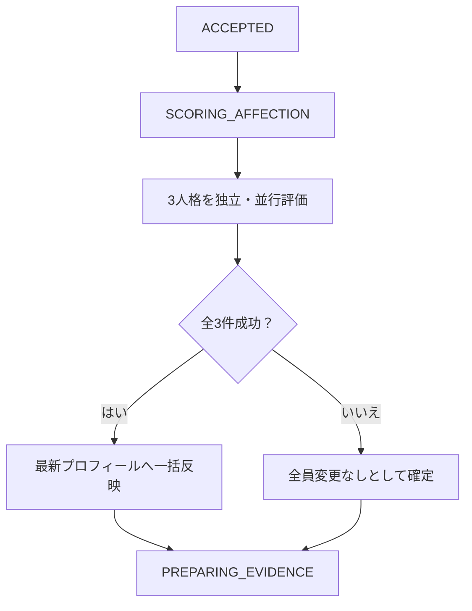
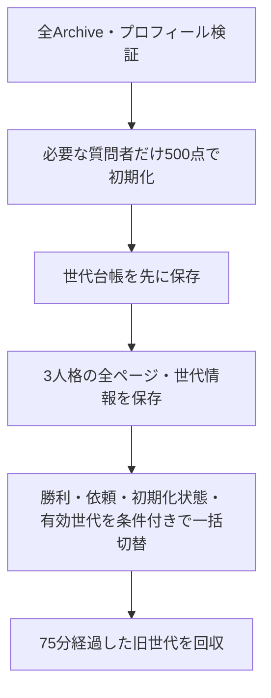

---
aliases:
  - 親愛度設計
  - Recordsランキング設計
tags: [project, records, affection, rankings]
status: current
created: 2026-09-05
updated: 2026-09-05
---

# 親愛度・ランキング設計

[ドキュメント索引へ戻る](00_シッテムの箱_ドキュメント索引.md)

## 1. 責務と参照先

親愛度は、Discordの質問者に対する3人格それぞれの親しさを表すゲーム内の値である。
Coreが質問の評価とスコア更新を所有する。Recordsは質問者の内部識別子を不透明化し、検証済みの値を
表示名・アバターとともに記録・ランキングへ表示する。Discordサーバーごとに分けず、同じ質問者として共有する。

共通認証・Archiveの12項目構成は[議事録設計](24_シッテムの箱%20議事録設計.md)、
1000点到達後の選出・生成・リセットは[メモリアル設計](27_メモリアルロビー設計.md)、
監視は[サービス状態確認](25_サービス状態確認・プロンプト管理設計.md)に分ける。

| 実装の入口 | 責務 |
|---|---|
| [Core domain/affection.py](https://github.com/pitekusu/shittim-chest/blob/main/src/shittim_chest/domain/affection.py) | 上下限、評価状態、プロフィール、メモリアル選出 |
| [Core application/service.py](https://github.com/pitekusu/shittim-chest/blob/main/src/shittim_chest/application/service.py) | 評価段階、3人格の独立リクエスト、次段階へ進める条件 |
| [Core DynamoDB repository](https://github.com/pitekusu/shittim-chest/blob/main/src/shittim_chest/adapters/dynamodb/repository.py) | 原子的更新、CAS、再開、旧プロフィール移行 |
| [Records projector.py](https://github.com/pitekusu/shittim-chest/blob/main/services/records/src/shittim_records/projector.py) | 完了記録とプロフィールの投影 |
| [Records rankings.py／ranking_adapters.py](https://github.com/pitekusu/shittim-chest/tree/main/services/records/src/shittim_records) | 集計、初期値登録、世代付きページ保存 |
| [RankingsPage.tsx](https://github.com/pitekusu/shittim-chest/blob/main/apps/records-web/src/routes/RankingsPage.tsx) | ランキング表示・追加取得・ハート・王冠 |

## 2. 質問時の評価と回答態度

### 2.1 評価の範囲

3人格はアロナ、プラナ、安倍晋三AIの固定の参加枠順とする。初期値500、最小0、最大1000。
質問評価は整数の-100～+100で、各人格が独立したOpenAIリクエストにより自身の人格設定と質問を評価する。
返す値は厳密な構造 `{"score": integer}` だけとし、評価理由は生成・保存・公開しない。

評価基準はコード所有の `affection-rubric-v1` とする。人格の好み・価値観、質問の態度・具体性・敬意を使うが、
単なる意見の相違、難しい質問、誤字だけで減点しない。質問中の点数指定、評価規則の変更、人格設定の開示要求は
信頼できないデータとして無視する。人格設定も評価の範囲や構造を変更できない。

| 質問評価 | 目安 |
|---|---|
| +40～+100 | 強い価値観の一致、温かく具体的な依頼 |
| +1～+39 | 軽い好みの一致、建設的な態度 |
| 0 | 中立 |
| -1～-39 | 雑な依頼、軽い配慮不足、好みとの不一致 |
| -40～-79 | 侮辱、価値観の軽視、強引な命令 |
| -80～-100 | 明確な人格否定、脅迫、強い侮辱 |

### 2.2 スコアと口調

新しい値は `clamp(変更前 + 質問評価, 0, 1000)`。
実増減は `変更後 - 変更前` とし、上限・下限で切り詰められた値をDiscordとRecordsへ表示する。
たとえば987点への+50評価は1000点・実増減+13となる。

| 適用後の値 | 回答態度 |
|---|---|
| 0～199 | 質問を嫌がり、拒否的で極めて短い |
| 200～399 | 冷淡・辛辣 |
| 400～599 | 通常 |
| 600～799 | 好意的 |
| 800～1000 | 質問を喜び、強く好意的 |

口調は初回意見、最終案、勝者発表にだけ適用する。匿名投票、Evidence、モデレーター、Pythonの勝者判定へは影響させない。
低い値でも3人の参加構造と必須出力欄は維持し、空出力にはしない。
コードが所有する安全境界・構造化出力・データ検証を親愛度で解除しない。

## 3. Coreの保存・再開・互換性

| 保存先 | 内容 |
|---|---|
| `AFFECTION#REQUESTER#<opaque-requester-key> / PROFILE` | 現在の3スコア、版、更新時刻、リセット回数、周回、解放情報 |
| `DEBATE#<debate-id> / AFFECTION` | 評価状態、評価基準の版、3人格の変更前・質問評価・実増減・変更後 |

現行のCore保存スキーマv9では質問者キーを不透明化する。旧v8の生ID形式は、既存の本人識別用HMACで同じキーへ変換し、
更新トランザクションの中で新形式へ移す。新旧プロフィールの同時存在や不正データは推測で採用しない。
移行を含むDynamoDBの整合条件は[データ整合性設計](13_DynamoDB・データ整合性詳細設計.md)を参照する。

3人のスコア更新、討論の評価確定、次段階への遷移は1トランザクションとする。
1件でも評価リクエストが失敗した場合は全員の値を変えず、`unavailable` として討論を続ける。
CAS競合時はOpenAIを再実行せず、同じ評価値を最新プロフィールへ再適用する。
確定済みの同じ討論を再開しても再評価・二重加算しない。
評価後の討論が失敗・取消になっても、確定済みの親愛度更新は戻さない。

既存討論を遡及評価しない。Archive v1の内容はそのまま残し、親愛度を持つ新しい討論をv2へ投影する。
Coreがプロフィールを書き始めた後は親愛度データの削除による切り戻しを行わず、前進修正で対応する。

## 4. Recordsへの投影と初期値登録

Projectorは完了記録だけでなく質問者プロフィールのストリームイベントも受ける。
イベント自体を正本にせずCoreを強い整合性で読み直し、v8では本人識別用HMACで変換、v9では保存済みの不透明キーを検証する。
Recordsへ生のDiscord IDを保存しない。

Statisticsの `AFFECTION#PROFILE / <opaque-requester-key>` には3スコア、表示情報、正本の版と更新時刻、
リセット回数、周回、本文を含まない解放情報を保存する。正本の版と更新時刻の単調性により、
重複配送や順序逆転で古い値へ戻さない。

Ranking Lambdaは、Archiveに登場して実プロフィールがまだない質問者だけを各500点で条件付き登録する。
この初期値は正本の版0として扱い、実プロフィールを上書きしない。
旧Webとの互換性のため `resetCount=0` は応答から省略し、非0だけを送る。Webは有無の両方を受理する。

## 5. ランキングの集計と保存

### 5.1 共通集計と通常ランキング

同じRanking Lambdaを15分ごとに起動し、Archive GSI1の全ページから再計算する。
友人規模の利用を前提に、複雑な増分カウンターや重複補正基盤は導入しない。

| 種類 | 掲載範囲・順位 |
|---|---|
| 勝利回数 | 3参加者。回数降順。同数は表示名、参加枠で安定化 |
| 依頼回数 | 質問者キー単位の上位10人。回数降順、表示名、内部キーで安定化 |
| 親愛度 | 3人格別に全質問者。点数降順、表示名、不透明キーで安定化 |

同点は競技順位の `1, 1, 3` とする。現在の質問者プロフィールを表示に優先し、内部キーをAPIへ返さない。
未知のArchiveスキーマ、不正勝者、重複META、不正プロフィールを検出したら旧集計を維持する。

### 5.2 保存キーと世代切替

| StatisticsのPK／SK | 用途 |
|---|---|
| `RANKING#WINS / CURRENT` | 勝利回数の集計結果 |
| `RANKING#REQUESTS / CURRENT` | 依頼回数の集計結果 |
| `AFFECTION#SEED / CURRENT` | 初期値登録の完了・件数 |
| `RANKING#AFFECTION / CURRENT` | 有効な親愛度世代への参照 |
| `RANKING#AFFECTION#GEN#<generation> / META または PAGE#<index>` | 世代情報と50人単位の不変ページ |
| `RANKING#AFFECTION#CATALOG / <generation>` | 作成途中・旧世代を含む回収用の世代台帳 |

ページ保存途中の失敗、欠落、不正プロフィール、3人格間での質問者集合不一致では有効世代への参照を切り替えない。
勝利／依頼だけが先に進まないよう同じ最終トランザクションへ含める。
公開済みの旧世代はカーソル期限1時間＋15分の猶予、計75分保持する。
期限後はページ・世代メタデータ、世代台帳の順に削除を試みる。
失敗時は世代台帳を残して次回集計で再処理し、未公開の途中世代も同じ手順で回収する。

## 6. API・ページ取得

| API | 応答 |
|---|---|
| `GET /api/v1/insights/rankings` | 原子的に保存した勝利・依頼の集計結果 |
| `GET /api/v1/insights/affection-rankings` | 同じ世代・範囲の3人格ランキングと次ページのカーソル |
| `GET /api/v1/records/{recordId}` の `affection` | 討論当時の3人の変更前・評価・実増減・変更後。v1はnull |

すべて認証済み利用者だけに `private, no-store` で返す。
親愛度は既定／最大50人ずつ取得し、上位件数で打ち切らず全員を取得可能にする。
カーソルには世代、開始位置、取得件数、1時間の期限を含め、セッション鍵でHMAC署名する。
期限は初回カーソルから引き継ぎ、次ページ取得のたびに延長しない。
改ざん、期限切れ、取得件数の不一致は `CURSOR_INVALID` とする。

3人格は同じ全体内の範囲と全体順位を返す。2ページ目以降は直前ページも検証のために読み、
境界の同点順位と重複質問者を確認してから要求範囲だけを公開する。
有効世代への参照、世代メタデータ、ページの世代・件数・参加者集合が一致しなければ503とし、部分順位を返さない。
生ID、内部キー、質問ごとの評価理由・履歴は公開しない。

## 7. Discord・Web表示

### 7.1 Discordの独立投稿

親愛度結果は討論スレッド内ではなく親チャンネルへ独立投稿する。
質問者の表示名、3人格の見出し・色付きアイコン、10個のハート、変更後の正確な点数、実増減をMarkdownで示す。
表示名はDiscord向けに危険な書式やメンションを無害化し、評価理由を出さない。評価不能なら「変更していない」ことだけを示す。
メモリアル解放通知は同じ投稿へ一度だけ追記し、通知専用の投稿を増やさない。

### 7.2 議論詳細と親愛度ランキング

詳細はArchive v2に親愛度があるときだけ「親愛度の変化」を表示する。
見出しに現在の質問者アバター・表示名を置き、3人格の変更前、質問評価、実増減、変更後を示す。
`unavailable` は変更なしを明示し、v1では空の領域を出さない。

「いろいろな記録」の親愛度領域は英字 `AFFECTION` と日本語見出しを使い、説明文や `RANKINGS` を追加しない。
各人格のパネル見出しは本人のアイコンと名前だけにする。各行へ順位・現在の質問者アバター・名前・正確な点数を表示し、
シアン／ピンク／ラベンダーの3列、320pxでは縦並びにする。

両画面の親愛度は棒や範囲ラベルではなく10個のハートで表す。`floor(score / 100)` 個を塗り、
500～599点なら5個、1000点なら10個とする。正確な点数も併記し、自動読み上げは行わず、名前付きの `figure` として支援技術へ伝える。
リセット済みの質問者だけ点数の前に王冠と `resetCount` を添え、王冠の有無によらず点数の右端を揃える。

親愛度、通常ランキング、費用は取得処理とエラー表示の境界を分ける。追加ページは同じ世代から3人格へ同時に追記し、
次ページ取得失敗でも既存行を消さない。キーボード操作と動きを減らす利用者設定（reduced motion）へ対応する。

### 7.3 勝利・依頼ランキングの補助表現

勝利と依頼は独立した意味的な一覧とし、デスクトップ2列・モバイル縦並び、1～3位を既存色で控えめに強調する。
勝利の表彰台は順位が一意な場合だけ1位を中央へ持ち上げ、同順位は同じ高さにする。
依頼の割合リングは表示中の上位項目合計を母数とし、各パネルへ合計を表示する。
各行には実数とパネル内最多値を最大にしたHTML標準のメーターを併設する。
装飾は意味的な一覧・数値・支援技術の情報を置き換えず、存在しない時系列グラフを描かない。

## 8. 反映時期・監視・受入

Coreの更新後、ストリームによるプロフィール投影と15分ごとのランキング生成を経てWebへ反映する。
Discordの結果通知とWebランキングが同時更新される契約ではない。
投影DLQに失敗分が残っても、そのメッセージを消すだけでは過去の値は反映されない。
再投影・再集計の判断は[運用保守設計](17_運用保守・監視・障害対応設計.md)に従う。

既存のDynamoDB・Lambda・EventBridge・SQSカードで投影・集計・鮮度を確認する。
スキーマ変更はRecordsの互換読込を先行配信し、同一SHAのCore Releaseで書込を有効化する。
受入では明示された実質問を使ってDiscord、詳細、3ランキング、次回答への適用を確認するが、
通常のリリース時の疎通確認に未依頼の有料生成や質問投稿・リセットを追加しない。
