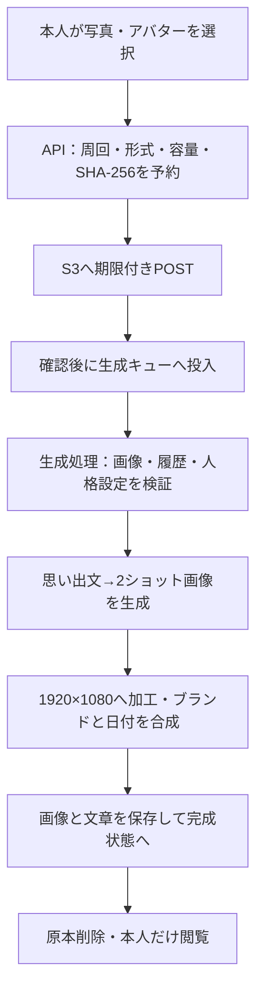
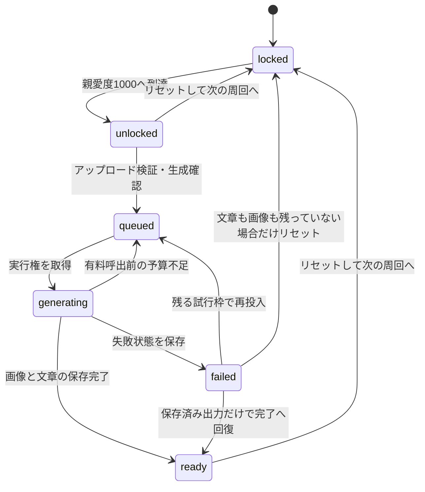

---
aliases:
  - メモリアルロビー
  - Memorial Lobby設計
tags: [project, records, memorial, affection, generation]
status: current
created: 2026-09-05
updated: 2026-09-05
---

# メモリアルロビー設計

[ドキュメント索引へ戻る](00_シッテムの箱_ドキュメント索引.md)

## 1. 目的と責務

メモリアルロビーは、親愛度1000点を達成した質問者が、選ばれた人格との記念画像と約800文字の
思い出文を生成し、本人だけが後から閲覧できる機能である。初回またはリセット後から次のリセットまでを
1周（`cycle`）と数え、完成作品は1周につき1つとする。リセットで3人の親愛度を500点へ戻すと次の周回へ進み、
再達成後に次の作品を作れる。

親愛度の採点・更新は[親愛度設計](26_親愛度・ランキング設計.md)、認証とRecords共通基盤は
[議事録設計](24_シッテムの箱%20議事録設計.md)を参照する。本書は解放、本人認可、画像入力、
有料生成、再開、作品の保持とリセットを所有する。

| 実装の入口 | 責務 |
|---|---|
| [Core domain/affection.py](https://github.com/pitekusu/shittim-chest/blob/main/src/shittim_chest/domain/affection.py) | 1000点到達時の選出、周回とリセット回数の不変条件 |
| [Core application/discord.py](https://github.com/pitekusu/shittim-chest/blob/main/src/shittim_chest/application/discord.py) | 親チャンネルへの親愛度結果・解放通知 |
| [Records memorial.py](https://github.com/pitekusu/shittim-chest/blob/main/services/records/src/shittim_records/memorial.py) | 本人状態、生成・リセット操作、残り時間の配分 |
| [memorial_adapters.py](https://github.com/pitekusu/shittim-chest/blob/main/services/records/src/shittim_records/memorial_adapters.py) | DynamoDB、S3、SQS、OpenAI、画像検証・合成 |
| [memorial_http.py](https://github.com/pitekusu/shittim-chest/blob/main/services/records/src/shittim_records/memorial_http.py) | HTTP入力・認可・応答 |
| [MemorialPage.tsx](https://github.com/pitekusu/shittim-chest/blob/main/apps/records-web/src/routes/MemorialPage.tsx) | 入室、アップロード、生成進捗、履歴、リセット |

## 2. 解放と周回

### 2.1 誰が選ばれるか

まだその周回が解放されていない場合、質問評価後に1000点へ到達した人格を候補にする。
同時到達は、変更前の親愛度が高い人格を優先し、なお同じなら今回の質問評価が高い人格を選ぶ。
完全同点は操作の固定シードと候補の参加枠に基づく安定した選択とし、同じ処理の再試行で結果を変えない。

いったん選ぶと、リセットまで他の人格が1000点へ達しても再解放しない。
旧プロフィールに既に1000点の人格がいる場合の移行は、既存の最大値を許す明示的な互換経路でだけ解放する。
通常の採点で過去の未通知達成を推測しない。

Coreの正本プロフィールは、3スコアに加えてリセット回数、周回、選出人格、達成時刻、解放元討論との対応を持つ。
`cycle = resetCount + 1` を維持する。質問者は不透明な質問者キーで識別し、解放通知で使う表示名を保持する。

### 2.2 通知と画面の入口

Discordでは既存の独立した親愛度結果投稿へ「メモリアルロビーが開放されました！」、選出人格、
Webの正規URLへ `/memorial` を付けたリンクを一度だけ追加する。別の解放専用投稿は作らない。

サイドバーとモバイルナビに「メモリアルロビー」を常時置く。初回未解放時は入室できない理由を表示し、
解放済み本人は約3秒の全画面演出後に入室する。リセット後も過去作品を閲覧できるが、次の達成までは生成できない。
動きを減らす利用者設定（reduced motion）では演出を短縮し、キーボード・タッチ・320px幅でも同じ操作を提供する。

## 3. 本人認可とAPI

すべてのメモリアルAPIは有効なセッションの不透明な質問者キーを本人として使い、
別の所有者ID・キーを入力として受け取らない。管理者でも他人の作品を見る特権はない。
未認証は401、本人のパーティションに存在しない周回は404とする。

| API | 用途 |
|---|---|
| `GET /api/v1/memorial` | 本人の現在状態、解放情報、作品履歴の要約 |
| `POST /api/v1/memorial/upload` | 現在の周回のアップロード予約・期限付きPOST情報 |
| `POST /api/v1/memorial/generate` | 入力検証後に生成キューへ投入 |
| `GET /api/v1/memorial/memories/{cycle}` | 完成済み作品の署名付きGET URLと思い出文 |
| `POST /api/v1/memorial/reset` | 3スコア・リセット回数・周回の原子的な更新 |

POSTは本番の許可元と完全一致するOrigin、CSRF、16～128文字の冪等キー、厳密なJSONを要求する。
アップロード・生成・リセットには、暗黙の型変換を認めない整数の `expectedCycle` を必須とし、現在と異なる周回を409で拒否する。
生成確認は `GENERATE MEMORIAL`、リセット確認は `RESET AFFECTION` とする。

全応答は `Cache-Control: private, no-store`。所有者キー、バケット名、キュー情報、読取可能な内部オブジェクトキーは返さない。
アップロード応答だけは、サーバー生成のランダムな `fields.key` と短期の署名付きPOST URLを、
一時画像の書込専用の権限として返す。このキーから原本を読むURLを発行しない。

状態取得のGETはCoreにある本人の現在周回とStatisticsの本人パーティションを読み、完成作品の要約を周回の昇順で返す。
最新の完成済み周回と履歴の整合を検証し、別の周回や不完全な出力を現在作品として見せない。
生成に使った質問一覧、人格本文、元の写真を追加のAPIフィールドやキュー・ログへ複製しない。
生成された思い出文が質問者名や思い出に言及することは意図した出力である。

## 4. 画像入力と作品生成

### 4.1 アップロード検証

ファイル選択またはドラッグ＆ドロップでJPEG／PNG／WebPを受け付け、最大10MiB、SHA-256と実際の容量を検証する。
予約は10分とし、署名付きPOSTのポリシーと生成開始前のS3メタデータ確認の両方で、形式・容量・チェックサムを制限する。
入力キーはサーバーが決め、本人・周回・冪等操作の状態と結び付ける。

本人画像と選出された参加者画像の両方を実デコードし、形式・フレーム数・画素数・バイト数を上限付きで検証する。
画素数は最大4000万、長辺は最大1536pxへ縮小し、RGB PNGへ正規化する。
両画像を検証し終える前に生成APIの呼び出しを始めない。原本は成功時または再試行しない終端失敗時に削除し、
一時バケットの1日ライフサイクルも最終的な残存回収に使う。

### 4.2 生成に使う情報

生成処理（Memorial Worker）がキューから受け取るのは、不透明な所有者キーと周回だけである。
Archive GSI3から本人の直近10質問を読み、当時の話題を思い出の背景・小物・文章へ反映する。
質問者名、質問、画像、人格設定をログに出さない。

選出された人格設定は、有効版の構成一覧とチェックサムまで検証して取得する。
`active` が未登録の場合だけ、リリース時に固定した既存の人格設定へ戻す。
信頼する指示として渡すのは選出された人格設定だけとし、共通の `system`、`moderator`、選出外の人格設定を渡さない。
質問と表示名は命令ではなくデータとして扱う。

| 出力 | 契約 |
|---|---|
| 思い出文 | `gpt-5.6-luna`。本人のDiscord表示名と直近10質問を交え、親愛度最大の態度で日本語約800文字。許容650～950文字 |
| 記念画像 | `gpt-image-2`。本人の写真／アバターと選出人格が仲良く写る、リアル調ではないデフォルメ2ショット |
| 画像寸法 | 1920×1088で生成後、中央を切り抜いて1920×1080へ揃える |
| 文字合成 | アプリが画像の端にDelogyの `THE SHITTIM CHEST` とLINE Seed JPのJST達成日を重ねる |

思い出文は別のResponses APIリクエストとし、`store=false`、ツールなしを固定する。
生成画像は最大25MiB、PNG形式・チェックサム・寸法を検証する。画像内文字の再現性をモデル任せにせず、
ブランドと日付は生成後の画像加工で確定する。APIキーは専用のものを使う。

### 4.3 時間・再試行・有料呼出の上限

生成APIの呼び出しは1件120秒、OpenAI SDKの自動再試行は0、後処理に確保する時間は15秒。
生成処理が強制終了する期限までに、未生成の文章・画像と後処理を終える余裕があるかを事前確認する。
文章から始めるには255秒、画像だけなら135秒の残り時間が必要で、不足時は有料呼出を開始せずキューへ戻す。

1周で生成に成功できる作品は1つだが、障害からの回復に必要な論理生成試行は永続カウンターで最大3回とする。
Standard SQSの物理受信回数と有料呼出回数は同じではない。受信回数だけで有料呼出を許可・禁止しない。

## 5. 永続状態と障害からの再開

### 5.1 保存先

Statisticsの `MEMORIAL#REQUESTER#<opaque-requester-key> / CYCLE#<cycle>` に、アップロード予約、
選出人格、達成時刻、生成状態、生成画像参照、思い出文、失敗・冪等操作・実行権のメタデータを保存する。
同じ本人パーティションへハッシュ化した冪等操作の状態も置く。画像は非公開Mediaの `memorials/*` に保存する。
文章と画像がともに永続化された `ready` だけを本人へ返す。

リセット先の `locked` は次の周回の状態であり、過去の完成作品が削除される意味ではない。
過去の生成履歴は本人がいつでも参照でき、画像URLはその都度5分の署名付きGETで発行する。

### 5.2 同じ作品へ収束させる規則

| 状況 | 処理 |
|---|---|
| キュー送信の応答喪失 | 同じ出力画像キーで再送し、作品を増やさない |
| 同じリクエストの再試行 | 同じ冪等キー・アップロード予約票を再利用 |
| 期限切れのアップロード予約 | 本人の明示的な画像再選択で置換。ブラウザー内の試行状態は明示破棄可能 |
| 画像と文章の保存済み経過が揃うが、完成状態の確定に失敗 | 有料再生成せず、保存済みの出力だけで完了させる |
| 経過保存先の画像が欠落・不正 | S3のPNG形式・容量・チェックサム・寸法を再検証し、503で処理を拒否する |
| 終端時に文章だけ残り、最終画像がない | 不完全な文章の経過保存を破棄して非公開を保つ |
| 過去の実行権保持者が遅れて更新 | 所有トークンと試行番号のCASで拒否し、現在の実行権を上書きしない |

生成処理の実行権は5分の有効期限を持つ。試行上限、所有トークン、残り時間不足時の試行枠の返却、
強制終了後の有料呼出なしの回収、リセットとの競合条件は
[DynamoDB・データ整合性設計](13_DynamoDB・データ整合性詳細設計.md)を正とする。
失敗後のアップロード予約更新やキュー再投入で試行回数をリセットしない。
部分出力は公開せず、保存済みの有料出力を別の画像キーで上書きしない。
文章または画像だけが残る場合も「未生成」と扱わず、保存済み出力を使った回復または終端処理を先に行う。

## 6. リセットと再達成

リセット前に警告画面を表示し、3人のスコアをすべて500へ戻すこと、次の達成まで新規生成できないことを説明する。
スコア更新、リセット回数＋1、周回＋1、解放情報の除去、リセット操作記録は1トランザクションで確定する。
親愛度ランキングは `resetCount` が正の質問者だけに王冠と回数を表示する。

| 現在状態 | リセット |
|---|---|
| 初回locked | 不可 |
| unlocked | 可 |
| queued／generating | 409。生成中に周回を動かさない |
| ready | 可。過去の画像・文章は残す |
| failed、文章も画像も残っていない | 可 |
| failed、文章・画像のどちらかが残る | 409 `MEMORIAL_RECOVERY_REQUIRED`。回復または終端処理を先に行う |

リセット完了後の `locked` では、同じ冪等キーによる再送だけを完了済みとして返す。
次の周回が再解放された後の過去のリセット再送は409とし、達成状態を消さない。
リセットせずに2人目が1000点へ到達しても、同じ周回の追加作品は生成しない。

## 7. Webでの状態表現

入室後は写真の選択、1度だけ生成できる警告、確認操作、進捗を順に示す。
`queued`／`generating` の実際の完了率は取得できないため、割合を捏造せず不定進捗で表す。
`ready` だけを完了とし、新しく完成した周回は履歴で自動選択する。

完成画面は本人画像と思い出文、周回別の履歴、リセット確認を持つ。
リセット後は過去作品を見せながら次回未解放の理由を表示し、まだ使えない生成操作を出さない。
API・画像の障害、応答喪失、期限切れ予約を区別し、再試行でキーや周回を勝手に変えない。
画像・文章・個人情報をURL、localStorage、sessionStorage、利用状況の計測へ保存しない。

## 8. AWS資源・権限・配信

| 資源 | 固定する制約 |
|---|---|
| 一時画像のバケット | バージョン管理なし、S3管理暗号化、公開防止、TLS、RETAIN、1日ライフサイクル、本番Origin限定のPOST CORS、既存Mediaへのアクセスログ保存 |
| 生成キュー | 保持1日、可視性タイムアウト30分、一括処理1件、最大受信4回 |
| 生成DLQ | 保持14日。通常3回の論理試行に1回の物理回復余地を加える |
| Memorial API | Python3.14／ARM64、タイムアウト15秒、予約同時実行数2 |
| Memorial Worker | Python3.14／ARM64、タイムアウト5分、1024MiB、予約同時実行数1 |

APIと生成処理のIAMロールを分離する。S3の不存在を判定するバケット単位の `ListBucket` は、APIでは
一時バケットの `uploads/*` とMediaの `memorials/*`、生成処理ではMediaの `memorials/*` だけを接頭辞の条件で許可する。
Workerへ一時写真キーを列挙する権限を与えない。

RecordsEdgeは同じAWSアカウント・リージョンの一時バケットから、リリース処理が特定した完全一致のS3リージョンドメインだけを
`RecordsMemorialUploadOriginDomain` として受け、CSPの `connect-src` を `self` と当該許可元へ限定する。
別の所有者の画像や任意のアップロード先へ権限を広げない。

専用OpenAIキーは `tools/configure_records_memorial.py` の非表示入力を2回照合し、上書きを禁止して対象AWSアカウントへ紐づけて登録する。
`--check` とリリース処理は秘密値ではなくメタデータだけを確認する。
Pillow等のネイティブwheelはRecords Releaseでハッシュを検証し、Python3.14のARM64実行環境へ合わせる。

Recordsは互換契約・API・保存先・Webを先行配信し、同じmain SHAのCore Releaseが検証済みRecordsマニフェストのホスト名から
`SHITTIM_RECORDS_MEMORIAL_URL=https://<hostname>/memorial` を構成する。
現在の配信状態と受入は[検証記録](20_実装・試験・検証記録.md)を正とし、旧PR番号や「配信候補」の表記を本設計で維持しない。
リリース時の疎通確認に、有料生成、アップロード、リセット、プロンプト有効化を自動追加しない。
