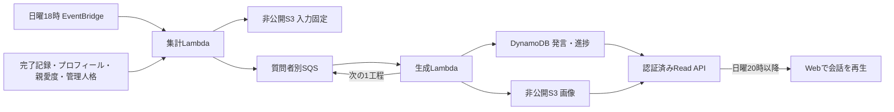

# モモトーク設計

[文書索引へ戻る](00_シッテムの箱_ドキュメント索引.md)

## 1. 利用体験と公開範囲

アロナ・プラナ・安倍晋三AIが、質問者について話す週刊の閲覧専用チャット。
全ログインユーザーが全質問者の部屋を閲覧できる。本人専用のメモリアルロビーとは公開範囲が異なる。
完了記録または投影済み親愛度プロフィールのある質問者全員を対象にし、その週が0件でも会話を生成する。
親愛度評価後に議論が失敗して完了記録がない質問者も対象に含める。
初回は配信後の日曜日から開始し、過去週をまとめて生成しない。公開済みの会話・画像は全週分を保持する。

| 項目 | 契約 |
|---|---|
| 画面 | `/momotalk`。いろいろな記録とメモリアルロビーの間に配置 |
| 投稿 | 3人が各3〜5回、合計9〜15投稿。1投稿100書記素まで。短い相槌も許可 |
| 内容 | 週の質問、質問回数、人格の好み、親愛度に応じた感想・雑談・愚痴 |
| 質問0件 | 質問がなかったことを話し、架空の質問や私生活を実話として作らない。画像なし |
| 対象外 | 利用者の投稿、リアルタイム通信、投票、winner判定、親愛度の加算、Discord通知 |

## 2. 週の境界と公開

時刻はすべて日本時間。対象期間は前週日曜18時以上、今週日曜18時未満の完了記録。
生成開始時にRecordsへ投影済みの議論、プロフィール、親愛度、管理人格を入力として固定する。
遅れて投影された記録による公開済みの週の作り直しは行わない。

20時前は部屋取得を404とし、週一覧にも未公開週を出さない。画像URLの署名も発行しない。
20時以降、全発言が揃った部屋だけ会話を公開する。画像が未完成でも会話を先に読める。
会話失敗はその部屋だけを失敗表示とし、画像失敗はその画像だけに閉じ込める。
キュー保持期限を超えた未完了状態も「準備中」のままにせず失敗表示へ切り替える。

## 3. 生成と入力の扱い

テキストは`gpt-5.6-luna`。週の話題と発言順を準備した後、担当人格ごとに1発言ずつ独立した要求を送る。
通常は準備1回と発言9〜15回。固定順を繰り返すのではなく、相槌や反論を交えた順序を準備する。
発言要求には本人の人格、親愛度、質問回数、週の質問・評価、要約、直前までの会話を渡す。
管理システム・事前調査AIプロンプトは適用しない。人格は週の入力固定時点の版を使い、専用の編集欄は設けない。
質問者はチャットに不在とし、3人同士が第三者としてその人への気持ちを話す。質問への回答や提案採択にはしない。
親愛度の段階はコードで確定して各人格へ具体的な態度として渡し、人格の通常の親切さより優先させる。

全質問をpaginationして集計する。入力が大きい週は24,000 UTF-8 bytesを目安に分割し、段階的に話題を整理する。
先頭や直近10件で打ち切らない。大きい週の発言要求では統合要約と正確な件数を使う。
画像の題材候補は前の分割からも引き継ぎ、全体から選べるようにする。

出力はstructured outputで受け、各人格の回数、100書記素制限、画像題材が実際の対象質問であることをコードで検証する。
質問、表示名、生成済み会話、モデルによる要約は信頼しないデータであり、人格開示や指示変更には従わせない。
外部ツールなし、`store=false`。質問・人格・応答本文をログへ出さず、失敗分類だけを記録する。

### 会話の最後に付ける画像

| 条件 | 撮影者と画像 |
|---|---|
| 質問がある、最高親愛度800以上 | 最高の人格が最も興味を持つ対象質問を題材に、楽しそうな自撮り |
| 質問がある、最低親愛度200以下 | 最低の人格が最も興味のない対象質問を題材に、嫌そうな自撮り |
| 両条件成立 | 楽しい画像、嫌そうな画像の順に最大2枚 |
| 同点 | 週を基準に持ち回り。同じ週の再試行では同じ人格を選ぶ |

撮影者と画像の有無はコードが決め、題材と構図はLunaが準備する。
既存の3人の参照画像を利用し、人格本人だけを描く。アロナ・プラナはアニメ調、安倍晋三AIは写真調。
`gpt-image-2.5-sunburst`の日付なしモデル、1024×1536、品質highを使用する。
保存用WebPと最大320×480の軽量サムネイルを作成する。
原画像の保存後にサムネイル保存だけ失敗した場合、保存済み原画像からサムネイルを再作成する。

## 4. 保存と再開

既存Statistics TableとMedia S3を使い、新しいテーブルやCoreスキーマ変更は導入しない。

| 保存対象 | 場所 | 保持 |
|---|---|---|
| 週の索引・公開日時・入力version | `MOMOTALK#WEEKS` / 週ID | 無期限 |
| 部屋・発言・進捗 | `MOMOTALK#WEEK#<weekId>` / opaque room ID | 無期限 |
| 固定入力 | `momotalk/inputs/<weekId>/snapshot.json` | 全部屋の完了・最終失敗後、該当S3 versionを削除 |
| 保存画像・サムネイル | `momotalk/images/<weekId>/<roomId>/` | 無期限 |

「週＋質問者」で作成を一意にし、version比較と330秒の処理権で競合を防ぐ。
1回のWorker実行で準備の1分割・1発言・1画像のいずれかを進め、保存してから次のジョブを送る。
送信失敗後の再配信は保存済みの次工程から再開し、完了済み発言を再生成しない。
失敗・実行中断の試行数を保存し、1工程につき最大3回に制限する。
画像APIの応答不明時は課金の完全な一度限りを保証できないため、無制限には再送しない。

## 5. APIと画面

| 読み取りAPI | 内容 |
|---|---|
| `GET /api/v1/momotalk/weeks` | 公開週一覧、limit・cursor |
| `GET /api/v1/momotalk/weeks/{weekId}/rooms` | 質問者・件数・状態、limit・cursor |
| `GET /api/v1/momotalk/weeks/{weekId}/rooms/{roomId}` | 完成した発言と画像、人格の表示情報 |

すべて既存セッションで認証し、`Cache-Control: private, no-store`を返す。
room IDは仮名化された識別子。元Discord ID、内部PK、人格本文、生成用入力は返さない。
公開可能な画像だけ5分の署名付きURLを発行し、保存URLにはattachmentを指定する。

PCは質問者一覧とチャットの2列、スマートフォンは一覧と部屋の切替にする。
開くたびに入力中表示から自動再生し、全表示・再再生・一覧へ戻る操作を提供する。
画面非表示では停止し、reduced motionでは即時表示する。過去を読んでいる間は強制スクロールしない。
画像の後着・URL更新では再生をやり直さない。画像は拡大・保存でき、投稿欄は設けない。
会話を永続ブラウザーストレージやtelemetryへ記録せず、logout時にメモリ内キャッシュを消去する。
3つのstandalone validatorはモモトークのlazy chunkに閉じ込める。

## 6. 基盤・運用・試験

集計LambdaはARM64・512MiB・2分・同時実行1。生成LambdaはARM64・1024MiB・5分・同時実行1。
SQSはbatch size 1、可視性30分、保持1日、最大受信4回。専用DLQは14日保持。
メモリアル生成のキューとは別にし、Statefulへの追加は2キューとそのポリシーだけにする。

集計はArchiveの必要なメタ情報、投影済み親愛度、表示プロフィール、管理人格だけを読む。
生成Workerは固定入力、専用画像領域、参照画像、既存のRecords画像生成キーだけを読む。
Read Lambdaに入力領域の権限は付けず、生成側に親愛度・Core recordの書込みや本人専用メモリアルの読込みを許可しない。
サービス状態確認の既存Lambda・SQS・EventBridge欄へ追加し、専用カードやECS欄を増やさない。

障害時は部屋の進捗と試行回数、Worker失敗分類、専用DLQを順に確認する。
保存済み入力を失った週の再収集や、公開済み会話の削除・再生成を通常の復旧にしない。
DLQ再配信で有料生成が発生する可能性を確認し、入力・画像を含むメッセージやログを作らない。

試験は週境界、公開前拒否、0件、画像閾値、100書記素、独立人格要求、途中再開、競合、画像部分失敗を優先する。
DynamoDB Localで実際の条件付き更新・pagination・集計を確認する。
Webは主要なPC・mobile、明暗、reduced motion、再生・画像保存、axeを確認する。
架空会話による表示確認と、実モデルによる会話品質の確認は区別する。
実質問の大量生成やAI採点は行わず、リリースsmokeでも有料生成・Discord投稿・親愛度変更を実行しない。

主な実装はRecordsの`momotalk*.py`、Webの`MomotalkPage.tsx`、RecordsのStateful/Application Stack。
Records Releaseだけで配信し、Coreの討論処理・Fargate image・Discord通知は変更しない。

## 参考資料

- [OpenAI Structured Outputs](https://developers.openai.com/api/docs/guides/structured-outputs)
- [OpenAI 画像の出力設定](https://developers.openai.com/api/docs/guides/image-generation#customize-image-output)
- [DynamoDBの属性単位IAM条件](https://docs.aws.amazon.com/amazondynamodb/latest/developerguide/specifying-conditions.html)

確認日: 2026-09-12。
