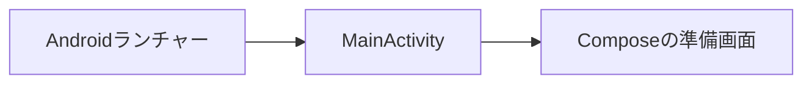

# Androidアプリ設計

[文書索引へ戻る](00_シッテムの箱_ドキュメント索引.md)

## 目的と現在の範囲

既存のDiscord・Records・Webを維持し、友人向けのAndroidネイティブアプリを段階的に追加する。
現段階はC01の最小アプリであり、製品機能の提供やGoogle Playへの配布を完了した状態ではない。

| 段階 | 内容 | 現在の扱い |
|---|---|---|
| C01 | Gradle Wrapper、Version Catalog、最小Compose画面 | 今回の実装範囲 |
| C02〜C04 | Circuit・Metro、Android CI、CodeQL接続 | 未実装 |
| 後続 | 認証、記録閲覧、暗号化保存、署名済み配布 | 未実装。未使用のAPI・権限は先行追加しない |

## 最小構成

`apps/records-android/`を独立したGradleプロジェクトとし、C01では`:app`の1モジュールだけを置く。
Android Studioで開く場所、必要な環境、実行コマンドは同ディレクトリのREADMEにまとめる。

- KotlinとJetpack Composeで静的な準備画面を表示する。通信・認証・永続保存は行わない。
- AGPのbuilt-in Kotlinを使用し、旧来のKotlin Androidプラグインは重ねて適用しない。
- Kotlin Gradle PluginとCompose CompilerはVersion Catalogの同じKotlin版へ固定する。
- Gradle Wrapperは配布版とSHA-256を固定し、SDK・JDKはリポジトリへ含めない。
- 実行用JDKはTemurinの`.java-version`指定版、生成するJVMバイトコードは17とする。
- minSdkは26、compileSdkとtargetSdkは37。SDKパッケージ名は`platforms;android-37.0`とする。
- debug版はapplication ID末尾に`.dev`を付け、将来の配布版との混同を防ぐ。
- 通信権限や本番接続先は持たせない。端末バックアップと平文HTTPを許可しない。
- SDKパス、ビルド出力、IDE設定、署名鍵をGitから除外する。

## 確認と今後の境界

C01はWrapper経由のdebug APK生成とAndroid Lintを確認する。
静的な表示やライブラリ内部のためだけの自動テストは追加しない。
実機起動、認証、署名済み配布は後続段階で確認し、ビルド成功で代用しない。

初回配布ではRecordsの既存認可を維持し、保存鍵のPQC処理にBouncy Castle、
端末内の秘密鍵保護にAndroid Keystoreを使用する計画とする。C01にはこれらの依存を追加しない。
HTTPSはOS標準TLSを使い、アプリ全体の暗号プロバイダーは置き換えない。

## 公式資料

2026年9月16日に確認。依存の具体的な版は実装の固定設定を正とする。

- [AGP 9.4の互換性](https://developer.android.com/build/releases/agp-9-4-0-release-notes)
- [built-in Kotlin](https://developer.android.com/build/migrate-to-built-in-kotlin)
- [Kotlin Gradle Pluginの版の指定](https://developer.android.com/build/releases/agp-9-0-0-release-notes#runtime-dependency-on-kotlin-gradle-plugin)
- [Gradle Wrapper](https://docs.gradle.org/9.6.0/userguide/gradle_wrapper.html)
