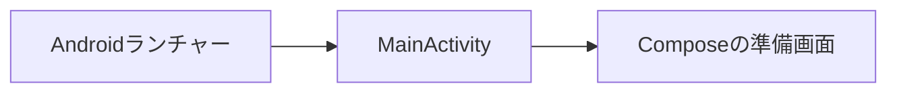

# Androidアプリ設計

[文書索引へ戻る](00_シッテムの箱_ドキュメント索引.md)

## 目的と現在の範囲

既存のDiscord・Records・Webを維持し、友人向けのAndroidネイティブアプリを段階的に追加する。
現段階はC01の最小アプリと、先行するデザイン基盤である。製品機能の提供やGoogle Playへの配布を完了した状態ではない。

| 段階 | 内容 | 現在の扱い |
|---|---|---|
| C01 | Gradle Wrapper、Version Catalog、最小Compose画面 | 今回の実装範囲 |
| デザイン基盤の先行実装 | Expressiveテーマ、独自配色・書体・背景、準備画面 | C01を維持した追加差分。C02の機能実装とは分離 |
| C02〜C04 | Circuit・Metro、Android CI、CodeQL接続 | 未実装 |
| 後続 | 認証、記録閲覧、暗号化保存、署名済み配布 | 未実装。未使用のAPI・権限は先行追加しない |

## 最小構成

`apps/records-android/`を独立したGradleプロジェクトとし、C01では`:app`の1モジュールだけを置く。
Android Studioで開く場所、必要な環境、実行コマンドは同ディレクトリのREADMEにまとめる。

- KotlinとJetpack Composeで静的な準備画面を表示する。通信・認証・永続保存は行わない。
- AGPのbuilt-in Kotlinを使用し、旧来のKotlin Androidプラグインは重ねて適用しない。
- Kotlin Gradle PluginとCompose CompilerはVersion Catalogの同じKotlin版へ固定する。
- Gradle Wrapperは配布版とSHA-256を固定し、SDK・JDKはリポジトリへ含めない。
- 実行用JDKはTemurinの`.java-version`指定版、生成するJVMバイトコードは17とする。
- minSdkは26、targetSdkは37。Composeの要件に合わせ、compileSdkは37.1（`platforms;android-37.1`）とする。
- debug版はapplication ID末尾に`.dev`を付け、将来の配布版との混同を防ぐ。
- 通信権限や本番接続先は持たせない。端末バックアップと平文HTTPを許可しない。
- SDKパス、ビルド出力、IDE設定、署名鍵をGitから除外する。

## UI・UXの設計方針

Material 3 Expressiveを操作部品とモーションの基盤に採用し、外観はシッテムの箱の独自Design Systemで構成する。
ブルーアーカイブを想起する透明感と未来的な端末の操作感、3人格の親しみやすさを両立する。
公式ゲームのロゴ・画面素材を新たに流用せず、背景・ライン・図形はComposeで描画する。

### 表現とデザイントークン

| 要素 | 明るい表示 | 暗い表示・共通ルール |
|---|---|---|
| 背景 | 氷色 `#F5FBFF` と淡い水色 `#DFF8FB` | 深い紺 `#071724` と青緑 `#123B49` |
| 本文 | 濃紺 `#17324D`、補助文字 `#587087` | 白青 `#EAF8FF`、補助文字 `#A8C5D4` |
| 操作の強調 | コントラストを確保したシアン `#207E99` | 明るいシアン `#80E5F0`。端末壁紙のDynamic Colorへ置換しない |
| パネル | 薄い輪郭、透け感を抑えた読みやすい面 | 一部を斜めに切った角。角丸ボタンと役割を分ける |
| 装飾 | 薄いグリッド、円弧、菱形 | 本文の背後は控えめにし、常時点滅・常時回転・重いblurは使わない |
| 人格色 | アロナはシアン、プラナはピンク、安倍晋三AIはラベンダー | 色だけで識別させず、名前・アイコンを併記する |
| 日本語・数値 | LINE Seed JP Regular／Bold | Materialの通常・強調書体を含め、共通テーマから設定する |
| 英字ブランド | 既存のDelogy | ブランドなど短い装飾見出しだけ。本文や操作説明に使わない |

具体的な値は`ui/ShittimTheme.kt`をAndroid側の正とし、Webの色の役割を踏襲する。
背景とシンボルは`ui/ShittimBackdrop.kt`へ分離する。部品を使う前から大量の共通クラス・モジュールは作らない。
LINE Seed JPは既存WebのWOFF2をTTFへ展開して同梱し、字形の加工・サブセット化はしない。
Delogyは既存TTFをそのまま使用する。出典・OFLはAPKの`assets/licenses/`へ含める。

### 操作とモーション

| 場面 | 採用する表現 | 操作上の制約 |
|---|---|---|
| 押下・選択 | Expressiveの形状変化と応答性のある動き | 意図を示す短い反応。入力を待たせない |
| NEW／OLD | 選択位置が連続して移動・変形する切替 | 選択状態を文字・読み上げでも伝える。C35で接続 |
| 一覧から詳細 | 選んだカード・議題を引き継ぐ展開 | 戻る操作とスクロール位置を維持。長文自体は動かさない |
| ログイン完了 | 約2秒の接続・認証演出 | 実際の認証成功後のみ。通常起動・画面復帰に強制待機を入れない |
| 読み込み | 円弧・リング等の動きと状態文言 | 実処理中だけ。取得できない進捗率を表示しない |
| モーション低減 | Androidのアニメーション無効・時間倍率に従う | 状態・結果・操作可能性は動きなしでも伝わること |

今回の準備画面はExpressiveの押下形状変化とライト／ダーク切替を確認する入口とする。
表示切替は画面内だけの一時状態で、設定保存・ログイン・通信は行わない。準備中という理由で無期限のローディングを流さない。

### 画面実装へ組み込む順序

見た目の決定をC34まで後回しにしない。既存PRの番号順は維持し、各画面の実装時から基本デザインを適用する。

| 段階 | デザイン作業 |
|---|---|
| 現段階 | 共通テーマ・書体・背景と準備画面を実装し、明暗・狭い幅を確認 |
| C16・C21の着手前 | ログインと記録一覧の画面モックで、情報配置・操作位置・主要な遷移を確認 |
| C16〜C25 | 画面実装へテーマを適用。loading・空・失敗・再試行・期限切れも同時に設計 |
| C34 | 実際に繰り返し使う部品を共通化し、全画面の色・書体・形を統一 |
| C35〜C36 | NEW／OLD・ログイン演出、Predictive Back、広い画面・文字拡大・TalkBackを仕上げる |

本文のコントラスト、48dp以上の操作領域、スクロール可能な長文、system barとの余白を各実装で守る。
横幅320dp・文字拡大で内容を切り捨てず、ダークモードでも装飾と文字を識別できるようにする。

### Material 3 Expressiveの全面採用

Material 3 `1.5.0-alpha28`をAndroid全画面の基盤とする。テーマだけの試験採用やstable版との使い分けは行わない。
依存するCompose本体もプレビュー版を採用し、Version Catalogで公式Alpha BOMとMaterial 3を固定する。

| 対象 | 採用版・管理方法 |
|---|---|
| Compose BOM | `androidx.compose:compose-bom-alpha:2026.09.00` |
| Material 3 | `1.5.0-alpha28`を明示固定。BOMの指定と一致させる |
| UI・Foundation・Runtime・Animation・Tooling | BOMが指定する`1.13.0-alpha03` |
| Compose Compiler | BOMの対象外。Kotlinと同じ版を維持する |

`MaterialExpressiveTheme`、`MotionScheme.expressive()`、押下で形が変わるButtonを使用する。
後続の認証・一覧・詳細もこのテーマと部品へ統一する。画面の採用方針であり、認証・通信・保存の安全仕様は変更しない。

Alpha BOMは安定版として保証される構成ではないため、API変更・描画・操作の回帰を更新時の確認対象とする。
更新時はBOMとMaterial 3を一組として扱い、依存解決・ビルド・Lintと明暗の代表画面を確認する。
破壊的変更で操作・アクセシビリティが維持できない場合は、依存の一部だけを下げず、直前に検証した組合せへ戻す。
独自の色・フォント・背景は維持する。

## 確認と今後の境界

C01はWrapper経由のdebug APK生成とAndroid Lintを確認する。
ライブラリ内部や装飾の座標を写した自動テストは追加しない。
デザイン変更はエミュレーターで明暗切替、320dp・文字拡大、アニメーション無効時の操作を確認する。
実機起動、認証、署名済み配布は後続段階で確認し、エミュレーターやビルド成功で代用しない。

初回配布ではRecordsの既存認可を維持し、保存鍵のPQC処理にBouncy Castle、
端末内の秘密鍵保護にAndroid Keystoreを使用する計画とする。C01にはこれらの依存を追加しない。
HTTPSはOS標準TLSを使い、アプリ全体の暗号プロバイダーは置き換えない。

## 公式資料

2026年9月16日に確認。依存の具体的な版は実装の固定設定を正とする。

- [AGP 9.4の互換性](https://developer.android.com/build/releases/agp-9-4-0-release-notes)
- [built-in Kotlin](https://developer.android.com/build/migrate-to-built-in-kotlin)
- [Kotlin Gradle Pluginの版の指定](https://developer.android.com/build/releases/agp-9-0-0-release-notes#runtime-dependency-on-kotlin-gradle-plugin)
- [Gradle Wrapper](https://docs.gradle.org/9.6.0/userguide/gradle_wrapper.html)
- [Material 3と独自テーマ](https://developer.android.com/develop/ui/compose/designsystems/material3)
- [Compose Material 3リリース情報](https://developer.android.com/jetpack/androidx/releases/compose-material3)
- [Compose BOMとプレビュー版の管理](https://developer.android.com/develop/ui/compose/bom)
