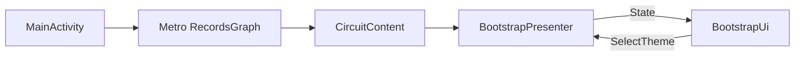
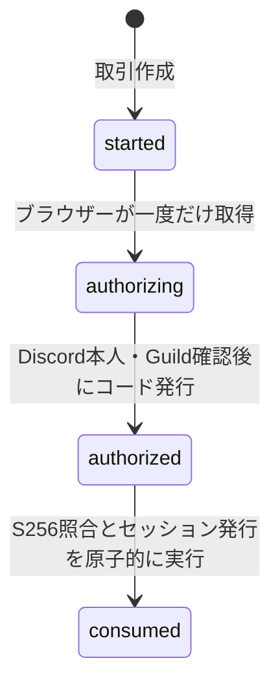
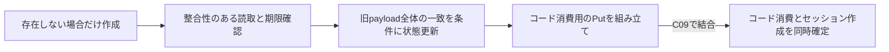
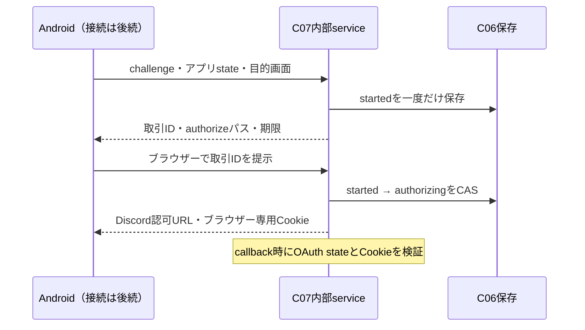
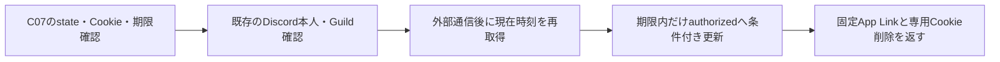
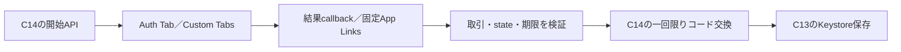
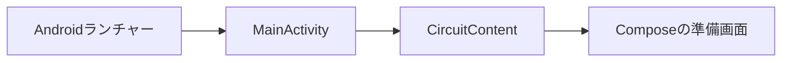

# Androidアプリ設計

[文書索引へ戻る](00_シッテムの箱_ドキュメント索引.md)

## 目的と現在の範囲

既存のDiscord・Records・Webを維持し、友人向けのAndroidネイティブアプリを段階的に追加する。
現段階ではC03までの基盤、C05〜C12のサーバー認証、C13〜C19のAndroid認証・記録1件表示・App Linksを実装済み。C20でPlay内部テスト版の実機ログインと記録表示を確認した。C21〜C25で議論一覧・詳細の表示を拡充した。C26〜C28は保存用秘密鍵・データ鍵・暗号化済み記録の保存部品、C29は認証済みAPIからその保存部品への接続、C30はオフライン認可とログアウト時の記録削除、C31は全記録の同期・キャンセル・再開、C32は保存済み一覧・詳細のオフライン表示とオンライン更新を担当する。実際の配信状態は実装・試験・検証記録で管理する。

| 段階 | 内容 | 現在の扱い |
|---|---|---|
| C01 | Gradle Wrapper、Version Catalog、最小Compose画面 | 実装済み |
| デザイン基盤の先行実装 | Expressiveテーマ、独自配色・書体・背景、準備画面 | C01を維持した追加差分。C02の機能実装とは分離 |
| C02 | Circuit・Metroによる準備画面の状態管理・依存接続 | 実装済み |
| C03 | Android CI | 実装済み |
| C04 | CodeQL接続 | Kotlin 2.4.20へのCodeQL対応待ち。GitHub切替は未実施 |
| C05 | モバイル認証の要求・応答・内部状態 | 契約定義を実装済み。C12で公開接続 |
| C06 | 認証取引と一回限りコードの保存処理 | 条件付き保存・期限確認・消費用transaction部品を実装済み。C09でセッション発行と結合 |
| C07 | ログイン開始とブラウザー認可 | 内部serviceを実装済み。state・Cookie検証をC08から利用。C12で公開接続 |
| C08 | Discord認証結果からアプリ復帰コードを発行 | 本人・Guild確認、最長60秒のコード発行を実装済み。公開接続はC12 |
| C09 | コード交換とモバイルセッション発行 | S256照合、コード消費と90日セッションの一括作成を実装済み。公開接続はC12 |
| C10 | モバイルセッション確認・ログアウト | 90日の絶対期限、本人情報の応答、提示tokenだけの失効を実装済み。公開接続はC12 |
| C11 | Records読取APIへBearer認証を接続 | 議論一覧・詳細へ接続済み。Cookie混在を拒否し、他APIへ認可を広げない |
| C12 | モバイル認証ルートとAWS設定 | 5ルート・共有callback・OpenAPIを既存Auth Lambdaへ接続。追加IAM・設定値なし |
| C13 | Keystoreによるトークン保存 | 保存・読取・削除、改ざん拒否、バックアップ除外を実装。C15〜C16で通信・画面へ接続 |
| C14 | モバイル認証APIクライアント | 4操作の通信・型変換・失敗分類を実装。ブラウザー・画面・保存への接続はC15以降 |
| C15 | ブラウザー認証からアプリ復帰・コード交換 | Auth TabとCustom Tabs fallback、PKCE・復帰検証・保存を接続。ログイン画面はC16、配布証明書の設定と実認証確認はC19 |
| C16 | ログイン・期限切れ・ログアウト画面 | Circuit／MetroへC13〜C15を接続。通信障害と失効、端末削除とサーバー失効を区別 |
| C17 | 記録1件の取得と表示 | ログイン後に最新一覧から1件を取得し、議題・勝者・結論を表示。許可された復帰先の個別記録も取得 |
| C18 | Release variant・署名入力・版番号 | debugと配布用application IDを分離。秘密値を環境変数から受け、未設定時のRelease成果物作成を拒否 |
| C19 | App Links・配布証明書 | 固定callbackと記録リンクをPlay署名証明書に関連付け、許可された記録へのログイン後復帰を接続 |
| C20 | 本人向け内部テスト | Play版のApp Links検証・Discordログイン・記録1件表示を実機で確認。記録リンク復帰と更新試験は未確認 |
| C21 | 議論一覧の最初のページ | 最新12件のカード、依頼者アイコン、読み込み・空・エラー状態を実装。カードから既存の1件表示へ遷移 |
| C22 | 議論一覧の追加ページ | Pagingでcursorを使った追加取得、重複排除、失敗時の再試行、期限切れ時の最初からの再取得を実装 |
| C23 | 議論本文とMarkdown表示 | 3人の初回意見・最終案と結論を表示。Markdownはライブラリへ任せ、外部リンクをHTTPSに限定 |
| C24 | 投票・評価・勝者の表示 | 3人の投票先・理由・得票数、任意の採点内訳と決定方式を表示。勝者は保存済み結果を使う |
| C25 | 親愛度の変化と任意項目 | 旧記録のnull、評価不可、質問評価点と実増減の差を区別。勝利コメント・実行案・注意点も表示 |
| C26 | Keystoreによる保存用秘密鍵の保護 | アカウントに結び付けた暗号文の保存・読取・削除と形式検証。C27で鍵生成に接続、記録保存には未接続 |
| C27 | ML-KEM／HPKEによるデータ鍵保護 | Bouncy CastleのHPKEで32-byteデータ鍵を包む。記録保存には未接続 |
| C28 | Roomの暗号化ペイロード保存 | 一覧・詳細のペイロードを認証付き暗号文として保存。画面・同期には未接続 |
| C29 | 記録Repositoryの暗号化保存・読込 | 認証済み一覧・詳細を保存し、再起動後の復号入口を用意。オフライン表示は未接続 |
| C30 | オフライン認可とアカウント分離 | 最長90日の検証済み許可、期限切れロック、ログアウト・切替時の鍵と暗号文の削除。画面のオフライン表示は未接続 |
| C31 | 全記録の同期・キャンセル・再開 | 全ページを直列照合し、暗号化進捗から再開。C32追加で自動バックグラウンド同期へ変更 |
| C32 | 保存済み表示とオンライン更新 | 期限付き認可でオフライン表示、失敗時の保持、404と全列挙成功後の削除反映 |
| 後続 | ローカル検索・UI仕上げ・友人向け配布 | 未実装。C33以降で分けて進める |

### PRの分割単位

実装計画のC01、C02…を、それぞれ独立したPRとして進める。複数のCを1本のPRへまとめない。
原則は番号順だが、2026年9月20日の合意により、独立したC04を保留してC05へ先行する。
C04を完了扱いにはせず、[Issue #376](https://github.com/pitekusu/shittim-chest/issues/376)で安定版の対応と再開を追跡する。
各PRには対象Cの実装・関連試験・文書を含め、同じCの不具合修正もそのPRで扱う。
C01には合意済みのExpressiveデザイン基盤の先行実装を含めるが、C02以降の機能は追加しない。
PRの公開状態はその工程の依頼に従う。C02・C03は確認後に通常PRとして公開した。
必須CI・CodeQL・レビュー状態を確認し、マージを妨げる問題がなければ、許可された範囲でsquash mergeする。
PR内はレビュー可能な目的別コミットに分けてよい。C番号は実装の区切りであり、Gitのコミット数と一致させる必要はない。
C04はCodeQLの対応後に独立したPRで再開し、C02・C03の機能は混ぜない。

### CodeQLのビルドと切替

2026年9月17日の実行確認では、CodeQL 2.27.0がKotlin 2.4.20を未対応として拒否した。
Kotlin／Compose Compilerは2.4.20を維持し、CodeQLの対応版を待つ。
Android解析の追加は保留し、既存3言語の解析・必須条件は維持する。
Androidの解析未完了を成功として扱わず、対応版で抽出成功を確認してからGitHub側へ追加する。

再開時は既存の`.github/workflows/codeql.yml`へKotlinの`manual`モード解析を追加する。
TemurinはAndroidの`.java-version`から読み、SDK Platform 37.1とBuild Tools 36.0.0を用意する。
CodeQL初期化後にWrapperから`assembleDebug`を実行し、キャッシュや差分コンパイルによる抽出漏れを防ぐ。
エミュレーター、署名鍵、認証情報は使用しない。通常のAndroid CI（C03）とは役割を分ける。

Python・JavaScript/TypeScript・GitHub ActionsはUbuntu 26.04への固定のため先に同workflowへ移す。
既存のチェック名と`security-extended`を維持し、PR、mainへのpush、週次定期実行、手動実行を対象にする。
GitHubのdefault setupとadvanced setupは併用せず、切替手順は
[GitHub・CI-CD詳細設計](15_GitHub・CI-CD詳細設計.md)に従う。

### Kotlin Compiler Native Image

Kotlin 2.4.20のNative Image版を単体CLIとして利用する。
GraalVMで事前コンパイルされたKotlin/JVMコンパイラーであり、
アプリをKotlin/Nativeへ移行するものではない。Material 3やJVM targetも変更しない。

2026年9月17日にLinux x86_64の公式配布物をSHA-256照合して導入し、
単体Kotlinのコンパイル・実行とCompose Compilerによる最小Composableの変換を確認した。
`-include-runtime`は配布物内のリソース参照で失敗したため、通常のclass出力と
標準ライブラリを指定する実行方法を使う。上流の非推奨API警告は抑制しない。

Kotlin Gradle Plugin 2.4.20ではNative Image選択の正式な設定は確認できていない。
CLIの導入だけでAGPの
`:app:compileDebugKotlin`が置き換わるわけではなく、APKビルドは従来の方式を維持する。
Gradle連携を独自実装せず、正式な連携経路を確認できた時点で改めて採用する。
CodeQL互換性も別の条件であり、Native Imageを解析回避には使わない。

配布仕様は[Kotlin 2.4.20のNative Image](https://kotlinlang.org/docs/whatsnew2420.html#native-image)、
利用方法はリポジトリの`apps/records-android/README.md`を参照する。

## 高レベルAPI・ライブラリ優先の開発方針

対象はAndroidアプリと、それを支えるPythonの認証・閲覧APIとする。Coreの討論処理や無関係なRecords機能は含めない。
既存のMaterial 3 Expressive・Circuit・Metro・Ktor・kotlinx.serialization・Pydanticを活用し、全面的な作り直しは行わない。
Authlib・Auth Tab・認証検証の共通化も維持する。この方針の追加では、公開API・保存形式・認可範囲を変更しない。

実装前に既採用ライブラリと標準SDKの高レベルAPIを確認し、足りない場合は保守されている外部ライブラリを検討する。
採用時には保守状況・ライセンス・脆弱性・既存バージョンとの互換性・依存の増加・安全な設定の可否を確認する。
独自実装は必要な安全条件・互換性・性能・端末機能を満たせない部分に限定し、理由を設計またはコードへ短く残す。
行数削減や抽象化した見た目のために層を追加せず、専用の承認工程や大量の比較資料も設けない。

### 用途ごとの採用先と責務

「継続」は既存実装を利用する方針、「導入予定」は該当C工程で実装・検証する方針であり、導入済みとは扱わない。
詳細な依存バージョンはVersion Catalog・lockfileを正とし、この表へ重複管理しない。

| 用途・工程 | 採用先 | 独自処理を残す理由・境界 |
|---|---|---|
| Python認証（継続） | Authlib、Pydantic、共通認証ガード | OAuthの要求・応答や型検証はライブラリへ任せる。Guild・管理者・本人限定の規則はサービス固有の認可として管理 |
| C13：トークン保存（継続） | Android Keystore、標準暗号API、AtomicFile | 鍵の保護・暗号演算・原子的なファイル更新を利用。用途への束縛と保存形式の検証は残し、高レベル化だけを理由に形式を変えない |
| C14：認証通信（継続） | Ktor、kotlinx.serialization | 通信・JSON変換を利用。再送防止・応答上限・秘密非表示は認証専用の境界として維持 |
| C15：ブラウザー認証（継続） | Auth Tab、Activity Result API | 起動・結果受け渡しを利用。非対応ブラウザーのfallbackも同じ固定callback・取引・state・期限の検証へ接続 |
| C16：認証画面／C17：通常API（接続済み） | 既存Circuit、Metro、AndroidX ViewModel／Activity Result。記録JSONの変換に[Ktor ContentNegotiation](https://ktor.io/docs/client-serialization.html)を使用 | 認証の寿命はViewModel、描画状態・イベントはCircuitへ任せる。記録本文の一時表示だけ行い、永続キャッシュや全件取得を先行追加しない |
| C21：画像表示（接続済み） | [Coil AsyncImage](https://coil-kt.github.io/coil/compose/) | 取得・縮小はCoilに任せる。署名付き画像のdisk cacheを無効化し、認証状態から離れた際にmemory cacheを消去 |
| C22：一覧の追加取得（接続済み） | [Paging／PagingSource](https://developer.android.com/topic/libraries/architecture/paging/v3-overview) | loading・retry・要求制御を任せる。APIのcursorを接続し、期限切れcursorでは最初のページから取得し直す |
| C23：Markdown（接続済み） | [Compose Markdown RendererのMaterial 3対応](https://github.com/mikepenz/multiplatform-markdown-renderer) | 独自パーサー・WebViewは追加しない。外部リンクはHTTPSの絶対URLだけを許可し、Markdown画像URLは取得しない |
| C26〜29：暗号化保存（導入予定） | Bouncy Castle、Android Keystore、[Room](https://developer.android.com/training/data-storage/room) | 独自暗号方式・DBアクセス基盤は作らない。保存形式・鍵の取り扱いを管理し、Roomには暗号化済み本文を保存 |
| C31〜C32：同期 | Coroutines、WorkManager、保存済み進捗からの再開 | バックグラウンド継続を新要件として受け、予約・制約・再試行をWorkManagerへ任せる。差分照合・本人認可・暗号化の再開点だけをサービス側で管理 |

### C15までの独自処理を残す理由

次の処理はライブラリを使わないためではなく、既存APIだけでは満たせない安全条件やサービス固有の契約を守るために残す。

| 処理 | 残す理由 | 詳細の参照先 |
|---|---|---|
| 認証POSTのone-shot body | 接続復旧retryの無効化だけでは防げない再送を抑え、一回限りコードの意図しない再交換を防ぐ | C14「通信と失敗の境界」 |
| 認証応答の上限付き読み込み | Content-Lengthの有無や正しさに依存せず、実際の応答を64 KiBまでに制限する | C14「通信と失敗の境界」 |
| JSON辞書化前の重複キー・サイズ検査 | 辞書化後のPydantic検証だけでは失われる重複キーを検出し、大きすぎる入力も先に拒否する | C12、`mobile_http.py` |
| DynamoDBの条件付きtransaction | 一回限りコードの消費とセッション発行を原子的に行い、期限・競合・二重消費をサービスの契約どおりに制御する | C06・C09 |
| 標準ライブラリによる短いS256、固定callback照合、期限・権限判定 | 暗号方式やOAuth全体を独自実装せず、開始端末との束縛とサービス固有の許可条件だけを扱う | C09〜C11、C15 |

これらをライブラリへ移すことだけを目的に、新しいProtocolやDI層を作らない。
FastAPIへの全面移行、新しい認証基盤、ORMの導入もこの方針の対象外とする。

### 各C工程への組み込みと確認

- 既存のC単位・PR単位を維持し、必要になる工程で依存を導入・固定する。未使用の依存は先行追加しない。
- 導入時に互換性と安全設定を確認する。問題があれば採用判断を見直し、独自実装へ即座に切り替えたり、Kotlin・Compose・Materialの既定バージョンを無断で変えたりしない。
- 試験は利用する機能と自サービスとの接続境界に絞る。ライブラリ内部の再試験、件数・カバレッジ目標は追加しない。
- 認証は再送防止・期限・二重交換・権限分離・秘密非表示を維持する。画像・DBは平文キャッシュとログアウト後の情報残存を確認する。
- Markdownは長文・リンク・主要構文に加え、Releaseビルドでの表示を確認する。
- 方針・文書だけの変更は文書整合・mirror・公開情報・差分を確認する。関連変更のない成功済み試験は繰り返さない。
- 実署名・App Links・実Discordログインの確認は引き続きC19で行い、今回の文書整備の完了条件へ追加しない。

## C02：CircuitとMetroの接続

画面は1つのまま、表示状態とUIの責務を分ける。通信・認証・DB・通知・架空の遷移先は追加しない。

- Circuit 0.39.0とMetro 1.4.4をVersion Catalogで固定する。Kotlin／Compose Compiler 2.4.20とMaterial 3 1.5.0-alpha28は維持する。
- `RecordsGraph`はActivityごとに1回生成し、実際に使うCircuitとPresenterだけを提供する。Application全体のscopeや空のRepositoryは設けない。
- `BootstrapScreen`は固定の画面識別子、`State`は表示選択、`Event.SelectTheme`は操作入力を表す。まだback stackを作らず、画面識別子の永続化もしない。
- `BootstrapPresenter`が`rememberSaveable`で表示選択を保持し、Activity再生成時に復元する。端末設定やアカウント設定には保存しない。
- `BootstrapUi`はStateから描画し、操作をeventSinkへ返す。スクロールなどUI固有の状態はUI側に残す。
- C01のMaterialExpressiveTheme、MotionScheme、排他的ButtonGroup、Expressive List、semantic color、余白と文字拡大時のoverflowを維持する。
- UI Previewは固定Stateを渡して表示し、DIや外部サービスを必要としない。MetroのCircuit codegenやKSPはこの1画面には追加しない。

## C03：Android CI

[CI設計](15_GitHub・CI-CD詳細設計.md)の`android-gate`で、ローカルと同じJDK・Wrapper・SDKを使い、
debug APK／テストAPK・LintとAPI 36の画面テストを実行する。画面・認証・配布機能は追加しない。

- C02の既存2件をそのまま実行し、別の大量のテストや端末matrixは設けない。
- Android専用差分では無関係なCore／Recordsの全試験を実行しない。共通CI・分類器の変更は両側を検証する。
- `android-gate`は必要なビルドの失敗・取消・skipや分類失敗を成功扱いしない。
- レポートのみを短期保存し、APK／署名済み配布は後続工程に残す。
- Kotlin 2.4.20とMaterial 3 1.5.0-alpha28は維持する。CodeQL対応待ちのC04は分離する。

## C05：モバイル認証の契約（公開前）

Recordsの`mobile_auth.py`に要求・応答と内部状態を定義する。既存の`PublicModel`、`SessionUser`、
OAuth／セッション有効期間を再利用する。C05では`AuthService`・WebのCookie／CSRF・Discord callbackを変更しない。
APIはC12まで公開せず、C05ではDBアクセス・トークン発行・PKCE照合・状態遷移の実行を行わない。
`mobile-auth.schema.json`は既存の契約生成コマンドで生成するが、live OpenAPIとWeb validatorには混ぜない。

### 受け渡しと期限

Androidはログインごとにランダムなverifierとstateを用意する。verifierは43〜128文字のASCII unreserved文字、
challengeはSHA-256をpaddingなしbase64urlにした43文字、方式は`S256`だけとする。
このPKCEはAndroidとRecords間の一回限りコードの交換を保護するもので、Discord OAuthのPKCE対応を仮定しない。
方式・長さは[RFC 7636](https://www.rfc-editor.org/rfc/rfc7636.html)、外部ブラウザーとApp Linksの方針は
[RFC 8252](https://www.rfc-editor.org/rfc/rfc8252.html)に基づく。

| 境界 | 契約 |
|---|---|
| ログイン取引 | 開始から最長10分。ブラウザー往復で延長しない |
| 一回限りコード | 発行から最長60秒、かつ取引期限まで |
| モバイルセッション | 発行から90日の絶対期限。利用で延長せず、refresh tokenを設けない |
| アプリstate・取引ID・コード・Bearer token | 独立した256-bit乱数をpaddingなしbase64urlで表す。アプリstateは端末内の開始値と照合 |
| アプリ復帰先 | Records設定のHTTPS origin＋固定`/auth/mobile/callback`。任意のredirect URIは受け付けない |
| 復帰query | `transaction`・`code`・`state`のみ。アクセストークン・Discord token・ユーザー情報を載せない |
| 認証後の目的画面 | `/`または`/records/{43文字のrecordId}`のみ。query・fragment・外部URL・管理画面は拒否 |

期限ちょうどは失効とし、後続実装で毎回サーバー時刻と比較する。TTL削除を待たない。
App Linksの公開証明書と配布版の接続はC19で確定する。C05はAndroid manifestや公開ページを追加しない。

### APIの入出力

C05で定義した以下の契約をC12で公開ルートへ接続する。全応答を`private, no-store`とする。
JSONはcamelCase、unknown field・余分／重複queryを拒否し、検証例外は固定コードだけへ変換する。

| ルート | 入力／出力 |
|---|---|
| `POST /api/v1/auth/mobile/start` | `codeChallenge`・`codeChallengeMethod`・`state`・省略時`/`の`returnTo` → `schemaVersion`・`transactionId`・`authorizePath`・offset付き`expiresAt` |
| `GET /api/v1/auth/mobile/authorize` | queryの`transaction`のみ。開始端末に結び付く取引とブラウザーの使い捨てCookieを確認してDiscordへ302 |
| 既存Discord callback | 現在の本人・Guild確認を再利用。モバイル取引だけを固定App Linkへ302。失敗時はコード・セッションを発行せず、Web側で安全なエラーを表示 |
| `POST /api/v1/auth/mobile/exchange` | `transactionId`・`code`・`codeVerifier` → `schemaVersion`・`accessToken`・`tokenType: Bearer`・`expiresAt`・`user`・`isAdmin`・`returnTo` |
| `GET /api/v1/auth/mobile/session` | Bearerを確認し、exchange応答からtoken・returnToを除いた本人情報を返す。無効／失効は401 |
| `POST /api/v1/auth/mobile/logout` | Bearerを失効して204。body・queryなし |

`authorizePath`は固定API originに対する相対パスで、任意URLを開かせない。ブラウザー側の一意な取引使用権はC06〜C08で実装する。
Web CookieとBearerの混在拒否、既存所属・管理者認可、Origin／CSRF、body上限はC07〜C12のHTTP接続で検証する。
リクエスト不正は`mobile_request_invalid`、取引・コード・PKCEの不一致／期限切れ／再使用は同一の
`mobile_grant_invalid`として詳細を漏らさない（公開時の400）。セッション不正は既存の401形式を維持する。

### 内部状態と保存境界

- 状態ごとの型を判別可能なunionにし、`authorizing`はブラウザーnonce／OAuth stateのハッシュ、
  `authorized`はコードhash・期限・opaque requester key・表示名・本人のavatar asset key（欠損時はnull）・所属確認日時を必須にする。
- 期限付き画像URLは保存しない。asset keyは本人の`requesters/{requesterKey}/avatar.webp`だけを許可し、
  セッション応答時に短時間のURLを発行する。これは公開前の内部状態の整理であり、公開DTOや既存データの移行は変更しない。
- 内部の時刻はepoch秒、APIはoffset付き日時。取引10分・コード60秒と取引期限の包含関係を型の検証で守る。
- コード・verifier・Bearer tokenの平文を内部状態に保存しない。ID・nonce・コードは用途別HMACで保存する設計とする。
  client stateだけはアプリへそのまま返す相関値として保持するが、それだけで認証や交換を許可しない。
- 状態の形の検証と、保存時のCAS／原子更新・有効期限判定は別物。C06で保存部品を用意し、C09でコード・S256照合とセッション発行へ接続する。
- `repr`と検証エラー表示へ機密フィールドを出さない。HTTP／adapterでPydanticの`errors()`や入力全体をログに記録しない。
- C05の試験はredirect・S256入力境界・状態必須項目・期限の関係・内部情報の非公開・既存OpenAPI不変に絞る。

## C06：認証取引の条件付き保存（公開前）

`mobile_auth_adapters.py`の`DynamoMobileAuthStore`を既存Session Table向けの独立adapterとして用意する。
既存Webの`OAUTH#`・`SESSION#`は変更せず、公開handler・AWS権限・認証フローにはまだ接続しない。

| 保存項目 | 内容 |
|---|---|
| PK／SK | `MOBILE#<transaction_hash>`／`TRANSACTION`。取引IDそのものは渡さない |
| メタ情報 | `schema_version=1`、`record_type=mobile_transaction`、TTL用`expiresAt` |
| payload | C05の状態型をJSONとして保存。認可前後で同じ取引・challenge・state・目的画面・開始日時・期限を維持 |
| 消費後 | `consumed`と消費日時を保存。コードhash・本人プロフィール・所属確認日時は残さない |

- `create`は上書き不可。`advance`は`started → authorizing → authorized`だけを許可する。
  ブラウザーの二重取得、コード再発行、異なる取引・端末への差し替え、期限延長を拒否する。
- 更新は読んだ状態全体と保存済みpayloadが一致する場合だけ成功する。同時要求では一方だけが進み、
  読み取り後に状態が変わった要求は`mobile_grant_invalid`で止める。
- 取引・コードの期限ちょうどは無効。TTL削除前でも読み取りと書き込みの両方で拒否する。
  保存形式の破損は入力を含まない`mobile_transaction_invalid`とする。
- `consumption_write`は実行せず、条件付きPutだけを返す。C09でコードとS256を照合した後、
  セッション作成と同じ`TransactWriteItems`へ渡す。単独のコード消費メソッドは設けない。
- 用途別HMAC・ランダム値の生成、Cookie／OAuth照合はC07以降の呼び出し側の責務である。
  このadapterは検証済みの状態型とハッシュだけを受け取り、ログへ保存内容を出さない。
- DynamoDB Localで同時取得・同時消費・再発行拒否・期限境界・セッション側の失敗時に未消費で残ることを確認する。
  単体試験は破損データ、束縛の変更、状態飛ばし、保存障害を扱う。未使用の公開APIやIAMを先行追加しない。

## C07：ログイン開始とブラウザー認可（公開前）

`mobile_login.py`の`MobileLoginService`はC06の保存インターフェースを使い、既存のHMAC・Cookie・
時刻処理と検証済みOAuth設定を再利用する。外部SDK・Discord APIクライアント・セッション発行権限は持たない。

| 処理 | 実装済みの動作 |
|---|---|
| `begin` | 検証済みS256 challenge・アプリstate・目的画面を、独立乱数の取引IDと開始から10分の期限に結び付けて保存。取引IDの平文は保存せず、固定相対authorizeパスを返す |
| `authorize` | 未使用かつ有効な`started`だけを取得し、ブラウザーnonceと独立OAuth stateを生成。C06のCASが成功した場合だけDiscord認可URLと専用Cookieを返す |
| `validate_callback` | OAuth stateの書式・取引・期限・`authorizing`状態、stateとCookieのHMACを検証。コード消費やDiscord本人確認は行わず、C08へ渡すsnapshotを返す |

- アプリstateとDiscord OAuth stateは別物。後者は`m.<取引ID>.<独立256-bit乱数>`とし、C12で共有callbackの
  モバイル処理を判別できるようにする。prefix・取引IDだけでは受理せず、state全体のHMACを照合する。
- HMACの用途を`mobile-transaction`・`mobile-browser-nonce`・`mobile-oauth-state`へ分離する。
  OAuth state・nonceはハッシュだけを保存し、認可URLとCookieは`repr`へ出さない。
- Cookieは`__Host-shittim-records-mobile-oauth`とし、Webログイン用を上書きしない。
  `Secure`・`HttpOnly`・`SameSite=Lax`・`Path=/`、Domainなし。Max-Ageは取引の残り秒数に限定し、期限を延長しない。
- 認可先とcallback先・scopeはサーバー側の固定値／設定だけを使用する。アプリstate・challengeをDiscordへ送らない。
- callback検証自体は読取のみ。C08では本人・Guild確認後に返されたsnapshotをCASしてコードを発行する。
  失敗したモバイルcallbackをWeb処理へフォールバックさせない。公開接続はC12で行う。
- `test_mobile_login.py`でCookie・期限・独立state・取引間の差し替え・CAS失敗・再使用・秘密非表示を確認する。
  既存Web認証／HTTP試験も維持する。実Discordログインや本番データ書き込みはこの工程の試験に含めない。

## C08：Discord認証後のアプリ復帰コード（公開前）

`mobile_callback.py`の`MobileCallbackService.complete`を内部処理として追加する。
既存HTTP callbackへの分岐追加、モバイルルート、IAM、AndroidのApp Linksはこの工程では接続しない。

- `auth.py`の`authenticate_discord_requester`をWeb／モバイルで共有する。
  Discord token交換、所属確認、表示名の優先順、既存HMACによるrequester key、アバターのbest-effort保存を維持する。
  Web側のstate消費、90日セッション、CSRF、Cookie、復帰先は変更しない。
- 本人確認前にブラウザー束縛を検証し、通信後にも取引期限を確認する。
  コードは独立した256-bit乱数で、保存するのは用途`mobile-code`のHMACのみ。
  有効期限は発行時から60秒と、元の取引期限の早い方にする。
- C06のCASで`authorizing → authorized`を確定してからだけ、固定HTTPS originの
  `/auth/mobile/callback?transaction=…&code=…&state=…`を返す。競合・期限切れ・再使用ではコードを返さない。
  URLへDiscord token、セッションtoken、プロフィール、認証後の目的画面を載せず、`repr`にも復帰URLを出さない。
- 削除対象CookieはモバイルOAuth専用だけ。WebセッションやCSRF Cookieを発行・削除しない。
  認証失敗時はコードを発行せず、既存の固定エラーを伝える。公開時の安全なエラー表示はC12で接続する。
- `test_mobile_callback.py`で発行・再使用・通信中の期限切れ・CAS競合・Guild確認失敗・秘密非表示を確認する。
  保存試験と既存Web認証／HTTP試験も実行する。一回限りコードのS256照合と原子的消費・セッション発行はC09が担当する。

## C09：コード交換とモバイルセッション発行（公開前）

`mobile_exchange.py`の`MobileExchangeService.exchange`は、C08のコードと開始端末のverifierを照合する。
Discordへの再問い合わせ、Webセッション作成、Cookie発行、公開ルートやIAMの変更は行わない。

1. 取引IDの用途別HMACで読み取り、`authorized`状態・元の取引期限・コード期限を確認する。
2. コードのHMACと、[RFC 7636のS256](https://www.rfc-editor.org/rfc/rfc7636.html#section-4.6)で変換したverifierをconstant-time比較する。
3. アバターの短時間URLを含む応答を準備する。準備失敗ではコードを消費せず、準備後にも期限を確認する。
4. 独立乱数のBearer tokenを作り、C06の条件付き消費・セッション新規作成・既存形式のプロフィール更新を
   1回のDynamoDB transactionで確定してからだけ応答を返す。

| 保存先・項目 | 契約 |
|---|---|
| `MOBILE_SESSION#{hash} / META` | Webの`SESSION#`と別のnamespace。tokenのHMAC用途も`mobile-session`として分離 |
| 保存payload | opaque requester key、表示名、本人のavatar asset key、Guild確認日時、発行・失効日時。token・verifier・署名付きURL・管理者判定は保存しない |
| 有効期限 | 発行時刻から90日。期限は`expiresAt`にも保存し、延長・refresh tokenは設けない |
| コード消費 | 取得済みpayload全体の一致が条件。競合した要求は別tokenで2つ目のセッションを作れない |
| 失敗 | コード側の条件不一致は`mobile_grant_invalid`。セッションキー衝突や一時的なtransaction失敗は`mobile_session_unavailable`として区別 |

セッションは上書きせず、プロフィールを含む書き込みの一部だけを確定させない。
書き込み後の応答紛失では同じコードからtokenを再発行せず、ログインをやり直す。
セッションの読取・90日期限の認可時確認・失効はC10、既存読取APIへのBearer接続はC11、HTTP公開はC12で行う。

試験はRFCの公開vector、異なるコード／verifier／取引、期限境界、応答準備失敗、秘密非表示に絞る。
DynamoDB Localの既存C06試験は仮のsession書き込みをC09の実処理へ置き換え、同時交換で1件だけ作成されること、
セッション作成失敗時にコードとプロフィールが変更されないこと、Web用として読めないことを確認する。

## C10：モバイルセッション確認とログアウト（公開前）

保存部品はC09の`MOBILE_SESSION#{hash} / META`をそのまま使い、移行やテーブル変更を行わない。
`DynamoMobileAuthStore.get_session`は強い整合性で読み、schema・キー・期限属性・payload全体の一致を検証する。
破損データは`mobile_session_record_invalid`とし、例外に保存内容を含めない。DB障害を未ログインとして隠さない。

削除は指定tokenのHMACに対応する1件だけに限定する。Webの`SESSION#`、別端末のセッション、
プロフィール、認証取引は変更しない。期限判定は自動削除ではなく、セッション確認処理が担当する。
保存試験は破損データの拒否と障害の伝播、DynamoDB LocalでC09形式の読取と削除対象の分離を確認する。

`mobile_session.py`の`MobileSessionService`が、保存部品へ次の認可処理を接続する。

| 操作 | 動作 |
|---|---|
| `authenticate` | 43文字のtokenを用途別HMACへ変換し毎回読取。DB応答後のサーバー時刻で、発行以降・90日の期限未満だけを認証済みとする |
| `session` | 本人の表示名・アバター、現在の管理者設定による`isAdmin`、元の`expiresAt`を返す。token・内部キー・認証取引は返さない |
| `logout` | 有効なtokenを確認してその1件の削除完了を待つ。プロフィールや他セッションを変更せず、tokenの再発行もしない |

- アバターURLは確認の都度作り直し、応答準備後にも期限を確認する。セッション期限自体は延長しない。
- 未指定・形式不正・未登録・削除済み・期限切れは認証不可。`session`と`logout`は`session_required`を返し、公開時に401へ変換する。再度のログアウトも同じ扱いとする。
- tokenや本人情報をlogへ出さず、応答の`repr`にも含めない。DB／アバター障害を成功や未ログインの応答へ置き換えない。
- 試験はC09発行tokenとの接続、90日期限の直前／一致、形式不正、失効後の再利用拒否、別端末の維持、管理者判定・アバター更新、公開項目の限定を確認する。

今回もHTTPルート・Cookie・IAM・本番設定は変更しない。既存読取APIのBearer認証はC11、公開接続はC12が担当する。

## C11：Records読取APIのBearer認証

`ReadHttpController`へモバイルセッションの読取口を追加する。C10の期限確認は
`authenticate_mobile_session`として共用し、Read側へアバター署名・管理者設定・書込権限を要求しない。

| 入力 | 読取時の扱い |
|---|---|
| WebのセッションCookieのみ | 従来のWebセッションと期限を確認。既存の閲覧範囲・応答形式を維持 |
| `Authorization: Bearer <token>`のみ | 議論一覧・詳細の2つのGETだけで、モバイルセッションを毎回確認 |
| AuthorizationとCookieの併記 | 有効／無効にかかわらず400。どちらかへフォールバックしない |
| 不正・複数のAuthorization、期限切れ・削除済みtoken | 読取を許可しない。認証失敗は401、保存データ破損は503 |
| URLやbodyに載せたtoken | 認証情報として使用しない |

Bearerの利用先は`GET /api/v1/records`と`GET /api/v1/records/{recordId}`に限定する。
ランキング・モモトーク・ADMIN・メモリアル・書込操作には広げない。アプリからWebの機能を開く場合はWeb側でログインする。
成功・失敗とも`private, no-store`を維持し、Authorization付き要求の認証401にはBearer challengeを付ける。
通常の一覧query・cursor・詳細の検証と公開フィールドは、Webと同じ処理を使用する。

Read Lambdaには既存クライアント・セッション表・HMAC鍵で`DynamoMobileAuthStore`を接続する。
新しいIAM権限・環境変数・ルート・DB書込は追加しない。管理者設定をRead Lambdaへ渡さない。
HTTP境界の想定外障害は固定の503へ変換し、ログは処理名・例外型だけとする。
OpenAPIでは2つのGETだけにCookieまたはopaque Bearerの選択を記載し、他のAPIの認証方式を変えない。

試験はWeb／Bearerの応答一致、混在・重複header、不正token、期限・失効、対象外API拒否に絞る。
既存Web認証・管理画面の認可処理は変更しない。新しいモバイル認証ルートの公開はC12で行うため、
この段階だけでアプリのログインが利用可能になるわけではない。

## C12：モバイル認証のHTTP境界と公開接続

`mobile_http.py`はC07〜C10の処理に薄いHTTP境界を設ける。JSON body・queryはそれぞれ4 KiB以下とし、
余分な項目、重複JSON field／query、base64 bodyを拒否する。成功・失敗とも`private, no-store`とする。
開始・交換はCookie／Authorizationを受け付けず、確認・ログアウトはBearerだけを使用する。
ネイティブ通信ではOriginを要求しないが、付いていれば設定済みHTTPS originとの完全一致を要求する。
ブラウザーのCookieに依存する認可・callbackは専用nonceとOAuth stateを照合し、Webセッションとは分離する。

共有Discord callbackは`m.`で始まるstateをモバイルへ振り分ける。この判別自体に認証効果はなく、
state全体・専用Cookie・期限を既存処理で照合する。重複state・キャンセル・不正CookieでもWebへフォールバックしない。
失敗時は外部入力を含まないHTMLで再ログインを案内し、モバイルOAuth Cookieだけを消す。
開始→認可→callback→交換→議論閲覧→ログアウトを架空データで通し、コード再使用拒否とWeb認証の維持を確認する。

既存Auth Lambdaの`live` aliasへ5つのHTTP API v2ルートを接続する。Session Table・用途別HMAC・
SSM設定・`requesters/`のアバター権限は既存のものを使い、IAM・環境変数・テーブル・indexを追加しない。
API Gatewayの既存スロットリングと、本文・query・headerを記録しないアクセスログを維持する。
OpenAPIへ認証DTOを追加するが、Web用schema／standalone validatorへモバイル専用型を混入させない。

通常PRのRecords Releaseで配信し、匿名session／logoutの401・no-store・Bearer challengeをsmokeで確認する。
smokeは取引作成・セッション削除・実Discord認証を行わない。復帰先と既存Discord callback設定は変更せず、
Androidの鍵保存・ログイン画面はC13〜C16、署名済みApp Linksの証明書確定はC19で行う。

## C13：端末内トークンの暗号化保存

`auth/KeystoreTokenStore.kt`を、C14以降の認証処理から呼ぶ小さな保存部品とする。
未使用のRepository・DI scope・認証画面・通信権限は追加しない。

| 対象 | 契約 |
|---|---|
| 保存内容 | `StoredToken`の43文字Bearerとサーバー発行のepoch秒の有効期限。氏名・画像・Discord tokenは保存しない |
| 鍵 | アプリ専用のAndroid Keystore AES-256鍵。GCM／NoPadding・128-bit tag・暗号化ごとの96-bit IV。鍵のexportや独自暗号providerを使わない |
| 保存形式v1 | version 1 byte＋IV 12 bytes＋暗号化payload 51 bytes＋tag 16 bytes。用途・package・versionをAADで束縛 |
| 保存先 | credential-protectedな`noBackupFilesDir`。既存のバックアップ無効化とcloud／device-transfer除外も維持 |
| 更新 | `AtomicFile`で暗号文だけを書き、完了後に再読込して一致確認。複数インスタンスの操作を単一process内で直列化 |
| 失敗 | 不正形式・改ざん・鍵消失・I/O失敗は固定`token_storage_unavailable`。原因例外やtokenを表示せず、平文へのfallbackもしない |
| 削除 | 専用鍵を失効させてから本体・作業ファイルを除去。失敗を成功扱いせず、他の鍵やアプリデータを削除しない |

`read`は未保存ならnull、破損や鍵消失なら例外とする。読取時に鍵を再作成せず、
鍵消失後の保存は明示的な`clear`を必要とする。既存内容を黙って消去・置換しない。
保存／読取だけでは認証成立・有効期限延長としない。期限切れの画面状態はC16、
記録キャッシュのオフライン認可はC30で接続する。`clear`はローカル削除であり、サーバーのlogoutとは別である。

`StoredToken`の文字列化は伏せ字とし、OSの例外をログ・上位例外へ引き渡さない。
平文payloadと復号用byte配列は使用後に消去するが、JVM上の全コピーや侵害されたprocessまで秘密を保護できるとは扱わない。
生体認証・StrongBoxを必須にせず、ハードウェア内保護の有無は端末に依存する。PQCを用いる記録保存はC26〜C29に分離する。

API 36のinstrumentation testで保存・再読込・IV更新・鍵の非export・改ざん／鍵消失・削除範囲・書込失敗を確認する。
実ユーザーの資格情報と別のテスト用directory／aliasを使う。エミュレーターの成功は実機のハードウェア保護確認と混同しない。
実装根拠は[Android Keystore](https://developer.android.com/privacy-and-security/keystore)、
[AtomicFile](https://developer.android.com/reference/android/util/AtomicFile)、
[バックアップの除外](https://developer.android.com/identity/data/autobackup)を参照する。

## C14：モバイル認証APIクライアント

`MobileAuthModels.kt`は[モバイル認証契約](https://github.com/pitekusu/shittim-chest/blob/main/contracts/records/v1/mobile-auth.schema.json)に対応する
開始・交換・セッション応答と本人情報のKotlin型を持つ。サーバー側の契約やWeb validatorは変更しない。

- S256、43文字のopaque値、verifierの長さ、許可された`returnTo`、schema version 1、Bearer方式を検証する。
- ブラウザーに渡す`authorizePath`は、応答の取引IDと一致する固定相対パスだけを受理する。
- offset付き日時を`Instant`へ変換し、C13へ渡す秒単位の絶対期限を保持する。期限延長や認可判定は行わない。
- 正常応答の未知fieldは読み飛ばし、将来の任意field追加に対応する。必須値・型・安全上の境界は省略しない。
- DTOを通常classとし、`toString()`にtoken・code・state・verifier・本人情報を含めない。

通信依存はKtor 3.6.0、OkHttp engine、kotlinx.serialization 1.11.0、Coroutines 1.11.0を
Version Catalogで固定する。serialization compiler pluginは既存Kotlin 2.4.20と揃える。
2026年9月21日に[Ktor公式](https://ktor.io/docs/client-engines.html#okhttp)と
[serializationのリリース](https://github.com/Kotlin/kotlinx.serialization/releases/tag/v1.11.0)を確認。
1.12.0-RCは今回採用せず、JSON runtimeは安定版を使う。通信・ブラウザー・画面・保存は責務を分ける。

### 通信と失敗の境界

`MobileAuthClient`は`start`・`exchange`・`session`・`logout`のsuspend関数を提供する。
`authorize`はブラウザー用であり、このクライアントからGETしない。固定のRecords HTTPS origin以外へ
要求を送る入口は設けず、`INTERNET`権限だけを追加する。OS標準のTLS／証明書検証と平文HTTP禁止を維持する。

| 項目 | C14の扱い |
|---|---|
| 認証情報 | 開始・交換はJSONのみ。session・logoutだけ明示的なBearerを付け、Cookie・Originを送らない |
| 再送・転送 | KtorのRetry／Auth pluginなし。接続復旧retryとredirectを無効化し、全POSTをone-shot bodyにする |
| 時間・サイズ | 接続10秒、request／socket 20秒。JSON応答はstreamから64 KiB＋1 byteまで読み、上限超過を拒否 |
| 保持 | HTTP cache・Cookie jar・HTTP loggingなし。DTOはメモリ内だけ。保存・削除は呼び出し側の別責務 |
| 終了 | クライアントを再利用し、不要になったら`close`。渡されたテストengineもクライアントが所有する |

OkHttpでは接続復旧retryを無効にしても、503の`Retry-After: 0`による再送があり得る。
POSTはKtorの`ReadChannelContent`を使い、[OkHttp用one-shot body](https://github.com/ktorio/ktor/blob/3.6.0/ktor-client/ktor-client-okhttp/jvm/src/io/ktor/client/engine/okhttp/StreamRequestBody.kt)へ変換させる。
応答不明時にコード交換を自動再実行せず、再ログイン等の判断をC15〜C16へ渡す。

`MobileAuthException`は固定の分類だけを持ち、HTTP・JSON・TLS例外のcauseや応答本文を引き継がない。
通信切断・timeoutは`NETWORK`、401は`AUTHENTICATION_REQUIRED`、400の一回限りコード不正は
`GRANT_REJECTED`とする。その他の400、403、429、5xx、不正な正常応答も別の分類で返す。
キャンセルはそのまま伝播し、通信失敗やログアウト成功に置き換えない。
この層だけでは保存済みtokenを消去せず、refresh・自動再認証・期限延長もしない。

型の2件と[MockEngine](https://ktor.io/docs/client-testing.html)の5件で、4操作、Bearer／Cookie境界、
不正復帰先、401と通信失敗の区別、転送拒否、応答上限、キャンセル、秘密非表示を確認する。
既存のエミュレーターCIへ追加し、本番API・Discord認可・実アカウントへ接続する試験は行わない。
ブラウザー・stateの生成／照合・C13への保存はC15、ログイン画面はC16、実配布でのApp LinksはC19へ分離する。

## C15：ブラウザー認証とアプリ復帰

### Auth Tabと既存APIの接続

[AndroidX Auth Tab](https://developer.chrome.com/docs/android/custom-tabs/guide-auth-tab)を使い、
ブラウザーの起動と認証結果をActivity Result APIで扱う。対応しないブラウザーではCustom Tabsへfallbackし、
固定HTTPS callbackのApp Linksから同じ検証処理へ渡す。Auth Tabの成功結果だけでログイン完了とは扱わない。

- Auth Tabはブラウザー往復を担当する。Records独自のJSON API、PKCE、サーバー側の原子的なコード消費は維持する。
- キャンセル、ブラウザー不在、HTTPS検証失敗・timeoutは成功扱いせず、進行中の試行を終了する。
  fallbackとAuth Tabの両方から結果が届いても、同じコードを二度交換しない。
- HTTPS復帰にはDigital Asset Linksが必要。非対応ブラウザーのfallbackでも検証済みApp Linksを使い、
  custom schemeや任意redirectへ緩めない。署名証明書と`assetlinks.json`の実設定・配布版での確認はC19で行う。
- 成功時は検証済みtokenと絶対期限だけをC13へ保存し、呼び出し元へは結果と許可された目的画面を返す。
  token・code・state・verifierをActivityの結果や永続状態に含めない。

この工程はログイン画面を追加しない。架空応答による開始・復帰・保存の検証と、実Discord／配布証明書での
ログイン確認を分け、ビルドやエミュレーター試験の成功を本番認証の確認とみなさない。

### PKCEと一回限りの交換

`MobileLoginFlow`はC14のクライアントを使い、開始時のverifier・state・取引・目的画面をメモリ内で結び付ける。
同時に進められる試行は1件だけとし、開始・交換を自動再試行しない。

| 境界 | 扱い |
|---|---|
| S256 | `SecureRandom`の独立した32 bytesをverifier・stateに使う。verifierのSHA-256をpaddingなしbase64urlで送信 |
| 復帰URL | 固定HTTPS origin・完全一致のcallback path・3つのqueryだけ。重複・余分なfield・percent escape・userinfo・port・fragmentを拒否 |
| 開始端末との束縛 | 生きている取引IDとstateを照合。stateはconstant-time比較し、verifierはURLへ載せない |
| 有効期限 | サーバーの残り時間と開始から10分の短い方。端末のmonotonic clockで判定し、時計を戻しても延長しない。コードの60秒期限はサーバーが照合 |
| 交換 | 最初のsuspend前に取引を使用中にし、重複Intentでは再交換しない。結果不明の通信失敗でもコードを再使用しない |
| 応答 | 開始時の目的画面との一致と未失効を確認。古い取引、キャンセル済み、開始情報を失ったプロセスからの交換を拒否 |

verifier・stateはBundle、SavedStateHandle、ファイル、logへ保存しない。プロセス終了時は再ログインする。
RFCの公開vectorと架空API応答で、S256・復帰URL・キャンセル・古いコード・期限・交換中の重複・応答不明を確認する。
PKCEの根拠は[RFC 7636](https://www.rfc-editor.org/rfc/rfc7636.html)を参照する。

## C16：ログイン・期限切れ・ログアウト画面

`MainActivity`がActivity再生成をまたいで保持する`MobileSessionModel`をMetro graphへ渡し、
CircuitのPresenterからStateFlowを購読する。ブラウザー起動・復帰はC15のActivity Result契約を再利用する。
新しい認証ライブラリ、Repository、汎用通信層は追加しない。

| 状態 | 表示・操作 |
|---|---|
| 確認中 | 進捗表示。保存tokenをUI thread外で読み、未失効の場合だけsession APIへ確認 |
| 未ログイン | Discordログイン。取消・期限切れ・ブラウザー不在等を区別して再操作を案内 |
| ブラウザー認証中 | 認証中の表示。二重タップでActivityを重ねず、C15の結果を待つ |
| ログイン済み | APIで確認した表示名とログアウト。記録取得・画像取得は後続工程 |
| 通信等の確認失敗 | プロフィールを隠し、再試行または端末ログアウト。通信失敗だけで失効扱い・token削除しない |
| ログアウト中 | 以前のプロフィールを直ちに隠し、追加操作を抑止 |
| 保存領域の障害 | 認証済みとして扱わない。明示削除が成功してから再ログインを許可 |

- 起動時、ログイン成功後、ログイン済み画面のforeground復帰時に保存値とsession APIを照合する。
  Activityの成功結果だけでは認証済みにせず、許可された復帰先だけをメモリで保持する。
- 保存期限とAPI期限の短い方を採用し、画面表示中にも期限到達でロックする。待機はmonotonicなdelayを使い、
  表示中に端末時計を戻しても、その待機を延長しない。絶対期限の最終的な認可はサーバー側で行う。
- 401または期限切れでは端末tokenを削除し、再ログインを案内する。削除失敗を成功扱いしない。
- ログアウトは端末の認証情報を先に削除し、保持していたtokenのサーバー失効を1回だけ試す。
  応答不明ではPOSTを自動再送せず、「端末から削除済み・サーバー失効は未確認」と表示する。
  端末削除が失敗した場合は認証済み画面へ戻さず、明示的な削除再試行を案内する。
- tokenは画面Stateへ渡さない。プロフィール・認証取引をBundleやSavedStateへ保存しない。
  再ログイン時は新しく確認できたプロフィールだけを表示する。記録キャッシュの削除は将来の保存工程で扱う。

架空APIと保存関数で、二重起動・期限・401・通信障害・削除失敗・ログアウト・アカウント切替を確認する。
画面はエミュレーターで操作・明暗・狭幅／文字拡大を確認し、実署名とDiscordの縦断確認はC19に残す。

## C17：記録1件の取得と表示

ログイン済みの場合だけ、C11でBearerを許可した既存Records読取APIへアクセスする。
通常起動では`GET /api/v1/records?limit=1&sort=newest`から最新1件のopaque IDを選び、
続いて`GET /api/v1/records/{recordId}`を取得する。C15から渡された許可済みの個別記録URLがあれば、
そのIDの詳細を直接取得する。空の一覧は「記録がまだない」と表示する。

| 責務 | 扱い |
|---|---|
| 通信・JSON | KtorとContentNegotiationを使用。固定HTTPS origin、Bearer、no-store、redirect禁止、Cookie・disk cache・HTTP loggingなし |
| 表示 | 詳細APIの議題・既存winnerと対応する表示名・最終決定を表示。アプリ側で勝者を再判定しない |
| 認証 | 保存tokenは認証ViewModelの要求callback内だけで使用し、画面Stateへ渡さない。セッションが変わった要求の結果は表示しない |
| 失敗 | 記録404・一時的障害・不正応答を区別して再読込を案内。401ならC16のsession API再確認へ進む |
| 保存 | 質問・結果は画面表示中のメモリだけに保持し、ログアウトで非表示にする。Room・検索用複製・SavedStateは作らない |

C17は縦断動作の最小表示であり、C21の一覧カード、C22のpagination、C23〜C25の詳細項目を先取りしない。
架空APIで一覧→詳細・空・個別復帰先・異なるID／勝者・401を確認し、画面で読み込み・結果・再試行と
狭幅／文字拡大を確認する。実署名でのログインはC19で確認する。

C21以降は通常起動で一覧を表示し、カード選択か個別記録リンクからこの1件表示へ進む。

## C18：Release variantと署名入力

Android Gradle Plugin標準の`release` build typeへupload keyの署名設定を接続する。`debug`は既存の`.dev`付きapplication IDとdebug署名を維持し、releaseは本来のapplication IDを使用する。

| 入力 | 契約 |
|---|---|
| 版番号 | Gradleプロパティ`shittimAndroidVersionCode`は正の整数（既定1）、`shittimAndroidVersionName`は`major.minor.patch`（既定`0.0.1`）。配布時のcodeはPlay提出済みの値より大きくする |
| upload key | keystoreの場所・store password・alias・key passwordをそれぞれ専用環境変数から取得し、build scriptやGradleプロパティに秘密値を保存しない |
| 失敗条件 | 入力またはkeystoreファイルが欠けた場合は`assembleRelease`と`bundleRelease`を成果物作成前に拒否し、欠けた秘密値やファイルパスをエラーへ表示しない |

合成テスト鍵によるAAB署名と、秘密入力なしでの失敗を確認する。実upload keyの発行・管理、Play app signing証明書によるApp Links、実Discordログイン・本人向け配布は後続の別工程とする。署名済み成果物はGitや通常CI artifactへ保存しない。

## C19：App Linksと記録への復帰

`dev.pitekusu.shittim.records`のPlayアプリ署名証明書を、`/.well-known/assetlinks.json`で公開する。
Play Consoleに表示される現行のアプリ署名鍵（従来の鍵・ポスト量子暗号鍵）に加え、以前のアプリ署名鍵がある場合はそのSHA-256も登録する。配布版の実機署名と照合し、アップロード鍵やdebug鍵は登録しない。
Records Webの検証済みartifactに同ファイルを含め、ReleaseでWeb S3へ`application/json`として配置する。
CloudFrontは拡張子付きのパスを書き換えず、同じHTTPS originからGET／HEADを返す。
Release smokeでは200・content type・artifactとの一致を確かめる。証明書の追加やローテーション時はPlay Consoleの表示を確認して更新する。
配信失敗時は直前の`assetlinks.json`へ戻し、初回配信で旧ファイルがなければ削除する。
このロールバックにはRecords配信ロールの対象ファイル限定の削除権限が必要なため、初回配信前にReleaseIdentityの変更を反映する。

| App Link | 受け手と検証 |
|---|---|
| `/auth/mobile/callback` | 専用receiverが固定origin・取引・state・期限を検証し、一回限りコードを交換する |
| `/records/{recordId}` | MainActivityがHTTPSの固定host、query・fragmentなし、43文字のopaque IDだけを受ける。未ログインなら目的記録を保持して認証し、ログイン済みならその記録を取得する |

リンクから来た値をAPIや認証の権限としては扱わない。記録の読み取りは従来どおりBearer認証とAPIの認可で決まる。
無効なリンクはアプリ内の復帰先に採用せず、ブラウザーに開く権限を広げるようなfallbackは作らない。
実upload keyによるAAB提出、Play配布版でのリンク検証、実Discordログインは実際の配布環境が整った時点で確認する。

## C20：本人向け内部テストの配布と確認

初回は本人のGoogleアカウントだけをPlay Consoleの内部テストトラックへ登録する。
内部アプリ共有は別鍵で再署名されるため、App Linksの受入確認に使わない。
upload keyは本人がリポジトリ外で生成・バックアップし、Git・CI artifact・チャットへ秘密鍵やパスワードを渡さない。
ビルド入力とPlay Console操作の具体的な手順は`apps/records-android/README.md`を参照する。

配布前にReleaseIdentityの限定IAM変更とRecords Releaseによる`assetlinks.json`配信を確認する。
Play Consoleに表示されるアプリ署名鍵のSHA-256を改めて全件確認し、配布版の実機署名が公開ファイルに含まれることを確認する。追加の鍵が表示された場合は公開ファイルへ反映してから配布する。
Playの内部テストへ未使用の`versionCode`を持つAABを提出し、本人だけが参加できる状態を確認する。
配布後は実機でOSのドメイン検証、Discordログイン、記録リンクからの復帰、同じupload keyによる更新を確認する。
debug版・エミュレーター・内部アプリ共有はこの受入の代替にならない。
未確認や失敗を成功扱いせず、問題版はより大きい版番号で修正する。友人への配布や公開は後続工程とする。

## C21：議論一覧のカード

ログイン後に`GET /api/v1/records?limit=12&sort=newest`の最初のページを読み、議題の要約、依頼者名・アイコン、完了日、既存の勝者をカードへ表示する。カードを選ぶとC17の1件表示を開く。追加ページの取得・cursor管理はC22に残す。

一覧の読み込み・空・通信失敗を区別し、失敗時は再試行できるようにする。選択先は既存の認証モデルの検証済み復帰先で管理し、画面復帰・回転後に維持する。詳細への往復では取得済み一覧を保持し、画面内ボタン・システムBackで復帰先を解除して一覧のスクロール位置へ戻る。認証更新時は一覧を再取得し、処理済みApp Linkは画面再生成で再適用しない。Bearer tokenは通信中だけ使用し、ログアウト・失効・アカウント切替後の応答を表示しない。署名付きアイコンはCoilの`AsyncImage`で読み、disk cacheを無効化して認証状態から離れた際にmemory cacheを消去する。本文とアイコンを永続保存しない。

## C22：議論一覧の追加取得

既存の12件ずつの一覧APIをPagingの`PagingSource`へ接続し、`nextCursor`がある場合だけ次ページを取得する。初回・追加中・空・失敗を画面に区別して表示し、追加取得の失敗は取得済みカードを残したまま再試行できるようにする。同じ記録IDがページ境界で重なっても一枚だけ表示し、同じcursorが再出現した場合は取得を停止する。

APIの1時間で期限切れになるcursorが`CURSOR_INVALID`になった場合、利用者の操作で最新ページから読み直す。更新に古いcursorを再利用しない。ログアウト・アカウント切替時にはページと選択可能な記録IDを破棄し、従来のBearer認可を維持する。画面内の追加取得と一覧・詳細の往復では、新たな永続キャッシュや全件一括取得は行わない。

## C23：議論本文とMarkdown表示

詳細APIの3人の初回意見・最終案を、既存の議題・勝者・結論とともに表示する。各人格と本文の対応を検証し、欠落・重複・空本文は不正応答として扱う。投票の内訳・評価・親愛度の変化はC24・C25へ残す。

本文のMarkdownはMaterial 3対応のCompose Markdown Rendererへ任せる。ブラウザーへのリンクはアプリ側で絶対HTTPS URLだけに制限し、`intent:`・`file:`・`content:`・認証情報付きURLを開かない。本文中の画像URLへはローダーを接続せず、外部画像を自動取得しない。本文は画面のメモリにだけ置き、ログや端末の永続保存へ流さない。

## C24：投票・評価・勝者の表示

詳細APIに保存された3人の投票先・理由・得票数を表示する。採点の内訳がある記録では、各候補の5項目・総合点・理由を展開して確認できる。過去の記録で採点や決定方式がない場合も投票は表示し、同票時は保存済みの旧方式の説明を使う。

投票者の重複、自己投票、採点対象・点数の範囲、投票・得票数・保存済み勝者の不整合は不正応答として拒否する。新方式では投票先がその投票者の最高採点候補であり、投票理由が選択候補の採点理由と一致すること、同票時の総合点と決定方式の整合も検証する。理由の500文字上限はAPIと同じUnicode文字数で判定する。勝者と決定方式はAPIの保存結果を表示し、端末側で再投票や勝者の選び直しを行わない。

## C25：親愛度の変化と任意項目

詳細APIの親愛度がnullの旧記録では値を補完せず、データがないことを示す。親愛度の状態が`unavailable`の場合は、質問評価を「未評価」、実増減を0として表示する。`applied`では3人の変更前・変更後、質問評価点、実際に適用された増減を区別する。上限・下限に達した場合、評価点と実増減は一致しなくてもよい。値はAPIの保存結果を表示し、端末から親愛度を書き換えない。

参加者の欠損・重複、範囲外の値、変更前後と実増減の不整合、状態と質問評価の不整合は不正応答として拒否する。勝利コメント、実行案、注意点は存在する場合だけ表示し、空要素は拒否する。本文は既存の認証済み画面状態のみで扱い、新たな永続保存やテレメトリーへ追加しない。

## C26：保存用秘密鍵の保護と形式

`storage/KeystorePrivateKeyStore.kt`は後続のML-KEM鍵生成から渡される秘密鍵バイト列を保護する。C26では鍵生成・HPKE・Room・認証画面には接続せず、実際の議論本文を保存しない。既存のトークン専用Keystore鍵や保存形式は変更しない。

- アプリ専用のAndroid Keystore AES-256-GCM鍵で暗号化し、暗号文だけをcredential-protectedな`noBackupFilesDir`へ`AtomicFile`で保存する。Keystore鍵は書き出さず、暗号化ごとにOSが新しい96-bit IVを選ぶ。ハードウェア保護・StrongBox・生体認証は端末依存または対象外とする。
- v1形式は1 byteのversion、12 bytesのIV、1〜16384 bytesの秘密鍵暗号文、16 bytesの認証tag。用途・package・versionと呼出元が渡す安定したopaqueなアカウント識別子をAADで束縛する。識別子をファイル名やログへ出さない。将来の鍵形式の検証とアカウント識別子の供給はC27以降の接続側が担当する。
- 同じアカウントの同一秘密鍵の再保存だけ許可し、別の秘密鍵・別アカウント・破損・鍵消失時の上書きは拒否する。鍵のローテーションが必要になった場合は、保存済み記録の移行と一体で別途設計する。読取時に鍵を再作成しない。未保存かつ鍵もない場合だけnullを返す。
- 上限を超えるファイルや入力、改ざん・鍵消失・I/O障害は内容を含まない固定`private_key_storage_unavailable`で停止し、平文fallbackをしない。呼出元は復号結果のbyte配列を使用後に消去する。
- 初回保存で書込が確定せず本体ファイルもない場合に限り、その操作で作った専用鍵と作業ファイルを除去して再試行可能にする。確定済みファイルがある場合や更新失敗では鍵を自動削除せず、保存済みデータを優先する。
- `clear`は保存用の専用鍵を失効させてから暗号文を削除し、他のファイルとモバイル認証用鍵を残す。ログアウト時の削除・アカウント切替・90日のオフライン認可はC29〜C30で接続する。

標準SDKのKeystoreとAtomicFileで必要な保護を実現できるため、C26では暗号ライブラリや汎用暗号層を追加しない。ML-KEM／HPKEの実装が必要になるC27で、Bouncy Castleを導入する。実Keystoreのinstrumentation testでは、再起動相当の新規インスタンスでの読取、IV更新、非書出し鍵、別アカウント・改ざん・鍵消失の拒否、削除範囲を確認する。

## C27：ML-KEM／HPKEによるデータ鍵保護

`storage/RecordDataKeyProtector.kt`はBouncy Castle 1.86のHPKEを使用する。暗号スイートはbase mode、ML-KEM-768、HKDF-SHA256、AES-256-GCM。独自のKEM・鍵導出・AEADは実装しない。生成したML-KEM秘密seedはC26のKeystore保護へ保存し、公開鍵はseedから復元する。秘密seedの保存形式は1-byte versionと64-byte seedで、読込後の一時byte配列と使用済み秘密鍵オブジェクトは消去する。

- 入力は32-byteの記録データ鍵、安定したopaqueなアカウント識別子、opaqueな記録ID。呼出元のデータ鍵は変更せず、平文を永続保存しない。
- wrapのv1形式は1-byte version、1088-byteのML-KEM encapsulation、48-byteのAES-GCM暗号文とtag。HPKEのinfoで用途・形式を分離し、AADでアカウント識別子と記録IDを束縛する。同じデータ鍵でも毎回新しいencapsulationを使う。
- unwrapは保存済み秘密鍵がない場合に新しい鍵を生成せず停止する。形式不正・改ざん・別アカウント・別記録・鍵消失・Keystore障害は固定categoryで拒否し、平文fallbackや例外内の秘密情報を出さない。
- C27は鍵を包む部品まで。記録本文の暗号化、Roomへの保存、ログアウトでの鍵削除、オフライン閲覧期限の適用はC28〜C30で接続する。安定した本人識別子の供給も接続側の責務とする。

端末テストは暗号ライブラリの内部ではなく、保存済みseedからの再読込、wrap/unwrap、異なるencapsulation、改ざん・別ID・鍵欠損の拒否を確認する。

## C28：Roomの暗号化ペイロード保存

`storage/EncryptedRecordStore.kt`は保存前に一覧項目または詳細のbyteペイロードをランダムな32-byteデータ鍵でAES-256-GCM暗号化し、そのデータ鍵をC27のHPKEで包む。標準暗号APIへAEADを任せ、独自暗号方式は作らない。保存のたびに新しいデータ鍵を生成して同一レコード・同一種別の行を置き換え、途中失敗では平文保存へ切り替えない。読込時は両方の認証を確認してから平文byteを呼出元へ返し、一時鍵は使用後に消去する。最大1 MiBの平文を受け付け、暗号文・鍵・列情報を含む行全体が旧端末のCursorWindow上限に収まる余裕を持たせる。保存形式は1 byteのversion、12 bytesのIV、暗号文、16 bytesのtag。AADは用途・アカウント識別子・記録ID・一覧／詳細の種別を束縛する。

[Room 3.0.3](https://developer.android.com/jetpack/androidx/releases/room3)と[KSP 2.3.12](https://github.com/google/ksp/releases/tag/2.3.12)を導入し、Android標準SQLite driverを用いる。`EncryptedRecordsDatabase`のv1 schemaはアカウント索引用のSHA-256由来の擬名、opaqueな記録ID、種別、HPKEで包んだ鍵、認証付き暗号文のみを列とする。質問・依頼者名・回答・検索用本文を平文列へ複製しない。アカウント索引は秘密鍵ではなく、低エントロピーなIDを隠す保証はないため、後続の接続では安定したopaqueな本人識別子を供給する。既存Manifestのbackup／端末転送除外を維持し、schema JSONをGitで管理する。データができた後の破壊的migration fallbackは設定しない。

C28は保存・読込・アカウント行削除の部品までで、実Records APIや認証画面には接続しない。C29で一覧／詳細モデルのシリアライズ、Repositoryへの保存・読込と本人識別子の供給を接続する。C30でログアウト・切替・90日の期限に従い、行削除とKeystore鍵失効を順序立てて扱う。端末テストでは架空の質問・名前がSQLite本体やWALに平文で残らないこと、再オープン後の復号、別アカウント・改ざん・鍵消失の拒否を確認する。

## C29：認証済み記録と暗号化保存の接続

モバイル認証の`exchange`／`session`応答に`cacheAccountId`を追加する。これはサーバーの既存の本人キーから、セッション秘密鍵と専用の用途名で導出した43文字の不透明IDである。表示名・Bearer token・生のDiscord IDをキャッシュのアカウント識別に流用しない。同じ本人の再ログインでは同じ値を返し、別人を混同しない。公開するのは本人の認証済み応答だけで、Web Cookie応答には含めない。

Androidの`RecordsRepository`は、既存の認証済みRecords APIが検証した一覧項目・詳細をバージョン付きJSONへ変換し、C28の暗号化Storeへ保存する。オンライン取得の保存に失敗したら固定の`STORAGE_UNAVAILABLE`として表示を止め、平文だけを成功扱いにしない。再読込時は復号後の形式版と記録IDを確認し、一時byte配列を消去する。Roomには本文・名前・検索文字列の平文列を増やさない。

C26の秘密鍵ファイルは1アカウント専用のため、別アカウントのログイン後に保存を始める前に、端末の`noBackupFilesDir`にある用途別・ハッシュ化済みの所有者マーカーを確認する。所有者が変わった場合は旧秘密鍵を失効させ、旧暗号文を全削除してからマーカーを原子的に更新する。この切替処理と保存・読込は同一プロセス内で直列化し、古いセッションの通信結果が新アカウントのキャッシュを逆に消さないよう現在の認証状態を再確認する。マーカー破損や削除失敗は固定の保存失敗として停止し、平文fallbackはしない。明示ログアウト直後の削除と90日認可はC30で扱う。

この段階では閲覧可能なデータは引き続きサーバーの認証済み応答だけである。暗号化済み読込APIは用意するが、画面へのオフライン表示はC30の本人確認・90日期限とC31〜C32の同期・表示統合まで接続しない。C30で明示ログアウト直後にも鍵と暗号文を削除する。サーバー応答への新フィールド追加を先に配信し、Android版はその後に配布する。

## C30：オフライン認可・期限切れロック・端末削除

既存のKeystore・AtomicFile・Roomを使い、新しい認証ライブラリや独自暗号方式は追加しない。session APIで本人を確認してから、アカウントのopaque識別子・確認時刻・絶対期限をtokenと同じ認証付き暗号文へ保存する。保存形式v2は従来のv1を読み取れるが、認可情報を持たないv1だけではオフライン閲覧を許可しない。プロフィールや記録本文は認可情報に含めない。新しいtokenの保存は旧許可を置き換えるため、別セッションの許可を流用しない。

- 有効期限は保存済みtoken・session応答・確認から90日の最短値。短縮された期限も保存し、通常利用やsession再確認で延長しない。
- `MobileSessionModel`のキャッシュ認可は、本人一致・確認時刻以降・期限未満を要求する。起動・復帰時は保存済み許可を先に復元し、session APIの応答待ちでもローカル閲覧を許可する。プロフィールは復元せず、通常APIへのtoken使用はサーバー確認後だけ許可する。通信障害／5xxでも既存許可だけを利用でき、未検証token・401・403・不正応答では許可しない。現在の認証付き画面要求で拒否を検知した場合は即座に閉じ、通信失敗だけでは再許可しない。同期失敗は現行の保存許可が無効化されたかを読み直して判断し、古いWorkerや旧tokenの遅延エラーだけでは新しい許可を閉じない。
- `RecordsRepository`は復号前後に認可を確認し、読取だけでは別所有者を有効化しない。鍵・所有者切替・記録操作は共通Mutexで直列化する。
- 確認開始後に認証拒否が届いた場合、その確認の成功応答では許可を再発行せず、拒否後に開始した確認だけがロックを解除できる。保存済み閲覧の終了・アカウント切替では、SignedIn到達前でもCoilの復号済み画像memory cacheを消去する。
- 期限切れ／失効はtokenを削除してロックするが、記録の鍵・暗号文は削除しない。同一アカウントの再認証で保持データを再利用する。
- 明示ログアウトは画面と認可を直ちに閉じ、記録鍵の失効→Roomの全暗号文削除→所有者マーカー削除→token削除を行う。保存済み閲覧が可能なChecking中も操作を表示し、確認処理をcancelして、削除予定を永続化した後にその処理の終了を待つ。画面終了によるcancelでも端末削除を完了させ、その後だけサーバー失効を1回試す。記録削除失敗でもtoken削除は試み、保存エラーで再ログインを止めて削除を再試行できる。
- アカウント切替はsession確認直後に旧鍵・旧暗号文を消し、新しい許可は削除完了後に保存する。記録取得がなくても切替処理を実施する。
- 削除予定を個人情報なしのAtomicFileマーカーへ先に保存する。中断・失敗後の同一アカウント再認証でも削除を再開し、残るマーカーがある間は復号しない。削除完了時だけ予定マーカーを消す。
- tokenのログアウト予定も別のAtomicFileへ保存し、記録とtoken・専用鍵の削除がすべて完了するまで残す。tokenが既に消えた、または読み出せない再起動でも、予定が残ればsession APIでログインを復元せず記録削除を再開し、再ログインを拒否する。端末削除の再試行中は旧tokenをメモリだけで保持し、初回のサーバー失効POST前に再送用の参照を破棄するため、応答不明のPOSTは繰り返さない。

試験では、v1互換とv2改ざん拒否、再起動後の許可、90日境界、本人不一致、失効、期限切れ後の同一アカウント再認証、鍵・全行・マーカーの削除、削除失敗の停止を確認する。オフライン中のサーバー失効は再接続まで検知できない。端末時計の確認に加え、同一プロセスは単調時計のタイマーで期限を閉じるが、OS侵害や時計の意図的操作を完全に防ぐ保証はしない。オフライン画面・全件同期はC31〜C32で接続し、C30ではUIやサーバーAPIを増やさない。

## C31：全記録の同期・キャンセル・再開

進捗は既存の暗号化Storeの別用途`sync-progress`として保存し、Roomのschemaや既存の一覧・詳細形式を変えない。本人認可と所有者確認はC30のゲートを使い、ログアウト・切替では進捗も記録とともに削除する。進捗には形式版、cursor、現在ページの未処理ID、ページ状態、巡回cursorのハッシュ、完了状態だけを含め、token・プロフィール・質問本文は含めない。復号後の形式と境界を検証し、不正な進捗で既存データを上書きしない。

`RecordSynchronization`は一覧の全cursorをたどり、未保存の詳細を1件ずつ取得する。ページの未処理IDを先に保存し、詳細が暗号化保存された後だけIDを進捗から外す。中断直前の詳細を再処理しても保存済み詳細を復号確認して飛ばすため、ページの重複・再起動で取得済み詳細を再ダウンロードしない。完了後の次回同期は先頭から新しい一覧を確認する。

cursor期限切れは保存済み記録を残して1試行につき1回だけ先頭から再列挙する。cursor巡回はハッシュで検出して停止する。通信・認可・保存の失敗では完了扱いにせず、最後の保存済み進捗を残す。取得中に削除された詳細の404だけは残りの処理を続け、既存キャッシュの削除・更新統合はC32に残す。全件の詳細をメモリへ集めず、ページ単位の進捗から直列取得する。

初期のC31では画面起点で開始・停止した。現在はC32追加仕様に従い、WorkManagerが画面停止後も同期を継続し、OS停止後は保存済み進捗から再開する。全体件数は列挙完了まで不明なので、割合を推測せず不定のインジケーターと状態文で表示する。ログアウト・切替では処理権を閉じ、予約を停止する。

試験は架空APIと実Keystore／Roomで、全ページ・重複・未取得詳細だけの取得、通信失敗／キャンセル後の再オープン、cursor期限切れ／巡回、詳細404、認可喪失時の遅延保存拒否を確認する。現在の画面はC32追加仕様に従い、同期中・失敗時だけの状態表示と、未認証時・通常時の非表示、明暗・320dp／文字2倍をエミュレーターで確認する。本番通信やPlay配布をこの試験へ混ぜない。

オフライン画面・オンライン更新との統合はC32で扱う。C31単独では保存済み詳細の更新や削除の反映を行わず、同期完了はオフライン画面の完成を意味しない。

## C32：保存済み表示とオンライン更新の統合

C30の期限付き本人認可を通過した場合だけ、暗号化済み一覧と詳細を復号して表示する。有効な保存済み許可があれば、Checking中も通信完了を待たず表示する。通信失敗でセッション確認ができない場合も、既存の認可期限内なら「オフライン閲覧中」として読める。未検証・認証拒否・失効・ログアウト・切替中は本文を隠す。プロフィールを新たに保存せず、一覧の保存済み依頼者情報だけを表示する。未取得の詳細は「未保存」とし、閲覧時に架空の内容や平文fallbackを作らない。

オンラインでも保存済み一覧・詳細から表示し、バックグラウンド同期の保存結果だけを反映する。画面の往復で一覧・保存済み詳細を再取得しない。未保存のApp Linkだけは個別取得できる。通信・サービス障害または端末保存失敗時は保存済み内容を残し、失敗と再試行操作を表示する。依頼者アイコンも暗号化保存し、オフラインは復号した画像を使う。未保存・欠損の場合だけ代替表示とし、古い署名付きURLへ接続しない。

詳細の認証済み404は一覧・詳細のキャッシュを同時に削除する。同期では開始時の保存済みIDを削除候補として暗号化進捗に固定し、取得したページのIDを候補から除外する。全ページと対象詳細の処理が成功した後、残った候補だけ既存の強整合な詳細APIで確認し、404の場合だけ削除する。GSIへの反映遅れや列挙中の追加で索引から漏れた記録は、200なら保存済み本文・アイコン情報を上書きせず維持する。通常の差分なし同期では追加の本文取得はしない。確認ごとに進捗を保存し、通信・保存失敗やキャンセルでは未確認の候補を削除しない。再起動後も候補を復元し、削除途中の再試行は同じ結果へ収束する。C31の旧進捗には候補情報がないため先頭から安全に再列挙する。cursor期限切れも候補を作り直す。

Room schema 1と一覧・詳細の暗号形式は維持する。削除候補はopaque IDだけであり暗号化Storeの既存1 MiB上限を適用し、上限時は保存失敗で停止する。非常に大量の記録への分割進捗は別の規模要件とし、制限を回避する平文保存は行わない。検索・勝者絞り込み・並べ替え操作はC33、全体のデザイン仕上げはC34以降に残す。

試験は、全列挙失敗時の保持と再開後の削除、404と5xxの区別、DB書き込み拒否時の旧詳細保持、期限内オフライン遷移・認可喪失時の非表示、明暗・320dp/文字2倍での表示と再試行操作を確認する。Play内部テストでは保存後の機内モード閲覧、再接続更新、ログアウト・期限切れの非表示を短く確認する。

### C32追加：アイコン保存・バックグラウンド自動同期・差分読取

新要件を受け、WorkManagerを採用する。既定のKotlin・Compose・Materialバージョンは維持し、予約・制約・プロセス再起動・再試行を独自に実装しない。ログイン／アプリ復帰後に即時ジョブ、15分間隔の定期ジョブを一意な名前で予約する。ネットワーク接続が条件で、Doze・省電力設定・強制停止等により遅れる。新規記録の瞬時push通知は追加しない。

同期は起動・復帰後に自動実行するため、専用の同期メニュー・同期ボタン・一覧／保存済み詳細の手動更新操作は設けない。通常時・完了時は同期UIを表示せず、同期中・失敗時だけ一覧へ小さな状態通知を置く。通信障害では次の自動同期で再試行し、保存失敗では空き容量の確認を案内する。ログインや未保存詳細の取得失敗に対する既存の再試行操作は維持する。

保存済み一覧の静的なPagingデータには、空一覧も含めて読み込み完了状態を明示する。記録表示後に初期の読み込み表示を残さず、バックグラウンド同期の状態通知とは分離する。画面試験では保存済み一覧・空一覧の読み込み終了と、実際の同期中通知が維持されることを確認する。

ローカル読込はアカウントと選択記録を寿命の境界とし、同一アカウントの認証再確認や同期進捗だけでは中断しない。進捗による再読込要求は直列に処理し、読込中は最新の要求だけを保留する。完了済み表示を保ったまま最新保存内容へ更新し、認可喪失・別アカウント・画面遷移では中断する。保存済み閲覧が可能な間はChecking中も閲覧用のコンパクトなヘッダー・余白を使い、未ログイン用レイアウトへ切り替えない。認証確認中にも保存期限のタイマーを動かし、期限到達時は遅延応答・保存処理を停止してからtokenを削除する。架空データの画面試験で、session応答を待たせたまま暗号化済み記録が見え、拒否応答後に隠れることを確認する。

認証済み`GET /api/v1/records/sync-index`は、50件ずつのopaque記録ID・記録版・アイコン版だけを返す。質問・名前・本文・画像URL・内部キーは返さない。cursorは一覧APIと用途を区別してHMAC保護する。Archive本文は不変で、記録版にはメタ情報と更新される依頼者プロフィール、アイコン版にはプロフィール情報を反映する。署名付きURLの期限は版に含めない。全索引を照合し、古い日付の遅延追加と削除も検出する。索引通信は毎回必要だが、議論結果の本文は未保存・変更分だけ取得する。旧キャッシュは初回だけ版の基準を再確認する間も表示可能とする。

本文・一覧・アイコンの保存後に記録版を確定し、中断したデータを保存済みと誤認しない。同じ依頼者の同じ版のアイコンは共用し、署名の更新だけでは再取得しない。画像はS3の依頼者領域のHTTPSだけを許可し、Bearer・Cookieを送らず転送も拒否する。Content-Lengthに依存しない256 KiBの読み込み上限と4096pxの寸法上限を検証し、標準Bitmap APIで128px PNGへ縮小する。この上限付き読み込みだけは安全条件のため低レベル処理を残す。Roomには既存Storeで暗号化した画像だけを渡し、Coilには復号したメモリ上のbytesだけを渡す。平文disk cacheは追加しない。全列挙成功後に未使用のアイコンも削除する。

Workerは実行時に保存tokenと認可を読み、サーバーで本人と期限を確認する。WorkManagerの入力・進捗・出力は固定状態と時刻だけで、token・質問・利用者IDを含めない。保存・読込の各境界で削除意図・token一致・所有者・期限を再確認する。Workerは所有者を再活性化せず、ログアウト／切替後の遅延応答で旧キャッシュを復活させない。サーバー失効は認可情報を比較付きで無効化し、別ログインの認可を上書きしない。8分で処理を区切り、通信失敗は指数backoffで最大3回再試行する。失敗・OS停止でも完了済みデータと再開点を保つ。

既存テーブル・Room schema・暗号形式・Coreは変えない。既存のCookie/Bearer混在拒否と読取専用認可を維持する。新APIをRecords Releaseで先に配信してからAndroidを配布する。試験は新規／更新分だけの本文取得、アイコン共用と再オープン、本人・期限・削除意図・失効の境界、Workerの未認可停止、既存の再開・削除条件と画面確認に絞る。実機は自動保存後の機内モード再起動、画面停止中の継続、再接続の新規記録反映とログアウトを確認する。

## 最小構成

`apps/records-android/`を独立したGradleプロジェクトとし、C01では`:app`の1モジュールだけを置く。
Android Studioで開く場所、必要な環境、実行コマンドは同ディレクトリのREADMEにまとめる。

- KotlinとJetpack Composeで静的な準備画面を表示する。通信・認証・永続保存は行わない。
- AGPのbuilt-in Kotlinを使用し、旧来のKotlin Androidプラグインは重ねて適用しない。
- Kotlin Gradle PluginとCompose CompilerはVersion Catalogの同じKotlin版へ固定する。
- Gradle Wrapperは配布版とSHA-256を固定し、SDK・JDKはリポジトリへ含めない。
- Gradle Wrapper・プラグイン・ライブラリはDependabotで毎週確認する。更新対象と採用時の検証は[CI/CD設計](15_GitHub・CI-CD詳細設計.md)に従う。
- `main`の依存解決結果をGitHub Dependency Graphへ送信し、Dependabotの脆弱性検知にも使用する。JDK・SDKの更新候補は固定ツールの週次監視で確認する。
- AGP由来の間接依存に脆弱性がある場合は、Version Catalogで管理する修正版の制約をビルド用classpathと独立したLintツールへ適用し、Dependabotによる更新を可能にする。
- 実行用JDKはTemurinの`.java-version`指定版、生成するJVMバイトコードは17とする。
- minSdkは26、targetSdkは37。Composeの要件に合わせ、compileSdkは37.1（`platforms;android-37.1`）とする。
- debug版はapplication ID末尾に`.dev`を付け、将来の配布版との混同を防ぐ。
- 通信権限や本番接続先は持たせない。端末バックアップと平文HTTPを許可しない。
- SDKパス、ビルド出力、IDE設定、署名鍵をGitから除外する。

## UI・UXの設計方針

Material 3 Expressiveを操作部品とモーションの基盤に採用し、外観はシッテムの箱の独自Design Systemで構成する。
ブルーアーカイブを想起する透明感と未来的な端末の操作感、3人格の親しみやすさを両立する。
公式ゲームのロゴ・画面素材を新たに流用せず、背景・ライン・図形はComposeで描画する。

### 表現とデザイントークン

| 要素 | 明るい表示 | 暗い表示・共通ルール |
|---|---|---|
| 背景 | 氷色 `#F5FBFF` と淡い水色 `#DFF8FB` | 深い紺 `#071724` と青緑 `#123B49` |
| 本文 | 濃紺 `#17324D`、補助文字 `#526A80` | 白青 `#EAF8FF`、補助文字 `#A8C5D4` |
| 操作の強調 | コントラストを確保したシアン `#1B7189` | 明るいシアン `#80E5F0`。端末壁紙のDynamic Colorへ置換しない |
| パネル | surface系の役割で読みやすい面を作る | 関連情報はExpressive Listへまとめ、各行を独立したカードで囲わない |
| 装飾 | 薄いグリッド、円弧、菱形 | 本文の背後は控えめにし、常時点滅・常時回転・重いblurは使わない |
| 人格色 | アロナはシアン、プラナはピンク、安倍晋三AIはラベンダー | 色だけで識別させず、名前・アイコンを併記する |
| 日本語・数値 | LINE Seed JP Regular／Bold | Materialの通常・強調書体を含め、共通テーマから設定する |
| 英字ブランド | 既存のDelogy | ブランドなど短い装飾見出しだけ。本文や操作説明に使わない |

具体的な値は`ui/ShittimTheme.kt`をAndroid側の正とし、Webの色の役割を踏襲する。
surface・inverse・fixedの各roleも明示し、未指定の既定紫が新しい部品へ混ざらないようにする。
明るい側のprimaryと補助文字は、濃いsurface上でも通常文字のコントラスト比4.5以上になるよう調整する。
背景とシンボルは`ui/ShittimBackdrop.kt`へ分離する。部品を使う前から大量の共通クラス・モジュールは作らない。
LINE Seed JPは既存WebのWOFF2をTTFへ展開して同梱し、字形の加工・サブセット化はしない。
Delogyは既存TTFをそのまま使用する。出典・OFLはAPKの`assets/licenses/`へ含める。

### 操作とモーション

| 場面 | 採用する表現 | 操作上の制約 |
|---|---|---|
| 押下・選択 | Expressiveの形状変化と応答性のある動き | 意図を示す短い反応。入力を待たせない |
| NEW／OLD | 選択位置が連続して移動・変形する切替 | 選択状態を文字・読み上げでも伝える。C35で接続 |
| 一覧から詳細 | 選んだカード・議題を引き継ぐ展開 | 戻る操作とスクロール位置を維持。長文自体は動かさない |
| ログイン完了 | 約2秒の接続・認証演出 | 実際の認証成功後のみ。通常起動・画面復帰に強制待機を入れない |
| 読み込み | 円弧・リング等の動きと状態文言 | 実処理中だけ。取得できない進捗率を表示しない |
| モーション低減 | Androidのアニメーション無効・時間倍率に従う | 状態・結果・操作可能性は動きなしでも伝わること |

今回の準備画面はButtonGroupによる自動／ライト／ダークの排他的選択を入口とする。
自動は端末設定に追従し、ライト／ダークを選んだ場合は端末設定の変更で選択を取り消さない。
チェック表示・標準の選択状態semanticsを使用し、幅が不足すれば標準overflow menuからも操作できるようにする。
表示切替は画面内の一時状態で、回転・resize時はSavedInstanceStateから復元する。設定ファイル・認証・通信・記録保存は追加しない。
準備中という理由で無期限のローディングや無効なログインボタンは置かない。

840dp以上かつ文字倍率1.5未満では、ブランド・説明と表示操作・対応範囲を左右に分ける。
それ以外はスクロールできる1列にし、文字2倍でも本文・操作を切り捨てない。レイアウトを切り替えても選択状態は保持する。

### 1.5系の部品を使う場所

[Material Design 3 UI/UXスキル](https://github.com/skydashnet/material-design-3-ui-skill/tree/a7d28f28251b64740b74dd0046971f23fbe74758)の
component semantics・semantic token・adaptive layout・accessibilityの指針を適用する。
透明な端末風の背景はブランド上の意図的な表現とし、操作自体はMaterialの標準動作を保つ。

| 部品・機能 | 現在の実装または接続する段階 |
|---|---|
| `MaterialExpressiveTheme` | 全画面のテーマ。人格色とブランド書体をsemantic roleで設定 |
| `ButtonGroup`／`toggleableItem` | 準備画面の排他的な表示選択。幅の押下反応・ToggleButtonの形状変化・overflowを標準実装へ委譲 |
| Expressive List | 対応範囲を非操作の`SegmentedListItem`と`ListItemDefaults.segmentedShapes`で表示。後続の記録一覧には操作可能なListItemを用途に応じて使用 |
| 強調Typography | 画面・節の見出しに`headlineLargeEmphasized`／`titleMediumEmphasized`。本文を一律に強調しない |
| `MotionScheme.expressive()` | ButtonGroup等の標準部品が参照。独自のばね定数や待機用アニメーションを重ねない |
| morphing Chip | C33の勝者絞り込み等で`FilterChip(shapes = FilterChipDefaults.shapes())`を使用する。C01には対象データがないためダミーのフィルターは作らない |

選択は即時反映し、追加の保存ボタンを置かない。未実装機能は「準備中」と記載する情報行であり、クリック可能なナビゲーションではない。

### 画面実装へ組み込む順序

見た目の決定をC34まで後回しにしない。既存PRの番号順は維持し、各画面の実装時から基本デザインを適用する。

| 段階 | デザイン作業 |
|---|---|
| 現段階 | 共通テーマ・書体・背景と準備画面を実装し、明暗・狭い幅を確認 |
| C16・C21の着手前 | ログインと記録一覧の画面モックで、情報配置・操作位置・主要な遷移を確認 |
| C16〜C25 | 画面実装へテーマを適用。loading・空・失敗・再試行・期限切れも同時に設計 |
| C34 | 実際に繰り返し使う部品を共通化し、全画面の色・書体・形を統一 |
| C35〜C36 | NEW／OLD・ログイン演出、Predictive Back、広い画面・文字拡大・TalkBackを仕上げる |

本文のコントラスト、48dp以上の操作領域、スクロール可能な長文、system barとの余白を各実装で守る。
横幅320dp・文字拡大で内容を切り捨てず、ダークモードでも装飾と文字を識別できるようにする。

### Material 3 Expressiveの全面採用

Material 3 `1.5.0-alpha28`をAndroid全画面の基盤とする。テーマだけの試験採用やstable版との使い分けは行わない。
依存するCompose本体もプレビュー版を採用し、Version Catalogで公式Alpha BOMとMaterial 3を固定する。

| 対象 | 採用版・管理方法 |
|---|---|
| Compose BOM | `androidx.compose:compose-bom-alpha:2026.09.00` |
| Material 3 | `1.5.0-alpha28`を明示固定。BOMの指定と一致させる |
| UI・Foundation・Runtime・Animation・Tooling | BOMが指定する`1.13.0-alpha03` |
| Compose Compiler | BOMの対象外。Kotlinと同じ版を維持する |

1.5系の公開APIを上記の用途へ接続し、非推奨の旧ListItemや旧ToggleButton overloadを使わない。
後続の認証・一覧・詳細もこのテーマと部品へ統一する。画面の採用方針であり、認証・通信・保存の安全仕様は変更しない。

Alpha BOMは安定版として保証される構成ではないため、API変更・描画・操作の回帰を更新時の確認対象とする。
更新時はBOMとMaterial 3を一組として扱い、依存解決・ビルド・Lintと明暗の代表画面を確認する。
破壊的変更で操作・アクセシビリティが維持できない場合は、依存の一部だけを下げず、直前に検証した組合せへ戻す。
独自の色・フォント・背景は維持する。

## 確認と今後の境界

C01／C02はWrapper経由のdebug APK生成とAndroid Lintを確認する。
C02では実Activityを使う2件のinstrumentation testで、graph接続・テーマ選択のイベント往復・Activity再生成後の選択復元を確認する。
ライブラリ内部や装飾の座標を写した自動テストは追加しない。
デザイン変更はエミュレーターで自動／明暗切替、320dp・文字2倍、840dp境界・広い幅、回転、アニメーション無効時を確認する。
ButtonGroupのoverflow menu、keyboardからの選択、読み上げ時の状態、配色のコントラストを確認する。
実機起動、認証、署名済み配布は後続段階で確認し、エミュレーターやビルド成功で代用しない。

### SSH環境の画面確認

RakuOS 44でEmulator 37.1.11／API 36を使う場合は、KVMと`-no-window -gpu swangle`を組み合わせる。
2026年9月16日にAndroid起動、準備画面の表示、明暗切替、スクリーンショット取得を確認した。
広い画面では2列表示とする。表示切替は文字の固有幅で計測し、収まらない選択肢を標準overflow menuへ移す。
均等幅への圧縮や文字サイズの縮小で、システムの文字拡大を妨げない。
`host`のEGL初期化失敗や従来のソフトウェア描画での異常終了は、SSHそのものの制約とは扱わない。
ホストのセキュリティ設定やGPUドライバーを変えず、AVD単位の描画方式で回避する。
AVDは永続領域へ保存し、再起動時も同じ構成を使う。起動・操作・終了手順はAndroid READMEを参照する。
ADBの接続先を明示し、制御ポートは外部公開しない。取得画像やUI dumpには実データを残さない。
ヘッドレス環境は表示・操作の確認に使い、実機の性能や読み上げの実聴を確認済みとは扱わない。

初回配布ではRecordsの既存認可を維持し、保存鍵のPQC処理にBouncy Castle、
端末内の秘密鍵保護にAndroid Keystoreを使用する計画とする。C01にはこれらの依存を追加しない。
HTTPSはOS標準TLSを使い、アプリ全体の暗号プロバイダーは置き換えない。

## 公式資料

2026年9月16日に確認。依存の具体的な版は実装の固定設定を正とする。

- [AGP 9.4の互換性](https://developer.android.com/build/releases/agp-9-4-0-release-notes)
- [built-in Kotlin](https://developer.android.com/build/migrate-to-built-in-kotlin)
- [Kotlin Gradle Pluginの版の指定](https://developer.android.com/build/releases/agp-9-0-0-release-notes#runtime-dependency-on-kotlin-gradle-plugin)
- [Gradle Wrapper](https://docs.gradle.org/9.7.1/userguide/gradle_wrapper.html)
- [Material 3と独自テーマ](https://developer.android.com/develop/ui/compose/designsystems/material3)
- [Compose Material 3リリース情報](https://developer.android.com/jetpack/androidx/releases/compose-material3)
- [Compose BOMとプレビュー版の管理](https://developer.android.com/develop/ui/compose/bom)
