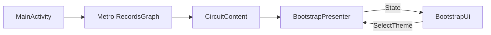
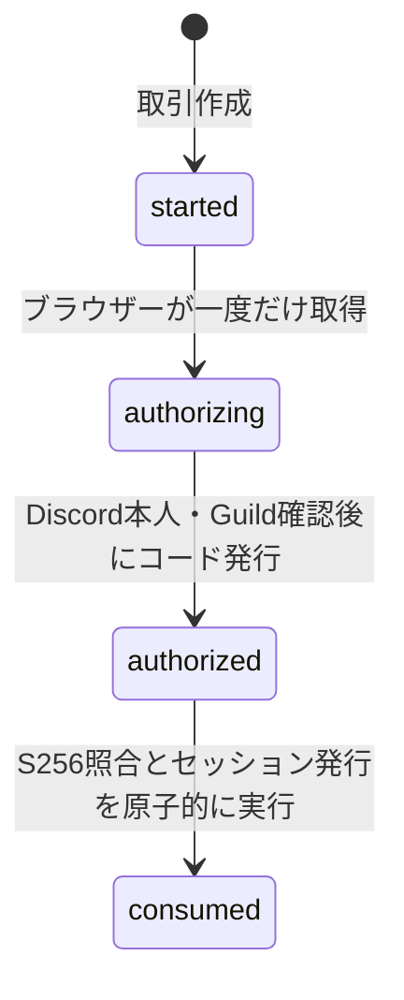
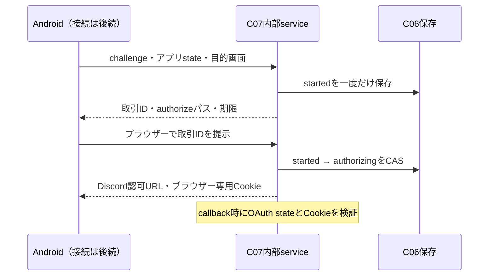
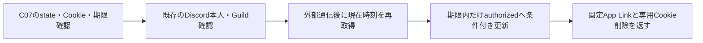
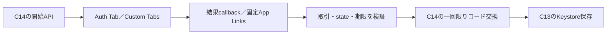
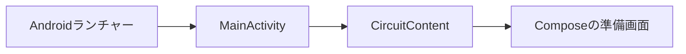

# Androidアプリ設計

[文書索引へ戻る](00_シッテムの箱_ドキュメント索引.md)

## 目的と現在の範囲

既存のDiscord・Records・Webを維持し、友人向けのAndroidネイティブアプリを段階的に追加する。
現段階ではC03までの基盤、C05〜C12のサーバー認証、C13〜C19のAndroid認証・記録1件表示・App Linksを実装済み。C20でPlay内部テスト版の実機ログインと記録表示を確認した。C21〜C25で議論一覧・詳細の表示を拡充した。C26〜C28は保存用秘密鍵・データ鍵・暗号化済み記録の保存部品、C29は認証済みAPIからその保存部品への接続、C30はオフライン認可とログアウト時の記録削除、C31は全記録の同期・キャンセル・再開、C32は保存済み一覧・詳細のオフライン表示とオンライン更新を担当する。実際の配信状態は実装・試験・検証記録で管理する。

| 段階 | 内容 | 現在の扱い |
|---|---|---|
| C01 | Gradle Wrapper、Version Catalog、最小Compose画面 | 実装済み |
| デザイン基盤の先行実装 | Expressiveテーマ、独自配色・書体・背景、準備画面 | C01を維持した追加差分。C02の機能実装とは分離 |
| C02 | Circuit・Metroによる準備画面の状態管理・依存接続 | 実装済み |
| C03 | Android CI | 実装済み |
| C04 | CodeQL接続 | Kotlin 2.4.20へのCodeQL対応待ち。GitHub切替は未実施 |
| C05 | モバイル認証の要求・応答・内部状態 | 契約定義を実装済み。C12で公開接続 |
| C06 | 認証取引と一回限りコードの保存処理 | 条件付き保存・期限確認・消費用transaction部品を実装済み。C09でセッション発行と結合 |
| C07 | ログイン開始とブラウザー認可 | 内部serviceを実装済み。state・Cookie検証をC08から利用。C12で公開接続 |
| C08 | Discord認証結果からアプリ復帰コードを発行 | 本人・Guild確認、最長60秒のコード発行を実装済み。公開接続はC12 |
| C09 | コード交換とモバイルセッション発行 | S256照合、コード消費と90日セッションの一括作成を実装済み。公開接続はC12 |
| C10 | モバイルセッション確認・ログアウト | 90日の絶対期限、本人情報の応答、提示tokenだけの失効を実装済み。公開接続はC12 |
| C11 | Records読取APIへBearer認証を接続 | 議論一覧・詳細へ接続済み。Cookie混在を拒否し、他APIへ認可を広げない |
| C12 | モバイル認証ルートとAWS設定 | 5ルート・共有callback・OpenAPIを既存Auth Lambdaへ接続。追加IAM・設定値なし |
| C13 | Keystoreによるトークン保存 | 保存・読取・削除、改ざん拒否、バックアップ除外を実装。C15〜C16で通信・画面へ接続 |
| C14 | モバイル認証APIクライアント | 4操作の通信・型変換・失敗分類を実装。ブラウザー・画面・保存への接続はC15以降 |
| C15 | ブラウザー認証からアプリ復帰・コード交換 | Auth TabとCustom Tabs fallback、PKCE・復帰検証・保存を接続。ログイン画面はC16、配布証明書の設定と実認証確認はC19 |
| C16 | ログイン・期限切れ・ログアウト画面 | Circuit／MetroへC13〜C15を接続。通信障害と失効、端末削除とサーバー失効を区別 |
| C17 | 記録1件の取得と表示 | ログイン後に最新一覧から1件を取得し、議題・勝者・結論を表示。許可された復帰先の個別記録も取得 |
| C18 | Release variant・署名入力・版番号 | debugと配布用application IDを分離。秘密値を環境変数から受け、未設定時のRelease成果物作成を拒否 |
| C19 | App Links・配布証明書 | 固定callbackと記録リンクをPlay署名証明書に関連付け、許可された記録へのログイン後復帰を接続 |
| C20 | 本人向け内部テスト | Play版のApp Links検証・Discordログイン・記録1件表示を実機で確認。記録リンク復帰と更新試験は未確認 |
| C21 | 議論一覧の最初のページ | 最新12件のカード、依頼者アイコン、読み込み・空・エラー状態を実装。カードから既存の1件表示へ遷移 |
| C22 | 議論一覧の追加ページ | Pagingでcursorを使った追加取得、重複排除、失敗時の再試行、期限切れ時の最初からの再取得を実装 |
| C23 | 議論本文とMarkdown表示 | 3人の初回意見・最終案と結論を表示。Markdownはライブラリへ任せ、外部リンクをHTTPSに限定 |
| C24 | 投票・評価・勝者の表示 | 3人の投票先・理由・得票数、任意の採点内訳と決定方式を表示。勝者は保存済み結果を使う |
| C25 | 親愛度の変化と任意項目 | 旧記録のnull、評価不可、質問評価点と実増減の差を区別。勝利コメント・実行案・注意点も表示 |
| C26 | Keystoreによる保存用秘密鍵の保護 | アカウントに結び付けた暗号文の保存・読取・削除と形式検証。C27で鍵生成に接続、記録保存には未接続 |
| C27 | ML-KEM／HPKEによるデータ鍵保護 | Bouncy CastleのHPKEで32-byteデータ鍵を包む。記録保存には未接続 |
| C28 | Roomの暗号化ペイロード保存 | 一覧・詳細のペイロードを認証付き暗号文として保存。画面・同期には未接続 |
| C29 | 記録Repositoryの暗号化保存・読込 | 認証済み一覧・詳細を保存し、再起動後の復号入口を用意。オフライン表示は未接続 |
| C30 | オフライン認可とアカウント分離 | 最長90日の検証済み許可、期限切れロック、ログアウト・切替時の鍵と暗号文の削除。画面のオフライン表示は未接続 |
| C31 | 全記録の同期・キャンセル・再開 | 全ページを直列照合し、暗号化進捗から再開。C32追加で自動バックグラウンド同期へ変更 |
| C32 | 保存済み表示とオンライン更新 | 期限付き認可でオフライン表示、失敗時の保持、404と全列挙成功後の削除反映 |
| C33 | ローカル検索・勝者絞り込み・並べ替え | 保存済みの議題・依頼者・本文を通信なしで検索し、保存結果による勝者絞り込みと日時の新旧順を画面へ接続 |
| C34 | 色・フォント・共通部品の整理 | 共通パネル・見出し・読み込み表示・人格色を接続。背景の文字色を明暗テーマへ統一 |
| C35 | NEW／OLD切替とログイン完了演出 | 新旧順の選択位置・形状変化と、保存tokenのサーバー確認後だけ出る短い完了通知を接続 |
| C36 | 可変幅レイアウト・戻る操作の仕上げ | 一覧／詳細の標準Adaptive配置、Predictive Back、読み上げ・文字拡大を接続 |
| C37 | Web機能への導線・アカウントメニュー | 記録閲覧中のメニューから固定Web機能を開き、ログアウトと表示切替を行う |
| C38 | Google Play提出Action・短寿命API認証の接続 | 既存署名と分離し、検証済みAABのuploadとcommitを採用Actionへ任せる。外部認証設定・配布確認はC39で行う |
| C39 | 検証済み同一AABの内部テスト配布Workflow | mainの必須CIと署名を確認し、WIFで同一AABを提出・照合する。外部設定未完了では起動しない |
| C40 | Android依存の更新検知 | 既存のDependabot・Dependency Graph・固定ツール監視の担当範囲を整理。監視の重複追加や依存更新は行わない |
| C41（スキップ） | 利用者向け導入・更新・復旧手順 | 利用者の指定で今回は実施しない。既存の配布・認証・復旧手順は維持する |
| 後続 | 起動演出・人格アイコン・投票／親愛度表示・友人向け配布 | C37後に小さなPRで分けて進める。起動演出はAndroid SplashScreenからComposeへ接続する |
| 後続：Navigation 3 | 一覧／詳細の画面遷移・戻る・状態寿命の標準化 | 型付きの単一back stackと標準NavDisplay・Adaptive Sceneを採用。第3段階で既存の一度限り入力処理と復帰経路を架空環境で横断確認する。実機受入と配布は別操作 |

### PRの分割単位

実装計画のC01、C02…を、それぞれ独立したPRとして進める。複数のCを1本のPRへまとめない。
原則は番号順だが、2026年9月20日の合意により、独立したC04を保留してC05へ先行する。
C04を完了扱いにはせず、[Issue #376](https://github.com/pitekusu/shittim-chest/issues/376)で安定版の対応と再開を追跡する。
各PRには対象Cの実装・関連試験・文書を含め、同じCの不具合修正もそのPRで扱う。
C01には合意済みのExpressiveデザイン基盤の先行実装を含めるが、C02以降の機能は追加しない。
PRの公開状態はその工程の依頼に従う。C02・C03は確認後に通常PRとして公開した。
必須CI・CodeQL・レビュー状態を確認し、マージを妨げる問題がなければ、許可された範囲でsquash mergeする。
PR内はレビュー可能な目的別コミットに分けてよい。C番号は実装の区切りであり、Gitのコミット数と一致させる必要はない。
C04はCodeQLの対応後に独立したPRで再開し、C02・C03の機能は混ぜない。

### CodeQLのビルドと切替

2026年9月17日の実行確認では、CodeQL 2.27.0がKotlin 2.4.20を未対応として拒否した。
Kotlin／Compose Compilerは2.4.20を維持し、CodeQLの対応版を待つ。
Android解析の追加は保留し、既存3言語の解析・必須条件は維持する。
Androidの解析未完了を成功として扱わず、対応版で抽出成功を確認してからGitHub側へ追加する。

再開時は既存の`.github/workflows/codeql.yml`へKotlinの`manual`モード解析を追加する。
TemurinはAndroidの`.java-version`から読み、SDK Platform 37.1とBuild Tools 36.0.0を用意する。
CodeQL初期化後にWrapperから`assembleDebug`を実行し、キャッシュや差分コンパイルによる抽出漏れを防ぐ。
エミュレーター、署名鍵、認証情報は使用しない。通常のAndroid CI（C03）とは役割を分ける。

Python・JavaScript/TypeScript・GitHub ActionsはUbuntu 26.04への固定のため先に同workflowへ移す。
既存のチェック名と`security-extended`を維持し、PR、mainへのpush、週次定期実行、手動実行を対象にする。
GitHubのdefault setupとadvanced setupは併用せず、切替手順は
[GitHub・CI-CD詳細設計](15_GitHub・CI-CD詳細設計.md)に従う。

### Kotlin Compiler Native Image

Kotlin 2.4.20のNative Image版を単体CLIとして利用する。
GraalVMで事前コンパイルされたKotlin/JVMコンパイラーであり、
アプリをKotlin/Nativeへ移行するものではない。Material 3やJVM targetも変更しない。

2026年9月17日にLinux x86_64の公式配布物をSHA-256照合して導入し、
単体Kotlinのコンパイル・実行とCompose Compilerによる最小Composableの変換を確認した。
`-include-runtime`は配布物内のリソース参照で失敗したため、通常のclass出力と
標準ライブラリを指定する実行方法を使う。上流の非推奨API警告は抑制しない。

Kotlin Gradle Plugin 2.4.20ではNative Image選択の正式な設定は確認できていない。
CLIの導入だけでAGPの
`:app:compileDebugKotlin`が置き換わるわけではなく、APKビルドは従来の方式を維持する。
Gradle連携を独自実装せず、正式な連携経路を確認できた時点で改めて採用する。
CodeQL互換性も別の条件であり、Native Imageを解析回避には使わない。

配布仕様は[Kotlin 2.4.20のNative Image](https://kotlinlang.org/docs/whatsnew2420.html#native-image)、
利用方法はリポジトリの`apps/records-android/README.md`を参照する。

## 高レベルAPI・ライブラリ優先の開発方針

本節はAndroidアプリと、それを支えるPythonの認証・閲覧APIの採用先を具体化する。リポジトリ全体に適用する既存module優先の共通方針は`AGENTS.md`を参照する。
既存のMaterial 3 Expressive・Circuit・Metro・Ktor・kotlinx.serialization・Pydanticを活用し、全面的な作り直しは行わない。
Authlib・Auth Tab・認証検証の共通化も維持する。この方針の追加では、公開API・保存形式・認可範囲を変更しない。

実装前に標準SDK・採用済みライブラリ・再利用可能な既存moduleを確認する。保守されている既成ライブラリ／Actionで満たせる責務は独自helperより優先し、重複する独自機能は維持を前提にせず置換・削除も検討する。
採用時には保守状況・ライセンス・脆弱性・既存バージョンとの互換性・依存の増加・安全な設定の可否を確認する。
独自実装は必要な安全条件・互換性・性能・端末機能を満たせない部分に限定し、理由を設計またはコードへ短く残す。
行数削減や抽象化した見た目のために層を追加せず、専用の承認工程や大量の比較資料も設けない。

### 用途ごとの採用先と責務

「継続」は既存実装を利用する方針、「導入予定」は該当C工程で実装・検証する方針であり、導入済みとは扱わない。
詳細な依存バージョンはVersion Catalog・lockfile、Actionの固定SHAはWorkflowを正とし、この表へ重複管理しない。

| 用途・工程 | 採用先 | 独自処理を残す理由・境界 |
|---|---|---|
| Python認証（継続） | Authlib、Pydantic、共通認証ガード | OAuthの要求・応答や型検証はライブラリへ任せる。Guild・管理者・本人限定の規則はサービス固有の認可として管理 |
| C13：トークン保存（継続） | Android Keystore、標準暗号API、AtomicFile | 鍵の保護・暗号演算・原子的なファイル更新を利用。用途への束縛と保存形式の検証は残し、高レベル化だけを理由に形式を変えない |
| C14：認証通信（継続） | Ktor、kotlinx.serialization | 通信・JSON変換を利用。再送防止・応答上限・秘密非表示は認証専用の境界として維持 |
| C15：ブラウザー認証（継続） | Auth Tab、Activity Result API | 起動・結果受け渡しを利用。非対応ブラウザーのfallbackも同じ固定callback・取引・state・期限の検証へ接続 |
| C16：認証画面／C17：通常API（接続済み） | 既存Circuit、Metro、AndroidX ViewModel／Activity Result。記録JSONの変換に[Ktor ContentNegotiation](https://ktor.io/docs/client-serialization.html)を使用 | 認証の寿命はViewModel、描画状態・イベントはCircuitへ任せる。記録本文の一時表示だけ行い、永続キャッシュや全件取得を先行追加しない |
| C21：画像表示（接続済み） | [Coil AsyncImage](https://coil-kt.github.io/coil/compose/) | 取得・縮小はCoilに任せる。署名付き画像のdisk cacheを無効化し、認証状態から離れた際にmemory cacheを消去 |
| C22：一覧の追加取得（接続済み） | [Paging／PagingSource](https://developer.android.com/topic/libraries/architecture/paging/v3-overview) | loading・retry・要求制御を任せる。APIのcursorを接続し、期限切れcursorでは最初のページから取得し直す |
| C23：Markdown（接続済み） | [Compose Markdown RendererのMaterial 3対応](https://github.com/mikepenz/multiplatform-markdown-renderer) | 独自パーサー・WebViewは追加しない。外部リンクはHTTPSの絶対URLだけを許可し、Markdown画像URLは取得しない |
| C26〜29：暗号化保存（導入予定） | Bouncy Castle、Android Keystore、[Room](https://developer.android.com/training/data-storage/room) | 独自暗号方式・DBアクセス基盤は作らない。保存形式・鍵の取り扱いを管理し、Roomには暗号化済み本文を保存 |
| C31〜C32：同期 | Coroutines、WorkManager、保存済み進捗からの再開 | バックグラウンド継続を新要件として受け、予約・制約・再試行をWorkManagerへ任せる。差分照合・本人認可・暗号化の再開点だけをサービス側で管理 |
| C36：可変幅の一覧／詳細と戻る | NavDisplay・NavEntry、Material 3 AdaptiveのListDetailSceneStrategy | 配置・遷移・pane focus・hinge回避・予測型Backを標準部品へ任せる。840dp／文字倍率の表示条件と戻る確定時の認可再確認はアプリ側で維持し、独自の進捗・取消処理を重ねない |
| 後続：画面遷移（段階的に導入） | Navigation 3のNavKey／rememberNavBackStack、NavDisplayのentryと標準SaveableStateHolder decorator | Circuit／Metroを維持し、閲覧先を単一back stackへ移す。認可、一回限りの復帰先、通知・App Linksの検証はアプリ側に残す。独自UUIDによる詳細寿命を撤去し、entryのpop後に状態を解放する |
| 議論公開通知 | Firebase Cloud Messaging、Firebase Admin SDK、NotificationCompat、Activity Result、WorkManager | 配送・通知表示・権限要求・登録再試行を既存APIへ任せる。セッションへの束縛、公開済み記録の確認、重複防止とログアウト時の抑止をサービス側で管理 |
| C38〜C39：内部テスト配布 | r0adkll/upload-google-play、Google認証Action、既存のgoogle-auth・Google API client | upload・track更新・commitは採用Actionへ任せる。helperは版番号読取・署名と同一AABの検証・提出後照合・秘密の準備と回収だけを担当し、独自の提出APIやedit受け渡しを作らない |

### C15までの独自処理を残す理由

次の処理はライブラリを使わないためではなく、既存APIだけでは満たせない安全条件やサービス固有の契約を守るために残す。

| 処理 | 残す理由 | 詳細の参照先 |
|---|---|---|
| 認証POSTのone-shot body | 接続復旧retryの無効化だけでは防げない再送を抑え、一回限りコードの意図しない再交換を防ぐ | C14「通信と失敗の境界」 |
| 認証応答の上限付き読み込み | Content-Lengthの有無や正しさに依存せず、実際の応答を64 KiBまでに制限する | C14「通信と失敗の境界」 |
| JSON辞書化前の重複キー・サイズ検査 | 辞書化後のPydantic検証だけでは失われる重複キーを検出し、大きすぎる入力も先に拒否する | C12、`mobile_http.py` |
| DynamoDBの条件付きtransaction | 一回限りコードの消費とセッション発行を原子的に行い、期限・競合・二重消費をサービスの契約どおりに制御する | C06・C09 |
| 標準ライブラリによる短いS256、固定callback照合、期限・権限判定 | 暗号方式やOAuth全体を独自実装せず、開始端末との束縛とサービス固有の許可条件だけを扱う | C09〜C11、C15 |

これらをライブラリへ移すことだけを目的に、新しいProtocolやDI層を作らない。
FastAPIへの全面移行、新しい認証基盤、ORMの導入もこの方針の対象外とする。

### 各C工程への組み込みと確認

- 既存のC単位・PR単位を維持し、必要になる工程で依存を導入・固定する。未使用の依存は先行追加しない。
- 導入時に互換性と安全設定を確認する。問題があれば採用判断を見直し、独自実装へ即座に切り替えたり、Kotlin・Compose・Materialの既定バージョンを無断で変えたりしない。
- 試験は利用する機能と自サービスとの接続境界に絞る。ライブラリ内部の再試験、件数・カバレッジ目標は追加しない。
- 認証は再送防止・期限・二重交換・権限分離・秘密非表示を維持する。画像・DBは平文キャッシュとログアウト後の情報残存を確認する。
- Markdownは長文・リンク・主要構文に加え、Releaseビルドでの表示を確認する。
- 方針・文書だけの変更は文書整合・mirror・公開情報・差分を確認する。関連変更のない成功済み試験は繰り返さない。
- 実署名・App Links・実Discordログインの確認は引き続きC19で行い、今回の文書整備の完了条件へ追加しない。

## ローカル開発・配布の一時ビルド領域

Androidのローカルビルドは、Git管理した`tools/run_android_build.py`を入口にする。標準の`TemporaryDirectory`とGradle init-scriptにより、ビルド出力・project cache・Kotlinのpersistent project data・JVM／native tempを専用ディスク領域へまとめる。Kotlin公式の`kotlin.project.persistent.dir`を使い、checkoutの`.kotlin`にも蓄積させない。`/tmp`のtmpfsや使い捨てworktreeには大きな中間生成物を残さず、処理終了を確認してから回収する。同時実行を排他し、強制終了の残骸は次回実行時に同じ入口の非使用領域だけを削除する。Wrapper取得失敗などinit前の通常終了は、launcherとprocess groupの終了を確認した記録がある場合だけ回収する。Gradleの単発JVMも使用権ロックを保持し、記録のある終了でも使用中の領域は削除しない。中断・状態不明の領域も自動削除せず、新たなビルドを止める。このローカル入口だけKotlin標準の`in-process`実行を使い、コンパイラを同じGradle JVMの使用権の中へ収める。依存バージョンやCIの実行方式は変更しない。

完成したAPK／AAB、必要なLint報告とprivate logはリポジトリ外の固定出力先へ残し、ビルドごとの大きな履歴ディレクトリを作らない。配布ヘルパーもこの入口を使う。署名・versionCode・Play反映の確認は従来どおりとし、大きな配布成果物は直近2版に限定する。SHA・署名・反映結果などの小さな再送防止記録は保持する。

ソースは既存worktreeを再利用する。配布専用の使い捨てworktreeと仮想環境は反映確認後に片付け、応答不明の状態ファイル・未コミット変更・実行中の参照は保護する。過去領域の掃除は、正確なpath・Git未追跡・非使用を確認できた生成物に限定する。SDK・JDK・共有Gradle cache・署名鍵・API認証JSONを削除せず、OS全体やCIのtemp設定も変更しない。具体的な実行方法はAndroid READMEを正とする。

## C02：CircuitとMetroの接続

画面は1つのまま、表示状態とUIの責務を分ける。通信・認証・DB・通知・架空の遷移先は追加しない。


```mermaid
flowchart LR
    Activity[MainActivity] --> Graph[Metro RecordsGraph]
    Graph --> Circuit[CircuitContent]
    Circuit --> Presenter[BootstrapPresenter]
    Presenter -->|State| UI[BootstrapUi]
    UI -->|SelectTheme| Presenter
```

- Circuit 0.39.0とMetro 1.4.4をVersion Catalogで固定する。Kotlin／Compose Compiler 2.4.20とMaterial 3 1.5.0-alpha28は維持する。
- `RecordsGraph`はActivityごとに1回生成し、実際に使うCircuitとPresenterだけを提供する。Application全体のscopeや空のRepositoryは設けない。
- `BootstrapScreen`は固定の画面識別子、`State`は表示選択、`Event.SelectTheme`は操作入力を表す。まだback stackを作らず、画面識別子の永続化もしない。
- `BootstrapPresenter`が`rememberSaveable`で表示選択を保持し、Activity再生成時に復元する。端末設定やアカウント設定には保存しない。
- `BootstrapUi`はStateから描画し、操作をeventSinkへ返す。スクロールなどUI固有の状態はUI側に残す。
- C01のMaterialExpressiveTheme、MotionScheme、排他的ButtonGroup、Expressive List、semantic color、余白と文字拡大時のoverflowを維持する。
- UI Previewは固定Stateを渡して表示し、DIや外部サービスを必要としない。MetroのCircuit codegenやKSPはこの1画面には追加しない。

## C03：Android CI

[CI設計](15_GitHub・CI-CD詳細設計.md)の`android-gate`で、ローカルと同じJDK・Wrapper・SDKを使い、
debug APK／テストAPK・LintとAPI 36の非画面instrumentation testを実行する。CIの検証範囲変更だけで、画面・認証・配布機能は追加しない。

- 認証・鍵・暗号化保存・DB・API・同期などの非画面試験は必須として維持する。大量のテストや端末matrixは追加しない。
- Composeの画面・操作試験は`@ScreenTest`で区別して残す。通常のPR／mainでは全件実行せず、UI変更時と配布前に影響する画面を選んで確認する。
- 選択はAndroidJUnitRunnerの標準フィルターに任せる。手動CIの`android_screen_tests`は既定false、trueでは画面を含む全試験を実行する。具体的なコマンドはAndroid READMEに示す。
- Android専用差分では無関係なCore／Recordsの全試験を実行しない。共通CI・分類器の変更は両側を検証する。
- `android-gate`は必要なビルドの失敗・取消・skipや分類失敗を成功扱いしない。Gradleの成功終了だけでは合格にせず、実行済みJUnit結果を確認し、結果欠落・0件・失敗・skipを拒否する。
- レポートのみを短期保存し、APK／署名済み配布は後続工程に残す。
- Kotlin 2.4.20とMaterial 3 1.5.0-alpha28は維持する。CodeQL対応待ちのC04は分離する。

## C05：モバイル認証の契約（公開前）

Recordsの`mobile_auth.py`に要求・応答と内部状態を定義する。既存の`PublicModel`、`SessionUser`、
OAuth／セッション有効期間を再利用する。C05では`AuthService`・WebのCookie／CSRF・Discord callbackを変更しない。
APIはC12まで公開せず、C05ではDBアクセス・トークン発行・PKCE照合・状態遷移の実行を行わない。
`mobile-auth.schema.json`は既存の契約生成コマンドで生成するが、live OpenAPIとWeb validatorには混ぜない。

### 受け渡しと期限

Androidはログインごとにランダムなverifierとstateを用意する。verifierは43〜128文字のASCII unreserved文字、
challengeはSHA-256をpaddingなしbase64urlにした43文字、方式は`S256`だけとする。
このPKCEはAndroidとRecords間の一回限りコードの交換を保護するもので、Discord OAuthのPKCE対応を仮定しない。
方式・長さは[RFC 7636](https://www.rfc-editor.org/rfc/rfc7636.html)、外部ブラウザーとApp Linksの方針は
[RFC 8252](https://www.rfc-editor.org/rfc/rfc8252.html)に基づく。

| 境界 | 契約 |
|---|---|
| ログイン取引 | 開始から最長10分。ブラウザー往復で延長しない |
| 一回限りコード | 発行から最長60秒、かつ取引期限まで |
| モバイルセッション | 発行から90日の絶対期限。利用で延長せず、refresh tokenを設けない |
| アプリstate・取引ID・コード・Bearer token | 独立した256-bit乱数をpaddingなしbase64urlで表す。アプリstateは端末内の開始値と照合 |
| アプリ復帰先 | Records設定のHTTPS origin＋固定`/auth/mobile/callback`。任意のredirect URIは受け付けない |
| 復帰query | `transaction`・`code`・`state`のみ。アクセストークン・Discord token・ユーザー情報を載せない |
| 認証後の目的画面 | `/`または`/records/{43文字のrecordId}`のみ。query・fragment・外部URL・管理画面は拒否 |

期限ちょうどは失効とし、後続実装で毎回サーバー時刻と比較する。TTL削除を待たない。
App Linksの公開証明書と配布版の接続はC19で確定する。C05はAndroid manifestや公開ページを追加しない。

### APIの入出力

C05で定義した以下の契約をC12で公開ルートへ接続する。全応答を`private, no-store`とする。
JSONはcamelCase、unknown field・余分／重複queryを拒否し、検証例外は固定コードだけへ変換する。

| ルート | 入力／出力 |
|---|---|
| `POST /api/v1/auth/mobile/start` | `codeChallenge`・`codeChallengeMethod`・`state`・省略時`/`の`returnTo` → `schemaVersion`・`transactionId`・`authorizePath`・offset付き`expiresAt` |
| `GET /api/v1/auth/mobile/authorize` | queryの`transaction`のみ。開始端末に結び付く取引とブラウザーの使い捨てCookieを確認してDiscordへ302 |
| 既存Discord callback | 現在の本人・Guild確認を再利用。モバイル取引だけを固定App Linkへ302。失敗時はコード・セッションを発行せず、Web側で安全なエラーを表示 |
| `POST /api/v1/auth/mobile/exchange` | `transactionId`・`code`・`codeVerifier` → `schemaVersion`・`accessToken`・`tokenType: Bearer`・`expiresAt`・`user`・`isAdmin`・`returnTo` |
| `GET /api/v1/auth/mobile/session` | Bearerを確認し、exchange応答からtoken・returnToを除いた本人情報を返す。無効／失効は401 |
| `POST /api/v1/auth/mobile/logout` | Bearerを失効して204。body・queryなし |

`authorizePath`は固定API originに対する相対パスで、任意URLを開かせない。ブラウザー側の一意な取引使用権はC06〜C08で実装する。
Web CookieとBearerの混在拒否、既存所属・管理者認可、Origin／CSRF、body上限はC07〜C12のHTTP接続で検証する。
リクエスト不正は`mobile_request_invalid`、取引・コード・PKCEの不一致／期限切れ／再使用は同一の
`mobile_grant_invalid`として詳細を漏らさない（公開時の400）。セッション不正は既存の401形式を維持する。

### 内部状態と保存境界


```mermaid
stateDiagram-v2
    [*] --> started: 取引作成
    started --> authorizing: ブラウザーが一度だけ取得
    authorizing --> authorized: Discord本人・Guild確認後にコード発行
    authorized --> consumed: S256照合とセッション発行を原子的に実行
```

- 状態ごとの型を判別可能なunionにし、`authorizing`はブラウザーnonce／OAuth stateのハッシュ、
  `authorized`はコードhash・期限・opaque requester key・表示名・本人のavatar asset key（欠損時はnull）・所属確認日時を必須にする。
- 期限付き画像URLは保存しない。asset keyは本人の`requesters/{requesterKey}/avatar.webp`だけを許可し、
  セッション応答時に短時間のURLを発行する。これは公開前の内部状態の整理であり、公開DTOや既存データの移行は変更しない。
- 内部の時刻はepoch秒、APIはoffset付き日時。取引10分・コード60秒と取引期限の包含関係を型の検証で守る。
- コード・verifier・Bearer tokenの平文を内部状態に保存しない。ID・nonce・コードは用途別HMACで保存する設計とする。
  client stateだけはアプリへそのまま返す相関値として保持するが、それだけで認証や交換を許可しない。
- 状態の形の検証と、保存時のCAS／原子更新・有効期限判定は別物。C06で保存部品を用意し、C09でコード・S256照合とセッション発行へ接続する。
- `repr`と検証エラー表示へ機密フィールドを出さない。HTTP／adapterでPydanticの`errors()`や入力全体をログに記録しない。
- C05の試験はredirect・S256入力境界・状態必須項目・期限の関係・内部情報の非公開・既存OpenAPI不変に絞る。

## C06：認証取引の条件付き保存（公開前）

`mobile_auth_adapters.py`の`DynamoMobileAuthStore`を既存Session Table向けの独立adapterとして用意する。
既存Webの`OAUTH#`・`SESSION#`は変更せず、公開handler・AWS権限・認証フローにはまだ接続しない。

| 保存項目 | 内容 |
|---|---|
| PK／SK | `MOBILE#<transaction_hash>`／`TRANSACTION`。取引IDそのものは渡さない |
| メタ情報 | `schema_version=1`、`record_type=mobile_transaction`、TTL用`expiresAt` |
| payload | C05の状態型をJSONとして保存。認可前後で同じ取引・challenge・state・目的画面・開始日時・期限を維持 |
| 消費後 | `consumed`と消費日時を保存。コードhash・本人プロフィール・所属確認日時は残さない |


```mermaid
flowchart LR
    Create[存在しない場合だけ作成] --> Read[整合性のある読取と期限確認]
    Read --> CAS[旧payload全体の一致を条件に状態更新]
    CAS --> Prepare[コード消費用のPutを組み立て]
    Prepare -->|C09で結合| Atomic[コード消費とセッション作成を同時確定]
```

- `create`は上書き不可。`advance`は`started → authorizing → authorized`だけを許可する。
  ブラウザーの二重取得、コード再発行、異なる取引・端末への差し替え、期限延長を拒否する。
- 更新は読んだ状態全体と保存済みpayloadが一致する場合だけ成功する。同時要求では一方だけが進み、
  読み取り後に状態が変わった要求は`mobile_grant_invalid`で止める。
- 取引・コードの期限ちょうどは無効。TTL削除前でも読み取りと書き込みの両方で拒否する。
  保存形式の破損は入力を含まない`mobile_transaction_invalid`とする。
- `consumption_write`は実行せず、条件付きPutだけを返す。C09でコードとS256を照合した後、
  セッション作成と同じ`TransactWriteItems`へ渡す。単独のコード消費メソッドは設けない。
- 用途別HMAC・ランダム値の生成、Cookie／OAuth照合はC07以降の呼び出し側の責務である。
  このadapterは検証済みの状態型とハッシュだけを受け取り、ログへ保存内容を出さない。
- DynamoDB Localで同時取得・同時消費・再発行拒否・期限境界・セッション側の失敗時に未消費で残ることを確認する。
  単体試験は破損データ、束縛の変更、状態飛ばし、保存障害を扱う。未使用の公開APIやIAMを先行追加しない。

## C07：ログイン開始とブラウザー認可（公開前）

`mobile_login.py`の`MobileLoginService`はC06の保存インターフェースを使い、既存のHMAC・Cookie・
時刻処理と検証済みOAuth設定を再利用する。外部SDK・Discord APIクライアント・セッション発行権限は持たない。

| 処理 | 実装済みの動作 |
|---|---|
| `begin` | 検証済みS256 challenge・アプリstate・目的画面を、独立乱数の取引IDと開始から10分の期限に結び付けて保存。取引IDの平文は保存せず、固定相対authorizeパスを返す |
| `authorize` | 未使用かつ有効な`started`だけを取得し、ブラウザーnonceと独立OAuth stateを生成。C06のCASが成功した場合だけDiscord認可URLと専用Cookieを返す |
| `validate_callback` | OAuth stateの書式・取引・期限・`authorizing`状態、stateとCookieのHMACを検証。コード消費やDiscord本人確認は行わず、C08へ渡すsnapshotを返す |


```mermaid
sequenceDiagram
    participant App as Android（接続は後続）
    participant Login as C07内部service
    participant Store as C06保存
    App->>Login: challenge・アプリstate・目的画面
    Login->>Store: startedを一度だけ保存
    Login-->>App: 取引ID・authorizeパス・期限
    App->>Login: ブラウザーで取引IDを提示
    Login->>Store: started → authorizingをCAS
    Login-->>App: Discord認可URL・ブラウザー専用Cookie
    Note over Login: callback時にOAuth stateとCookieを検証
```

- アプリstateとDiscord OAuth stateは別物。後者は`m.<取引ID>.<独立256-bit乱数>`とし、C12で共有callbackの
  モバイル処理を判別できるようにする。prefix・取引IDだけでは受理せず、state全体のHMACを照合する。
- HMACの用途を`mobile-transaction`・`mobile-browser-nonce`・`mobile-oauth-state`へ分離する。
  OAuth state・nonceはハッシュだけを保存し、認可URLとCookieは`repr`へ出さない。
- Cookieは`__Host-shittim-records-mobile-oauth`とし、Webログイン用を上書きしない。
  `Secure`・`HttpOnly`・`SameSite=Lax`・`Path=/`、Domainなし。Max-Ageは取引の残り秒数に限定し、期限を延長しない。
- 認可先とcallback先・scopeはサーバー側の固定値／設定だけを使用する。アプリstate・challengeをDiscordへ送らない。
- callback検証自体は読取のみ。C08では本人・Guild確認後に返されたsnapshotをCASしてコードを発行する。
  失敗したモバイルcallbackをWeb処理へフォールバックさせない。公開接続はC12で行う。
- `test_mobile_login.py`でCookie・期限・独立state・取引間の差し替え・CAS失敗・再使用・秘密非表示を確認する。
  既存Web認証／HTTP試験も維持する。実Discordログインや本番データ書き込みはこの工程の試験に含めない。

## C08：Discord認証後のアプリ復帰コード（公開前）

`mobile_callback.py`の`MobileCallbackService.complete`を内部処理として追加する。
既存HTTP callbackへの分岐追加、モバイルルート、IAM、AndroidのApp Linksはこの工程では接続しない。


```mermaid
flowchart LR
    Binding[C07のstate・Cookie・期限確認] --> Discord[既存のDiscord本人・Guild確認]
    Discord --> Time[外部通信後に現在時刻を再取得]
    Time --> CAS[期限内だけauthorizedへ条件付き更新]
    CAS --> Link[固定App Linkと専用Cookie削除を返す]
```

- `auth.py`の`authenticate_discord_requester`をWeb／モバイルで共有する。
  Discord token交換、所属確認、表示名の優先順、既存HMACによるrequester key、アバターのbest-effort保存を維持する。
  Web側のstate消費、90日セッション、CSRF、Cookie、復帰先は変更しない。
- 本人確認前にブラウザー束縛を検証し、通信後にも取引期限を確認する。
  コードは独立した256-bit乱数で、保存するのは用途`mobile-code`のHMACのみ。
  有効期限は発行時から60秒と、元の取引期限の早い方にする。
- C06のCASで`authorizing → authorized`を確定してからだけ、固定HTTPS originの
  `/auth/mobile/callback?transaction=…&code=…&state=…`を返す。競合・期限切れ・再使用ではコードを返さない。
  URLへDiscord token、セッションtoken、プロフィール、認証後の目的画面を載せず、`repr`にも復帰URLを出さない。
- 削除対象CookieはモバイルOAuth専用だけ。WebセッションやCSRF Cookieを発行・削除しない。
  認証失敗時はコードを発行せず、既存の固定エラーを伝える。公開時の安全なエラー表示はC12で接続する。
- `test_mobile_callback.py`で発行・再使用・通信中の期限切れ・CAS競合・Guild確認失敗・秘密非表示を確認する。
  保存試験と既存Web認証／HTTP試験も実行する。一回限りコードのS256照合と原子的消費・セッション発行はC09が担当する。

## C09：コード交換とモバイルセッション発行（公開前）

`mobile_exchange.py`の`MobileExchangeService.exchange`は、C08のコードと開始端末のverifierを照合する。
Discordへの再問い合わせ、Webセッション作成、Cookie発行、公開ルートやIAMの変更は行わない。

1. 取引IDの用途別HMACで読み取り、`authorized`状態・元の取引期限・コード期限を確認する。
2. コードのHMACと、[RFC 7636のS256](https://www.rfc-editor.org/rfc/rfc7636.html#section-4.6)で変換したverifierをconstant-time比較する。
3. アバターの短時間URLを含む応答を準備する。準備失敗ではコードを消費せず、準備後にも期限を確認する。
4. 独立乱数のBearer tokenを作り、C06の条件付き消費・セッション新規作成・既存形式のプロフィール更新を
   1回のDynamoDB transactionで確定してからだけ応答を返す。

| 保存先・項目 | 契約 |
|---|---|
| `MOBILE_SESSION#{hash} / META` | Webの`SESSION#`と別のnamespace。tokenのHMAC用途も`mobile-session`として分離 |
| 保存payload | opaque requester key、表示名、本人のavatar asset key、Guild確認日時、発行・失効日時。token・verifier・署名付きURL・管理者判定は保存しない |
| 有効期限 | 発行時刻から90日。期限は`expiresAt`にも保存し、延長・refresh tokenは設けない |
| コード消費 | 取得済みpayload全体の一致が条件。競合した要求は別tokenで2つ目のセッションを作れない |
| 失敗 | コード側の条件不一致は`mobile_grant_invalid`。セッションキー衝突や一時的なtransaction失敗は`mobile_session_unavailable`として区別 |

セッションは上書きせず、プロフィールを含む書き込みの一部だけを確定させない。
書き込み後の応答紛失では同じコードからtokenを再発行せず、ログインをやり直す。
セッションの読取・90日期限の認可時確認・失効はC10、既存読取APIへのBearer接続はC11、HTTP公開はC12で行う。

試験はRFCの公開vector、異なるコード／verifier／取引、期限境界、応答準備失敗、秘密非表示に絞る。
DynamoDB Localの既存C06試験は仮のsession書き込みをC09の実処理へ置き換え、同時交換で1件だけ作成されること、
セッション作成失敗時にコードとプロフィールが変更されないこと、Web用として読めないことを確認する。

## C10：モバイルセッション確認とログアウト（公開前）

保存部品はC09の`MOBILE_SESSION#{hash} / META`をそのまま使い、移行やテーブル変更を行わない。
`DynamoMobileAuthStore.get_session`は強い整合性で読み、schema・キー・期限属性・payload全体の一致を検証する。
破損データは`mobile_session_record_invalid`とし、例外に保存内容を含めない。DB障害を未ログインとして隠さない。

削除は指定tokenのHMACに対応する1件だけに限定する。Webの`SESSION#`、別端末のセッション、
プロフィール、認証取引は変更しない。期限判定は自動削除ではなく、セッション確認処理が担当する。
保存試験は破損データの拒否と障害の伝播、DynamoDB LocalでC09形式の読取と削除対象の分離を確認する。

`mobile_session.py`の`MobileSessionService`が、保存部品へ次の認可処理を接続する。

| 操作 | 動作 |
|---|---|
| `authenticate` | 43文字のtokenを用途別HMACへ変換し毎回読取。DB応答後のサーバー時刻で、発行以降・90日の期限未満だけを認証済みとする |
| `session` | 本人の表示名・アバター、現在の管理者設定による`isAdmin`、元の`expiresAt`を返す。token・内部キー・認証取引は返さない |
| `logout` | 有効なtokenを確認してその1件の削除完了を待つ。プロフィールや他セッションを変更せず、tokenの再発行もしない |

- アバターURLは確認の都度作り直し、応答準備後にも期限を確認する。セッション期限自体は延長しない。
- 未指定・形式不正・未登録・削除済み・期限切れは認証不可。`session`と`logout`は`session_required`を返し、公開時に401へ変換する。再度のログアウトも同じ扱いとする。
- tokenや本人情報をlogへ出さず、応答の`repr`にも含めない。DB／アバター障害を成功や未ログインの応答へ置き換えない。
- 試験はC09発行tokenとの接続、90日期限の直前／一致、形式不正、失効後の再利用拒否、別端末の維持、管理者判定・アバター更新、公開項目の限定を確認する。

今回もHTTPルート・Cookie・IAM・本番設定は変更しない。既存読取APIのBearer認証はC11、公開接続はC12が担当する。

## C11：Records読取APIのBearer認証

`ReadHttpController`へモバイルセッションの読取口を追加する。C10の期限確認は
`authenticate_mobile_session`として共用し、Read側へアバター署名・管理者設定・書込権限を要求しない。

| 入力 | 読取時の扱い |
|---|---|
| WebのセッションCookieのみ | 従来のWebセッションと期限を確認。既存の閲覧範囲・応答形式を維持 |
| `Authorization: Bearer <token>`のみ | 議論一覧・詳細の2つのGETだけで、モバイルセッションを毎回確認 |
| AuthorizationとCookieの併記 | 有効／無効にかかわらず400。どちらかへフォールバックしない |
| 不正・複数のAuthorization、期限切れ・削除済みtoken | 読取を許可しない。認証失敗は401、保存データ破損は503 |
| URLやbodyに載せたtoken | 認証情報として使用しない |

Bearerの利用先は`GET /api/v1/records`と`GET /api/v1/records/{recordId}`に限定する。
ランキング・モモトーク・ADMIN・メモリアル・書込操作には広げない。アプリからWebの機能を開く場合はWeb側でログインする。
成功・失敗とも`private, no-store`を維持し、Authorization付き要求の認証401にはBearer challengeを付ける。
通常の一覧query・cursor・詳細の検証と公開フィールドは、Webと同じ処理を使用する。

Read Lambdaには既存クライアント・セッション表・HMAC鍵で`DynamoMobileAuthStore`を接続する。
新しいIAM権限・環境変数・ルート・DB書込は追加しない。管理者設定をRead Lambdaへ渡さない。
HTTP境界の想定外障害は固定の503へ変換し、ログは処理名・例外型だけとする。
OpenAPIでは2つのGETだけにCookieまたはopaque Bearerの選択を記載し、他のAPIの認証方式を変えない。

試験はWeb／Bearerの応答一致、混在・重複header、不正token、期限・失効、対象外API拒否に絞る。
既存Web認証・管理画面の認可処理は変更しない。新しいモバイル認証ルートの公開はC12で行うため、
この段階だけでアプリのログインが利用可能になるわけではない。

## C12：モバイル認証のHTTP境界と公開接続

`mobile_http.py`はC07〜C10の処理に薄いHTTP境界を設ける。JSON body・queryはそれぞれ4 KiB以下とし、
余分な項目、重複JSON field／query、base64 bodyを拒否する。成功・失敗とも`private, no-store`とする。
開始・交換はCookie／Authorizationを受け付けず、確認・ログアウトはBearerだけを使用する。
ネイティブ通信ではOriginを要求しないが、付いていれば設定済みHTTPS originとの完全一致を要求する。
ブラウザーのCookieに依存する認可・callbackは専用nonceとOAuth stateを照合し、Webセッションとは分離する。

共有Discord callbackは`m.`で始まるstateをモバイルへ振り分ける。この判別自体に認証効果はなく、
state全体・専用Cookie・期限を既存処理で照合する。重複state・キャンセル・不正CookieでもWebへフォールバックしない。
失敗時は外部入力を含まないHTMLで再ログインを案内し、モバイルOAuth Cookieだけを消す。
開始→認可→callback→交換→議論閲覧→ログアウトを架空データで通し、コード再使用拒否とWeb認証の維持を確認する。

既存Auth Lambdaの`live` aliasへ5つのHTTP API v2ルートを接続する。Session Table・用途別HMAC・
SSM設定・`requesters/`のアバター権限は既存のものを使い、IAM・環境変数・テーブル・indexを追加しない。
API Gatewayの既存スロットリングと、本文・query・headerを記録しないアクセスログを維持する。
OpenAPIへ認証DTOを追加するが、Web用schema／standalone validatorへモバイル専用型を混入させない。

通常PRのRecords Releaseで配信し、匿名session／logoutの401・no-store・Bearer challengeをsmokeで確認する。
smokeは取引作成・セッション削除・実Discord認証を行わない。復帰先と既存Discord callback設定は変更せず、
Androidの鍵保存・ログイン画面はC13〜C16、署名済みApp Linksの証明書確定はC19で行う。

## C13：端末内トークンの暗号化保存

`auth/KeystoreTokenStore.kt`を、C14以降の認証処理から呼ぶ小さな保存部品とする。
未使用のRepository・DI scope・認証画面・通信権限は追加しない。

| 対象 | 契約 |
|---|---|
| 保存内容 | `StoredToken`の43文字Bearerとサーバー発行のepoch秒の有効期限。氏名・画像・Discord tokenは保存しない |
| 鍵 | アプリ専用のAndroid Keystore AES-256鍵。GCM／NoPadding・128-bit tag・暗号化ごとの96-bit IV。鍵のexportや独自暗号providerを使わない |
| 保存形式v1 | version 1 byte＋IV 12 bytes＋暗号化payload 51 bytes＋tag 16 bytes。用途・package・versionをAADで束縛 |
| 保存先 | credential-protectedな`noBackupFilesDir`。既存のバックアップ無効化とcloud／device-transfer除外も維持 |
| 更新 | `AtomicFile`で暗号文だけを書き、完了後に再読込して一致確認。複数インスタンスの操作を単一process内で直列化 |
| 失敗 | 不正形式・改ざん・鍵消失・I/O失敗は固定`token_storage_unavailable`。原因例外やtokenを表示せず、平文へのfallbackもしない |
| 削除 | 専用鍵を失効させてから本体・作業ファイルを除去。失敗を成功扱いせず、他の鍵やアプリデータを削除しない |

`read`は未保存ならnull、破損や鍵消失なら例外とする。読取時に鍵を再作成せず、
鍵消失後の保存は明示的な`clear`を必要とする。既存内容を黙って消去・置換しない。
保存／読取だけでは認証成立・有効期限延長としない。期限切れの画面状態はC16、
記録キャッシュのオフライン認可はC30で接続する。`clear`はローカル削除であり、サーバーのlogoutとは別である。

`StoredToken`の文字列化は伏せ字とし、OSの例外をログ・上位例外へ引き渡さない。
平文payloadと復号用byte配列は使用後に消去するが、JVM上の全コピーや侵害されたprocessまで秘密を保護できるとは扱わない。
生体認証・StrongBoxを必須にせず、ハードウェア内保護の有無は端末に依存する。PQCを用いる記録保存はC26〜C29に分離する。

API 36のinstrumentation testで保存・再読込・IV更新・鍵の非export・改ざん／鍵消失・削除範囲・書込失敗を確認する。
実ユーザーの資格情報と別のテスト用directory／aliasを使う。エミュレーターの成功は実機のハードウェア保護確認と混同しない。
実装根拠は[Android Keystore](https://developer.android.com/privacy-and-security/keystore)、
[AtomicFile](https://developer.android.com/reference/android/util/AtomicFile)、
[バックアップの除外](https://developer.android.com/identity/data/autobackup)を参照する。

## C14：モバイル認証APIクライアント

`MobileAuthModels.kt`は[モバイル認証契約](https://github.com/pitekusu/shittim-chest/blob/main/contracts/records/v1/mobile-auth.schema.json)に対応する
開始・交換・セッション応答と本人情報のKotlin型を持つ。サーバー側の契約やWeb validatorは変更しない。

- S256、43文字のopaque値、verifierの長さ、許可された`returnTo`、schema version 1、Bearer方式を検証する。
- ブラウザーに渡す`authorizePath`は、応答の取引IDと一致する固定相対パスだけを受理する。
- offset付き日時を`Instant`へ変換し、C13へ渡す秒単位の絶対期限を保持する。期限延長や認可判定は行わない。
- 正常応答の未知fieldは読み飛ばし、将来の任意field追加に対応する。必須値・型・安全上の境界は省略しない。
- DTOを通常classとし、`toString()`にtoken・code・state・verifier・本人情報を含めない。

通信依存はKtor 3.6.0、OkHttp engine、kotlinx.serialization 1.11.0、Coroutines 1.11.0を
Version Catalogで固定する。serialization compiler pluginは既存Kotlin 2.4.20と揃える。
2026年9月21日に[Ktor公式](https://ktor.io/docs/client-engines.html#okhttp)と
[serializationのリリース](https://github.com/Kotlin/kotlinx.serialization/releases/tag/v1.11.0)を確認。
1.12.0-RCは今回採用せず、JSON runtimeは安定版を使う。通信・ブラウザー・画面・保存は責務を分ける。

### 通信と失敗の境界

`MobileAuthClient`は`start`・`exchange`・`session`・`logout`のsuspend関数を提供する。
`authorize`はブラウザー用であり、このクライアントからGETしない。固定のRecords HTTPS origin以外へ
要求を送る入口は設けず、`INTERNET`権限だけを追加する。OS標準のTLS／証明書検証と平文HTTP禁止を維持する。

| 項目 | C14の扱い |
|---|---|
| 認証情報 | 開始・交換はJSONのみ。session・logoutだけ明示的なBearerを付け、Cookie・Originを送らない |
| 再送・転送 | KtorのRetry／Auth pluginなし。接続復旧retryとredirectを無効化し、全POSTをone-shot bodyにする |
| 時間・サイズ | 接続10秒、request／socket 20秒。JSON応答はstreamから64 KiB＋1 byteまで読み、上限超過を拒否 |
| 保持 | HTTP cache・Cookie jar・HTTP loggingなし。DTOはメモリ内だけ。保存・削除は呼び出し側の別責務 |
| 終了 | クライアントを再利用し、不要になったら`close`。渡されたテストengineもクライアントが所有する |

OkHttpでは接続復旧retryを無効にしても、503の`Retry-After: 0`による再送があり得る。
POSTはKtorの`ReadChannelContent`を使い、[OkHttp用one-shot body](https://github.com/ktorio/ktor/blob/3.6.0/ktor-client/ktor-client-okhttp/jvm/src/io/ktor/client/engine/okhttp/StreamRequestBody.kt)へ変換させる。
応答不明時にコード交換を自動再実行せず、再ログイン等の判断をC15〜C16へ渡す。

`MobileAuthException`は固定の分類だけを持ち、HTTP・JSON・TLS例外のcauseや応答本文を引き継がない。
通信切断・timeoutは`NETWORK`、401は`AUTHENTICATION_REQUIRED`、400の一回限りコード不正は
`GRANT_REJECTED`とする。その他の400、403、429、5xx、不正な正常応答も別の分類で返す。
キャンセルはそのまま伝播し、通信失敗やログアウト成功に置き換えない。
この層だけでは保存済みtokenを消去せず、refresh・自動再認証・期限延長もしない。

型の2件と[MockEngine](https://ktor.io/docs/client-testing.html)の5件で、4操作、Bearer／Cookie境界、
不正復帰先、401と通信失敗の区別、転送拒否、応答上限、キャンセル、秘密非表示を確認する。
既存のエミュレーターCIへ追加し、本番API・Discord認可・実アカウントへ接続する試験は行わない。
ブラウザー・stateの生成／照合・C13への保存はC15、ログイン画面はC16、実配布でのApp LinksはC19へ分離する。

## C15：ブラウザー認証とアプリ復帰

### Auth Tabと既存APIの接続

[AndroidX Auth Tab](https://developer.chrome.com/docs/android/custom-tabs/guide-auth-tab)を使い、
ブラウザーの起動と認証結果をActivity Result APIで扱う。対応しないブラウザーではCustom Tabsへfallbackし、
固定HTTPS callbackのApp Linksから同じ検証処理へ渡す。Auth Tabの成功結果だけでログイン完了とは扱わない。


```mermaid
flowchart LR
    Start[C14の開始API] --> Browser[Auth Tab／Custom Tabs]
    Browser --> Result[結果callback／固定App Links]
    Result --> Check[取引・state・期限を検証]
    Check --> Exchange[C14の一回限りコード交換]
    Exchange --> Store[C13のKeystore保存]
```

- Auth Tabはブラウザー往復を担当する。Records独自のJSON API、PKCE、サーバー側の原子的なコード消費は維持する。
- キャンセル、ブラウザー不在、HTTPS検証失敗・timeoutは成功扱いせず、進行中の試行を終了する。
  fallbackとAuth Tabの両方から結果が届いても、同じコードを二度交換しない。
- HTTPS復帰にはDigital Asset Linksが必要。非対応ブラウザーのfallbackでも検証済みApp Linksを使い、
  custom schemeや任意redirectへ緩めない。署名証明書と`assetlinks.json`の実設定・配布版での確認はC19で行う。
- 成功時は検証済みtokenと絶対期限だけをC13へ保存し、呼び出し元へは結果と許可された目的画面を返す。
  token・code・state・verifierをActivityの結果や永続状態に含めない。

この工程はログイン画面を追加しない。架空応答による開始・復帰・保存の検証と、実Discord／配布証明書での
ログイン確認を分け、ビルドやエミュレーター試験の成功を本番認証の確認とみなさない。

### PKCEと一回限りの交換

`MobileLoginFlow`はC14のクライアントを使い、開始時のverifier・state・取引・目的画面をメモリ内で結び付ける。
同時に進められる試行は1件だけとし、開始・交換を自動再試行しない。

| 境界 | 扱い |
|---|---|
| S256 | `SecureRandom`の独立した32 bytesをverifier・stateに使う。verifierのSHA-256をpaddingなしbase64urlで送信 |
| 復帰URL | 固定HTTPS origin・完全一致のcallback path・3つのqueryだけ。重複・余分なfield・percent escape・userinfo・port・fragmentを拒否 |
| 開始端末との束縛 | 生きている取引IDとstateを照合。stateはconstant-time比較し、verifierはURLへ載せない |
| 有効期限 | サーバーの残り時間と開始から10分の短い方。端末のmonotonic clockで判定し、時計を戻しても延長しない。コードの60秒期限はサーバーが照合 |
| 交換 | 最初のsuspend前に取引を使用中にし、重複Intentでは再交換しない。結果不明の通信失敗でもコードを再使用しない |
| 応答 | 開始時の目的画面との一致と未失効を確認。古い取引、キャンセル済み、開始情報を失ったプロセスからの交換を拒否 |

verifier・stateはBundle、SavedStateHandle、ファイル、logへ保存しない。プロセス終了時は再ログインする。
RFCの公開vectorと架空API応答で、S256・復帰URL・キャンセル・古いコード・期限・交換中の重複・応答不明を確認する。
PKCEの根拠は[RFC 7636](https://www.rfc-editor.org/rfc/rfc7636.html)を参照する。

## C16：ログイン・期限切れ・ログアウト画面

`MainActivity`がActivity再生成をまたいで保持する`MobileSessionModel`をMetro graphへ渡し、
CircuitのPresenterからStateFlowを購読する。ブラウザー起動・復帰はC15のActivity Result契約を再利用する。
新しい認証ライブラリ、Repository、汎用通信層は追加しない。

| 状態 | 表示・操作 |
|---|---|
| 確認中 | 進捗表示。保存tokenをUI thread外で読み、未失効の場合だけsession APIへ確認 |
| 未ログイン | Discordログイン。取消・期限切れ・ブラウザー不在等を区別して再操作を案内 |
| ブラウザー認証中 | 認証中の表示。二重タップでActivityを重ねず、C15の結果を待つ |
| ログイン済み | APIで確認した表示名とログアウト。記録取得・画像取得は後続工程 |
| 通信等の確認失敗 | プロフィールを隠し、再試行または端末ログアウト。通信失敗だけで失効扱い・token削除しない |
| ログアウト中 | 以前のプロフィールを直ちに隠し、追加操作を抑止 |
| 保存領域の障害 | 認証済みとして扱わない。明示削除が成功してから再ログインを許可 |

- 起動時、ログイン成功後、ログイン済み画面のforeground復帰時に保存値とsession APIを照合する。
  Activityの成功結果だけでは認証済みにせず、許可された復帰先だけをメモリで保持する。
- 保存期限とAPI期限の短い方を採用し、画面表示中にも期限到達でロックする。待機はmonotonicなdelayを使い、
  表示中に端末時計を戻しても、その待機を延長しない。絶対期限の最終的な認可はサーバー側で行う。
- 401または期限切れでは端末tokenを削除し、再ログインを案内する。削除失敗を成功扱いしない。
- ログアウトは端末の認証情報を先に削除し、保持していたtokenのサーバー失効を1回だけ試す。
  応答不明ではPOSTを自動再送せず、「端末から削除済み・サーバー失効は未確認」と表示する。
  端末削除が失敗した場合は認証済み画面へ戻さず、明示的な削除再試行を案内する。
- tokenは画面Stateへ渡さない。プロフィール・認証取引をBundleやSavedStateへ保存しない。
  再ログイン時は新しく確認できたプロフィールだけを表示する。記録キャッシュの削除は将来の保存工程で扱う。

架空APIと保存関数で、二重起動・期限・401・通信障害・削除失敗・ログアウト・アカウント切替を確認する。
画面はエミュレーターで操作・明暗・狭幅／文字拡大を確認し、実署名とDiscordの縦断確認はC19に残す。

## C17：記録1件の取得と表示

ログイン済みの場合だけ、C11でBearerを許可した既存Records読取APIへアクセスする。
通常起動では`GET /api/v1/records?limit=1&sort=newest`から最新1件のopaque IDを選び、
続いて`GET /api/v1/records/{recordId}`を取得する。C15から渡された許可済みの個別記録URLがあれば、
そのIDの詳細を直接取得する。空の一覧は「記録がまだない」と表示する。

| 責務 | 扱い |
|---|---|
| 通信・JSON | KtorとContentNegotiationを使用。固定HTTPS origin、Bearer、no-store、redirect禁止、Cookie・disk cache・HTTP loggingなし |
| 表示 | 詳細APIの議題・既存winnerと対応する表示名・最終決定を表示。アプリ側で勝者を再判定しない |
| 認証 | 保存tokenは認証ViewModelの要求callback内だけで使用し、画面Stateへ渡さない。セッションが変わった要求の結果は表示しない |
| 失敗 | 記録404・一時的障害・不正応答を区別して再読込を案内。401ならC16のsession API再確認へ進む |
| 保存 | 質問・結果は画面表示中のメモリだけに保持し、ログアウトで非表示にする。Room・検索用複製・SavedStateは作らない |

C17は縦断動作の最小表示であり、C21の一覧カード、C22のpagination、C23〜C25の詳細項目を先取りしない。
架空APIで一覧→詳細・空・個別復帰先・異なるID／勝者・401を確認し、画面で読み込み・結果・再試行と
狭幅／文字拡大を確認する。実署名でのログインはC19で確認する。

C21以降は通常起動で一覧を表示し、カード選択か個別記録リンクからこの1件表示へ進む。

## C18：Release variantと署名入力

Android Gradle Plugin標準の`release` build typeへupload keyの署名設定を接続する。`debug`は既存の`.dev`付きapplication IDとdebug署名を維持し、releaseは本来のapplication IDを使用する。

| 入力 | 契約 |
|---|---|
| 版番号 | Gradleプロパティ`shittimAndroidVersionCode`は正の整数（既定1）、`shittimAndroidVersionName`は`major.minor.patch`（既定`0.0.1`）。配布時のcodeはPlay提出済みの値より大きくする |
| upload key | keystoreの場所・store password・alias・key passwordをそれぞれ専用環境変数から取得し、build scriptやGradleプロパティに秘密値を保存しない |
| 失敗条件 | 入力またはkeystoreファイルが欠けた場合は`assembleRelease`と`bundleRelease`を成果物作成前に拒否し、欠けた秘密値やファイルパスをエラーへ表示しない |

合成テスト鍵によるAAB署名と、秘密入力なしでの失敗を確認する。実upload keyの発行・管理、Play app signing証明書によるApp Links、実Discordログイン・本人向け配布は後続の別工程とする。署名済み成果物はGitや通常CI artifactへ保存しない。

## C19：App Linksと記録への復帰

`dev.pitekusu.shittim.records`のPlayアプリ署名証明書を、`/.well-known/assetlinks.json`で公開する。
Play Consoleに表示される現行のアプリ署名鍵（従来の鍵・ポスト量子暗号鍵）に加え、以前のアプリ署名鍵がある場合はそのSHA-256も登録する。配布版の実機署名と照合し、アップロード鍵やdebug鍵は登録しない。
Records Webの検証済みartifactに同ファイルを含め、ReleaseでWeb S3へ`application/json`として配置する。
CloudFrontは拡張子付きのパスを書き換えず、同じHTTPS originからGET／HEADを返す。
Release smokeでは200・content type・artifactとの一致を確かめる。証明書の追加やローテーション時はPlay Consoleの表示を確認して更新する。
配信失敗時は直前の`assetlinks.json`へ戻し、初回配信で旧ファイルがなければ削除する。
このロールバックにはRecords配信ロールの対象ファイル限定の削除権限が必要なため、初回配信前にReleaseIdentityの変更を反映する。

| App Link | 受け手と検証 |
|---|---|
| `/auth/mobile/callback` | 専用receiverが固定origin・取引・state・期限を検証し、一回限りコードを交換する |
| `/records/{recordId}` | MainActivityがHTTPSの固定host、query・fragmentなし、43文字のopaque IDだけを受ける。未ログインなら目的記録を保持して認証し、ログイン済みならその記録を取得する |

リンクから来た値をAPIや認証の権限としては扱わない。記録の読み取りは従来どおりBearer認証とAPIの認可で決まる。
無効なリンクはアプリ内の復帰先に採用せず、ブラウザーに開く権限を広げるようなfallbackは作らない。
実upload keyによるAAB提出、Play配布版でのリンク検証、実Discordログインは実際の配布環境が整った時点で確認する。

## C20：本人向け内部テストの配布と確認

初回は本人のGoogleアカウントだけをPlay Consoleの内部テストトラックへ登録する。
内部アプリ共有は別鍵で再署名されるため、App Linksの受入確認に使わない。
upload keyは本人がリポジトリ外で生成・バックアップし、Git・CI artifact・チャットへ秘密鍵やパスワードを渡さない。
ビルド入力とPlay Console操作の具体的な手順は`apps/records-android/README.md`を参照する。

配布前にReleaseIdentityの限定IAM変更とRecords Releaseによる`assetlinks.json`配信を確認する。
Play Consoleに表示されるアプリ署名鍵のSHA-256を改めて全件確認し、配布版の実機署名が公開ファイルに含まれることを確認する。追加の鍵が表示された場合は公開ファイルへ反映してから配布する。
Playの内部テストへ未使用の`versionCode`を持つAABを提出し、本人だけが参加できる状態を確認する。
配布後は実機でOSのドメイン検証、Discordログイン、記録リンクからの復帰、同じupload keyによる更新を確認する。
debug版・エミュレーター・内部アプリ共有はこの受入の代替にならない。
未確認や失敗を成功扱いせず、問題版はより大きい版番号で修正する。友人への配布や公開は後続工程とする。

## C21：議論一覧のカード

ログイン後に`GET /api/v1/records?limit=12&sort=newest`の最初のページを読み、議題の要約、依頼者名・アイコン、完了日、既存の勝者をカードへ表示する。カードを選ぶとC17の1件表示を開く。追加ページの取得・cursor管理はC22に残す。

一覧の読み込み・空・通信失敗を区別し、失敗時は再試行できるようにする。選択先は既存の認証モデルの検証済み復帰先で管理し、画面復帰・回転後に維持する。詳細への往復では取得済み一覧を保持し、システムBackで復帰先を解除して一覧のスクロール位置へ戻る。認証更新時は一覧を再取得し、処理済みApp Linkは画面再生成で再適用しない。Bearer tokenは通信中だけ使用し、ログアウト・失効・アカウント切替後の応答を表示しない。署名付きアイコンはCoilの`AsyncImage`で読み、disk cacheを無効化して認証状態から離れた際にmemory cacheを消去する。本文とアイコンを永続保存しない。

## C22：議論一覧の追加取得

既存の12件ずつの一覧APIをPagingの`PagingSource`へ接続し、`nextCursor`がある場合だけ次ページを取得する。初回・追加中・空・失敗を画面に区別して表示し、追加取得の失敗は取得済みカードを残したまま再試行できるようにする。同じ記録IDがページ境界で重なっても一枚だけ表示し、同じcursorが再出現した場合は取得を停止する。

APIの1時間で期限切れになるcursorが`CURSOR_INVALID`になった場合、利用者の操作で最新ページから読み直す。更新に古いcursorを再利用しない。ログアウト・アカウント切替時にはページと選択可能な記録IDを破棄し、従来のBearer認可を維持する。画面内の追加取得と一覧・詳細の往復では、新たな永続キャッシュや全件一括取得は行わない。

## C23：議論本文とMarkdown表示

詳細APIの3人の初回意見・最終案を、既存の議題・勝者・結論とともに表示する。各人格と本文の対応を検証し、欠落・重複・空本文は不正応答として扱う。投票の内訳・評価・親愛度の変化はC24・C25へ残す。

本文のMarkdownはMaterial 3対応のCompose Markdown Rendererへ任せる。ブラウザーへのリンクはアプリ側で絶対HTTPS URLだけに制限し、`intent:`・`file:`・`content:`・認証情報付きURLを開かない。本文中の画像URLへはローダーを接続せず、外部画像を自動取得しない。本文は画面のメモリにだけ置き、ログや端末の永続保存へ流さない。

### 日本語の自然な折り返し

議題・回答本文・見出し・カードなどの共通Typographyへ、Compose標準の`LineBreak.Paragraph`（高品質な段落配置・厳密な禁則処理）に`WordBreak.Phrase`と`ja-JP`のlocaleを指定する。Markdownの見出し・本文・箇条書き・引用・表もテーマの設定を引き継ぐ。句読点や括弧の位置に配慮し、画面幅・文字拡大に合わせて日本語の文節のまとまりで折り返す（[Composeの公式仕様](https://developer.android.com/develop/ui/compose/text/style-paragraph?hl=ja)）。

文節改行・厳密な禁則設定はAndroid 13以降の標準機能を使う。利用者は全員Android 16以降のため、全利用者の端末で使用でき、Android 16を検証対象とする。互換上のAndroid 8〜12ではComposeの高品質な段落折り返しへフォールバックし、同じ文節境界を保証しない。最低SDKは変更しない。画面幅より長い語句は必要に応じて折り返し、明示された改行は保持する。BudouXの追加依存・独自の文節解析・本文への改行や不可視文字の挿入は行わない。API・暗号化保存形式・検索対象の原文・リンクURL・依存バージョンは変更しない。

Markdownのコードブロックだけは`LineBreak.Simple`を指定し、rendererの等幅書体・横スクロールを維持する。コード・インラインコードの文字列を置換しない。検証は架空の日本語と英数字・絵文字、長文Markdownを実際に描画し、文節・禁則・文字境界、本文とリンクの保持、明暗・320dp／文字2倍の表示を確認する。

## C24：投票・評価・勝者の表示

詳細APIに保存された3人の投票先・理由・得票数を表示する。採点の内訳がある記録では、各候補の5項目・総合点・理由を展開して確認できる。過去の記録で採点や決定方式がない場合も投票は表示し、同票時は保存済みの旧方式の説明を使う。

投票者の重複、自己投票、採点対象・点数の範囲、投票・得票数・保存済み勝者の不整合は不正応答として拒否する。新方式では投票先がその投票者の最高採点候補であり、投票理由が選択候補の採点理由と一致すること、同票時の総合点と決定方式の整合も検証する。理由の500文字上限はAPIと同じUnicode文字数で判定する。勝者と決定方式はAPIの保存結果を表示し、端末側で再投票や勝者の選び直しを行わない。

## C25：親愛度の変化と任意項目

詳細APIの親愛度がnullの旧記録では値を補完せず、データがないことを示す。親愛度の状態が`unavailable`の場合は、評価不能の説明と実増減0を表示する。`applied`では3人の変更前・変更後と実際に適用された増減を表示し、質問評価点は表示しない。上限・下限に達した場合、評価点と実増減は一致しなくてもよい。両者を引き続き検証し、表示値にはAPIの保存結果を使い、端末から親愛度を書き換えない。

参加者の欠損・重複、範囲外の値、変更前後と実増減の不整合、状態と質問評価の不整合は不正応答として拒否する。勝利コメント、実行案、注意点は存在する場合だけ表示し、空要素は拒否する。本文は既存の認証済み画面状態のみで扱い、新たな永続保存やテレメトリーへ追加しない。

## C26：保存用秘密鍵の保護と形式

`storage/KeystorePrivateKeyStore.kt`は後続のML-KEM鍵生成から渡される秘密鍵バイト列を保護する。C26では鍵生成・HPKE・Room・認証画面には接続せず、実際の議論本文を保存しない。既存のトークン専用Keystore鍵や保存形式は変更しない。

- アプリ専用のAndroid Keystore AES-256-GCM鍵で暗号化し、暗号文だけをcredential-protectedな`noBackupFilesDir`へ`AtomicFile`で保存する。Keystore鍵は書き出さず、暗号化ごとにOSが新しい96-bit IVを選ぶ。ハードウェア保護・StrongBox・生体認証は端末依存または対象外とする。
- v1形式は1 byteのversion、12 bytesのIV、1〜16384 bytesの秘密鍵暗号文、16 bytesの認証tag。用途・package・versionと呼出元が渡す安定したopaqueなアカウント識別子をAADで束縛する。識別子をファイル名やログへ出さない。将来の鍵形式の検証とアカウント識別子の供給はC27以降の接続側が担当する。
- 同じアカウントの同一秘密鍵の再保存だけ許可し、別の秘密鍵・別アカウント・破損・鍵消失時の上書きは拒否する。鍵のローテーションが必要になった場合は、保存済み記録の移行と一体で別途設計する。読取時に鍵を再作成しない。未保存かつ鍵もない場合だけnullを返す。
- 上限を超えるファイルや入力、改ざん・鍵消失・I/O障害は内容を含まない固定`private_key_storage_unavailable`で停止し、平文fallbackをしない。呼出元は復号結果のbyte配列を使用後に消去する。
- 初回保存で書込が確定せず本体ファイルもない場合に限り、その操作で作った専用鍵と作業ファイルを除去して再試行可能にする。確定済みファイルがある場合や更新失敗では鍵を自動削除せず、保存済みデータを優先する。
- `clear`は保存用の専用鍵を失効させてから暗号文を削除し、他のファイルとモバイル認証用鍵を残す。ログアウト時の削除・アカウント切替・90日のオフライン認可はC29〜C30で接続する。

標準SDKのKeystoreとAtomicFileで必要な保護を実現できるため、C26では暗号ライブラリや汎用暗号層を追加しない。ML-KEM／HPKEの実装が必要になるC27で、Bouncy Castleを導入する。実Keystoreのinstrumentation testでは、再起動相当の新規インスタンスでの読取、IV更新、非書出し鍵、別アカウント・改ざん・鍵消失の拒否、削除範囲を確認する。

## C27：ML-KEM／HPKEによるデータ鍵保護

`storage/RecordDataKeyProtector.kt`はBouncy Castle 1.86のHPKEを使用する。暗号スイートはbase mode、ML-KEM-768、HKDF-SHA256、AES-256-GCM。独自のKEM・鍵導出・AEADは実装しない。生成したML-KEM秘密seedはC26のKeystore保護へ保存し、公開鍵はseedから復元する。秘密seedの保存形式は1-byte versionと64-byte seedで、読込後の一時byte配列と使用済み秘密鍵オブジェクトは消去する。

- 入力は32-byteの記録データ鍵、安定したopaqueなアカウント識別子、opaqueな記録ID。呼出元のデータ鍵は変更せず、平文を永続保存しない。
- wrapのv1形式は1-byte version、1088-byteのML-KEM encapsulation、48-byteのAES-GCM暗号文とtag。HPKEのinfoで用途・形式を分離し、AADでアカウント識別子と記録IDを束縛する。同じデータ鍵でも毎回新しいencapsulationを使う。
- unwrapは保存済み秘密鍵がない場合に新しい鍵を生成せず停止する。形式不正・改ざん・別アカウント・別記録・鍵消失・Keystore障害は固定categoryで拒否し、平文fallbackや例外内の秘密情報を出さない。
- C27は鍵を包む部品まで。記録本文の暗号化、Roomへの保存、ログアウトでの鍵削除、オフライン閲覧期限の適用はC28〜C30で接続する。安定した本人識別子の供給も接続側の責務とする。

端末テストは暗号ライブラリの内部ではなく、保存済みseedからの再読込、wrap/unwrap、異なるencapsulation、改ざん・別ID・鍵欠損の拒否を確認する。

## C28：Roomの暗号化ペイロード保存

`storage/EncryptedRecordStore.kt`は保存前に一覧項目または詳細のbyteペイロードをランダムな32-byteデータ鍵でAES-256-GCM暗号化し、そのデータ鍵をC27のHPKEで包む。標準暗号APIへAEADを任せ、独自暗号方式は作らない。保存のたびに新しいデータ鍵を生成して同一レコード・同一種別の行を置き換え、途中失敗では平文保存へ切り替えない。読込時は両方の認証を確認してから平文byteを呼出元へ返し、一時鍵は使用後に消去する。最大1 MiBの平文を受け付け、暗号文・鍵・列情報を含む行全体が旧端末のCursorWindow上限に収まる余裕を持たせる。保存形式は1 byteのversion、12 bytesのIV、暗号文、16 bytesのtag。AADは用途・アカウント識別子・記録ID・一覧／詳細の種別を束縛する。

[Room 3.0.3](https://developer.android.com/jetpack/androidx/releases/room3)と[KSP 2.3.12](https://github.com/google/ksp/releases/tag/2.3.12)を導入し、Android標準SQLite driverを用いる。`EncryptedRecordsDatabase`のv1 schemaはアカウント索引用のSHA-256由来の擬名、opaqueな記録ID、種別、HPKEで包んだ鍵、認証付き暗号文のみを列とする。質問・依頼者名・回答・検索用本文を平文列へ複製しない。アカウント索引は秘密鍵ではなく、低エントロピーなIDを隠す保証はないため、後続の接続では安定したopaqueな本人識別子を供給する。既存Manifestのbackup／端末転送除外を維持し、schema JSONをGitで管理する。データができた後の破壊的migration fallbackは設定しない。

C28は保存・読込・アカウント行削除の部品までで、実Records APIや認証画面には接続しない。C29で一覧／詳細モデルのシリアライズ、Repositoryへの保存・読込と本人識別子の供給を接続する。C30でログアウト・切替・90日の期限に従い、行削除とKeystore鍵失効を順序立てて扱う。端末テストでは架空の質問・名前がSQLite本体やWALに平文で残らないこと、再オープン後の復号、別アカウント・改ざん・鍵消失の拒否を確認する。

## C29：認証済み記録と暗号化保存の接続

モバイル認証の`exchange`／`session`応答に`cacheAccountId`を追加する。これはサーバーの既存の本人キーから、セッション秘密鍵と専用の用途名で導出した43文字の不透明IDである。表示名・Bearer token・生のDiscord IDをキャッシュのアカウント識別に流用しない。同じ本人の再ログインでは同じ値を返し、別人を混同しない。公開するのは本人の認証済み応答だけで、Web Cookie応答には含めない。

Androidの`RecordsRepository`は、既存の認証済みRecords APIが検証した一覧項目・詳細をバージョン付きJSONへ変換し、C28の暗号化Storeへ保存する。オンライン取得の保存に失敗したら固定の`STORAGE_UNAVAILABLE`として表示を止め、平文だけを成功扱いにしない。再読込時は復号後の形式版と記録IDを確認し、一時byte配列を消去する。Roomには本文・名前・検索文字列の平文列を増やさない。

C26の秘密鍵ファイルは1アカウント専用のため、別アカウントのログイン後に保存を始める前に、端末の`noBackupFilesDir`にある用途別・ハッシュ化済みの所有者マーカーを確認する。所有者が変わった場合は旧秘密鍵を失効させ、旧暗号文を全削除してからマーカーを原子的に更新する。この切替処理と保存・読込は同一プロセス内で直列化し、古いセッションの通信結果が新アカウントのキャッシュを逆に消さないよう現在の認証状態を再確認する。マーカー破損や削除失敗は固定の保存失敗として停止し、平文fallbackはしない。明示ログアウト直後の削除と90日認可はC30で扱う。

この段階では閲覧可能なデータは引き続きサーバーの認証済み応答だけである。暗号化済み読込APIは用意するが、画面へのオフライン表示はC30の本人確認・90日期限とC31〜C32の同期・表示統合まで接続しない。C30で明示ログアウト直後にも鍵と暗号文を削除する。サーバー応答への新フィールド追加を先に配信し、Android版はその後に配布する。

## C30：オフライン認可・期限切れロック・端末削除

既存のKeystore・AtomicFile・Roomを使い、新しい認証ライブラリや独自暗号方式は追加しない。session APIで本人を確認してから、アカウントのopaque識別子・確認時刻・絶対期限をtokenと同じ認証付き暗号文へ保存する。保存形式v2は従来のv1を読み取れるが、認可情報を持たないv1だけではオフライン閲覧を許可しない。プロフィールや記録本文は認可情報に含めない。新しいtokenの保存は旧許可を置き換えるため、別セッションの許可を流用しない。

- 有効期限は保存済みtoken・session応答・確認から90日の最短値。短縮された期限も保存し、通常利用やsession再確認で延長しない。
- `MobileSessionModel`のキャッシュ認可は、本人一致・確認時刻以降・期限未満を要求する。起動・復帰時は保存済み許可を先に復元し、session APIの応答待ちでもローカル閲覧を許可する。プロフィールは復元せず、通常APIへのtoken使用はサーバー確認後だけ許可する。通信障害／5xxでも既存許可だけを利用でき、未検証token・401・403・不正応答では許可しない。現在の認証付き画面要求で拒否を検知した場合は即座に閉じ、通信失敗だけでは再許可しない。同期失敗は現行の保存許可が無効化されたかを読み直して判断し、古いWorkerや旧tokenの遅延エラーだけでは新しい許可を閉じない。
- `RecordsRepository`は復号前後に認可を確認し、読取だけでは別所有者を有効化しない。鍵・所有者切替・記録操作は共通Mutexで直列化する。
- 認証拒否は画面を直ちに閉じ、既存の確認処理をcancel／joinした後に、拒否されたtokenと一致する保存済み許可を無効化してから再確認する。Activity終了でも無効化を完了させ、再起動後の通信障害では許可を復元しない。拒否より前の成功では解除できず、拒否後に開始した確認だけが新しい許可を発行できる。保存済み閲覧の終了・アカウント切替では、SignedIn到達前でもCoilの復号済み画像memory cacheを消去する。
- 保存許可の無効化書き換えが失敗した場合は、同じtokenの認証Keystore鍵を失効させてtokenファイルを削除する。記録用の鍵・暗号文は残す。後続のファイル掃除が失敗しても、既に失効した認証鍵では古い許可を読み戻せない。
- 期限切れ／失効はtokenを削除してロックするが、記録の鍵・暗号文は削除しない。同一アカウントの再認証で保持データを再利用する。
- 明示ログアウトは画面と認可を直ちに閉じ、記録鍵の失効→Roomの全暗号文削除→所有者マーカー削除→token削除を行う。保存済み閲覧が可能なChecking中も操作を表示し、確認処理をcancelして、削除予定を永続化した後にその処理の終了を待つ。画面終了によるcancelでも端末削除を完了させ、その後だけサーバー失効を1回試す。記録削除失敗でもtoken削除は試み、保存エラーで再ログインを止めて削除を再試行できる。
- アカウント切替はsession確認直後に旧鍵・旧暗号文を消し、新しい許可は削除完了後に保存する。記録取得がなくても切替処理を実施する。
- 削除予定を個人情報なしのAtomicFileマーカーへ先に保存する。中断・失敗後の同一アカウント再認証でも削除を再開し、残るマーカーがある間は復号しない。削除完了時だけ予定マーカーを消す。
- tokenのログアウト予定も別のAtomicFileへ保存し、記録とtoken・専用鍵の削除がすべて完了するまで残す。tokenが既に消えた、または読み出せない再起動でも、予定が残ればsession APIでログインを復元せず記録削除を再開し、再ログインを拒否する。端末削除の再試行中は旧tokenをメモリだけで保持し、初回のサーバー失効POST前に再送用の参照を破棄するため、応答不明のPOSTは繰り返さない。

試験では、v1互換とv2改ざん拒否、再起動後の許可、90日境界、本人不一致、失効、期限切れ後の同一アカウント再認証、鍵・全行・マーカーの削除、削除失敗の停止を確認する。オフライン中のサーバー失効は再接続まで検知できない。端末時計の確認に加え、同一プロセスは単調時計のタイマーで期限を閉じるが、OS侵害や時計の意図的操作を完全に防ぐ保証はしない。オフライン画面・全件同期はC31〜C32で接続し、C30ではUIやサーバーAPIを増やさない。

## C31：全記録の同期・キャンセル・再開

進捗は既存の暗号化Storeの別用途`sync-progress`として保存し、Roomのschemaや既存の一覧・詳細形式を変えない。本人認可と所有者確認はC30のゲートを使い、ログアウト・切替では進捗も記録とともに削除する。進捗には形式版、cursor、現在ページの未処理ID、ページ状態、巡回cursorのハッシュ、完了状態だけを含め、token・プロフィール・質問本文は含めない。復号後の形式と境界を検証し、不正な進捗で既存データを上書きしない。

`RecordSynchronization`は一覧の全cursorをたどり、未保存の詳細を1件ずつ取得する。ページの未処理IDを先に保存し、詳細が暗号化保存された後だけIDを進捗から外す。中断直前の詳細を再処理しても保存済み詳細を復号確認して飛ばすため、ページの重複・再起動で取得済み詳細を再ダウンロードしない。完了後の次回同期は先頭から新しい一覧を確認する。

cursor期限切れは保存済み記録を残して1試行につき1回だけ先頭から再列挙する。cursor巡回はハッシュで検出して停止する。通信・認可・保存の失敗では完了扱いにせず、最後の保存済み進捗を残す。取得中に削除された詳細の404だけは残りの処理を続け、既存キャッシュの削除・更新統合はC32に残す。全件の詳細をメモリへ集めず、ページ単位の進捗から直列取得する。

初期のC31では画面起点で開始・停止した。現在はC32追加仕様に従い、WorkManagerが画面停止後も同期を継続し、OS停止後は保存済み進捗から再開する。全体件数は列挙完了まで不明なので、割合を推測せず不定のインジケーターと状態文で表示する。ログアウト・切替では処理権を閉じ、予約を停止する。

試験は架空APIと実Keystore／Roomで、全ページ・重複・未取得詳細だけの取得、通信失敗／キャンセル後の再オープン、cursor期限切れ／巡回、詳細404、認可喪失時の遅延保存拒否を確認する。現在の画面はC32追加仕様に従い、同期中・失敗時だけの状態表示と、未認証時・通常時の非表示、明暗・320dp／文字2倍をエミュレーターで確認する。本番通信やPlay配布をこの試験へ混ぜない。

オフライン画面・オンライン更新との統合はC32で扱う。C31単独では保存済み詳細の更新や削除の反映を行わず、同期完了はオフライン画面の完成を意味しない。

## C32：保存済み表示とオンライン更新の統合

C30の期限付き本人認可を通過した場合だけ、暗号化済み一覧と詳細を復号して表示する。有効な保存済み許可があれば、Checking中も通信完了を待たず表示する。通信失敗でセッション確認ができない場合も、既存の認可期限内なら「オフライン閲覧中」として読める。未検証・認証拒否・失効・ログアウト・切替中は本文を隠す。プロフィールを新たに保存せず、一覧の保存済み依頼者情報だけを表示する。未取得の詳細は「未保存」とし、閲覧時に架空の内容や平文fallbackを作らない。

オンラインでも保存済み一覧・詳細から表示し、バックグラウンド同期の保存結果だけを反映する。画面の往復で一覧・保存済み詳細を再取得しない。未保存のApp Linkだけは個別取得できる。通信・サービス障害または端末保存失敗時は保存済み内容を残し、失敗と再試行操作を表示する。依頼者アイコンも暗号化保存し、オフラインは復号した画像を使う。未保存・欠損の場合だけ代替表示とし、古い署名付きURLへ接続しない。

詳細の認証済み404は一覧・詳細のキャッシュを同時に削除する。同期では開始時の保存済みIDを削除候補として暗号化進捗に固定し、取得したページのIDを候補から除外する。全ページと対象詳細の処理が成功した後、残った候補だけ既存の強整合な詳細APIで確認し、404の場合だけ削除する。GSIへの反映遅れや列挙中の追加で索引から漏れた記録は、200なら保存済み本文・アイコン情報を上書きせず維持する。通常の差分なし同期では追加の本文取得はしない。確認ごとに進捗を保存し、通信・保存失敗やキャンセルでは未確認の候補を削除しない。再起動後も候補を復元し、削除途中の再試行は同じ結果へ収束する。C31の旧進捗には候補情報がないため先頭から安全に再列挙する。cursor期限切れも候補を作り直す。

Room schema 1と一覧・詳細の暗号形式は維持する。削除候補はopaque IDだけであり暗号化Storeの既存1 MiB上限を適用し、上限時は保存失敗で停止する。非常に大量の記録への分割進捗は別の規模要件とし、制限を回避する平文保存は行わない。検索・勝者絞り込み・並べ替え操作はC33、全体のデザイン仕上げはC34以降に残す。

試験は、全列挙失敗時の保持と再開後の削除、404と5xxの区別、DB書き込み拒否時の旧詳細保持、期限内オフライン遷移・認可喪失時の非表示、明暗・320dp/文字2倍での表示と再試行操作を確認する。Play内部テストでは保存後の機内モード閲覧、再接続更新、ログアウト・期限切れの非表示を短く確認する。

### C32追加：アイコン保存・バックグラウンド自動同期・差分読取

新要件を受け、WorkManagerを採用する。既定のKotlin・Compose・Materialバージョンは維持し、予約・制約・プロセス再起動・再試行を独自に実装しない。ログイン／アプリ復帰後に即時ジョブ、15分間隔の定期ジョブを一意な名前で予約する。ネットワーク接続が条件で、Doze・省電力設定・強制停止等により遅れる。この同期とは別に、後述の議論公開通知を追加する。

同期は起動・復帰後に自動実行する。追加の手動操作として、記録一覧の先頭で下方向へ引っ張ると同じ差分同期を予約する。専用の同期メニュー・同期ボタンや保存済み詳細の手動更新操作は設けない。通常時・完了時は同期UIを表示せず、同期中・失敗時だけ一覧へ小さな状態通知を置く。通信障害では次の自動同期または一覧の引っ張る操作で再試行し、保存失敗では空き容量の確認を案内する。ログインや未保存詳細の取得失敗に対する既存の再試行操作は維持する。

引っ張る操作は採用済みMaterial 3の`PullToRefreshBox`で扱い、独自のジェスチャー処理を作らない。一覧の同じLazyListState・Paging Flowを保持したまま既存の一意なWorkManagerジョブへ接続し、実行中の同期を中断・置換せず重複要求を集約する。検索・絞り込み・メニュー・詳細表示中、画面非表示時、認可喪失後は受け付けない。インジケーターは実際の処理中だけ表示し、完了・失敗で閉じる。認可済みオフライン中は接続待ちとして予約し、無期限の読み込み表示にはしない。同期中も保存済み記録を読め、既存のカードkeyと固定高の状態領域で読位置を維持する。

保存済み一覧の静的なPagingデータには、空一覧も含めて読み込み完了状態を明示する。記録表示後に初期の読み込み表示を残さず、バックグラウンド同期の状態通知とは分離する。画面試験では保存済み一覧・空一覧の読み込み終了と、実際の同期中通知が維持されることを確認する。

同一アカウントの保存済み一覧は同じ`StateFlow<PagingData>`へ更新を流し、同期進捗でPagingの配信元を作り直さない。既存の記録IDによるカードのkeyと組み合わせ、再読込中に一覧を空へ切り替えてスクロール位置を失わないようにする。新規記録が先頭へ追加された場合と同期完了で状態通知が消えた場合も、読んでいるカードを維持する。認可喪失・アカウント変更ではこの配信元も引き継がない。画面試験で更新の繰り返し・新規追加・同期完了を確認する。

ローカル読込はアカウントと選択記録を寿命の境界とし、同一アカウントの認証再確認や同期進捗だけでは中断しない。進捗による再読込要求は直列に処理し、読込中は最新の要求だけを保留する。完了済み表示を保ったまま最新保存内容へ更新し、認可喪失・別アカウント・画面遷移では中断する。保存済み閲覧が可能な間はChecking中も閲覧用のコンパクトなヘッダー・余白を使い、未ログイン用レイアウトへ切り替えない。認証確認中にも保存期限のタイマーを動かし、期限到達時は遅延応答・保存処理を停止してからtokenを削除する。架空データの画面試験で、session応答を待たせたまま暗号化済み記録が見え、拒否応答後に隠れることを確認する。

認証済み`GET /api/v1/records/sync-index`は、50件ずつのopaque記録ID・記録版・アイコン版だけを返す。質問・名前・本文・画像URL・内部キーは返さない。cursorは一覧APIと用途を区別してHMAC保護する。Archive本文は不変で、記録版にはメタ情報と更新される依頼者プロフィール、アイコン版にはプロフィール情報を反映する。署名付きURLの期限は版に含めない。全索引を照合し、古い日付の遅延追加と削除も検出する。索引通信は毎回必要だが、議論結果の本文は未保存・変更分だけ取得する。旧キャッシュは初回だけ版の基準を再確認する間も表示可能とする。

本文と一覧の保存後に記録版を確定し、その時点で表示へ通知する。画像は独立した暗号化済みの再開待ちとして保持し、全本文の照合・取得後に保存する。画像の遅延・失敗で新しい本文の表示を待たせず、画像だけの再試行では完成済み本文を再取得しない。同じ依頼者の同じ版のアイコンは共用し、署名の更新だけでは再取得しない。画像はS3の依頼者領域のHTTPSだけを許可し、Bearer・Cookieを送らず転送も拒否する。Content-Lengthに依存しない256 KiBの読み込み上限と4096pxの寸法上限を検証し、標準Bitmap APIで128px PNGへ縮小する。この上限付き読み込みだけは安全条件のため低レベル処理を残す。Roomには既存Storeで暗号化した画像だけを渡し、Coilには復号したメモリ上のbytesだけを渡す。平文disk cacheは追加しない。参照変更や削除候補の確認がある同期だけ、全列挙成功後に未使用アイコンを整理する。

同期進捗にはコミット済みの記録版をまとめて暗号化保存する。一致する版と一覧・詳細の両行の存在を一括照合し、変更のない本文は復号しない。本文を読む際の改ざん検証は維持する。旧進捗・記録ごとの版は既定値と一度限りの読み取りで引き継ぎ、DB移行や全件の再取得を要求しない。変更なしの進捗保存はページ境界にまとめ、変更分は本文・一覧の保存成功ごとに確定する。中断した古いページを再開する前に最新の先頭ページを照合するが、その先頭だけで削除を判断せず、元のcursorと全列挙の削除候補を保持する。

画面への更新通知は最初の変更を即時に届け、以後の連続変更を最大500msの間隔でまとめ、終了・失敗・取消時も保存済みの最後の変更を通知する。WorkManagerの開始・終了や変更を伴わない進捗通知だけでは一覧を再復号しない。保存済み一覧・アイコンの再読込はRoomから暗号文を一括取得し、同じアカウントのRepository内メモリへ復号済み表示値を保持する。包鍵と暗号文の両方が一致する行だけ再利用し、更新・削除・改ざんを検出する。アカウント変更・認可喪失・Repository終了でメモリを破棄し、平文をDB・SavedState・ログへ追加保存しない。

Workerは実行時に保存tokenと認可を読み、サーバーで本人と期限を確認する。WorkManagerの入力・進捗・出力は固定状態と時刻だけで、token・質問・利用者IDを含めない。保存・読込の各境界で削除意図・token一致・所有者・期限を再確認する。Workerは所有者を再活性化せず、ログアウト／切替後の遅延応答で旧キャッシュを復活させない。サーバー失効は認可情報を比較付きで無効化し、別ログインの認可を上書きしない。8分で処理を区切り、通信失敗は指数backoffで最大3回再試行する。失敗・OS停止でも完了済みデータと再開点を保つ。

既存テーブル・Room schema・暗号形式・Coreは変えない。既存のCookie/Bearer混在拒否と読取専用認可を維持する。新APIをRecords Releaseで先に配信してからAndroidを配布する。試験は新規／更新分だけの本文取得、アイコン共用と再オープン、本人・期限・削除意図・失効の境界、Workerの未認可停止、既存の再開・削除条件と画面確認に絞る。実機は自動保存後の機内モード再起動、画面停止中の継続、再接続の新規記録反映とログアウトを確認する。

## 最小構成

`apps/records-android/`を独立したGradleプロジェクトとし、C01では`:app`の1モジュールだけを置く。
Android Studioで開く場所、必要な環境、実行コマンドは同ディレクトリのREADMEにまとめる。


```mermaid
flowchart LR
    Launcher[Androidランチャー] --> Activity[MainActivity]
    Activity --> Circuit[CircuitContent]
    Circuit --> Compose[Composeの準備画面]
```

- KotlinとJetpack Composeで静的な準備画面を表示する。通信・認証・永続保存は行わない。
- AGPのbuilt-in Kotlinを使用し、旧来のKotlin Androidプラグインは重ねて適用しない。
- Kotlin Gradle PluginとCompose CompilerはVersion Catalogの同じKotlin版へ固定する。
- Gradle Wrapperは配布版とSHA-256を固定し、SDK・JDKはリポジトリへ含めない。
- Gradle Wrapper・プラグイン・ライブラリはDependabotで毎週確認する。更新対象と採用時の検証は[CI/CD設計](15_GitHub・CI-CD詳細設計.md)に従う。
- `main`の依存解決結果をGitHub Dependency Graphへ送信し、Dependabotの脆弱性検知にも使用する。JDK・SDKの更新候補は固定ツールの週次監視で確認する。
- AGP由来の間接依存に脆弱性がある場合は、Version Catalogで管理する修正版の制約をビルド用classpathと独立したLintツールへ適用し、Dependabotによる更新を可能にする。
- 実行用JDKはTemurinの`.java-version`指定版、生成するJVMバイトコードは17とする。
- minSdkは26、targetSdkは37。Composeの要件に合わせ、compileSdkは37.1（`platforms;android-37.1`）とする。
- debug版はapplication ID末尾に`.dev`を付け、将来の配布版との混同を防ぐ。
- 通信権限や本番接続先は持たせない。端末バックアップと平文HTTPを許可しない。
- SDKパス、ビルド出力、IDE設定、署名鍵をGitから除外する。

## C33：ローカル検索・勝者絞り込み・並べ替え

検索対象は、本人の期限付き認可で読める端末内の保存済み記録とする。議題・依頼者・勝者に加え、保存済みの結論、3人の意見、投票・採点コメント、勝利コメント、実行案・注意点を検索する。未保存の詳細を検索のために取得せず、本文がない記録も一覧メタ情報で一致すれば表示する。同期中は現在保存されている分だけが対象となる。

UnicodeのNFKC正規化と大文字・小文字の統一を標準ライブラリへ任せ、空白区切りの全語を含む記録に絞る。勝者は保存済みの結果と照合し、アプリで再判定しない。完了日時の新しい順／古い順に並べ、同日時は記録IDで順序を安定させる。

検索は既存の暗号化Repositoryの読取とKotlin／Coroutinesによるメモリ内比較で行う。Roomの全文検索は平文索引を必要とするため採用せず、検索専用DB・独自パーサー・永続索引は作らない。必要な詳細を1件ずつ復号し、比較用テキストはその記録の判定後に破棄する。認可を検索の前後と各読取で確認し、失効後の結果は表示しない。暗号形式・DB schema・公開API・通信量は変更しない。

画面はMaterialの全画面検索、形状変化する勝者の`FilterChip`、新旧順の排他的`ButtonGroup`を用いる。勝者は「すべて」または1人を選択し、選択チェックとsemanticsでも状態を伝える。チップは狭い幅・文字拡大時に折り返し、並べ替えは標準overflowへ委譲する。IME領域を避け、検索キーではキーボードを閉じる。保存件数と表示件数、検索中、条件一致なしを区別し、条件解除は入力・勝者・順序をまとめて初期値へ戻す。

通常の一覧では検索欄・勝者チップ・並べ替えを常設せず、一覧右下の浮遊ツールバーから全画面検索または絞り込みシートを開く。閉じても条件を保持し、条件適用中はアイコンの選択状態と解除可能なChipで知らせる。詳細を開く際は検索を閉じてフォーカスを解除し、結果の読位置を一覧へ渡す。復帰時に検索画面やキーボードを再開しない。具体的な表示と状態管理は後述の「記録一覧のジャーナル表示」を正とする。

入力を250msまとめてから検索し、入力変更は古い検索を中断する。同期進捗による更新は直列処理と最新要求の集約で扱い、復号中の検索を繰り返し中断しない。結果は同じPagingのFlowへ反映し、入力中・同期中も直前の一覧を保持する。検索文字列・条件・復号済み一覧はアカウントに結び付けた画面内メモリのみとし、SavedState・ログ・telemetry・永続ストレージへ渡さない。詳細から戻る間は条件を保持し、認可喪失・アカウント切替時に破棄する。回転など画面を再生成した場合は検索条件を初期値へ戻す。

試験は架空データと実Keystore／Roomで、通信なしの本文検索、全半角・大小文字、複数語、本文欠損、勝者・新旧順・同日時、認可喪失と平文の非保存を確認する。エミュレーターで入力・条件解除・選択semantics、明暗・320dp／文字2倍、検索時のローカル先行表示と認可喪失を確認する。既存の詳細往復・同期中のスクロール位置維持も確認し、本番質問やPlay配布はこの試験へ混ぜない。

## C34：共通デザインシステム

既存の`MaterialExpressiveTheme`・semantic color・LINE Seed JP／Delogy・形状・MotionSchemeを維持し、実際に繰り返す表示だけを`ui/ShittimComponents.kt`へまとめる。新しいUIフレームワーク・依存・汎用wrapper層は追加しない。

| 共通部品・役割 | 接続先と扱い |
|---|---|
| `ShittimPanel` | 認証状態と議論詳細の主要な面。surfaceContainerLow／onSurface、large形状、統一した余白 |
| `ShittimInset` | 投票理由と親愛度の関連情報。surfaceContainerHigh／onSurface、medium形状。独立したカードを繰り返して囲わない |
| `ShittimSectionHeading` | ACCOUNT・記録一覧・詳細・表示選択・投票・親愛度の見出し。heading semanticsを保持 |
| `ShittimParticipantLabel` | 人格名とアクセントを併記。アロナprimary、プラナsecondary、安倍晋三AI tertiary。未知の名前は補助色とし、色だけで識別させない |
| `ShittimProgress` | 一覧・追加取得・詳細・自動同期の読み込み。実処理中だけ標準の不定進捗と説明を表示し、live regionで伝える |
| `ShittimSpacing` | 画面・パネル・関連要素の余白。文字拡大で固定高さを課さない |

背景の`ShittimBackdrop`はMaterialの`Surface`で本文色を供給してから、グリッド・円弧・グラデーションを描く。背景上の`Text`がダークテーマでも既定の黒へ戻る経路をなくす。背景・パネル・補助文字・人格名の組合せは通常文字のコントラスト比4.5以上を確認する。

記録カードはクリック可能な議論単位として残し、主要パネルと形状を使い分ける。カードの依頼者・日付と議題を細い線で分離し、勝者色を人格名に対応させる。代替アイコンもpinkをsecondary、lavenderをtertiaryへ統一する。ログイン・再試行と、ログアウト・端末内情報削除の操作は表現を分け、破壊的操作を主操作と同じ塗りつぶしボタンにしない。

書体と既存の利用条件は変更しない。Delogyは固定の短い英字ラベルだけ、日本語・本文・数値は共通テーマのLINE Seed JPを使用する。素材は追加せず、公式ゲームのロゴや画面を流用しない。

試験は架空データで明暗・320dp／文字2倍・操作可能性・人格名・親愛度と評価表示・背景本文色を確認する。既存の詳細往復、背景同期中のスクロール維持、失効後の情報非表示を維持する。認証・通信・暗号化・保存形式・同期処理と依存バージョンは変更しない。NEW／OLD・ログイン演出はC35、全体の画面操作の仕上げはC36へ残す。画面写真は試験用の架空記録であり、実認証・Play配布の確認とは区別する。

## C35：NEW／OLD切替とログイン完了演出

NEW／OLDはC33の日時の新しい順／古い順を選ぶ操作であり、未読・既読ではない。標準の`ButtonGroup`と接続形状の`ToggleButton`で排他的な選択と押下時の形状・幅変化を扱う。日本語の説明を併記して文字拡大時は折り返すため、`customItem`で内容だけを差し替える。選択位置を示す装飾線はテーマの`MotionScheme.fastSpatialSpec()`で移動し、選択状態は標準のchecked semanticsでも伝える。独自の入力部品・アニメーション時計は作らない。

ログイン完了はブラウザーのActivity Resultだけでは判定しない。既存の`MobileSessionModel`が保存tokenを読み、session API・本人・期限・保存成功を確認して`SignedIn`へ進んだ後、対話的ログインの場合だけ表示用の完了回数を更新する。通常起動・アプリ復帰の確認、キャンセル、認証失敗では更新せず、追加通信・待機・認可範囲の変更は行わない。

当初の`LoginCompletionFeedback`は標準の`SnackbarHost`で約2秒表示した。後続の起動・ログイン演出で全画面表示へ置き換える。完了回数の消費と非再演、SavedStateへ本文・token・利用者情報を入れない方針は維持する。

Material／Compose標準のモーションを使い、Androidのアニメーション倍率0では即時に状態へ反映する。演出を止めても選択・完了の説明は残り、架空の認証進捗は表示しない。試験は架空APIと架空記録で、認証確認前・失敗・通常起動の非表示、完了後の操作と終了、再生成時の非再演、明暗・320dp／文字2倍・アニメーション無効時の操作を確認する。認証・保存形式・API・依存バージョンとC36以降の範囲は変更しない。画面写真は実DiscordログインやPlay配布の証拠ではない。

## C36：可変幅レイアウト・画面操作の仕上げ

この節はC36から継続する表示条件・操作を記載する。Navigation 3の第1段階で閲覧先を一本化し、第2段階では描画・戻る・詳細状態の寿命も標準NavDisplay／Adaptive Sceneへ移す。

認証後の記録画面は、標準`NavDisplay`と`ListDetailSceneStrategy`で一覧／詳細のentryを配置する。利用できる幅840dp以上かつ文字倍率1.5未満では左右2ペインとし、それ以外は選択先だけを1ペインで表示する。幅の判定は物理画面ではなく、system bar・IMEを避けた内容領域を使う。標準のwindow postureからhingeの除外領域を取り込み、本文は詳細760dp・単独一覧560dpまでに制限する。ログイン前は従来のブランドと操作の配置を維持する。

一覧・詳細の各entryは、既存の不透明なブランド背景も含めて移動する。内容だけを透明な面でスライドさせず、詳細の余白に退場中の一覧カードが透けないようにする。実際のアニメーションを有効にした架空環境で、途中フレームの位置と背景、戻る確定・取消、一覧の読位置、認可喪失時の即時非表示を確認する。

上部アプリバーは画面名とメニューに絞り、重複する左側の装飾アイコンを置かない。一覧・ログインのブランド見出しはWeb版と同じ二重円枠と斜め四角のマークを使用し、`THE SHITTIM CHEST`をその右側に配置する。日本語アプリ名はログイン前だけ下段に残す。

一覧・詳細のスクロール状態を別々に保持する。選択記録はNav3の単一back stackから得て、検索条件は既存Circuitのアカウントに結び付くメモリで管理する。リサイズで再取得・選択解除・スクロール初期化を行わない。独自のnavigation履歴や本文を含むSavedStateは追加しない。閲覧認可を失った場合は記録ペインを直ちにcompositionから外し、退出アニメーションで本文を残さない。
検索欄にフォーカスしたまま詳細へ移った場合はフォーカスを解除する。一覧へ戻る遷移中は検索欄をフォーカス対象から外し、遷移後も自動で戻さない。検索内容と一覧のスクロール位置は維持する。

詳細に「一覧に戻る」リンクを重複配置せず、端末の戻るボタン・ジェスチャーを使う。詳細タイトルは本文のスクロール外に置く。両ペインは読み上げのまとまりと日本語のpane名を持ち、一覧の表示中記録は文字とselected semanticsで伝える。名前の隣にある装飾アイコン／代替イニシャルは重複して読ませない。標準Cardのkeyboard操作とtouch targetを維持し、文字を縮めて収めない。

ランチャーアイコンはDelogy Regularの「S」を字形からベクター化し、ライトカラーの背景に薄いシアンの曲線・菱形を重ねる。「S」は青色とし、108dpのAdaptive Iconの前景を中央の安全領域へ収め、背景と分離して端末のマスクに対応する。単色アイコンでは同じ字形を用いる。起動画面も同じ意匠を使い、フォントの出典とライセンスは同梱の`FONTS.md`を正とする。Google Playの掲載アイコンは同じ図形を512×512pxのPNGにした`apps/records-android/play/store-icon.png`を使い、編集元のSVGも隣に置く。Play掲載アイコンはAAB内のランチャーアイコンとは別に更新する。

システムの戻るgestureと取消はNavDisplayと標準NavigationBackHandlerを使い、独自の`PredictiveBackHandler`・`seekTo()`・取消時の復元処理は撤去する。標準handlerをNavDisplayより前に置き、広幅ではAdaptive Scene内部のBack処理を優先する。現在のroute識別子に結び付くnavigation event状態を使い、広幅の描画scopeもroute変更時に交換して古いgestureを取り消す。狭幅ではNavDisplayを維持し、通常の戻るは約280msの横スライドで一覧へ移る。予測型Backの途中取消ではentry・選択・スクロールを維持し、確定時は閲覧認可を確認する既存`CloseRecord`へ接続する。NavDisplayの退出中のentry保持を利用し、本文を空欄へ差し替えるための独自遅延を追加しない。MainActivityの予測型戻るopt-inと認証ブラウザーのActivityは変更しない。アニメーション無効時は即時に戻り、通常の戻ると確定・取消は機能する。

試験用の架空記録で広幅から狭幅への切替・選択先と一覧スクロールの維持・認可喪失後の非表示・320dp／文字2倍・keyboard操作・gesture取消と確定を確認する。ヘッドレスエミュレーターでのsemantics確認をTalkBackの実聴確認とは扱わない。認証・API・同期・暗号化保存・Material／Composeの既定版・C37と配布処理は変更しない。

## C37：Web機能メニューとログアウト移設

認証済みの一覧・詳細の上部に固定アプリバーを置き、メニューを標準のModalBottomSheetで開く。
いろいろな記録、モモトーク、メモリアルロビー、サービス状態確認、プロンプト管理への導線は固定HTTPS URLだけをAndroidX BrowserのCustom Tabsで開く。Web側のログイン・権限判定を使い、アプリのBearer tokenをWeb URLへ渡さない。ブラウザーを開けない場合は記録画面に留まり、エラーを表示する。

メニューには自動／ライト／ダークの表示切替とログアウトも設ける。閲覧中の常設ログイン状態パネルと表示切替を一覧から取り除く。オフライン閲覧中でも同じ既存ログアウト処理を使う。認可喪失時にはメニューを閉じ、旧アカウントの記録を表示しない。ログイン前にはブランド、ログインボタン、表示切替を残し、常時表示していた説明文を削除する。取消・期限切れ・通信障害の説明は必要な状態のときにだけ表示する。

架空の認可済み状態で、メニューからのログアウト・状態欄の非表示・幅を変えた際のスクロール位置を確認する。実Webへの接続は内部テスト版で確認する。

## C38：内部テスト配布の接続

[r0adkll/upload-google-play](https://github.com/r0adkll/upload-google-play)（MIT）を配布Workflowの完全SHA付き`uses:`で固定する。既存の署名・CIを維持し、upload・track更新・commitを採用Actionへ任せる。Gradle Play Publisherと独自Pythonの提出処理は使わず、Gradle pluginやアプリの実行時依存を追加しない。

- 提出Actionの`releaseFiles`へ検証済み署名付きAABの正確なpathを1個だけ渡し、glob・複数成果物・提出時の再ビルドを使わない。`packageName`、`tracks: internal`、`status: completed`をWorkflowで固定し、本番トラック・掲載情報・内部アプリ共有は変更しない。
- GitHub OIDCとWorkload Identity Federation（WIF）から短寿命認証を取得し、Google認証Actionの`credentials_file_path`を提出Actionの`serviceAccountJson`へ渡す。長期秘密鍵JSONや`serviceAccountJsonPlainText`は使わない。WIF・Play権限の外部設定が未完了なら配布を開始しない。
- upload keyとパスワードはC18のRelease署名専用であり、API認証で代用しない。提出は署名済み同一AABを使い、署名し直さない。
- helperは既存の公式Google SDKによる版番号の事前読取、秘密入力の準備、AAB検証、提出後の再取得、後片付けに限定する。独自upload・commit、Actionとのedit受け渡し、試行状態機械は追加しない。
- Actionは通常のcommitを行うため、既存審査を取り消して変更を送信し得る。起動前にPlay Consoleで他の審査が進行中でなく、未送信の掲載情報変更を意図せず送らない状態を確認する。これは運用上の前提であり、自動guardが防いでいるとは扱わない。

関連試験は単一AAB・WIF入力・固定トラックとhelperの検証境界に絞る。Action内部のuploadやcommitを独自に複製して再試験せず、架空データの接続確認と実署名・WIF・Play配布の受入を区別する。詳細はAndroid READMEとC39に集約し、公開設計書へ実project ID・認証アカウント・ローカル保管場所を記載しない。

## Navigation 3への段階的移行

### 位置付けと範囲

記録一覧と議論詳細の遷移をNavigation 3へ移す。現在のCircuit／MetroはPresenter・UI・依存接続として残す。Material 3 Expressive、配色・書体、詳細内のHorizontalPager・人物選択も維持し、画面全体を作り直さない。

目的は、個別に制御している戻るアニメーション、画面状態の寿命、1ペイン／2ペインの切替を高レベルAPIへ寄せ、今後のランキング・モモトーク・討論開始などのネイティブ画面追加をしやすくすることとする。通信・復号の高速化や、既存の引っかかりの解消を導入だけで保証しない。

ネイティブ画面を増やす前の独立工程として進める。第1段階ではNavigation 3 runtimeで型付きの閲覧先と状態保持を接続し、第2段階でNavDisplayとAdaptive Sceneを同時に導入する。C41は利用者の指定でスキップし、C38〜C40の配布工程と内部テスト配布の条件は変更しない。依存は必要な段階で互換性・保守状況・安全性を確認してVersion Catalogで固定し、Kotlin・Compose・Materialの既定版を無断で変更しない。

### 実装単位

レビュー可能な目的別コミットと3つの通常PRに分け、関連する境界試験と文書更新を各PRへ含める。安全条件を最後のPRまで後回しにせず、移行途中も動作する状態を保つ。

| PR | 内容 | 主な確認点 |
|---|---|---|
| 1 | 型付きrouteと単一back stack、認証状態から閲覧先を分離 | rememberNavBackStackを唯一の閲覧先とする。既存の認可・一回限りのログイン復帰・外部リンクへ接続し、Circuit／Metroと現行Adaptive描画を維持する |
| 2 | NavDisplay・NavEntryとAdaptiveのSceneStrategy、1ペイン／2ペイン、戻る演出 | 描画の置換を一度に行い、標準のListDetailSceneStrategyを優先する。約280msのスライド、予測型Backの確定・取消、幅変更時の選択と読位置を維持する |
| 3 | 既存の外部入力・復帰経路の横断確認 | cold／warm起動、再作成時の再演拒否、通知の旧binding拒否、認証、一覧・検索・Web／オフライン復帰を架空環境で確認し、実機受入とは区別する |

### 第2段階の描画とentry寿命

一覧と詳細をNavDisplayのentryへ接続し、一覧／詳細のSceneは標準ListDetailSceneStrategyへ任せる。1ペインと2ペインのために別の閲覧先・履歴を作らず、検索・絞り込みは現在の画面内状態として維持する。Sceneの自動focus移動を無効にし、検索欄のfocusを復活させない。表示許可がなくなった時点でNavDisplay全体を外し、退出中のentryを含め実記録を非表示にする。確認済みアカウントが変わったときも、メモリ内のownerに結び付くNavDisplayとentryを破棄し、旧利用者の退出本文を残さない。

詳細のSaveable状態は標準entry decoratorへ寄せる。decorated entry・SaveableStateHolder・scene状態は描画scopeのroute keyより外側に置き、同じentryのリサイズ・回転・同期では読み位置を維持する。popして開き直した場合はアロナの初回意見から始める。旧実装の詳細UUID・手動removeStateは撤去する。一覧のPaging Flow・アカウントに結び付く検索条件・読位置を詳細entryの寿命へ巻き込まない。本文・検索語・token・アカウント識別子は保存対象にしない。

NavEntryの移動で親のLookaheadScopeが切り替わる際のMaterialツールバーの計測エラーを防ぐため、検索・絞り込みツールバーだけを標準LookaheadScopeで囲む。記録entry全体の再生成や独自計測処理は追加せず、狭幅→広幅→狭幅の操作後にツールバーが復帰することを既存画面試験で確認する。

### 第3段階の既存入力処理と復帰確認

MainActivityの既存cold／warm起動は同じcanonical App Link・通知binding検証へ接続し、onNewIntentに渡された新しい入力を直接検証する。Activity再作成ではsavedInstanceStateによって元のリンクを再実行せず、未消費の検証済み復帰先はretained MobileSessionModelへ任せる。この一度限りの入力処理を横断確認し、Intentの再読込や独自Nav3 decoder・ResultBusを追加する必要はない。

固定HTTPS URIの検証、一回限りのpending復帰先、Auth TabのActivity Result、キャッシュ閲覧許可は継続する。通知の旧bindingは拒否し、認証の取消・再試行・失効でも検証前の入力を閲覧許可にしない。公開API・認証方式・通知設定・依存バージョンを変更しない。

架空データと標準ActivityMonitorによるWeb起動・STOP／RESUMEを使い、詳細の人物・初回／最終案・読位置と、一覧の検索条件・読位置・focus非復活を確認する。cold／warmリンクと再作成、旧通知binding、pendingの一度限り消費、取消・再試行・失効、オフライン閲覧は関連する既存試験も使う。本体は第1・第2段階の実装を維持し、この段階での実機、実Discord認証、実FCM通知、Play配布は未実施であり、架空環境の成功をその受入の代替にしない。

### 維持する境界

- 閲覧routeはNav3の単一back stackを正とし、既存の選択先・履歴と二重に同期する基盤は作らない。routeは一覧とopaqueな記録IDを持つ詳細の2種類とし、現在と同じ一覧＋詳細1件の構成を維持する。別の詳細を開くときも詳細履歴を積み重ねない。
- 認証モデルは現在の閲覧先を保持しない。検証済みApp Link・ログイン結果からの復帰先だけを一回限りのpending状態として渡し、有効なキャッシュ閲覧許可の下で消費してback stackへ接続する。未認可の入力だけで実記録を表示しない。
- 閲覧許可の期限切れでは実記録を直ちに隠し、back stackの識別子は同じ利用者の再認証復帰用として残す。ログイン開始時は未消費の復帰先または非表示の閲覧routeを渡す。明示ログアウトでは同期的に一覧へ戻し、確認済みのアカウント切替でも旧利用者の閲覧先とpending状態を破棄する。
- 固定App Linksの検証、通知のアカウント束縛・ローカル許可確認、Activity再生成時のIntent二重実行防止を維持する。認可喪失時は全entry・全ペインの実記録を直ちに非表示にし、進行中の戻る処理で別記録や別アカウントを操作しない。
- 一覧のPaging Flow・検索条件・読位置を維持する。詳細を閉じて同じ記録を開き直した場合も新しい閲覧としてアロナの初回意見から開始し、同じ閲覧中の回転・同期・シート／Web復帰では読位置を維持する。検索画面・フォーカス・キーボードを一覧復帰時に自動再表示しない。
- Nav3のSavedStateにはopaqueな記録IDなど必要最小限のroute識別子だけを入れる。質問・回答・検索語・token・private Discord IDは入れない。検索語は既存どおりアカウントに結び付くメモリだけで保持する。
- 公開API、認証方式・認可範囲、暗号化保存形式、差分同期、Web機能メニューの固定URLは変更しない。独自のnavigationフレームワークや汎用wrapperを追加しない。
- ListDetailSceneStrategyは、現行と同じく内容幅840dp以上かつ文字倍率1.5未満の場合だけ2ペインへ接続し、それ以外は1ペインにする。標準の幅区分によって既存の表示条件を広げず、境界試験も維持する。

### 検証と完了条件

関連Android試験・Lint・Debug／Releaseビルド・必須CIで、一覧／詳細往復、戻る確定・取消、戻るプレビュー中の認可喪失・アカウント切替、通知／App Links／ログイン復帰、詳細再訪の初期化と検索フォーカス抑止を確認する。ローカル先行表示と同期中の読位置、狭幅・文字拡大・2ペイン・回転・アニメーション無効も維持する。内部テスト版での主要経路の実機確認は、別途配布後に行う受入として残す。ライブラリ内部の再試験や新しい件数・カバレッジ目標は追加しない。

コード移行の完了は、一覧／詳細の閲覧先と遷移がNav3へ一本化され、既存の閲覧・認証・通知・状態保持を維持したまま不要な旧遷移管理を取り除けた状態とする。実機・本番サービスによる受入とPlay配布は、コード移行の確認とは分けて報告する。

## 起動・ログインのブランド演出

AndroidXの`core-splashscreen`で標準の起動画面を使い、Composeの全画面ブランド演出へ接続する。起動は約1秒、確認済みの対話的ログイン成功時だけ約1.5秒。ロゴの円弧だけを回し、ログイン前と記録一覧のヘッダーでは約8秒で一周する。タップ・戻る操作でスキップ可能で、アニメーション無効時は表示しない。画面非表示中の継続回転や回転・通常復帰での再演は行わない。

起動演出は認可確認やローカル記録の読込を待たず、背後で進める。ログイン演出は保存済みtokenのサーバー確認と保存成功に連動し、取消・失敗時には出さない。画面には認証の架空の進捗を表示しない。旧C35のSnackbarはこの演出へ置き換える。

## 人格アイコンと保存済み記録の互換性

既存Web版と同じ3人のWebP顔アイコンをAndroidに同梱し、通信なしで一覧の勝者・絞り込み・意見・詳細の勝者へ表示する。各顔は人格色の縁取りと名前を併用し、勝者には王冠を付ける。

APIにある人格slotをAndroidの一覧・詳細表示モデルへ保持する。追加項目は既定値を持ち、既存の暗号化済み記録には既知の名前から対応付ける。対応が不明な名前・slotでは汎用アイコンを使い、名前だけで違う人格へ誤対応させない。保存形式の移行や全件再同期を行わない。

## 投票の視覚表示

3人の顔を三角形に配置し、投票者から投票先への曲線矢印を順に描く。相互投票は方向別の線で区別し、得票数バッジと勝者の王冠を併記する。顔を押すと、その人の投票先・理由・保存済みの5項目評価と総合点をBottom Sheetで確認できる。採点のない旧記録には存在しない評価を作らない。

表示幅が足りない場合や文字を拡大している場合は、顔を使った「投票者 → 投票先」の3行に切り替える。結果と決定方法はAPIに保存された値をそのまま表示し、端末で勝者を再判定しない。関係図が画面内へ完全に入ったときに矢印を約1.8秒で描き、表示中は完成形を約0.9秒保って繰り返す。画面外・理由シート表示中・アニメーション無効時は完成形で静止させる。認可や記録本文は演出状態へ保存しない。

## 親愛度の視覚表示

人格ごとに顔・名前、10個のハート、変更前後の正確な点数、実際の増減チップをまとめる。質問評価点はカードに表示しない。ハートは100点単位の概略で、端数を切り捨てても数値は保存値をそのまま表示する。増加・減少・変化なしを矢印と色でも区別する。

3人の顔・名前と実増減を形状変化するChipへまとめ、選択した1人のカードを大きく表示する。タブを直接押した初期人物は保存済みの勝者、該当データがなければ先頭とする。横スワイプでもアロナ→プラナ→安倍晋三AIの順で切り替え、最後は循環しない。選択欄は議題の後に固定し、狭幅・文字拡大では折り返す。各カードが画面内へ完全に入った際だけ約1.1秒で点数とハートを変化させる。人物を切り替えたとき、親愛度画面や記録を開き直したときは再生する。同じ表示中のスクロール・同期・回転では繰り返さず、演出済み状態は現在の閲覧に限定する。非選択ページ・ページ移動中・画面非表示・シート表示中は完成形を表示し、未再生カードの演出を消費しない。画面内に収まりきらないカードとアニメーション無効設定では最終値を即時表示する。一時的に小さい表示領域を計測しても再生済みとは扱わず、領域が広がり完全表示になれば再生できる。点数表示は最大値の文字領域を確保し、演出によって読み位置を動かさない。上限・下限の実増減0、評価不能、親愛度のない旧記録には架空の点数を作らない。

## UI・UXの設計方針

Material 3 Expressiveを操作部品とモーションの基盤に採用し、外観はシッテムの箱の独自Design Systemで構成する。
ブルーアーカイブを想起する透明感と未来的な端末の操作感、3人格の親しみやすさを両立する。
公式ゲームのロゴ・画面素材を新たに流用せず、背景・ライン・図形はComposeで描画する。

### 表現とデザイントークン

| 要素 | 明るい表示 | 暗い表示・共通ルール |
|---|---|---|
| 背景 | 氷色 `#F5FBFF` と淡い水色 `#DFF8FB` | 深い紺 `#071724` と青緑 `#123B49` |
| 本文 | 濃紺 `#17324D`、補助文字 `#526A80` | 白青 `#EAF8FF`、補助文字 `#A8C5D4` |
| 操作の強調 | コントラストを確保したシアン `#1B7189` | 明るいシアン `#80E5F0`。端末壁紙のDynamic Colorへ置換しない |
| パネル | surface系の役割で読みやすい面を作る | 関連情報はExpressive Listへまとめ、各行を独立したカードで囲わない |
| 装飾 | 薄いグリッド、円弧、菱形 | 本文の背後は控えめにし、常時点滅・常時回転・重いblurは使わない |
| 人格色 | アロナはシアン、プラナはピンク、安倍晋三AIはラベンダー | 色だけで識別させず、名前・アイコンを併記する |
| 日本語・数値 | LINE Seed JP Regular／Bold | Materialの通常・強調書体を含め、共通テーマから設定する |
| 英字ブランド | 既存のDelogy | ブランドなど短い装飾見出しだけ。本文や操作説明に使わない |

具体的な値は`ui/ShittimTheme.kt`をAndroid側の正とし、Webの色の役割を踏襲する。
surface・inverse・fixedの各roleも明示し、未指定の既定紫が新しい部品へ混ざらないようにする。
明るい側のprimaryと補助文字は、濃いsurface上でも通常文字のコントラスト比4.5以上になるよう調整する。
背景とシンボルは`ui/ShittimBackdrop.kt`へ分離する。部品を使う前から大量の共通クラス・モジュールは作らない。
LINE Seed JPは既存WebのWOFF2をTTFへ展開して同梱し、字形の加工・サブセット化はしない。
Delogyは既存TTFをそのまま使用する。出典・OFLはAPKの`assets/licenses/`へ含める。

### 操作とモーション

| 場面 | 採用する表現 | 操作上の制約 |
|---|---|---|
| 押下・選択 | Expressiveの形状変化と応答性のある動き | 意図を示す短い反応。入力を待たせない |
| NEW／OLD | 選択位置が連続して移動・変形する切替 | 選択状態を文字・読み上げでも伝える。C35で接続 |
| 一覧から詳細 | 選んだカード・議題を引き継ぐ展開 | 戻る操作とスクロール位置を維持。長文自体は動かさない |
| ログイン完了 | 約2秒の接続・認証演出 | 実際の認証成功後のみ。通常起動・画面復帰に強制待機を入れない |
| 読み込み | 円弧・リング等の動きと状態文言 | 実処理中だけ。取得できない進捗率を表示しない |
| モーション低減 | Androidのアニメーション無効・時間倍率に従う | 状態・結果・操作可能性は動きなしでも伝わること |

今回の準備画面はButtonGroupによる自動／ライト／ダークの排他的選択を入口とする。
自動は端末設定に追従し、ライト／ダークを選んだ場合は端末設定の変更で選択を取り消さない。
チェック表示・標準の選択状態semanticsを使用し、幅が不足すれば標準overflow menuからも操作できるようにする。
表示切替は画面内の一時状態で、回転・resize時はSavedInstanceStateから復元する。設定ファイル・認証・通信・記録保存は追加しない。
準備中という理由で無期限のローディングや無効なログインボタンは置かない。

ログイン前は840dp以上かつ文字倍率1.5未満で、ブランド・説明と表示操作を左右に分ける。
記録閲覧時は同じ条件で一覧／詳細の2ペインとする。
それ以外はスクロールできる1列にし、文字2倍でも本文・操作を切り捨てない。レイアウトを切り替えても選択状態は保持する。

### 1.5系の部品を使う場所

[Material Design 3 UI/UXスキル](https://github.com/skydashnet/material-design-3-ui-skill/tree/a7d28f28251b64740b74dd0046971f23fbe74758)の
component semantics・semantic token・adaptive layout・accessibilityの指針を適用する。
透明な端末風の背景はブランド上の意図的な表現とし、操作自体はMaterialの標準動作を保つ。

| 部品・機能 | 現在の実装または接続する段階 |
|---|---|
| `MaterialExpressiveTheme` | 全画面のテーマ。人格色とブランド書体をsemantic roleで設定 |
| `ButtonGroup`／`toggleableItem` | 準備画面の排他的な表示選択。幅の押下反応・ToggleButtonの形状変化・overflowを標準実装へ委譲 |
| Expressive List | 対応範囲を非操作の`SegmentedListItem`と`ListItemDefaults.segmentedShapes`で表示。後続の記録一覧には操作可能なListItemを用途に応じて使用 |
| 強調Typography | 画面・節の見出しに`headlineLargeEmphasized`／`titleMediumEmphasized`。本文を一律に強調しない |
| `MotionScheme.expressive()` | ButtonGroup等の標準部品が参照。独自のばね定数や待機用アニメーションを重ねない |
| morphing Chip | C33の勝者絞り込み等で`FilterChip(shapes = FilterChipDefaults.shapes())`を使用する。C01には対象データがないためダミーのフィルターは作らない |

選択は即時反映し、追加の保存ボタンを置かない。未実装機能は「準備中」と記載する情報行であり、クリック可能なナビゲーションではない。

### 画面実装へ組み込む順序

見た目の決定をC34まで後回しにしない。既存PRの番号順は維持し、各画面の実装時から基本デザインを適用する。

| 段階 | デザイン作業 |
|---|---|
| 現段階 | 共通テーマ・書体・背景と準備画面を実装し、明暗・狭い幅を確認 |
| C16・C21の着手前 | ログインと記録一覧の画面モックで、情報配置・操作位置・主要な遷移を確認 |
| C16〜C25 | 画面実装へテーマを適用。loading・空・失敗・再試行・期限切れも同時に設計 |
| C34 | 実際に繰り返し使う部品を共通化し、全画面の色・書体・形を統一 |
| C35〜C36 | NEW／OLD・ログイン演出、Predictive Back、広い画面・文字拡大・TalkBackを仕上げる |

本文のコントラスト、48dp以上の操作領域、スクロール可能な長文、system barとの余白を各実装で守る。
横幅320dp・文字拡大で内容を切り捨てず、ダークモードでも装飾と文字を識別できるようにする。

### Material 3 Expressiveの全面採用

Material 3 `1.5.0-alpha28`をAndroid全画面の基盤とする。テーマだけの試験採用やstable版との使い分けは行わない。
依存するCompose本体もプレビュー版を採用し、Version Catalogで公式Alpha BOMとMaterial 3を固定する。

| 対象 | 採用版・管理方法 |
|---|---|
| Compose BOM | `androidx.compose:compose-bom-alpha:2026.09.00` |
| Material 3 | `1.5.0-alpha28`を明示固定。BOMの指定と一致させる |
| UI・Foundation・Runtime・Animation・Tooling | BOMが指定する`1.13.0-alpha03` |
| Compose Compiler | BOMの対象外。Kotlinと同じ版を維持する |

1.5系の公開APIを上記の用途へ接続し、非推奨の旧ListItemや旧ToggleButton overloadを使わない。
後続の認証・一覧・詳細もこのテーマと部品へ統一する。画面の採用方針であり、認証・通信・保存の安全仕様は変更しない。

Alpha BOMは安定版として保証される構成ではないため、API変更・描画・操作の回帰を更新時の確認対象とする。
更新時はBOMとMaterial 3を一組として扱い、依存解決・ビルド・Lintと明暗の代表画面を確認する。
破壊的変更で操作・アクセシビリティが維持できない場合は、依存の一部だけを下げず、直前に検証した組合せへ戻す。
独自の色・フォント・背景は維持する。

## 確認と今後の境界

C01／C02はWrapper経由のdebug APK生成とAndroid Lintを確認する。
C02では実Activityを使う2件のinstrumentation testで、graph接続・テーマ選択のイベント往復・Activity再生成後の選択復元を確認する。
ライブラリ内部や装飾の座標を写した自動テストは追加しない。
デザイン変更はエミュレーターで自動／明暗切替、320dp・文字2倍、840dp境界・広い幅、回転、アニメーション無効時を確認する。
ButtonGroupのoverflow menu、keyboardからの選択、読み上げ時の状態、配色のコントラストを確認する。
実機起動、認証、署名済み配布は後続段階で確認し、エミュレーターやビルド成功で代用しない。

### SSH環境の画面確認

RakuOS 44でEmulator 37.1.11／API 36を使う場合は、KVMと`-no-window -gpu swangle`を組み合わせる。
2026年9月16日にAndroid起動、準備画面の表示、明暗切替、スクリーンショット取得を確認した。
広い画面では2列表示とする。表示切替は文字の固有幅で計測し、収まらない選択肢を標準overflow menuへ移す。
均等幅への圧縮や文字サイズの縮小で、システムの文字拡大を妨げない。
`host`のEGL初期化失敗や従来のソフトウェア描画での異常終了は、SSHそのものの制約とは扱わない。
ホストのセキュリティ設定やGPUドライバーを変えず、AVD単位の描画方式で回避する。
AVDは永続領域へ保存し、再起動時も同じ構成を使う。起動・操作・終了手順はAndroid READMEを参照する。
ADBの接続先を明示し、制御ポートは外部公開しない。取得画像やUI dumpには実データを残さない。
ヘッドレス環境は表示・操作の確認に使い、実機の性能や読み上げの実聴を確認済みとは扱わない。

初回配布ではRecordsの既存認可を維持し、保存鍵のPQC処理にBouncy Castle、
端末内の秘密鍵保護にAndroid Keystoreを使用する計画とする。C01にはこれらの依存を追加しない。
HTTPSはOS標準TLSを使い、アプリ全体の暗号プロバイダーは置き換えない。

## 議論詳細の4画面化

詳細は下部の「意見／投票／結果／親愛度」と左右スワイプで切り替える。6つの意見→投票→結果→3人の親愛度を1つの非ループHorizontalPagerでつなぎ、端は標準のoverscrollだけで遷移しない。初期表示はアロナの初回意見とし、人物色・配色・フォントを継続する。Material 3のShortNavigationBarとCompose標準HorizontalPagerを使用する。意見は回答を切り替えるたびに本文先頭へ戻すが、同じ回答の同期・回転では読位置を維持する。新規・同じ記録の開き直しともアロナの初回意見から始める。詳細の状態はNavDisplayのentry単位で分離し、一覧の読位置・検索条件・退場アニメーションを初期化しない。

閲覧ごとの詳細状態はNavDisplayの標準SaveableStateHolder decoratorで管理し、entryのpop後に解放する。非表示paneの固定roleへ過去の閲覧状態を蓄積させず、現在のentryだけを回転時に復元する。起動・回転時に保存済み本文を読み込んでいる間は既存の状態表示だけを描画し、本文が揃ってからPagerと回答の読位置を復元する。仮のページ数で保存された選択を消費・補正せず、遅れて本文が届いても選択と読位置を保持する。

選択中のページが停止し、Activityが表示中で、メニューなどのシートが閉じている場合にだけ装飾演出を許可する。Pagerの先読みで親愛度の一度限り演出を消費しない。既存の認可、暗号化保存、差分同期、一覧へのPredictive Backと検索のfocus復帰抑止は維持する。本文を画面状態やログへ保存しない。

議題はPager外の共通領域に1つだけ表示し、タブの切替・左右スワイプ中も位置と大きさを固定する。省略せず全文を保持し、長文や文字拡大では高さに上限のある議題領域だけを独立して縦スクロールできるようにして、本文と下部切替の領域を確保する。「議題」のラベルは固定し、本文だけを枠内でスクロール・クリップする。収まりきらない場合は固定の「全文」ボタンも表示し、末尾まで読む方法を明示する。議題の読位置はタブ切替で保持する。議題を押した全文Bottom Sheetも維持し、戻る操作はまずシートを閉じる。結果は王冠付きの勝者・結論・勝利コメントを中心にし、実行案と注意点はアイコン・件数バッジ・回転する開閉矢印付きのカードへ整理する。開閉はMaterialのMotionSchemeによる展開・フェード・背景色の変化を使い、アニメーション無効時は即時切り替える。本文の省略・生成し直しは行わず、Markdownと外部リンクの安全処理を継続する。勝者の短い登場演出は記録単位で一度だけ行い、閲覧を待たせない。

意見は透明な背景の顔付きの形状変化するChipで人物を選び、ButtonGroup内の丸いToggleButtonで初回意見／最終案を切り替える。個々のボタンには人格色の輪郭と選択面を付け、狭幅・文字拡大では折り返す。親愛度の人物選択にも共通の四角い背景を付けず、同じ丸いChipの表現を用いる。初期人物はアロナ、該当意見がない旧記録は存在する人格順の先頭、初期段階は初回意見とする。左スワイプはアロナ初回→アロナ最終→プラナ初回→プラナ最終→安倍晋三AI初回→安倍晋三AI最終→投票の順に進む。投票から右スワイプすると安倍晋三AIの最終案へ戻る。アロナ初回の右スワイプは行き止まりで、循環しない。旧記録は存在する人物の回答だけを対象にする。順序は人格slotと旧キャッシュの名前補完で決める。人物を直接押すと同じ人物でも初回意見へ戻る。スワイプ・人物・段階の切替では、遷移先の本文を先頭へ戻し、前回の読み位置から表示しない。同じ回答内の同期・回転は読位置を維持する。選択した人物の96dpの顔アイコンを意見カード内へ表示し、6本文を縦に積まず、選択欄を議題の後に固定して本文だけ縦スクロールする。独自のジェスチャー基盤や仮想ループページは使わない。保存するのは選択番号・段階・現在のスクロール位置だけとする。本文は保存済みデータから読み、SavedStateへ複製しない。詳細内の「保存済みの記録」は表示しないが、更新中・更新失敗・保存失敗などの状態通知は維持する。

一覧への戻りを確定したら、標準Adaptiveのpane遷移を約280msのtweenで進め、退場完了後に選択を解除する。長いspringの余韻は使わず、退場中の詳細を空欄へ切り替えない。通常の戻るボタンでは予測型ジェスチャーの縮小を適用せず、元の大きさのまま横スライドする。予測型の縮小・復元は実際に戻るジェスチャーの進捗が届いた場合だけに限定する。アニメーション無効設定では即時に戻る。戻るジェスチャー中の追従と取消時の復元は維持し、認可喪失時は本文を即時非表示にして、別の記録選択後にも古い戻り操作を適用しない。狭幅の一覧は表示中カードの選択色を出さず、広幅の2ペインでは選択中の記録を強調する。一覧のスクロール位置と検索のfocus復帰抑止は維持する。

投票ページは3人の関係図・得票数・保存された決定方式を中心にする。見出しの直後に、アイコンをタップすると投票理由と採点内訳を確認できる案内を表示し、狭幅の行表示にも共通で適用する。全投票に採点データがない旧記録では投票理由だけを案内する。顔を押した理由・評価シートでは、人物ごとの読位置を保持し、取得応答が置き換わっても選択中の投票者を変えない。部分展開を使わず、Androidの戻る1回でシートを閉じる。採点のない旧記録は理由を表示し、採点データがないことを明示する。関係図は完全表示時だけ約1.8秒の描画と約0.9秒の静止を繰り返し、同期で再生周期を初期化しない。親愛度はChipと横スワイプの両方で人物を切り替える。スワイプ順はアロナ→プラナ→安倍晋三AIで、安倍晋三AIの左側は行き止まり。結果から左スワイプで親愛度アロナ、親愛度アロナから右スワイプで結果へ戻る。直接タブを押した初期人物は従来どおり勝者とする。人物ごとの読位置を保持し、表示する実増減と保存値の検証は従来どおり行う。

## 記録一覧のジャーナル表示

一覧は日本時間の完了日ごとに日付見出しを挿入したジャーナルとする。日付は表示専用のPaging行であり、記録件数には含めない。記録IDと絶対日付を安定したkeyとし、同じアカウントのPaging Flow・Presenter・LazyListStateを同期中も維持する。

常設の上部アプリバーは「議論の記録」とメニューだけにし、一覧先頭には回転するWeb版ロゴと英字ブランドの小さな横並び表示を残す。日本語アプリ名・RECORDS ARCHIVE・重複する節見出しは置かない。文字拡大時は折り返し、文字を縮小しない。

カードは56dpの依頼者顔・大きな依頼者名を主役に、最大4行の議題を配置する。依頼者名は2行まで表示し、長い場合だけ省略する。勝者は下段に24dpの王冠付き顔と短い名前を置き、完了時刻とともに補助情報とする。人格色のカード輪郭は維持する。カード全体から既存の詳細へ進む。依頼者の保存済み画像を既存のCoilで表示し、欠損時は大きな代替表示を使う。未知の勝者も既存の汎用表示を使う。狭幅のカードは選択色を残さず、2ペインだけ選択中のカードを強調する。通常一覧と検索結果に同じカードを使用し、追加取得・保存形式・同期を変更しない。

件数はローカルの表示件数と保存件数を区別し、サーバー総件数とは表現しない。同期・オフライン・保存失敗等は同じ高さの小さな状態領域へ表示し、通知の出入りで読位置を動かさない。初回・追加読込、空一覧、不一致、失敗と既存の再試行経路を維持する。装飾のための全件詳細取得・復号、未読・お気に入り・要約は追加しない。手動更新は一覧先頭の引っ張る操作だけとし、常設ボタンを増やさない。API・認可・暗号化保存形式・差分同期・依存版は変更しない。

### 一覧の検索・絞り込み

検索と絞り込みは一覧ペイン右下の`HorizontalFloatingToolbar`から明示的に開く。末尾カードと操作を隠さない余白を置き、詳細・検索・シート表示中は重ねない。検索は`ExpandedFullScreenSearchBar`、絞り込みは標準Bottom Sheetと顔付きmorphing Chip・並べ替えButtonGroupを使う。絞り込みは即時反映し、適用ボタンを置かない。

依頼者フィルターは保存済みの全一覧メタ情報から候補を作り、Discordディスプレイネームと保存済みアイコンのChipで単一選択する。「すべて」または有効条件Chipで解除でき、検索・勝者条件とはANDで組み合わせる。候補は絞り込み結果や現在のPagingページから作らず、選択中も全候補を維持する。新しい記録のアイコンがまだ保存されていなければ既存の保存済み画像を優先し、欠損時は代替表示を使う。オフライン表示の追加通信は行わない。既存読取APIには依頼者IDがないため保存された表示名の完全一致を使い、同名は同一候補、改名前後は別候補とする。内部Discord IDやアイコンURLから本人を推測しない。条件・候補は認可されたアカウントのメモリだけに保持し、API・保存形式・DB schemaは変更しない。

検索入力は既存のローカル全文検索と250ms debounceへ渡す。入力用TextFieldStateも通常のrememberで保持し、検索語をSavedState・DB・ログへ保存しない。明示的に検索を開いた場合だけフォーカスとキーボードを出し、条件の存在だけで画面を開かない。認可喪失時は結果・検索・シートをcompositionから直ちに外す。

有効条件は解除可能な小さなChipで示す。条件変更時だけ結果の先頭へ移動し、条件を変更せず閉じた場合や同期更新では読位置を保つ。検索結果から詳細を開く場合は検索を閉じてIME・focusを解除し、安定した行keyから検索結果の読位置を通常一覧へ引き継ぐ。詳細から戻っても検索画面・focus・キーボードを再開しない。既存の約280ms戻りスライド、予測型戻るの取消と安全ガードは維持する。

### 一覧の演出と画面確認

カードにはMaterial標準の押下反応、人格色の縁取り、MotionSchemeによる短い出現フェードと2ペイン選択色の遷移を使う。Lazy itemのplacement animationは無効にし、同期で追加・削除・状態表示が変化しても、既存のkeyを持つカードの読位置を動かさない。順番待ち・常時回転・点滅は設けない。

ブランドの回転と装飾はActivity非表示、検索・シート・詳細表示、アニメーション無効時には停止する。操作・記録表示は演出完了を待たない。浮遊ツールバーは一覧の内容幅内へ収め、末尾カードが隠れない余白を確保する。狭幅と文字拡大ではブランドと条件を折り返し、2ペインの選択色を単独一覧へ残さない。

画面資料は架空のメタ情報だけで作成する。明暗、320dp・文字2倍、広幅、検索、絞り込みと短い詳細往復を確認し、同期時のanchor、認可喪失、戻るの取消・確定を関連Android試験で検証する。エミュレーター・検証用署名のビルドと、内部テスト配布・実機受入は区別する。今回Play配布は行わない。

## Android議論公開通知

### 対象と公開時点

通知を許可した認証済み端末へ、閲覧可能な全利用者の新しい議論を通知する。自分の依頼だけには限定しない。
単一の起点は、完了した議論をWebのArchiveへ保存した時点とする。DiscordのCOMPLETEを別の起点にはせず、二重通知を防ぐ。
過去の記録、Backfill、再投影には通知を作らない。端末登録より前に公開された記録も遡って通知しない。

```text
完了記録のProjector
  → Archiveと本文を含まない通知outboxを同一transactionで保存
  → 専用FIFO SQS
  → 送信Lambda：端末登録とモバイルセッションを再確認
  → FCM data message
  → Android：許可・本人セッション・binding・期限を確認して通知表示
```

Archive保存後にキューへ送れなかった場合は1分ごとのsweepで回収する。通知失敗でWeb公開や既存Discord処理を取り消さない。
専用FIFOの固定group、batch size 1、送信Lambdaの同時実行1を使い、他の生成キューを塞がない。
再試行は端末ごとに制限し、送信結果不明・古い通知・失効した端末へ無制限に再送しない。完全な一度限りの配送や即時到着は保証しない。

### 端末登録と表示

既存Auth Lambdaへ`PUT`／`DELETE /api/v1/auth/mobile/notifications/device`を追加する。
Cookieを受け付けず、本人のモバイルBearerでFCM宛先とopaqueなbindingを登録・解除する。登録期限はセッションの絶対期限を超えない。
登録の上書きは条件付き更新とセッション確認を同時に行い、遅延した旧端末処理が新しい登録を削除しないようにする。
公式SDKの`register()`／`onRegistered()`でFIDを取得し、FCM宛先として使用する。APIの`token`フィールドはこの宛先を保持する。
SDKの登録callbackによる更新は実行中のunique Workを維持し、自分自身の登録処理をキャンセルしない。ユーザーの明示的な有効化／解除だけは新しい設定へ置き換える。前景復帰時に登録が未有効なら、実行中処理の後へ再確認を予約し、OS設定の変更を取りこぼさない。
Firebaseプロジェクトと認証済み端末のFIDを配送境界とし、本番パッケージ名だけの追加制限で同じプロジェクトの開発版`.dev`を拒否しない。

通知の初期設定はONとし、Firebase設定と有効なセッションが揃った初回に標準の通知許可を要求する。拒否・取消後に起動や復帰のたびに許可ダイアログを出さない。
メニューの通知設定でON／OFFを変更できる。明示的なOFFは再起動後も維持し、起動・復帰の自動登録で勝手にONへ戻さない。OS側で許可を変えた後の復帰では、ONの設定と有効なセッションを確認して登録する。
OS全体の通知許可だけでなく、「議論結果」チャンネルの無効化も許可不足として表示し、OSの設定へ案内する。チャンネルをまだ作成していない初回は拒否扱いにしない。
Firebase未設定時は「通知設定の準備中」とし、有効化済みとは表示しない。FCM auto-initは無効のまま、許可されたセッションだけ手動登録する。
通知の見出しは「議論結果が投稿されました」、本文は「依頼者：表示名」と「タップして議論の記録を確認できます。」とする。
FCMには種別・schema版・opaqueな記録ID・binding・公開日時・依頼者のDiscordディスプレイネームを送り、議題・回答・Discord IDは送らない。
表示名はArchiveの保存値から取り、改行・制御文字を除いて100文字以内に整える。端末でも検証し、命令・リンクとして解釈しない。

端末側でも保存済み認可の期限、現セッションへの束縛、通知許可、binding、公開日時を検証してから表示する。
ログアウト・切替・認可喪失ではネットワーク処理より先に端末の通知束縛と表示中通知を無効化し、遅延したメッセージを捨てる。
通知表示にAPI応答は待たず、既存の差分同期を予約する。通知タップは固定の議論App Linkへ進み、本文取得には通常の認可を再適用する。
拒否・通信失敗・OSの配送遅延があっても、起動／定期／引っ張る操作による既存同期は維持する。

### Firebase設定と有効化

Firebase Android設定と送信用サービスアカウントは別物とする。Analyticsは導入しない。
Android設定はリポジトリ外の`google-services.json`を`SHITTIM_ANDROID_FIREBASE_CONFIG`で指定し、公式Google Services pluginを利用する。
設定なしの開発・CIビルドも可能だが、実通知は利用できない。
送信用JSONは固定SSM SecureString `/shittim-chest/production/records/firebase/service-account`へ安全に登録する。
取得権限は送信Lambdaだけに付け、値をCloudFormation・環境変数・Git・ログ・artifactへ出さない。Play Developer API用のJSONやupload keyは流用しない。

有効化はFirebaseプロジェクト作成 → Androidアプリ登録 → FCM送信資格情報の安全な登録 → Records配信 → Firebase設定付きAndroid版配布 → 実機受入の順とする。
Firebase未作成のため、コード試験と実FCM配送の確認を区別する。実機で前景・背景・アプリ終了中の通知、タップ先、通知拒否、ログアウト後の抑止を確認してから有効化完了とする。
端末の強制停止やOS制限による遅延・未配送はアプリ内の同期で補い、到着時刻の保証とは扱わない。

## C39：内部テスト配布の自動化

`Android Internal Release`は手動実行専用とし、固定リポジトリの`main`と`android-internal` Environmentだけで動かす。既存のCore／Records配信とは分離し、Play掲載情報や本番トラックは変更しない。C38の提出Actionと既存helperを利用する。

### 認証・外部設定

Google Cloud管理者が既存Play用サービスアカウントへのWorkload Identity Federation（WIF）を設定する。GitHub OIDCから公式認証Actionで短寿命の資格情報を得て、その設定ファイルのpathを提出Actionへ渡す。helperの読取にはgoogle-authと公式Google API clientを使う。サービスアカウントJSONの秘密鍵はGitHubへ登録しない。Firebase送信用サービスアカウントも流用しない。

WIFの条件は数値のリポジトリ／所有者ID、`main`、この配布Workflow、`workflow_dispatch`、`android-internal`のsubjectに限定する。サービスアカウントへの委譲は`roles/iam.workloadIdentityUser`だけとし、Owner／Editorや汎用Token Creatorは付けない。Play Consoleでは対象アプリの読取・テストトラック配信に限定する。内部トラックへの限定は、Play権限だけに頼らずWorkflowのAction入力でも固定する。

subjectはGitHubのOIDC設定APIが返す`sub_claim_prefix`とEnvironmentから組み立て、provider条件と照合する。immutable subjectが有効な場合は、所有者名・リポジトリ名のそれぞれに`@数値ID`が入るため、旧形式の名前だけを固定しない。[GitHubのOIDC仕様](https://docs.github.com/en/actions/reference/security/oidc)を参照する。
認証拒否時もJWT・token本文は取得・記録せず、GitHub設定とprovider条件を確認する。subjectの不一致なら、その一致条件だけを実際の形式へ合わせ、他の制限・mapping・IAM権限は緩めない。

GitHub Environmentには次を登録し、`main`以外から利用できないbranch policyを設ける。登録値や実際のプロジェクト識別子は公開文書へ載せない。

| 種別 | 名前 | 用途 |
|---|---|---|
| Variable | `PLAY_WORKLOAD_IDENTITY_PROVIDER`、`PLAY_SERVICE_ACCOUNT` | 短寿命のAPI認証 |
| Variable | `ANDROID_UPLOAD_KEY_ALIAS`、`ANDROID_UPLOAD_CERT_SHA256` | 既存upload keyの指定と独立した署名照合 |
| Variable | `ANDROID_RELEASE_ENABLED` | 外部設定と読取確認が完了するまで`false` |
| Secret | `ANDROID_UPLOAD_KEYSTORE_BASE64`、`ANDROID_UPLOAD_STORE_PASSWORD` | AABの署名。API認証とは別に保護 |
| Secret | `ANDROID_FIREBASE_CLIENT_CONFIG` | 既存AndroidアプリのFirebase設定 |

WIF・Environment・Play権限の外部設定前は起動を拒否する。設定準備や架空データの試験を、実配布の成功とは扱わない。

### 同一成果物の検証・配信

1. 固定SHAの最新main CI・Records CI・既存CodeQLが成功したことを確認する。新しい失敗・実行中の試行を古い成功で置き換えない。
2. Playの全トラック、現在のbundle／APKを読み、その最大値より大きい`versionCode`を決める。`minimum_version_code`は通常の最大値＋1に優先する下限指定であり、失敗後に状態と副作用を確認した前回試行番号＋1を指定して番号の再利用を防ぐ。指定値を検証し、現在の最大番号＋1との大きい方を使う。以後の更新が不可能になる最終番号`2100000000`は、下限指定・自動採番ともビルド前に拒否する。競合した場合は自動的な再番号付け・再ビルドをせず終了する。
3. 既存upload keyでRelease AABを一度ビルドし、Release Lintを実行する。JDKとdigest固定の公式bundletoolで署名・証明書・パッケージ・版番号・非debugを検証する。pinした公開証明書のUTC有効期間を確認し、その証明書だけの一時truststoreを使ってJDKの厳格検証を行う。自己署名を理由に重大警告全体を許可せず、一時truststoreは検証後に回収する。
4. 検証した同一AABのhashを再照合し、配信直前にWIF認証を更新する。C38の提出Actionへ単一AABと資格情報ファイルのpath、固定した内部トラック・statusを渡す。upload・track更新・commitはActionが担当し、helperから別のcommitを行わない。
5. Action成功後に公式Google SDKでPlayの版番号・bundle hash・内部トラックの`completed`を再取得し、検証したAABと照合する。提出前の`verification.json`と、提出後照合が成功した場合の簡単な`receipt.json`を保持する。

receiptの`status=submitted`・`verified=true`は、内部トラックと同一AABの提出後照合に成功したことを表す。審査済み・公開済み・端末で更新可能な証拠とは区別する。

起動前にPlay Consoleで他の審査が進行中でなく、未送信の掲載情報変更を意図せず送らない状態を確認する。通常のcommitは既存審査を取り消し、変更を審査へ送信し得るため、この運用確認を省略しない。専用の審査guardを実装済みとは扱わず、実行中は同じアプリのPlay Consoleを編集しない。

uploadの自動再送や競合時の自動再番号付けは行わない。失敗・タイムアウト・取消・応答不明ではWorkflowの「再実行」は使わず、Play Consoleと版番号・hash・internal track、残っているreceiptで副作用を確認してから新しい手動実行を判断する。receiptが残っていなくても、upload／commit未実行とは判断しない。

公開artifactはSHA・版番号・AAB hash・署名／manifestの`verification.json`と簡単な`receipt.json`だけとし、7日保持する。署名鍵、Firebase設定、WIF資格情報、edit ID、Gradleログ、AABそのものを公開artifactへ含めず、秘密入力と一時ログは`always()`で回収する。

試験は固定mainと必須CI、全トラックの最大版番号、長期資格情報拒否、署名／manifest／hash、単一AABと固定Action入力、提出後照合の不一致・API障害、取消時の後片付けを架空データで確認する。Action内部のupload・commitやライブラリの再試行機構を独自に再実装して試験しない。実配布ではPlay Consoleの審査・公開状態と内部トラックを確認し、Play内部テスト版の実機取得・更新を確認する。架空データの接続確認や提出receiptだけで配布受入を完了扱いにしない。最初のActionによるWIF実提出は外部設定・mainの検証完了後、別の配布依頼で行う。

公式仕様：[提出ActionとWIF入力](https://github.com/r0adkll/upload-google-play)、[WIFとDeployment pipelines](https://docs.cloud.google.com/iam/docs/workload-identity-federation-with-deployment-pipelines)、[GitHub認証Action](https://github.com/google-github-actions/auth)、[Play editsと同時編集](https://developers.google.com/android-publisher/edits)、[commitの既定動作](https://developers.google.com/android-publisher/api-ref/rest/v3/edits/commit)。

## C40：Android依存の更新検知

新しい監視基盤を追加せず、既存のDependabot・Dependency Graph・Release Tool VersionsへC38／C39の配布依存も含める。更新の担当範囲と固定値の正本を明確にし、同じ依存を複数の監視へ重複登録しない。

| 対象 | 既存の検知先 | 固定値の正本 |
|---|---|---|
| Gradle Wrapper・プラグイン・ライブラリ | DependabotのGradle設定 | Wrapper・Version Catalog・Gradle設定 |
| CI／配布のAction（upload-google-playを含む） | DependabotのGitHub Actions設定 | Workflowの完全SHA付き`uses:` |
| JDK・SDK Platform／Build Tools・bundletool | Release Tool Versionsの単一Issue | `apps/records-android/.java-version`、アプリのGradle設定、`.github/tool-versions.json` |
| 推移的依存の脆弱性 | Dependency GraphへのGradle解決結果の送信 | 実際の解決結果。更新には親依存・制約の確認が必要 |

Gradleは月曜09:15、Actionsは月曜09:00、固定ツールは水曜13:29（日本時間）の既存予約を維持する。Version Catalogで監視するライブラリは固定ツール側へ複製しない。Emulator・system image・SDK command-line toolsは今回の固定ツール監視に含めない。

検知は自動採用やPlay配布ではない。更新PRごとに互換性、関連するビルド・Lint・試験、必須CIとCodeQLを確認する。Kotlin・Compose・Materialの既定版、Actionの完全SHA、配布ツールのchecksum・署名条件を無断で変更しない。取得失敗は未確認として残し、古い成功で更新Issueを閉じない。推移的依存の警告から修正PRが自動生成されるとは保証しない。

C40の確認は既存設定と担当表、C38／C39・Android READMEの参照、正本とmirror・公開情報の整合を対象とする。既存設定を採用する文書整理であり、依存更新、新Workflow、追加権限、Play提出は行わない。実配布はC39のWorkflowによる別の操作として扱う。

## 公式資料

初期設計の資料は2026年9月16日、FCM通知の資料は2026年10月3日に確認。依存の具体的な版は実装の固定設定を正とする。

- [AGP 9.4の互換性](https://developer.android.com/build/releases/agp-9-4-0-release-notes)
- [built-in Kotlin](https://developer.android.com/build/migrate-to-built-in-kotlin)
- [Kotlin Gradle Pluginの版の指定](https://developer.android.com/build/releases/agp-9-0-0-release-notes#runtime-dependency-on-kotlin-gradle-plugin)
- [Gradle Wrapper](https://docs.gradle.org/9.7.1/userguide/gradle_wrapper.html)
- [Material 3と独自テーマ](https://developer.android.com/develop/ui/compose/designsystems/material3)
- [Compose Material 3リリース情報](https://developer.android.com/jetpack/androidx/releases/compose-material3)
- [Compose BOMとプレビュー版の管理](https://developer.android.com/develop/ui/compose/bom)
- [Navigation 3の概要](https://developer.android.com/guide/navigation/navigation-3)
- [Nav3の画面遷移・予測型Back演出](https://developer.android.com/guide/navigation/navigation-3/animate-destinations)
- [Nav3の状態保持](https://developer.android.com/guide/navigation/navigation-3/save-state)
- [Nav3のSceneとAdaptiveレイアウト](https://developer.android.com/guide/navigation/navigation-3/scenes)
- [FCM Androidの導入と通知許可](https://firebase.google.com/docs/cloud-messaging/android/get-started)
- [FCMメッセージ受信](https://firebase.google.com/docs/cloud-messaging/android/receive-messages)
- [Firebase Admin SDKの送信](https://firebase.google.com/docs/cloud-messaging/send/admin-sdk)
- [FCM宛先のFID移行](https://firebase.google.com/docs/reference/android/com/google/firebase/messaging/FirebaseMessaging)
