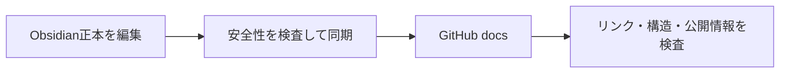

# シッテムの箱の設計文書

入口は[ドキュメント索引](00_シッテムの箱_ドキュメント索引.md)です。
利用者向けの概要から、機能別設計、運用・検証へ順に読めます。

## 正本と公開版

公開可能なObsidian文書を正本とし、このディレクトリは内容が完全一致する公開用の複製です。
番号付き文書をGitHub側だけで編集しないでください。`README.md`と`LICENSE.md`はリポジトリ側で管理します。



## 変更する手順

1. 索引の「変更内容と編集先」から、その仕様を管理する文書を選ぶ。
2. 正本を編集し、必要な関連リンク・図表と更新日を直す。実際に確認していない検証日や配信状態は変えない。
3. リポジトリのルートで同期と検査を行う。

```sh
export SHITTIM_DOCS_SOURCE="<公開用Obsidianプロジェクトフォルダー>"
python tools/sync_docs.py --write --source "$SHITTIM_DOCS_SOURCE"
python tools/sync_docs.py --check --source "$SHITTIM_DOCS_SOURCE"
uv run --frozen python -m tools.check_docs
uv run --frozen python tools/check_public_surface.py
git diff --check
```

## 書き方の約束

- 本文と見出しは日本語、API名・コード上の識別子は原綴りを使う。用語は初出で説明する。
- 現行の仕様、過去の判断、配信の証拠を分ける。同じ仕様を複数の文書へ複製しない。
- 文書間は通常の相対Markdownリンクを使う。空白を含むパスは`%20`にし、ObsidianとGitHubで同じリンクを使う。
- 構成・順序・状態遷移はMermaid、比較・対応関係は表、単純な注意事項は本文か短い箇条書きにする。
- コードへのリンクはGitHub上のファイルを使い、端末固有の絶対パスを書かない。
- 新しい正本文書を追加する場合は、索引と同期ツールの対象一覧も更新する。

同期対象の一覧は同期ツールが管理します。対象外ファイルやシンボリックリンク、
認証情報・個人識別情報を含むファイルは同期しません。
文書はMITライセンスの対象外です。[文書の利用条件](LICENSE.md)を確認してください。
